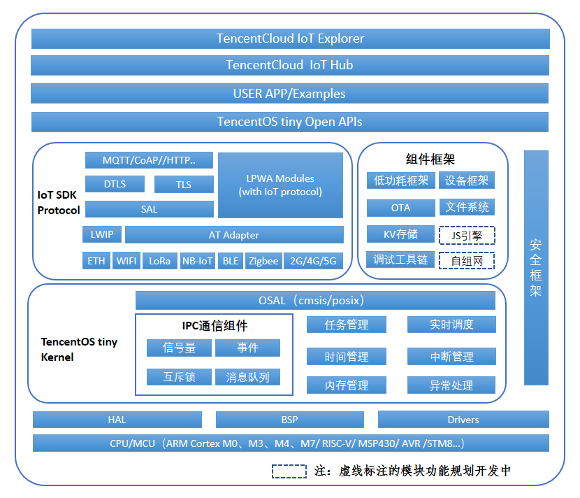
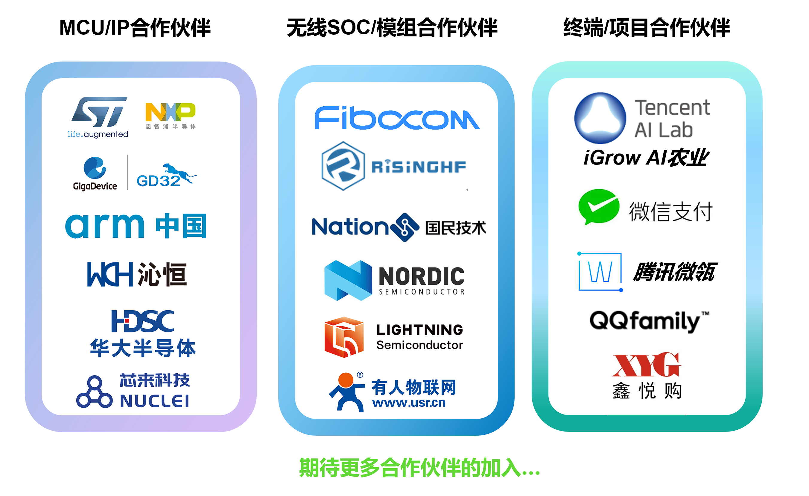

[(English Documents Available)](README_en.md)

# 一、TencentOS Tiny 简介

[TencentOS tiny](https://cloud.tencent.com/product/tos-tiny)是腾讯面向物联网领域开发的实时操作系统，具有低功耗，低资源占用，模块化，安全可靠等特点，可有效提升物联网终端产品开发效率。TencentOS tiny 提供精简的 RTOS 内核，内核组件可裁剪可配置，可快速移植到多种主流 MCU (如STM32全系列)及模组芯片上。而且，基于RTOS内核提供了丰富的物联网组件，内部集成主流物联网协议栈（如 CoAP/MQTT/TLS/DTLS/LoRaWAN/NB-IoT 等），可助力物联网终端设备及业务快速接入腾讯云物联网平台。

## 1、TencentOS tiny整体架构

TencentOS tiny 主体架构图，从下到上主要包括：

**CPU 库** ：TencentOS tiny 支持的 CPU IP 核架构，当前主要支持 ARM Cortex M0/3/4/7。

**驱动管理层** ：包括板级支持包（BSP，主要由 MCU 芯片厂家开发与维护）、硬件抽象（HAL，主要由 TencentOS tiny提供，方便不同芯片的适配与移植）、设备驱动（Drivers，例如 Wi-Fi、GPRS、LoRa 等模块的驱动程序）。

**内核** ：TencentOS tiny 实时内核包括任务管理、实时调度、时间管理、中断管理、内存管理、异常处理、软件定时器、链表、消息队列、信号量、互斥锁、事件标志等模块。

**IoT 协议栈**：TencentOS tiny 提供 lwip、AT Adapter、SAL 层，支持不同的网络硬件，例如以太网、串口 Wi-Fi、GPRS、NB-IoT、4G等通信模块。TCP/IP 网络协议栈上提供常用的物联网协议栈，例如 CoAP、MQTT，支撑终端业务快速接入腾讯云。

**安全框架**：TencentOS tiny 为了确保物联网终端数据传输安全以及设备认证安全，提供了完整的安全解决方案。安全框架提供的 DTLS 和 TLS 安全协议，加固了 COAP 及 MQTT 的传输层，可确保物联网终端在对接腾讯云时实现安全认证和数据加密；另外针对低资源的终端硬件，安全框架还提供与腾讯云 IoTHub 配套的密钥认证方案，确保资源受限设备也能在一定程度上实现设备安全认证。

**组件框架**：TencentOS tiny 提供文件系统、KV 存储、自组网、JS 引擎、低功耗框架、设备框架、OTA、调试工具链等一系列组件，供用户根据业务场景选用。

**开放 API（规划开发中）**：TencentOS tiny 将在协议中间件和框架层上提供开放 API 函数，方便用户调用中间件功能，使用户无需过多关心中间件具体实现，快速对接腾讯云，实现终端业务上云的需求，期望最大程度减少终端物联网产品开发周期，节省开发成本。

**示例应用**：TencentOS tiny 提供的示例代码，模块测试代码等，方便用户参考使用。

## 2、TencentOS tiny优势

### (1).小体积
最小内核：RAM 0.6KB，ROM 1.8KB
典型LoraWAN及传感器应用：RAM 3.3KB，ROM 12KB
### (2).低功耗
休眠最低功耗低至2 uA
支持外设功耗管理框架
### (3).丰富的IoT组件
集成主流IoT协议栈
多种通信模组SAL层适配框架；
支持OTA升级
提供简单易用端云API，加速用户业务接入腾讯云
### (4).可靠的安全框架
多样化的安全分级方案
均衡安全需求&成本控制
### (5).良好的可移植性
内核及IoT组件高度解耦，提供标准适配层
提供自动化移植工具，提升开发效率
### (6).便捷的调试手段
提供云化的最后一屏调试功能
故障现场信息自动上传云平台，方便开发人员调试分析

## 3、TencentOS tiny携手合作伙伴共建IoT生态

TencentOS tiny目前支持STM32、NXP、华大半导体、国民技术、GD32、Nordic、TI等主流MCU。当前已完成两套官方定制开发板设计，支持全系列STM32 NUCLEO官方评估板内核移植。TencentOS tiny 将携手合作伙伴为物联网终端厂家提供更优质的IoT终端软件解决方案，方便各种物联网设备快速接入腾讯云，共同扩展IoT生态，更好地支撑智慧城市、智能水表、智能家居、智能穿戴、车联网等多种行业应用。

欢迎IoT相关项目合作，有合作需求的请邮件联系TencentOS tiny官方工作人员，邮箱地址 ： supowang@tencent.com

# 二、TencentOS tiny 代码目录
- [TencentOS tiny代码目录说明](./doc/09.Code_Directories.md)

# 三、TencentOS tiny 参考文档
## 1、移植指南
- [TencentOS tiny移植指南（KEIL版本）](./doc/10.Porting_Manual_for_KEIL.md)
- [TencentOS tiny移植指南（IAR版本）](./doc/11.Porting_Manual_for_IAR.md)
- [TencentOS tiny移植指南（GCC版本）](./doc/12.Porting_Manual_for_GCC.md)

## 2、TencentOS tiny 开发指南
- [TencentOS tiny内核开发指南](./doc/04.Development_Manual.md)
- [TencentOS tiny API参考](./doc/05.SDK_Manual.md)
- [TencentOS tiny对接腾讯云IoTHub开发指南](./doc/08.QCloud_IoTHub_Quick_Start.md)

# 四、TencentOS tiny 开源协议
* TencentOS tiny 遵循 [BSD-3开源许可协议](LICENSE)

# 五、TencentOS tiny 支持的物联网平台
TencentOS tiny能支持物联网终端设备和业务快速接入[腾讯云物联网平台IoT Explorer](https://cloud.tencent.com/product/iotexplorer)。

TencentOS tiny结合腾讯云物联网开发平台IoT Explorer，已经构筑起连接通讯芯片到云开发的能力，加上已经建设完成的国内最大规模LoRa网络，腾讯彻底打通从芯片通讯开发、网络支撑服务，物理设备定义管理，数据分析和多场景应用开发等全链条IoT云开发服务能力，重新定义了物联网开发模式，助力亿级设备多方式多模式低门槛接入腾讯云服务。作为物联网基础设施建设服务者，腾讯将持续打造开放的物联网生态体系，促进物联网生态良性发展。

# 六、TencentOS tiny 快速入门参考
TencentOS tiny联合合作伙伴(南京厚德物联网)设计了定制开发板，如下图：

- [TencentOS tiny定制开发板介绍页](http://www.holdiot.com/product/showproduct.php?id=8)，开发者可以基于定制开发板进行快速入门学习，点击下载参考文档
- [TencentOS-tiny定制开发板入门指南](./doc/15.TencentOS_tiny_EVB_MX_Plus_Quick_Start.md)

# 七、贡献代码
* 1.  在您自己的GitHub账户下Fork TencentOS tiny 开源项目；
* 2.  根据您的需求在本地clone 一份TencentOS tiny 代码；
* 3.  您修改或者新增功能后，push 到您fork的远程分支；
* 4.  创建 pull request，向TencentOS tiny官方开发分支提交合入请求；
* 5.  TencentOS tiny研发团队会定期review代码，通过测试后合入。

# 八、加入TencentOS tiny官方QQ技术交流群

扫码加群，请备注TencentOS tiny开发者，工作人员会根据备注进行审核：

# 九、第三方开发者评测

1.基于TencentOS tiny 的环境监测实战项目
[【TencentOS tiny】环境监测实战项目最终完整版](https://www.bilibili.com/video/av73782956?from=search&seid=4421984671929108231)
感谢阿正的贡献

2.基于野火stm32f103开发板上移植的TencentOS tiny 例程、源码剖析、视频讲解。
感谢CSDN博客专家杰杰的贡献

## 简单上手：

- [超详细的 TencentOS tiny 移植到STM32F103全教程](https://blog.csdn.net/jiejiemcu/article/details/101034426)

## 深度源码分析：

- [【TencentOS tiny学习】源码分析（1）——task](https://blog.csdn.net/jiejiemcu/article/details/99618912)

- [【TencentOS tiny学习】源码分析（2）——调度器](https://blog.csdn.net/jiejiemcu/article/details/99665883)

- [【TencentOS tiny学习】源码分析（3）——队列](https://blog.csdn.net/jiejiemcu/article/details/99687678)

- [【TencentOS tiny学习】源码分析（4）——消息队列](https://blog.csdn.net/jiejiemcu/article/details/99781093)

- [【TencentOS tiny学习】源码分析（5）——信号量](https://blog.csdn.net/jiejiemcu/article/details/100052643)

- [【TencentOS tiny学习】源码分析（6）——互斥锁](https://blog.csdn.net/jiejiemcu/article/details/100056641)

- [【TencentOS tiny学习】源码分析（7）——事件](https://blog.csdn.net/jiejiemcu/article/details/100492219)

- [【TencentOS tiny学习】源码分析（8）——软件定时器](https://blog.csdn.net/jiejiemcu/article/details/101846089)

## 配套例程：

- [【TencentOS tiny学习】例程（0）——hello world](https://github.com/jiejieTop/TencentOS-Demo/tree/master/hello-world)

- [【TencentOS tiny学习】例程（1）——task](https://github.com/jiejieTop/TencentOS-Demo/tree/master/01-task)

- [【TencentOS tiny学习】例程（2）——队列](https://github.com/jiejieTop/TencentOS-Demo/tree/master/02-queue)

- [【TencentOS tiny学习】例程（3）——消息队列](https://github.com/jiejieTop/TencentOS-Demo/tree/master/03-msg_queue)

- [【TencentOS tiny学习】例程（4）——信号量](https://github.com/jiejieTop/TencentOS-Demo/tree/master/04-sem)

- [【TencentOS tiny学习】例程（5）——互斥锁](https://github.com/jiejieTop/TencentOS-Demo/tree/master/05-mutex)

- [【TencentOS tiny学习】例程（6）——事件](https://github.com/jiejieTop/TencentOS-Demo/tree/master/06-event)

- [【TencentOS tiny学习】例程（7）——软件定时器](https://github.com/jiejieTop/TencentOS-Demo/tree/master/07-timer)

- [【TencentOS tiny学习】例程（8）——内存池](https://github.com/jiejieTop/TencentOS-Demo/tree/master/08-mmblk)

- [【TencentOS tiny学习】例程（9）——内存堆](https://github.com/jiejieTop/TencentOS-Demo/tree/master/09-mmheap)

## 视频教程：

- [【TencentOS tiny学习】视频汇总](https://www.bilibili.com/video/av70478596?from=search&seid=10160676184801585522)
- [【视频】01-初识TencentOS tiny](https://www.bilibili.com/video/av70478596/?p=1)
- [【视频】02-TencentOS tiny基础知识](https://www.bilibili.com/video/av70478596/?p=2)
- [【视频】03-TencentOS tiny移植](https://www.bilibili.com/video/av70478596/?p=3)
- [【视频】04-TencentOS tiny任务-1](https://www.bilibili.com/video/av70478596/?p=4)
- [【视频】05-TencentOS tiny任务-2](https://www.bilibili.com/video/av70478596/?p=5)
- [【视频】06-TencentOS tiny队列-1](https://www.bilibili.com/video/av70478596/?p=6)
- [【视频】07-TencentOS tiny队列-2](https://www.bilibili.com/video/av70478596/?p=7)
- [【视频】08-TencentOS tiny消息队列](https://www.bilibili.com/video/av70478596/?p=8)
- [【视频】09-TencentOS tiny信号量-1](https://www.bilibili.com/video/av70478596/?p=9)
- [【视频】10-TencentOS tiny信号量-2](https://www.bilibili.com/video/av70478596/?p=10)
- [【视频】11-TencentOS tiny互斥锁-1](https://www.bilibili.com/video/av70478596/?p=11)
- [【视频】12-TencentOS tiny互斥锁-2](https://www.bilibili.com/video/av70478596/?p=12)
- [【视频】13-TencentOS tiny互斥锁-3](https://www.bilibili.com/video/av70478596/?p=13)
- [【视频】14-TencentOS tiny事件-1](https://www.bilibili.com/video/av70478596/?p=14)
- [【视频】15-TencentOS tiny事件-2](https://www.bilibili.com/video/av70478596/?p=15)
- [【视频】16-TencentOS tiny软件定时器-1](https://www.bilibili.com/video/av70478596/?p=16)
- [【视频】17-TencentOS tiny软件定时器-2](https://www.bilibili.com/video/av70478596/?p=11)
- [【视频】18-TencentOS tiny软件定时器-3](https://www.bilibili.com/video/av70478596/?p=18)

## 相关PPT资料：
- [【TencentOS tiny学习】视频PPT](https://github.com/jiejieTop/TencentOS-Demo/tree/master/PPT)

