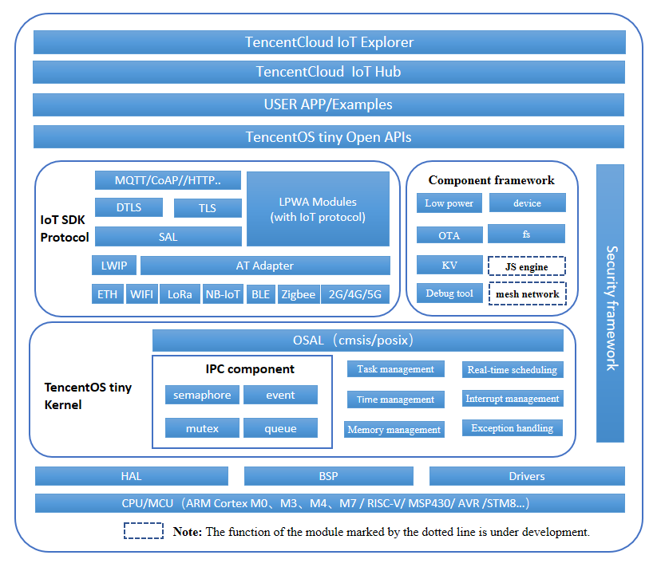
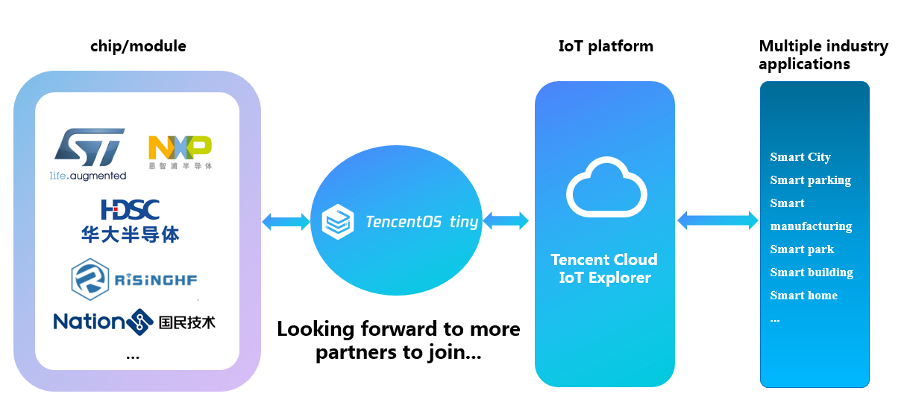

[(中文)](README.md)

# Introduction to TencentOS Tiny

[TencentOS tiny](https://cloud.tencent.com/product/tos-tiny) is a real-time operating system developed by Tencent for the Internet of Things. It features low power consumption, low resource consumption, modularity, security and reliability, and can effectively improve the development efficiency of IoT terminal products. TencentOS tiny provides a streamlined RTOS core that can be tailored and configurable for rapid migration to a wide range of mainstream MCUs (such as the full range of STM32) and module chips. Moreover, based on the RTOS kernel, it provides a wealth of IoT components, and internally integrates mainstream IoT protocol stacks (such as CoAP/MQTT/TLS/DTLS/LoRaWAN/NB-IoT, etc.), which can help IoT terminals and services to quickly access Tencent. Cloud Internet of Things platform.

## 1、The software architecture of TencentOS tiny

TencentOS tiny main architecture diagram, from bottom to top, mainly includes:

**CPU libs** ：The CPU IP core architecture supported by TencentOS tiny,currently supports ARM Cortex M0/3/4/7.

**Drive management** ：Including board support package (BSP, mainly developed and maintained by MCU chip manufacturers), hardware abstraction (HAL, mainly provided by TencentOS tiny, to facilitate adaptation and porting of different chips), device drivers (Drivers, such as Wi-Fi, GPRS Drivers for modules such as LoRa).

**kernel** ：The TencentOS tiny real-time kernel includes tasks management, real-time scheduling, time management, interrupt management, memory management, exception handling, software timers, linked lists, message queues, semaphores, mutex locks, event flags, and more.

**IoT protocol stack**：TencentOS tiny provides lwip, AT Adapter, SAL layer, supports different network hardware, such as Ethernet, serial Wi-Fi, GPRS, NB-IoT, 4G and other communication modules. A commonly used IoT protocol stack, such as CoAP and MQTT, is provided on the TCP/IP network protocol stack to support the terminal service to quickly access Tencent Cloud.

**Security framework**：TencentOS tiny provides a complete security solution to ensure data transmission security and device authentication security for IoT terminals. The DTLS and TLS security protocols provided by the security framework reinforce the transport layer of COAP and MQTT to ensure that the IoT terminal implements secure authentication and data encryption when docking Tencent Cloud. In addition, for the low-resource terminal hardware, the security framework also provides Tencent. The key authentication scheme of the cloud IoTHub ensures that resource-constrained devices can also achieve device security certification to a certain extent.

**Component framework**：TencentOS tiny provides a series of components such as file system, KV storage, ad hoc network, JS engine, low-power framework, device framework, OTA, and debugging toolchain for users to choose according to business scenarios.

**Open API (in planning and development)**：TencentOS tiny will provide open API functions on the protocol middleware and framework layer, which is convenient for users to call the middleware function, so that users do not need to pay much attention to the implementation of middleware, quickly connect to Tencent cloud, realize the cloud demand on the terminal business, and expect the maximum degree. Reduce the development cycle of the terminal IoT product and save development costs.

**examples**：TencentOS tiny provides sample code, module test code, etc., which is convenient for users to refer to.

## 2、Key features of TencentOS tiny

### (1).Small size

Minimum kernel: RAM 0.6KB, ROM 1.8KB;

Typical LoraWAN and Sensor Applications: RAM 3.3KB, ROM 12KB.

### (2).Low power consumption

Minimum sleep power consumption as low as 2 uA;

Support for peripheral power management framework;

### (3).Rich IoT components

Integrate mainstream IoT protocol stack;

Multiple communication module SAL layer adaptation framework;

Support FOTA;

Provides easy-to-use end-cloud API to accelerate user service access to Tencent Cloud.

### (4).Reliable security framework

Diversified security grading scheme; 

Balanced security requirements & cost control.

### (5).Good portability

Highly decoupled core and IoT components, providing a standard adaptation layer;

Provide automated migration tools to improve development efficiency.

### (6).Convenient debugging means
Provide cloudized last screen debugging;

The fault scene information is automatically uploaded to the cloud platform, which is convenient for developers to debug and analyze.

## 3、TencentOS tiny and partners are committed to building the IoT ecosystem

TencentOS tiny currently supports mainstream MCUs such as STM32, NXP, Huada Semiconductor, National Technology, GD32, Nordic, and TI. Two sets of official custom development board designs have been completed, supporting the full range of STM32 NUCLEO official evaluation board kernel migration. TencentOS tiny will work together with partners to provide better IoT terminal software solutions for IoT terminal manufacturers, facilitating the rapid access of various IoT devices to Tencent Cloud, and jointly expanding the IoT ecosystem to better support smart cities, smart water meters, and smart homes. , smart wear, car networking and other industrial applications.

# TencentOS tiny code directory
- [TencentOS tiny code directory description](./doc/09.Code_Directories.md)

# TencentOS tiny reference documentation
## 1、Porting guide
- [TencentOS tiny Porting guide（KEIL version）](./doc/10.Porting_Manual_for_KEIL.md)
- [TencentOS tiny Porting guide（IAR version）](./doc/11.Porting_Manual_for_IAR.md)
- [TencentOS tiny Porting guide（GCC version）](./doc/12.Porting_Manual_for_GCC.md)

## 2、Development guide
- [TencentOS tiny Kernel development guide](./doc/04.Development_Manual.md)
- [TencentOS tiny API reference](./doc/05.SDK_Manual.md)
- [The development Guide for use TencentOS tiny connect to  Tencent Cloud IoTHub ](./doc/08.QCloud_IoTHub_Quick_Start.md)

# TencentOS tiny opensource license
* TencentOS tiny follow [BSD-3 Open source license agreement](LICENSE)

# The IoT platform TencentOS tiny  support 
TencentOS tiny can support IoT terminal devices and services for fast access to Tencent Cloud IoT Platform [IoT Explorer](https://cloud.tencent.com/product/iotexplorer)。

TencentOS tiny combines Tencent Cloud IoT development platform IoT Explorer, which has built up the ability to connect communication chips to cloud development. Together with the largest LoRa network in China, Tencent has completely opened up from chip communication development, network support services, and physical equipment. Defining management, data analysis and multi-scenario application development and other full-chain IoT cloud development service capabilities, redefining the IoT development model, helping multi-mode low threshold access to Tencent cloud services. As an IoT infrastructure construction service provider, Tencent will continue to build an open IoT ecosystem and promote the sound development of the Internet of Things.

# TencentOS tiny Quick Start Reference
TencentOS tiny joint partner (Nanjing Houde IoT) designed a custom development board, as shown below:

- [TencentOS tiny custom development board introduction page](http://www.holdiot.com/product/showproduct.php?id=8) ,Developers can quickly learn based on custom development boards, click to download reference documentation
- [TencentOS-tiny Custom Development Board Getting Started Guide](./doc/15.TencentOS_tiny_EVB_MX_Plus_Quick_Start.md)

# Contributing
* 1.  Fork TencentOS tiny open source project under your own GitHub account;
* 2.  Clone a TencentOS tiny code locally according to your needs;
* 3.  After you modify or add a new function, push to the remote branch of your fork;
* 4.  Create a pull request and submit a join request to the official TencentOS tiny development branch;
* 5.  The TencentOS tiny R&D team will periodically review the code and merge your pull request.

# Join the TencentOS tiny official QQ technology exchange group

Scan the QR code to join the qq group, please note the TencentOS tiny developer, the TencentOS tiny staff will review according to the notes:

