# 开发板BDW01入门介绍
---
## 1. 开发板特性
BDW01物联网开发板的板载资源如下：
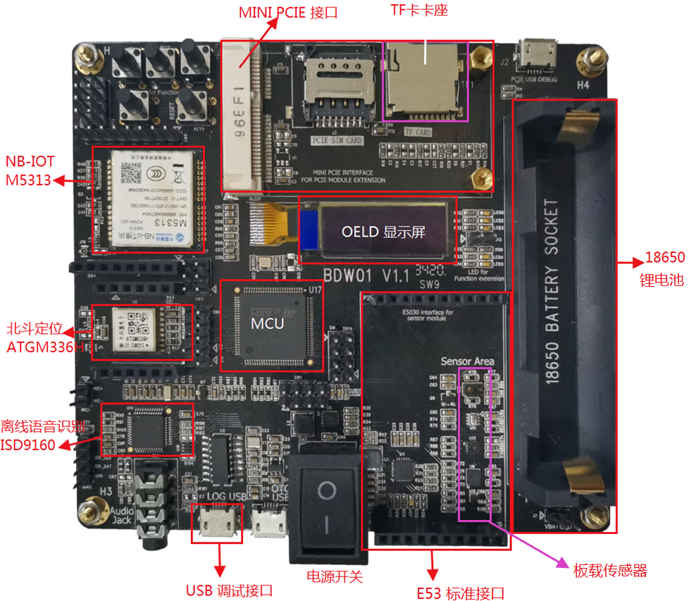

主控芯片采用STM32L4VGTx，Flash空间大小1MB，SRAM空间大小320KB；  

- 板载中移物联NB-IOT模组M5313；
- 板载中科微北斗定位模组ATGM336H；
- 板载环境光检测传感器TMD27713;
- 板载压力传感器BMP280;
- 板载温湿度传感器SHT3X;
- 板载3D加速度陀螺仪传感器LSM6DSL;
- 板载磁力计传感器MMC3680KJ;
- 板载E43接口可扩展其他无线通信模块；
- 板载E32接口可扩展其他定位模块；
- 板载E53传感器标准接口，方便连接各种E53传感器；
- 板载0.91'OLED显示屏幕；
- 板载新塘语离线音识别模块ISD9160；
- 板载TF卡卡座，方便扩展存储空间；
- 板载MINI PCIE接口，方便连接4G通信模块；
- 板载18650锂电池插座，方便移动时正常供电；
- 板载CH340转串口连接，可以使用一根USB线连接至电脑，查看串口日志；

关于开发板硬件电路的更多信息和详解，请查看文档BDW01主板规格书和文档物联网开发板原理图。

## 2. 开发板硬件准备
### 2.1 连接LOG USB线
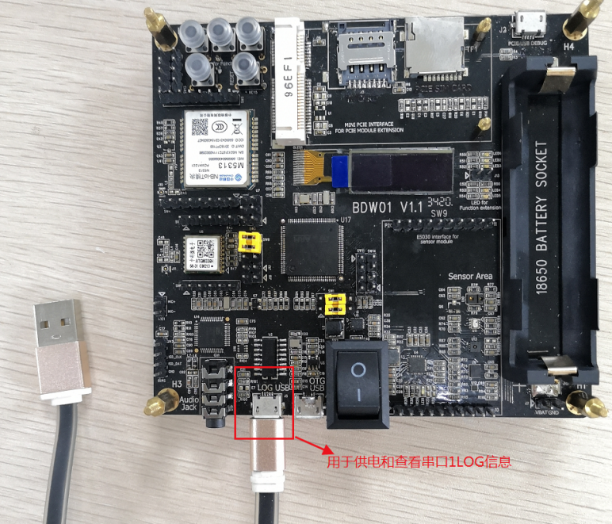
### 2.2 连接ST-Link烧录器
对照烧录器引脚图和开发板原理图，找到开发板上的网络标号SW11,连接如下:  
**注意电源正负极不要接反接错，避免烧掉MCU和烧录器。**
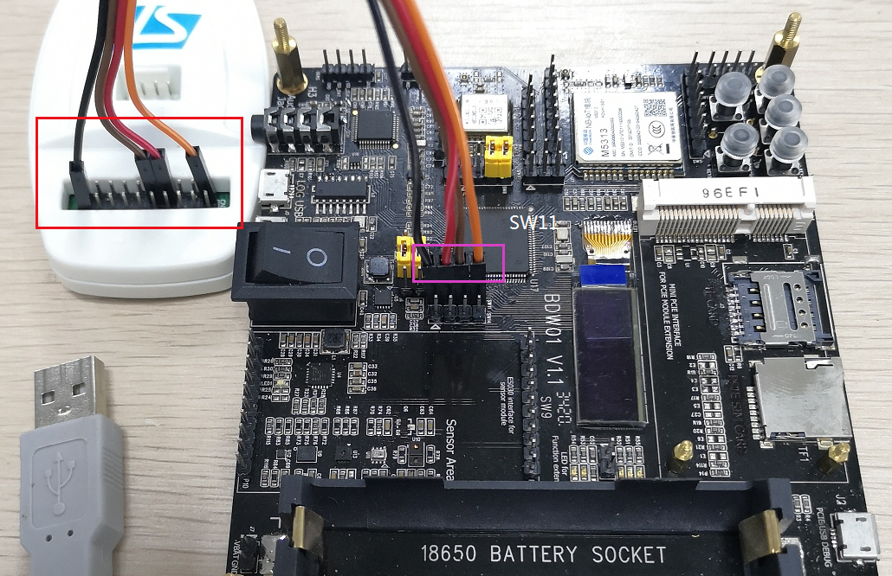

- 开发板VCC(3v3) ---> STlink  3.3V
- 开发板ST_SWDIO 	---> STlink  SWDIO
- 开发板ST_SWCLK 	---> STlink  SWCLK
- 开发板GND          ---> STlink  GND

## 3. 开发软件的环境准备
### 3.1 软件开发工具的下载安装
我们使用的软件开发工具是Keil公司的MDK(Microcontroller Development kit)，MDK官网下载地址：[http://www2.keil.com/mdk5](http://www2.keil.com/mdk5)

下载的版本最好在5.24或5.24以上，本次介绍以5.25版本为例，双击MDK524应用程序文件，接着点击next>>。

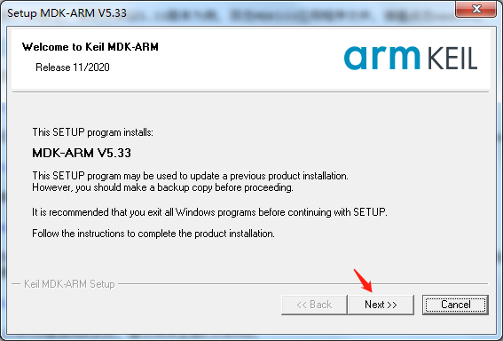

在I agree前面的小方框打勾，表示同意该安装协议，再点击next>>。

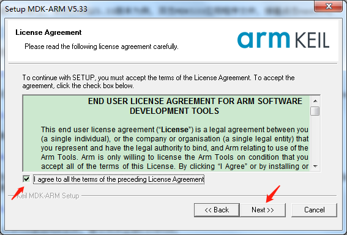

选择安装路径，默认情况下会安装在系统盘C盘，建议在其他盘建立单独的文件夹，并选择安装到该文件夹下。点击next>>。

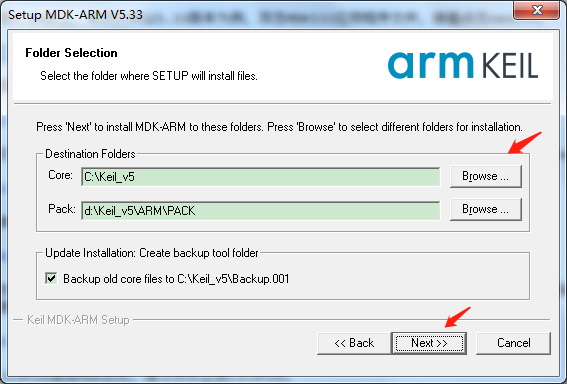

填上我们的信息后，继续next>>。

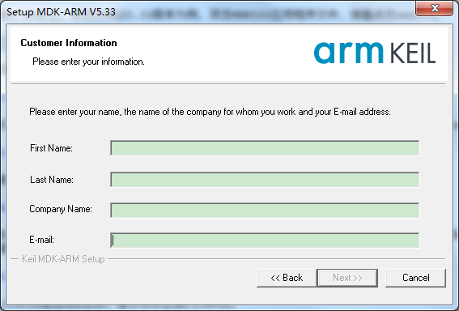

然后等待安装完成后点击Finish,接着会跳出器件支持包安装界面，点OK再把弹框都叉掉，后续再介绍。最后要激活MDK，导入License,激活MDK后就可以使用了。

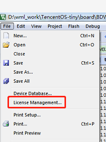

特别提示：一定要输入License激活MDK软件，建议购买正版License。

### 3.2 安装器件支持包
MDK V4版本安装包里集成了器件的支持包，而MDK V5版本是独立出来的，可以自己下载安装。安装完开发工具MDK V5后，我们需要安装开发板主芯片型号对应的芯片器件支持包。
#### 3.2.1 安装方式一
登录官网：[http://www.keil.com/dd2/pack/](http://www.keil.com/dd2/pack/)
下载Keil.STM32L4xx_DFP.x.x.x.pack 完成后，双击打开安装。
#### 3.2.2 安装方式二
MDK软件上在线安装，一般下载速度会比较慢，更新时间很长，不推荐。
打开软件，在导航栏打开Pack安装界面，弹出包安装提示点击ok选项。
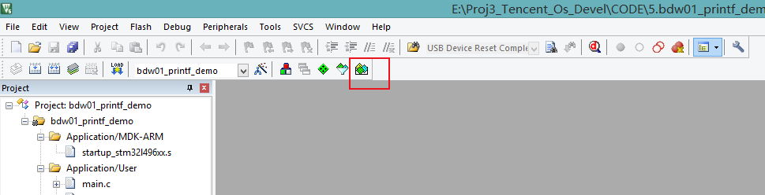
进入在线安装界面，选择STM32L4XX Pack,点击Install进行安装。
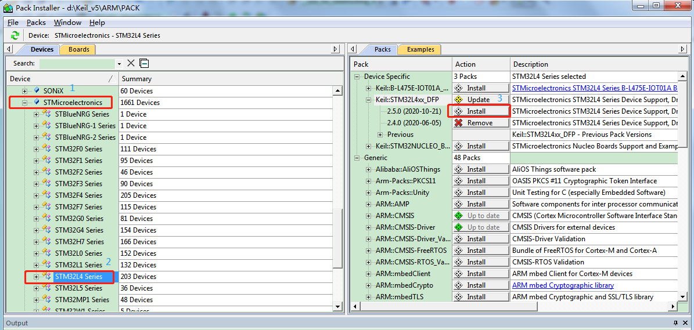

### 3.3 CH340串口驱动安装
BDW01开发板板载USB转串口芯片，所以使用USB线将开发板连接到电脑，就在串口调试助手查看串口输出的LOG信息。使用串口调试助手之前需要下载安装CH340转串口芯片的驱动。直接在网上搜索下载CH340转串口芯片的驱动，下载完成后打开驱动安装程序点击安装即可。

### 3.4 串口调试助手的安装与使用
工具下载网址：[http://www.daxia.com/download/sscom.rar](http://www.daxia.com/download/sscom.rar)
下载完成后，解压，双击打开串口调试助手执行程序，直接使用。
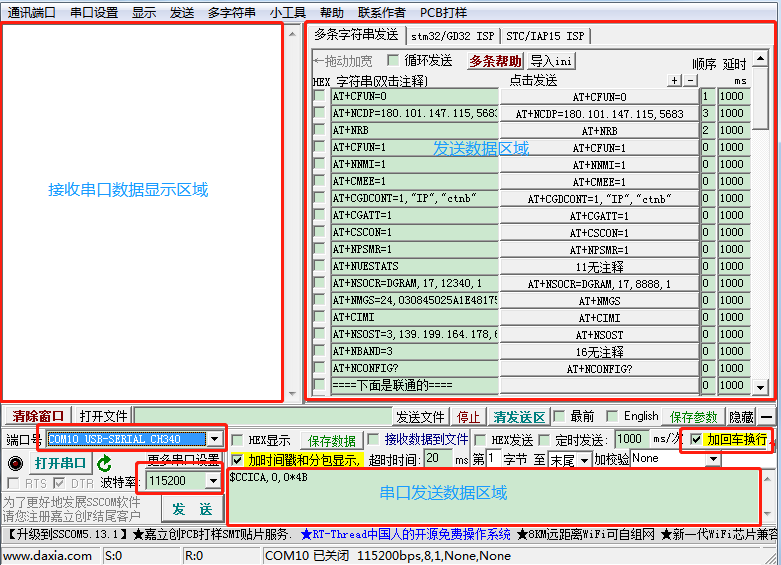
使用USB线一端接开发板LOG USB串口，另一端连接到电脑，前面安装完CH340转串口芯片的驱动，打开电脑的设备管理器，就可以在端口列表查看PC与开发板之间连接端口号，然后在串口调试助手-端口号处，选择PC和开发板之间的连接端口(我这里显示的是COM15，所以要在串口调试助手中选择COM15)。
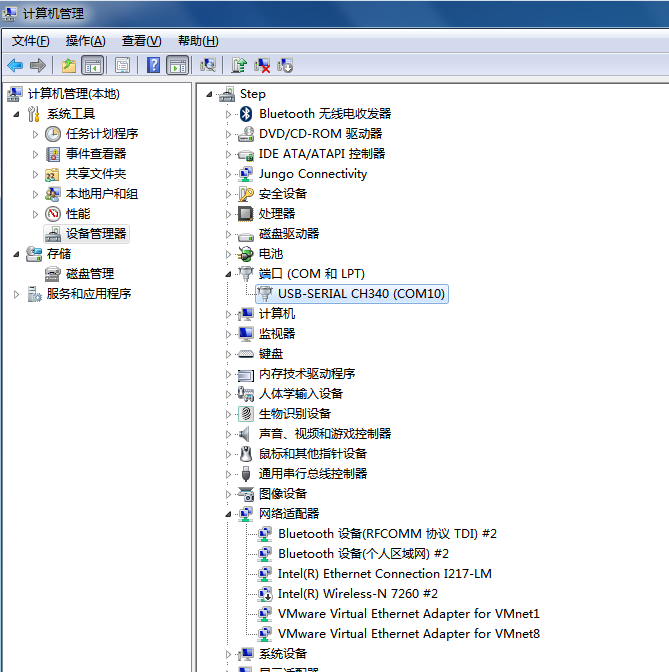
再根据开发板串口波特率设置串口调试助手-波特率，开发板程序波特率设置为115200，所以在串口调试助手中选择115200波特率。最后打开串口就可以使用了。

### 3.5 ST-Link驱动的下载与安装
前面2.2介绍过开发板与ST-Link烧录器的接线方式，在使用烧录器将程序烧录到开发板之前，需要安装烧录器的驱动。
在ST官网下载ST-Link驱动STSW-LINK009，下载网址：
[https://www.st.com/content/st_com/zh/products/development-tools/software-development-tools/stm32-software-development-tools/stm32-utilities/stsw-link009.html](https://www.st.com/content/st_com/zh/products/development-tools/software-development-tools/stm32-software-development-tools/stm32-utilities/stsw-link009.html)

再根据电脑系统安装驱动，32位电脑系统安装dpinst_x86.exe，64位电脑系统安装dpinst_amd64.exe 。 
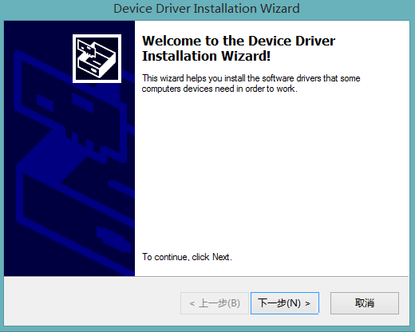

运行对应的驱动执行程序，开始安装ST-Link V2驱动，最后点击完成。
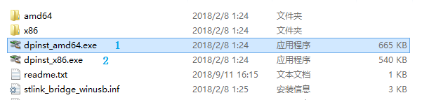

安装完成后, 将开发板电源打开，将连着开发板的烧录器通过USB接口连至电脑。

打开电脑上的设备管理器。若可以看到通用串行总线设备-STM32 STLink,表示驱动安装成功,如下图所示。
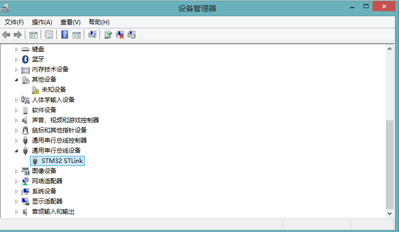

## 4. 开发与调试
前面的软硬件工作准备好之后，接下来就可以进行开发与调试了。示例工程hello_world的主要功能是创建两个任务，两个任务循环输出打印 。  
路径：TencentOS-tiny\board\BDW01-STM32L496VG\KEIL\hello_world。

打开示例工程hello_world，进入到MDK keil5主窗口界面：
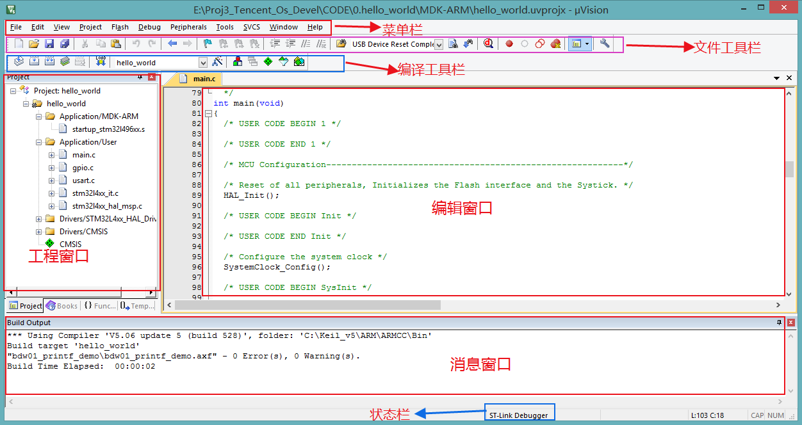  
点击 Build Target 编译工程目标：
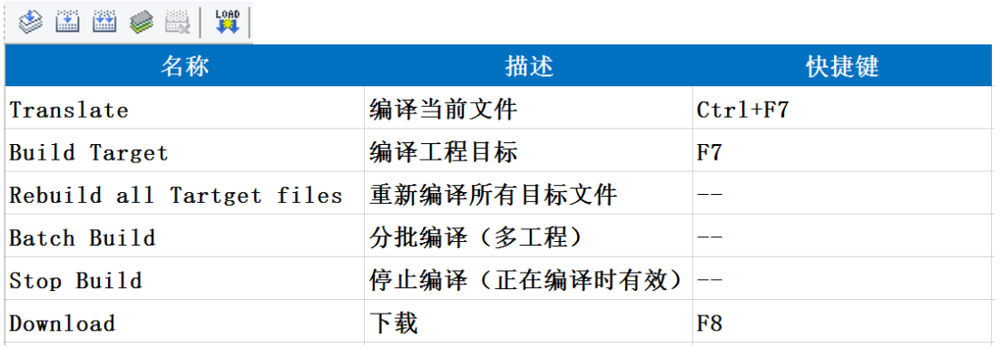  
编译完成后，查看消息窗口：0 Error(s)，表示代码没有语法错误。
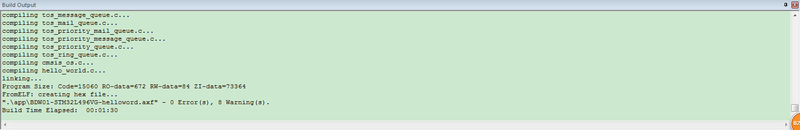  
LOG USB线和烧录器ST-Link/v2都连接到电脑，串口调试助手也配置好并打开。  
点击 Download 下载程序到开发板。  
下载完成后，在开发板上按下复位按钮，查看串口调试助手上接收数据的显示。  
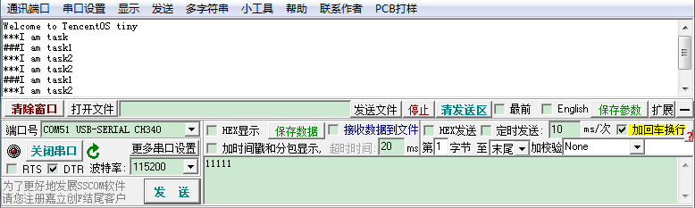