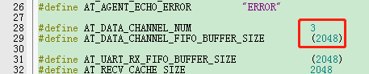
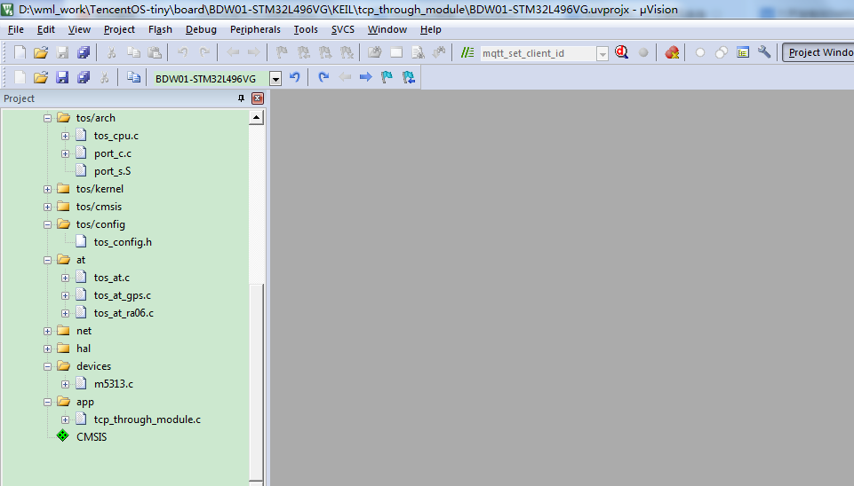
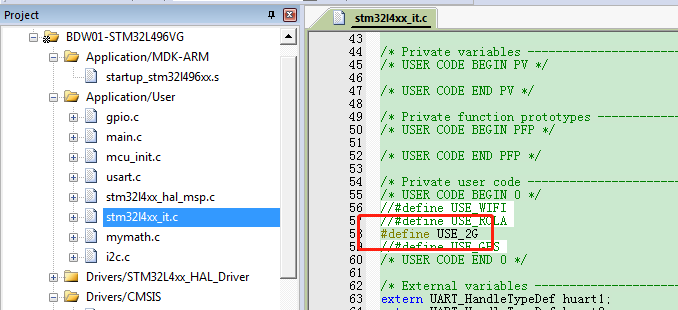
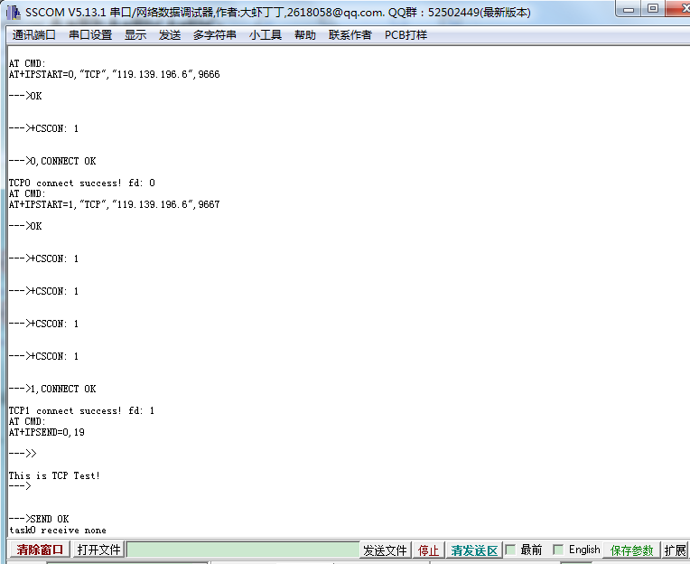
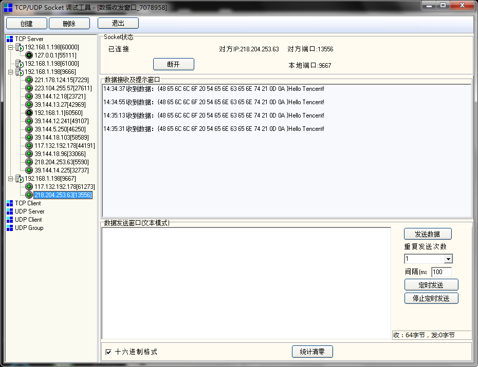
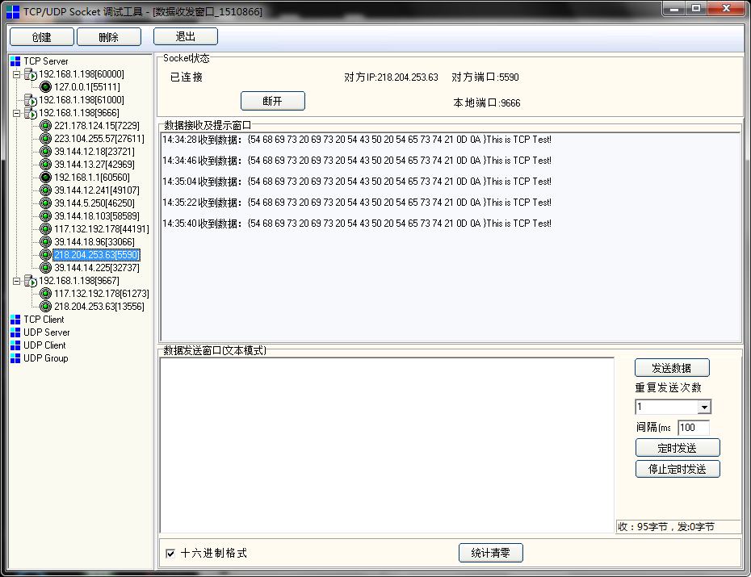

# TCP Socket 通讯测试
---
本示例会启动两个线程，建立两个TCP链接，分别发送数据
M5313可同时支持4个链接，不过在代码默认定义的是3个，有需要可以修改为4个或根据自己需要进行修改。

路径：TencentOS-tiny\net\at\include\tos_at.h

## 1. 搭建TCP服务器
M5313 使用2G网络，本地PC使用的是局域网，这里做了一个服务器的内网穿透，然后百度ip查看服务器的外网IP。  
这里使用SocketTool建立TCP server。

## 2. 运行工程
使用 Keil-MDK 打开 tcp_through_module工程：  
路径：TencentOS-tiny\board\BDW01-STM32L496VG\KEIL\tcp_through_module

打开2g模块M5313的串口接收：

打开tcp_through_module.c文件，根据自己的TCP服务器地址，修改配置:

修改完成后，点击编译按钮编译，编译成功之后烧录到开发板（默认使用ST-Link下载器）。

烧录之后按下开发板上的复位按钮，程序开始运行，在串口助手查看日志：

在TCP服务器上可查看收到的数据

