# 对接腾讯云与腾讯连连-测试

----------
本示例示范如何对接到腾讯云物联网开发平台IoT Explore和腾讯连连小程序
## 1.云端操作步骤
登录[腾讯云物联网开发平台（IoT Explorer）](https://cloud.tencent.com/product/iotexplorer "腾讯云物联网开发平台（IoT Explorer）")，点击“立即使用”进入控制台，个人开发可以使用微信进行登录。

### 1.1 新建项目
项目是为了用户面对不同的产品迭代或不同的项目角色而设计的一种隔离机制，便于用户清晰管理物联网项目，并能灵活地配置项目权限。  

1. 项目下可以建立多个产品与应用，应用默认有权限访问该项目下的所有产品；  
2. 每个项目会有自己的唯一 ID，数据会根据项目进行隔离，以确保数据安全；  
3. 项目删除后，该项目所属产品等数据都将被删除且不能恢复；  
4. 开发平台提供资源级的权限控制，可为不同的子用户分配项目级、产品级的权限控制；  

点击新建项目，填写项目名称和简介：  
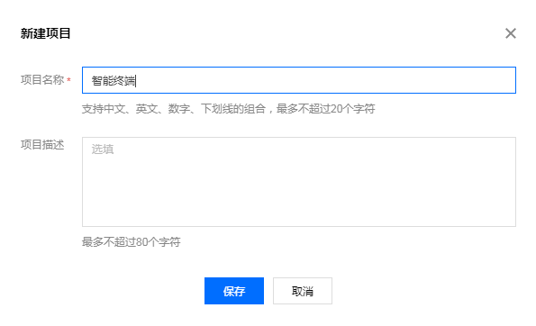  

### 1.2. 产品开发
#### 1.2.1 新建产品
点击项目名称进入到该项目中，点击新建产品：
  
填写产品的一些信息：  
1. 产品名称：名称为中文、字母、数字、下划线的组合，1 - 20位且不能为空。  
2. 产品品类：选择您所创建产品的所属品类，不同类型产品的属性、事件等数据模板会有所不同。详情请参见 数据模板。  
3. 设备类型：设备使用2G/3G/4G/Wi-Fi无线通信或有线通信方式，网关可提供云端通信能力，帮助设备与平台通信。  
4. 认证方式：物联网开发平台提供两种认证方式用于设备与平台之间鉴权认证。  
     证书认证：在创建设备时，平台将为设备生成一个证书文件和一个私钥文件，实现设备与云之间的双向认证。  
     密钥认证：在创建设备时，使用平台为设备随机生成的 PSK。    
5. 通信方式：您可以选择 Wi-Fi、移动蜂窝（2G/3G/4G）和其他通信方式。  
6. 数据协议：默认采用数据模板的数据协议，您也可以自定义协议进行透传。  
7. 描述：字数不能超过80个，您可以根据需要选填。   
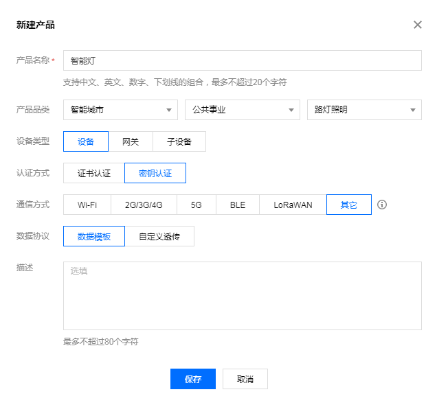  
产品新建成功后，可在产品列表页查看到“智能灯”。
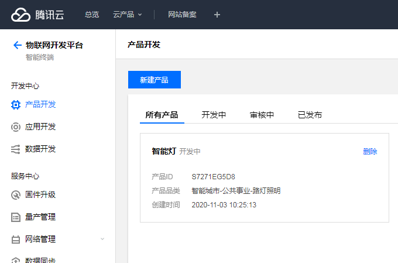  

#### 1.2.2 数据模版
数据模板是将物理实体设备进行数字化描述，构建其数字模型。在物联网开发平台定义数据模板即定义产品功能。完成功能定义后，系统将自动生成该产品的数据模板。

点击智能灯产品进入。

##### 1.2.2.1 
选择“智能灯”类型后，系统会自动生成标准功能：
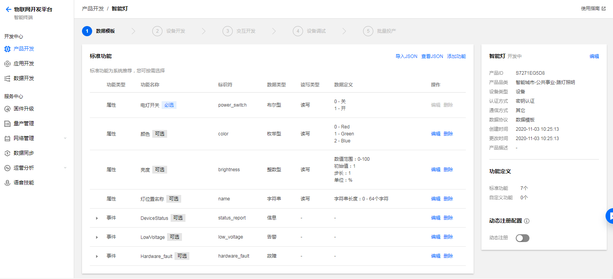   
#### 1.2.2.2
下方的新建功能，可以增加新的功能，定义如下:
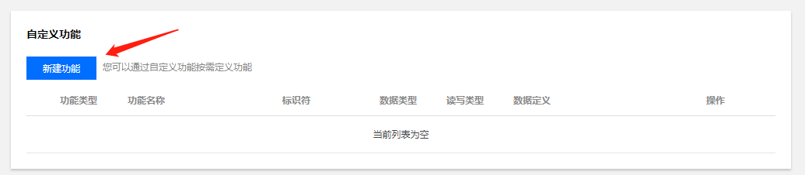  
功能类型包含三元素：  
1. 属性：包括布尔型、整数型、字符型、浮点型、枚举型和时间型等6种基本数据类型；  
2. 事件：包括告警、故障和信息三种类型，事件型功能属性可以添加具体的事件参数，这些参数可以由属性中6种基本数据类型组成；  
3. 行为：用于实现更复杂的业务逻辑，可包含输入参数和输出参数，可用于让设备执行某项特定的任务。行为的输入参数和输出参数可添加上述6种属性的基本数据类型。
  
| 功能元素 | 功能描述      | 功能标识符 |
| -------- | --------- | ----------- |
| 属性      | 用于描述设备的实时状态，支持读取和设置，如模式、亮度、开关等。 | PropertiesId    |
| 事件      | 用于描述设备运行时的事件，包括告警、信息和故障等三种事件类型，可添加多个输出参数，如环境传感器检测到空气质量很差，空调异常 | EventId    |   
| 行为      | 用于描述复杂的业务逻辑,可添加多个调用参数和返回参数,用于让设备执行某项定特定的任务，例如，开锁动作需要知道是哪个用户在什么时间开锁，锁的状态如何等。 | ActionId    |   

数据类型支持6种：  
1.布尔型：非真即假的二值型变量。例如，开关功能。  
2.整数型：可用于线性调节的整数变量。例如，空调的温度。  
3.字符型：以字符串形式表达的功能点，例如，灯的位置。  
4.浮点型：精度为浮点型的功能点。例如，压力值的范围：0.0 - 24.0。  
5.枚举型：自定义的有限集合值。例如，灯的颜色：白色、红色、黄色等。  
6.时间型：string 类型的 UTC 时间戳（毫秒）。

#### 1.2.3
数据模板是一个 JSON 格式的文件，使用数据模板协议，用户的设备需按数据模板定义要求传输设备数据到云端，并可使用基于数据模板的诸多业务功能，点击查看json可以看到上面创建功能的json格式：
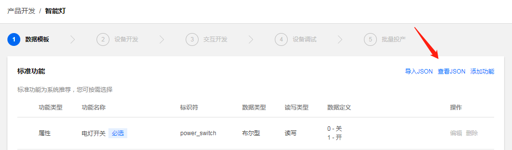  

```c
{
  "version": "1.0",
  "properties": [
    {
      "id": "power_switch",
      "name": "电灯开关",
      "desc": "控制电灯开灭",
      "required": true,
      "mode": "rw",
      "define": {
        "type": "bool",
        "mapping": {
          "0": "关",
          "1": "开"
        }
      }
    },
    {
      "id": "color",
      "name": "颜色",
      "desc": "灯光颜色",
      "mode": "rw",
      "define": {
        "type": "enum",
        "mapping": {
          "0": "Red",
          "1": "Green",
          "2": "Blue"
        }
      }
    },
    {
      "id": "brightness",
      "name": "亮度",
      "desc": "灯光亮度",
      "mode": "rw",
      "define": {
        "type": "int",
        "unit": "%",
        "step": "1",
        "min": "0",
        "max": "100",
        "start": "1"
      }
    },
    {
      "id": "name",
      "name": "灯位置名称",
      "desc": "灯位置名称：书房、客厅等",
      "mode": "rw",
      "required": false,
      "define": {
        "type": "string",
        "min": "0",
        "max": "64"
      }
    }
  ],
  "events": [
    {
      "id": "status_report",
      "name": "DeviceStatus",
      "desc": "Report the device status",
      "type": "info",
      "required": false,
      "params": [
        {
          "id": "status",
          "name": "running_state",
          "desc": "Report current device running state",
          "define": {
            "type": "bool",
            "mapping": {
              "0": "normal",
              "1": "fault"
            }
          }
        },
        {
          "id": "message",
          "name": "Message",
          "desc": "Some extra message",
          "define": {
            "type": "string",
            "min": "0",
            "max": "64"
          }
        }
      ]
    },
    {
      "id": "low_voltage",
      "name": "LowVoltage",
      "desc": "Alert for device voltage is low",
      "type": "alert",
      "required": false,
      "params": [
        {
          "id": "voltage",
          "name": "Voltage",
          "desc": "Current voltage",
          "define": {
            "type": "float",
            "unit": "V",
            "step": "1",
            "min": "0.0",
            "max": "24.0",
            "start": "1"
          }
        }
      ]
    },
    {
      "id": "hardware_fault",
      "name": "Hardware_fault",
      "desc": "Report hardware fault",
      "type": "fault",
      "required": false,
      "params": [
        {
          "id": "name",
          "name": "Name",
          "desc": "Name like: memory,tf card, censors ...",
          "define": {
            "type": "string",
            "min": "0",
            "max": "64"
          }
        },
        {
          "id": "error_code",
          "name": "Error_Code",
          "desc": "Error code for fault",
          "define": {
            "type": "int",
            "unit": "",
            "step": "1",
            "min": "0",
            "max": "2000",
            "start": "1"
          }
        }
      ]
    }
  ],
  "actions": [],
  "profile": {
    "ProductId": "S7271EG5D8",
    "CategoryId": "3"
  }
}
```  


### 1.3. 创建测试设备
在【设备调试】页面中，单击【新建设备】，设备名为 bdw01_led：
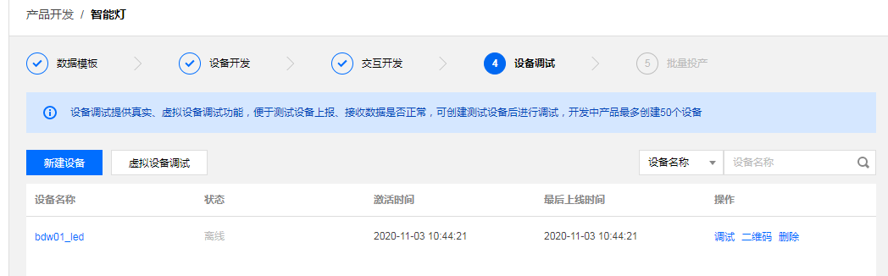  

## 2. 设备侧操作
使用 Keil-MDK 打开 mqttclient_iot_explorer 工程：  
TencentOS-tiny\board\BDW01-STM32L496VG\KEIL\mqttclient_iot_explorer  
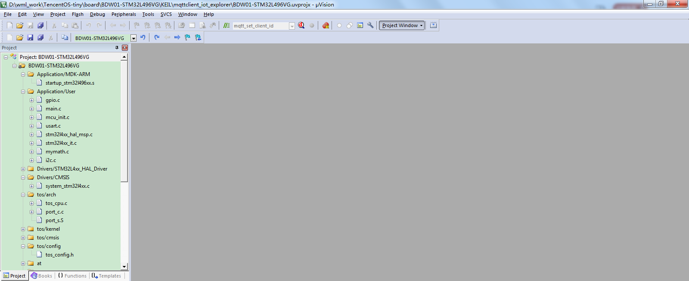  

### 2.1 配置使用的网络设备
打开mqttclient_iot_explorer.c文件，修改配置。  
修改本工程所使用的通信模组，打开USE_M5313，如图：
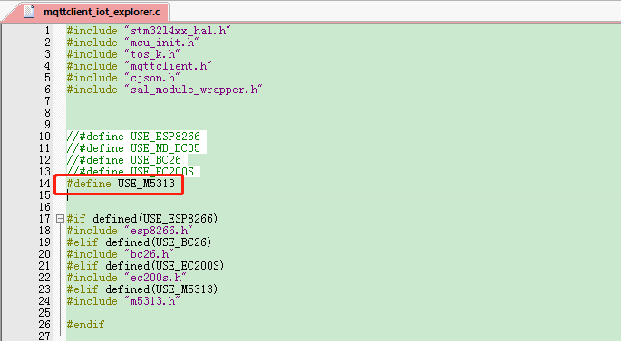  

#### 2.1.1 修改MQTT对接参数
在腾讯云物联网开发平台可以看到一些产品ID、设备ID、设备秘钥三个参数，如图：  
  

接下来进入TencentOS-tiny仓库中的tools目录，使用python运行脚本mqtt_config_gen.py，按照提示输出刚刚在平台查询到的三个参数，脚本会自动生成mqtt配置参数：  
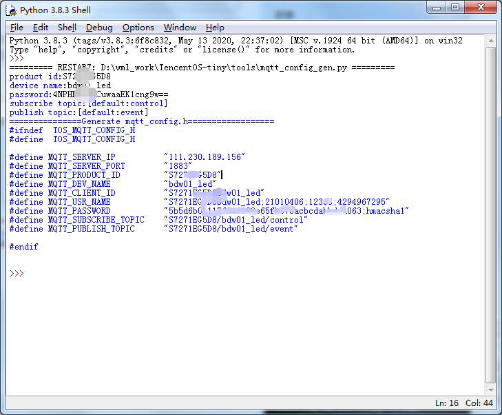  
① 输入产品ID；  
② 输入设备名称；  
③ 输入设备秘钥；  
④ ⑤ 保持默认，直接回车；  
⑥ 需要的生成信息。  
接下来在代码中修改配置信息：
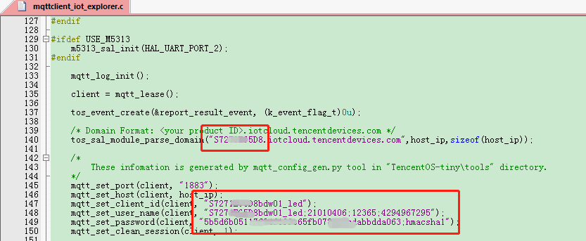  

#### 2.1.2 修改mqtt对接topic
设备向云端上报数据的topic如下：
上行请求 Topic： $thing/up/property/{ProductID}/{DeviceName}  
上行响应 Topic： $thing/down/property/{ProductID}/{DeviceName}  
这两个topic咋玩呢？  
首先订阅上行响应topic，接着向上行请求topic上报数据，上报数据时平台不仅规定了topic，还规定了数据内容，如下：  
```c
{
	"method":"report",
	"clientToken":"clientToken-145023f5-bc9b-4174-ba3b-430ba5956e5c",
	"params":
	{
		"brightness":55,
		"name":"bedroom",
		"power_switch":1,
		"color":2
	}
}
```  
其中每一项的意义如下：
| 参数 | 类型      | 说明 |
| -------- | --------- | ----------- |
| method      | String | report 表示设备属性上报    |
| clientToken      | String | 用于上下行消息配对标识    |   
| timestamp      | Integer | 属性上报的时间    |
| params      | JSON | JSON 结构内为设备上报的属性值    |  

同时，因为订阅了上行响应topic，所以模组会收到云端下发的响应并通过URC模式上报，云端响应报文整理一下格式如下：  
```c
{
	"method":"report_reply",
	"clientToken":"clientToken-145023f5-bc9b-4174-ba3b-430ba5956e5c",
	"code":0,
	"status":"success"}
｝
``` 
其中每一项也有具体的含义：
| 参数 | 类型      | 说明 |
| -------- | --------- | ----------- |
| method      | String | report_reply 表示云端接收设备上报后的响应报文    |
| clientToken      | String | 用于上下行消息配对标识    |   
| code      | Integer | 0表示云端成功收到设备上报的属性    |
| status      | String | 当code非0的时候, 提示错误信息    |  

接下来修改代码，首先**根据自己的产品ID和设备ID修改上报topic**：
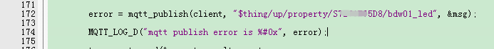  
然后修改订阅topic：  
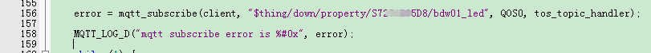  

打开2g模块M5313的串口接收：  
  

#### 2.1.3 编译下载
修改完成之后编译工程，下载到开发板中，重新上电开始运行，在串口助手中查看打印日志：  
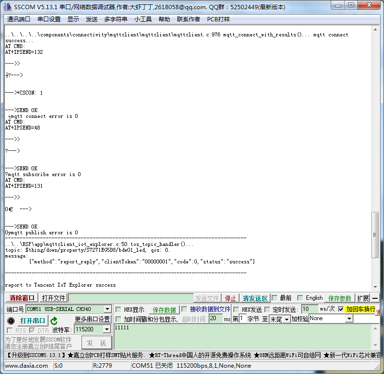  
在云端查看上报日志：  
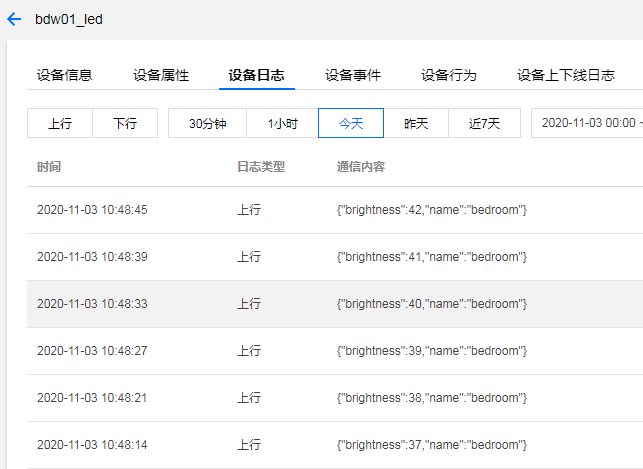  
点击【设备属性】，点击亮度属性一栏的查看，可以查看曲线显示：  
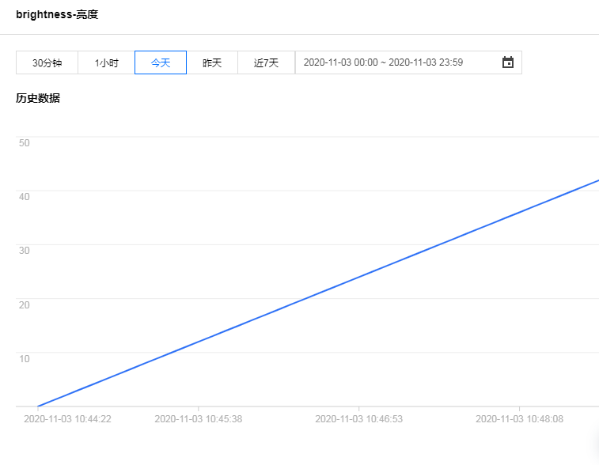  

## 3. 腾讯连连小程序操作步骤
### 3.1 添加家庭
手机端在【微信】搜索【腾讯连连】小程序，首次使用需要进入后点击【我的】->【家庭管理】，添加一个你喜欢的名称即可。

### 3.2 添加设备
进入后在中下方点击➕号，开始扫描二维码
  
  
在腾讯云物联网开发平台进入【设备调试】，点击对应设备后的【二维码】：  
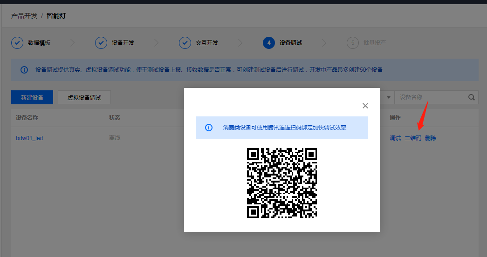  
腾讯连连扫描此二维码即可成功添加设备，添加成功之后如图：  
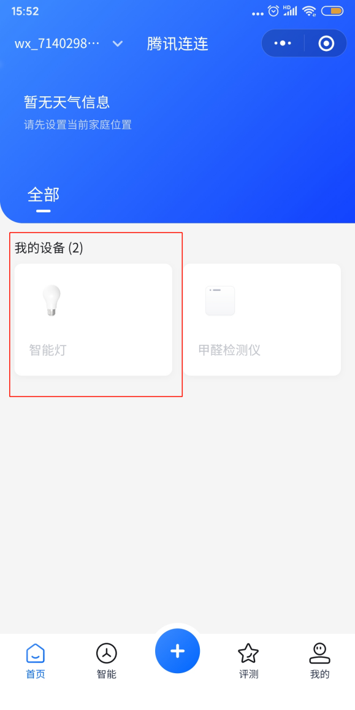  
给设备上电，等一会可以看到设备上线，点击进入可以看到代码上传的亮度数据  
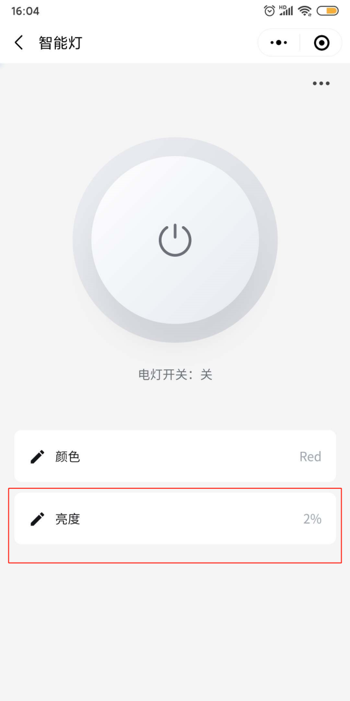

