# 对接腾讯云与腾讯连连-电动车追踪
本示例示范如何对接到腾讯云物联网开发平台IoT Explore和腾讯连连小程序
并上传GPS定位和通过腾讯云与腾讯连连控制开发板上的LED。
## 1. 云端操作步骤
登录[腾讯云物联网开发平台（IoT Explorer）](https://cloud.tencent.com/product/iotexplorer "腾讯云物联网开发平台（IoT Explorer）")，点击“立即使用”进入控制台，个人开发可以使用微信进行登录。
### 1.1 新建项目
具体可参考《3.对接腾讯云与腾讯连连-测试》新建项目章节，根据文档已经创建了一个智能终端的项目  
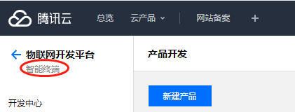  
### 1.2 产品开发
#### 1.2.1 新建产品
点击项目名称进入到该项目中，点击新建产品：  
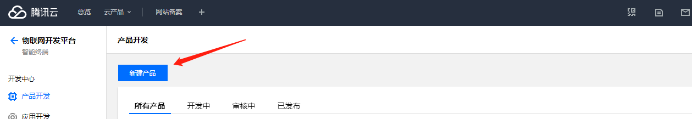  

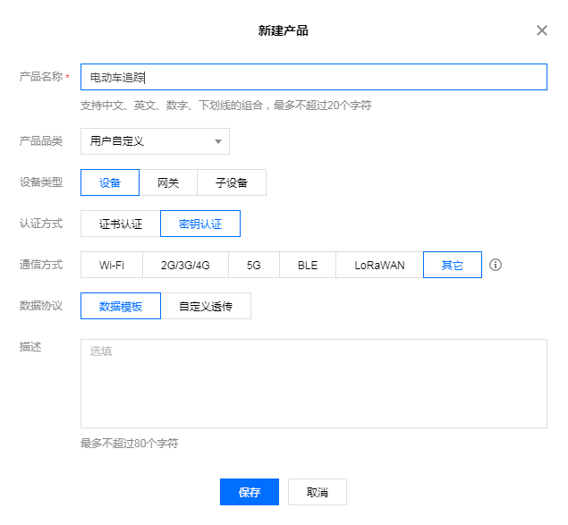  
产品新建成功后，可在产品列表页查看到“电动车追踪”。  
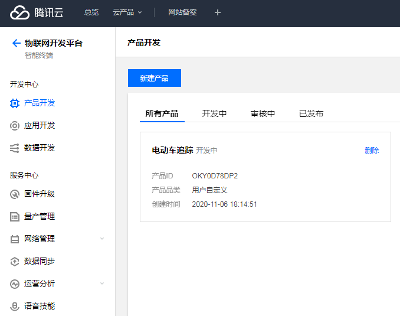  

#### 1.2.2 新建功能
点击电动车追踪产品进入。
##### 1.2.2.1 
参照下图建立两个功能：灯和位置两个功能  
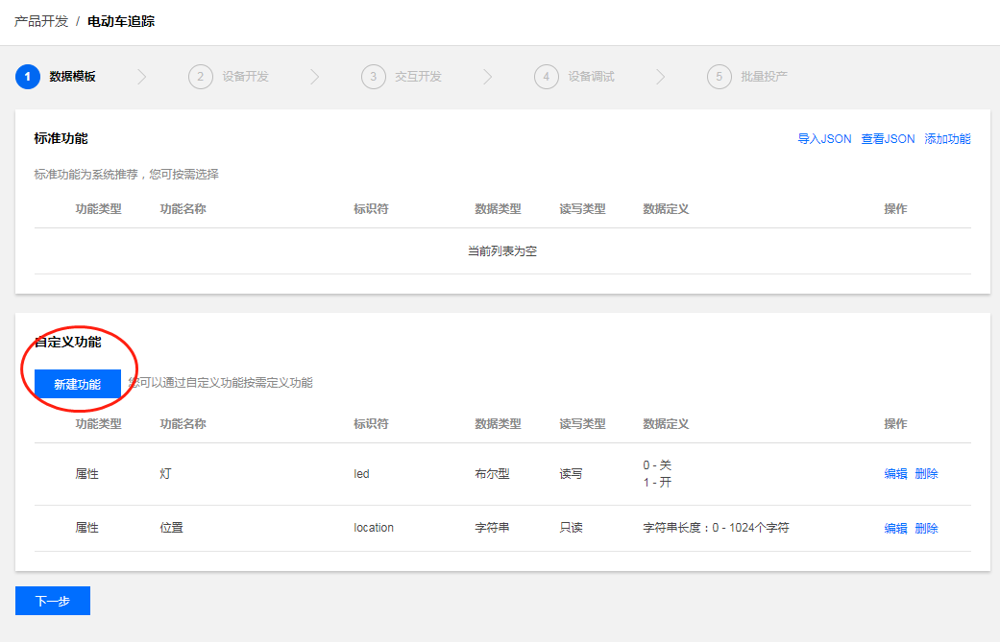  

##### 1.2.2.2
json格式为：
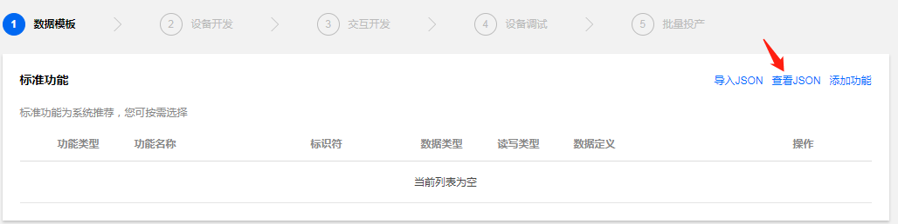  
```c
{
  "version": "1.0",
  "profile": {
    "ProductId": "OKY0D78DP2",
    "CategoryId": "1"
  },
  "properties": [
    {
      "id": "led",
      "name": "灯",
      "desc": "",
      "mode": "rw",
      "define": {
        "type": "bool",
        "mapping": {
          "0": "关",
          "1": "开"
        }
      },
      "required": false
    },
    {
      "id": "location",
      "name": "位置",
      "desc": "",
      "mode": "r",
      "define": {
        "type": "string",
        "min": "0",
        "max": "1024"
      },
      "required": false
    }
  ],
  "events": [],
  "actions": []
}
```  
### 1.3 创建测试设备
在【设备调试】页面中，单击【新建设备】，设备名为 bd_location：  
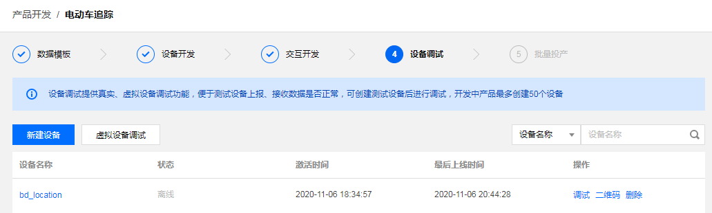  

## 2. 设备侧操作
使用 Keil-MDK 打开 mqttclient_iot_explorer_location 工程：
TencentOS-tiny\board\BDW01-STM32L496VG\KEIL\mqttclient_iot_explorer_location  
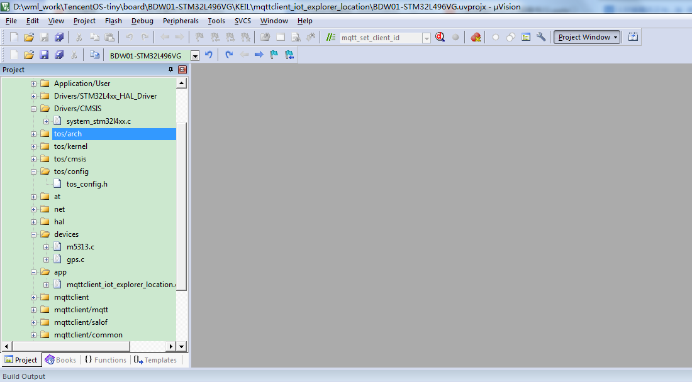  
### 2.1 配置使用的网络设备
打开mqttclient_iot_explorer_location.c文件，修改配置。  
路径为：TencentOS-tiny\board\BDW01-STM32L496VG\BSP\app  
修改本工程所使用的通信模组，打开USE_M5313，如图：  
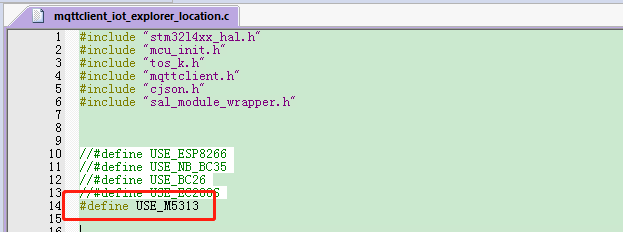  

#### 2.1.1 修改MQTT对接参数
在腾讯云物联网开发平台可以看到一些产品ID、设备ID、设备秘钥三个参数，如图：  
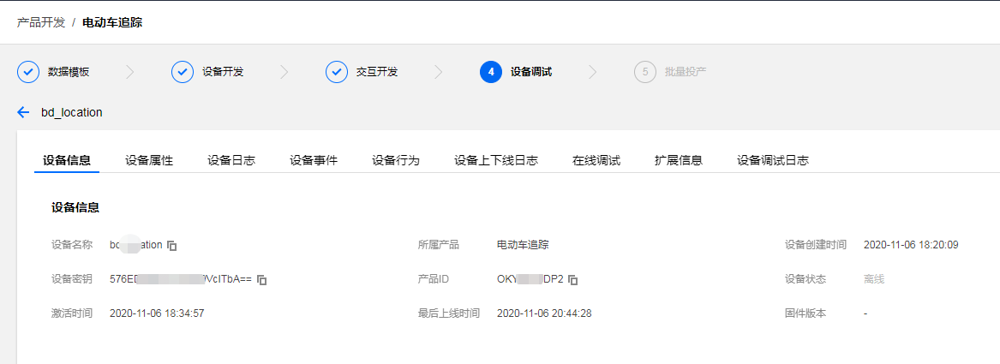  
接下来进入TencentOS-tiny仓库中的tools目录，使用python运行脚本mqtt_config_gen.py，按照提示输出刚刚在平台查询到的三个参数，脚本会自动生成mqtt配置参数：  
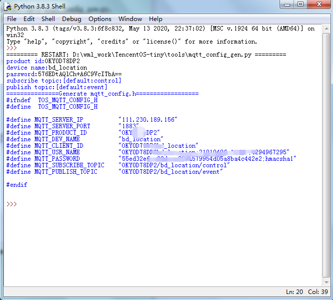  
① 输入产品ID；  
② 输入设备名称  
③ 输入设备秘钥；  
④ ⑤ 保持默认，直接回车；  
⑥ 需要的生成信息。  
接下来在代码中修改配置信息：  
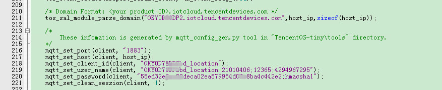  
#### 2.1.2 修改mqtt对接topic
设备向云端上报数据的topic如下：
上行请求 Topic： $thing/up/property/{ProductID}/{DeviceName}
上行响应 Topic： $thing/down/property/{ProductID}/{DeviceName}  
首先订阅上行响应topic，数据内容如下：  
```c  
{
	"method":"control",
		"clientToken":"clientToken-9d2601f3-c36f-46a5-bdf6-1bd21c547406",
	"params":
	{
		"led":1,
	}
}
```  
同时，因为订阅了上行响应topic，所以模组会收到云端下发的响应并通过URC模式上报，云端响应报文整理一下格式如下：
```c  
{
	"method":"report_reply",
	"clientToken":"clientToken-9d2601f3-c36f-46a5-bdf6-1bd21c547406",
	"code":0,
	"status":"success"}
｝
```  
修改代码，首先**根据自己的产品ID和设备ID修改上报topic**：  
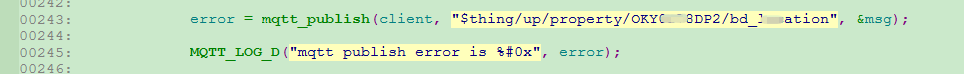  
然后修改订阅topic：  
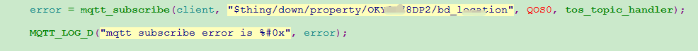  
打开2g模块M5313的串口接收：  
  
#### 2.1.3 编译下载
修改完成之后编译工程，下载到开发板中，重新上电开始运行，在串口助手中查看打印日志：  
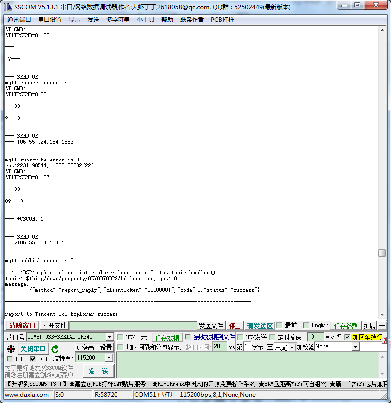  
#### 2.1.4 上报定位
GPS获取到定位时，串口会打印GPS定位信息：  
  
同时将定位上传到云端，
在云端查看上报日志：  
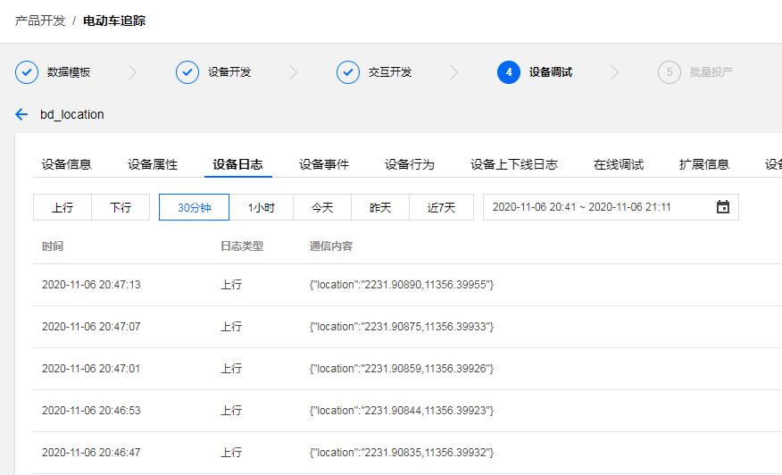  
#### 2.1.5 LED控制
在设备调试里，打开在线调试，选择灯，期望值选择打开状态，然后点击发送，成功控制板子上的LED，并返回数据  
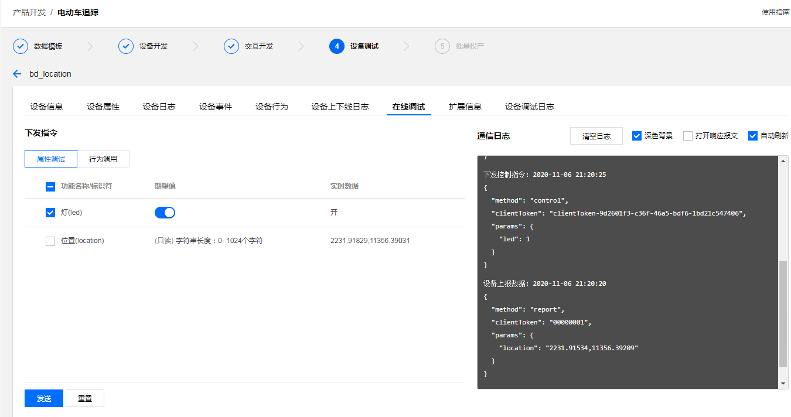  

## 3. 腾讯连连小程序操作步骤
### 3.1 添加家庭
手机端在【微信】搜索【腾讯连连】小程序，首次使用需要进入后点击【我的】->【家庭管理】，添加一个你喜欢的名称即可。  
### 3.2 添加设备
进入后在中下方点击➕号，开始扫描二维码  
  
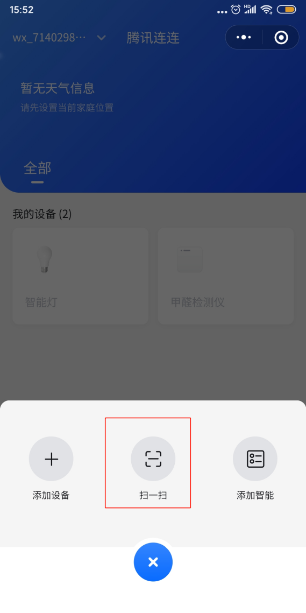  
在腾讯云物联网开发平台进入【设备调试】，点击对应设备后的【二维码】：  
  
腾讯连连扫描此二维码即可成功添加设备，添加成功之后如图：  
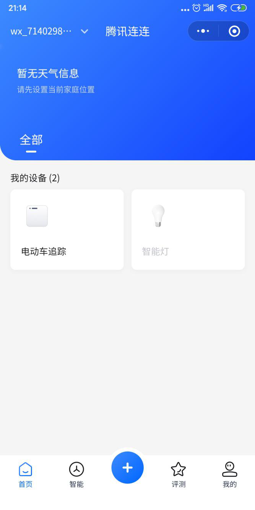  
给设备上电，等一会可以看到设备上线，点进去可进行LED的控制，
开发板上的LED会亮。  
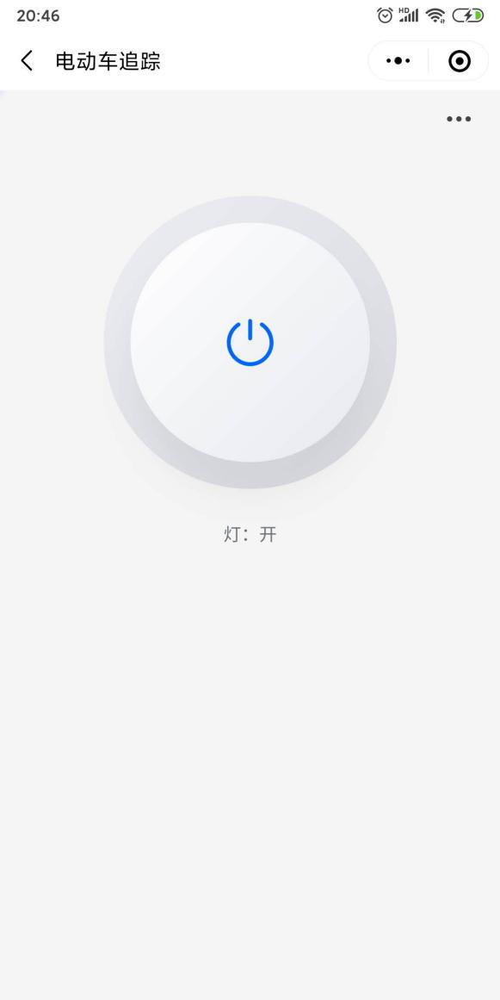  
#### 3.2.1 面板配置
可以采用H5对小程序的显示页面进行编辑  
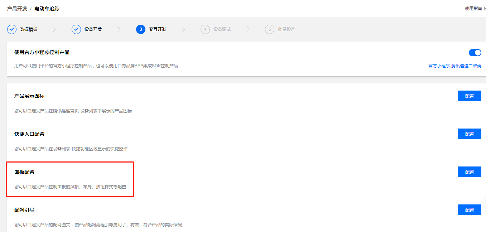  
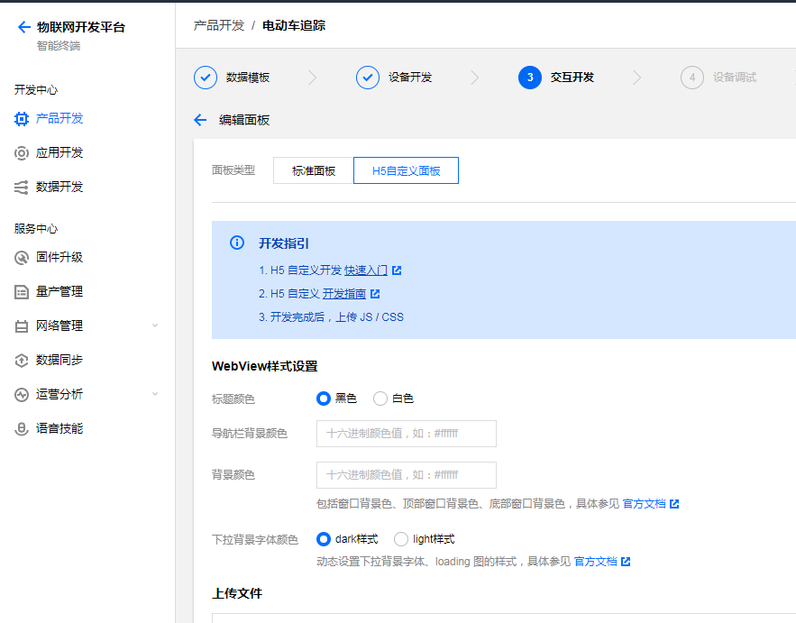  
上传文件index.js、index.css(在source文件夹里)  
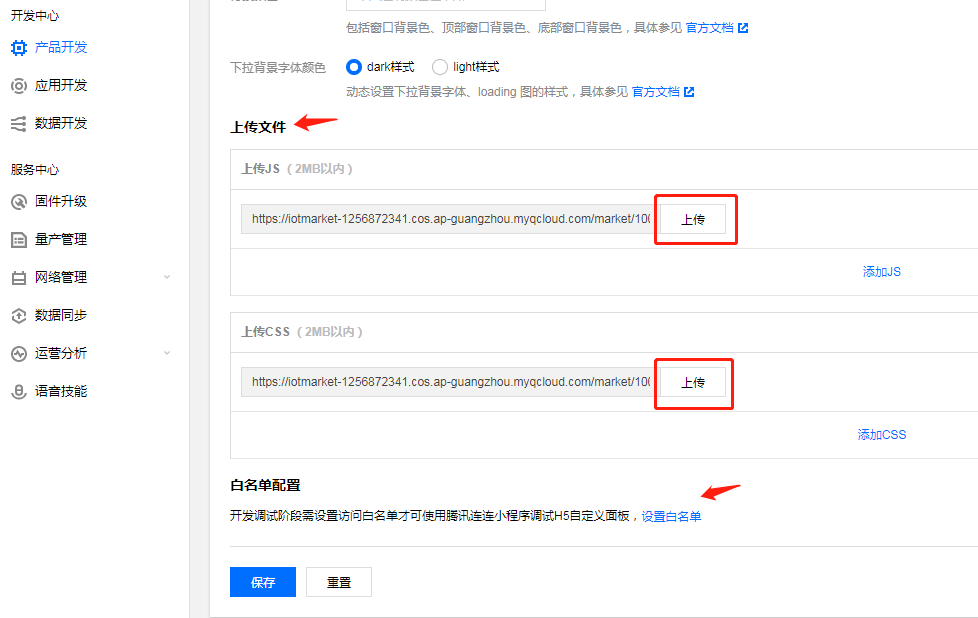  
并将腾讯连连小程序里的帐号添加至白名单。  
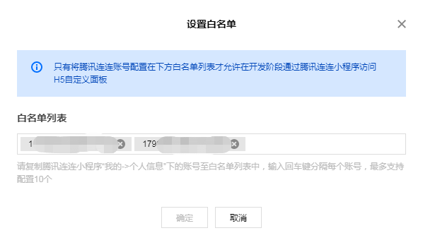  
用小程序重新扫描设备二维码，给设备重新上电，当有定位时，效果如下： 
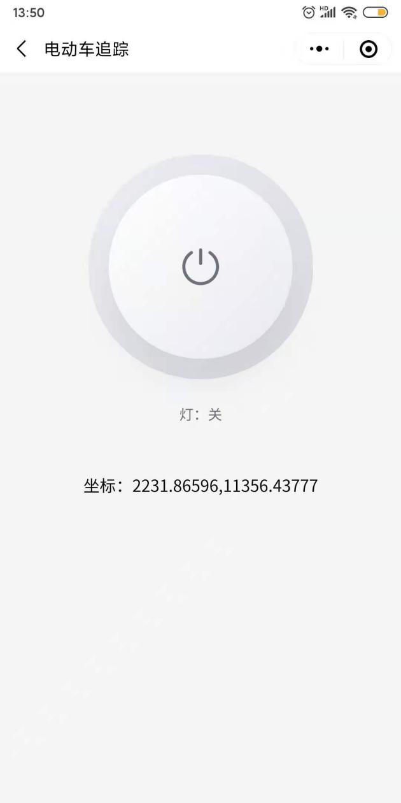  

