# 定位器
在物品、枪支、电动车等需要实时追踪的领域，我们需要获取定位数据并上传到云端或手机端，从而可以查看所在位置。

在BDW01开发板上，基于TencentOS Tiny，通过中科微定位模块，获取到GPS或北斗定位，然后通过2G模块将定位上传到腾讯云，并通过微信小程序腾讯连连查看实时位置。

----------
# 一、开发板BDW01入门介绍
## 1. 开发板特性
BDW01物联网开发板的板载资源如下：

主控芯片采用STM32L4VGTx，Flash空间大小1MB，SRAM空间大小320KB；

- 板载中移物联NB-IOT模组M5313；
- 板载中科微北斗定位模组ATGM336H；
- 板载环境光检测传感器TMD27713;
- 板载压力传感器BMP280;
- 板载温湿度传感器SHT3X;
- 板载3D加速度陀螺仪传感器LSM6DSL;
- 板载磁力计传感器MMC3680KJ;
- 板载E43接口可扩展其他无线通信模块；
- 板载E32接口可扩展其他定位模块；
- 板载E53传感器标准接口，方便连接各种E53传感器；
- 板载0.91'OLED显示屏幕；
- 板载新塘语离线音识别模块ISD9160；
- 板载TF卡卡座，方便扩展存储空间；
- 板载MINI PCIE接口，方便连接4G通信模块；
- 板载18650锂电池插座，方便移动时正常供电；
- 板载CH340转串口连接，可以使用一根USB线连接至电脑，查看串口日志;

关于开发板硬件电路的更多信息和详解，请查看文档BDW01主板规格书和原理图。
## 2.原理图
关键原图图如下：  
M5313：通讯模块
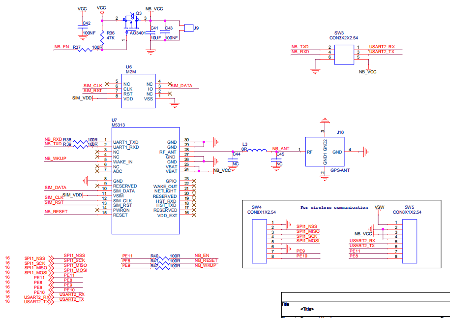
ATGM336H：中科微定位模块  
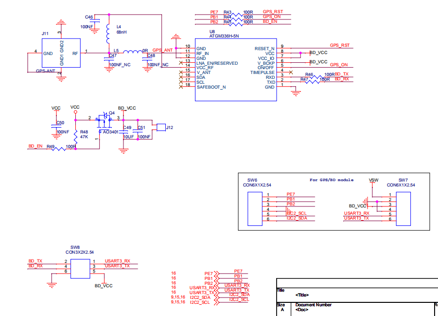
## 3. 开发板硬件准备
### 3.1 连接LOG USB线

### 3.2 连接ST-Link烧录器
对照烧录器引脚图和开发板原理图，找到开发板上的网络标号SW11,连接如下:  
**注意电源正负极不要接反接错，避免烧掉MCU和烧录器。**


- 开发板VCC(3v3) ---> STlink  3.3V
- 开发板ST_SWDIO 	---> STlink  SWDIO
- 开发板ST_SWCLK 	---> STlink  SWCLK
- 开发板GND          ---> STlink  GND

## 4. 开发软件的环境准备
### 4.1 软件开发工具的下载安装
我们使用的软件开发工具是Keil公司的MDK(Microcontroller Development kit)，MDK官网下载地址：[http://www2.keil.com/mdk5](http://www2.keil.com/mdk5)

下载的版本最好在5.24或5.24以上，本次介绍以5.33版本为例，双击MDK533应用程序文件，接着点击next>>。


在I agree前面的小方框打勾，表示同意该安装协议，再点击next>>。


选择安装路径，默认情况下会安装在系统盘C盘，建议在其他盘建立单独的文件夹，并选择安装到该文件夹下。点击next>>。


填上我们的信息后，继续next>>。


然后等待安装完成后点击Finish,接着会跳出器件支持包安装界面，点OK再把弹框都叉掉，后续再介绍。最后要激活MDK，导入License,激活MDK后就可以使用了。


特别提示：一定要输入License激活MDK软件，建议购买正版License。

### 4.2 安装器件支持包
MDK V4版本安装包里集成了器件的支持包，而MDK V5版本是独立出来的，可以自己下载安装。安装完开发工具MDK V5后，我们需要安装开发板主芯片型号对应的芯片器件支持包。
#### 4.2.1 安装方式一
登录官网：[http://www.keil.com/dd2/pack/](http://www.keil.com/dd2/pack/)
下载Keil.STM32L4xx_DFP.x.x.x.pack 完成后，双击打开安装。
#### 4.2.2 安装方式二
MDK软件上在线安装，一般下载速度会比较慢，更新时间很长，不推荐。
打开软件，在导航栏打开Pack安装界面，弹出包安装提示点击ok选项。

进入在线安装界面，选择STM32L4XX Pack,点击Install进行安装。


### 4.3 CH340串口驱动安装
BDW01开发板板载USB转串口芯片，所以使用USB线将开发板连接到电脑，就在串口调试助手查看串口输出的LOG信息。使用串口调试助手之前需要下载安装CH340转串口芯片的驱动。直接在网上搜索下载CH340转串口芯片的驱动，下载完成后打开驱动安装程序点击安装即可。


### 4.4 串口调试助手的安装与使用
工具下载网址：[http://www.daxia.com/download/sscom.rar](http://www.daxia.com/download/sscom.rar)
下载完成后，解压，双击打开串口调试助手执行程序，直接使用。

使用USB线一端接开发板LOG USB串口，另一端连接到电脑，前面安装完CH340转串口芯片的驱动，打开电脑的设备管理器，就可以在端口列表查看PC与开发板之间连接端口号，然后在串口调试助手-端口号处，选择PC和开发板之间的连接端口(我这里显示的是COM10，所以要在串口调试助手中选择COM10)。

再根据开发板串口波特率设置串口调试助手-波特率，开发板程序波特率设置为115200，所以在串口调试助手中选择115200波特率。最后打开串口就可以使用了。

### 4.5 ST-Link驱动的下载与安装
前面2.2介绍过开发板与ST-Link烧录器的接线方式，在使用烧录器将程序烧录到开发板之前，需要安装烧录器的驱动。
在ST官网下载ST-Link驱动STSW-LINK009，下载网址：
[https://www.st.com/content/st_com/zh/products/development-tools/software-development-tools/stm32-software-development-tools/stm32-utilities/stsw-link009.html](https://www.st.com/content/st_com/zh/products/development-tools/software-development-tools/stm32-software-development-tools/stm32-utilities/stsw-link009.html)

再根据电脑系统安装驱动，32位电脑系统安装dpinst_x86.exe，64位电脑系统安装dpinst_amd64.exe 。 


运行对应的驱动执行程序，开始安装ST-Link V2驱动，最后点击完成。


安装完成后, 将开发板电源打开，将连着开发板的烧录器通过USB接口连至电脑。

打开电脑上的设备管理器。若可以看到通用串行总线设备-STM32 STLink,表示驱动安装成功,如下图所示。


## 5. 代码下载
[https://github.com/Tencent/TencentOS-tiny](https://github.com/Tencent/TencentOS-tiny "https://github.com/Tencent/TencentOS-tiny")

# 三、操作步骤
## 1.云端操作步骤
登录[腾讯云物联网开发平台（IoT Explorer）](https://cloud.tencent.com/product/iotexplorer "腾讯云物联网开发平台（IoT Explorer）")，点击“立即使用”进入控制台，个人开发可以使用微信进行登录。
### 1.1 新建项目
项目是为了用户面对不同的产品迭代或不同的项目角色而设计的一种隔离机制，便于用户清晰管理物联网项目，并能灵活地配置项目权限。  

1. 项目下可以建立多个产品与应用，应用默认有权限访问该项目下的所有产品；  
2. 每个项目会有自己的唯一 ID，数据会根据项目进行隔离，以确保数据安全；  
3. 项目删除后，该项目所属产品等数据都将被删除且不能恢复；  
4. 开发平台提供资源级的权限控制，可为不同的子用户分配项目级、产品级的权限控制；  

点击新建项目，填写项目名称和简介：  
  

### 1.2. 产品开发
#### 1.2.1 新建产品
点击项目名称进入到该项目中，点击新建产品：
  
填写产品的一些信息：  
1. 产品名称：名称为中文、字母、数字、下划线的组合，1 - 20位且不能为空。  
2. 产品品类：选择您所创建产品的所属品类，不同类型产品的属性、事件等数据模板会有所不同。详情请参见 数据模板。  
3. 设备类型：设备使用2G/3G/4G/Wi-Fi无线通信或有线通信方式，网关可提供云端通信能力，帮助设备与平台通信。  
4. 认证方式：物联网开发平台提供两种认证方式用于设备与平台之间鉴权认证。  
     证书认证：在创建设备时，平台将为设备生成一个证书文件和一个私钥文件，实现设备与云之间的双向认证。  
     密钥认证：在创建设备时，使用平台为设备随机生成的 PSK。    
5. 通信方式：您可以选择 Wi-Fi、移动蜂窝（2G/3G/4G）和其他通信方式。  
6. 数据协议：默认采用数据模板的数据协议，您也可以自定义协议进行透传。  
7. 描述：字数不能超过80个，您可以根据需要选填。   
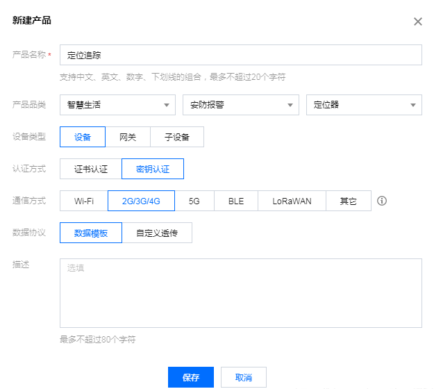  
产品新建成功后，可在产品列表页查看到“定位追踪”。
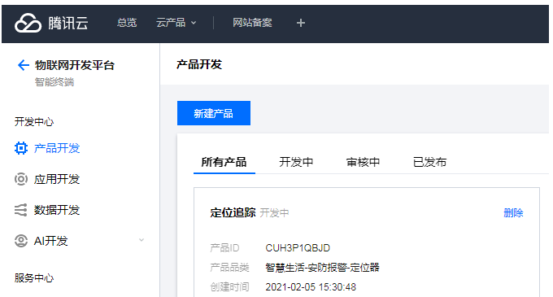  
#### 1.2.2 新建功能

点击“定位追踪”进入。

系统会自动生成标准功能，参照下图将其他不必须的删除
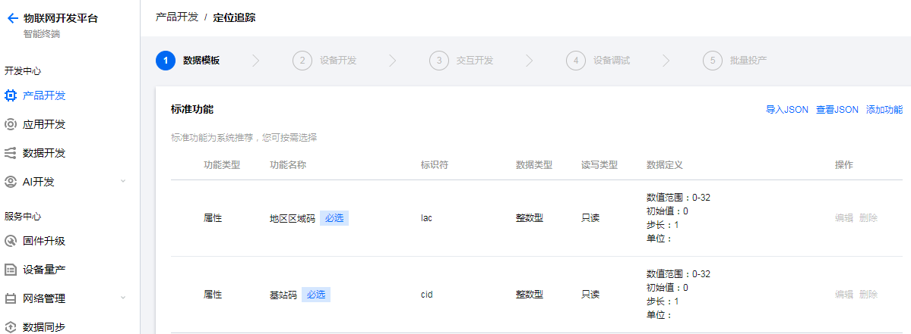
##### 1.2.2.1 

添加功能，增加GPS定位

在后面腾讯连连里也需要这个
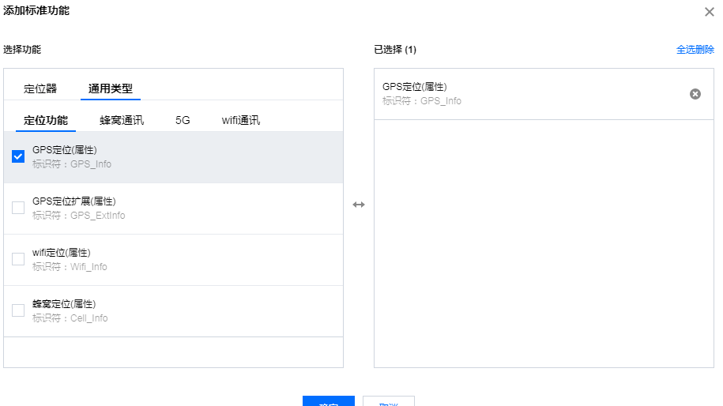
##### 1.2.2.2

json格式为： 
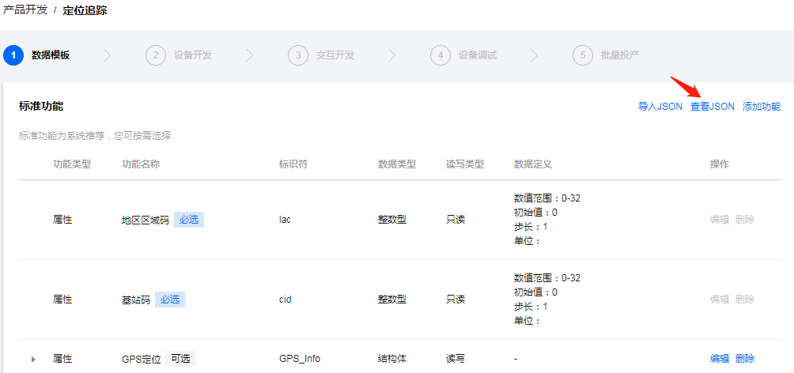
```c
{
  "version": "1.0",
  "profile": {
    "ProductId": "CUH3P1QBJD",
    "CategoryId": "550"
  },
  "properties": [
    {
      "id": "lac",
      "name": "地区区域码",
      "desc": "地区区域码",
      "required": true,
      "mode": "r",
      "define": {
        "type": "int",
        "unit": "",
        "step": "1",
        "min": "0",
        "max": "32",
        "start": "0"
      }
    },
    {
      "id": "cid",
      "name": "基站码",
      "desc": "基站码",
      "required": true,
      "mode": "r",
      "define": {
        "type": "int",
        "unit": "",
        "step": "1",
        "min": "0",
        "max": "32",
        "start": "0"
      }
    },
    {
      "id": "GPS_Info",
      "name": "GPS定位",
      "desc": "",
      "mode": "rw",
      "define": {
        "type": "struct",
        "specs": [
          {
            "id": "longtitude",
            "name": "GPS经度",
            "dataType": {
              "type": "float",
              "min": "-180",
              "max": "180",
              "start": "0",
              "step": "0.001",
              "unit": "度"
            }
          },
          {
            "id": "latitude",
            "name": "GPS纬度",
            "dataType": {
              "type": "float",
              "min": "-90",
              "max": "90",
              "start": "0",
              "step": "0.001",
              "unit": "度"
            }
          }
        ]
      },
      "required": false
    }
  ],
  "events": [],
  "actions": []
}
```  
### 1.3 创建测试设备
在【设备调试】页面中，单击【新建设备】，设备名为 bd_location：
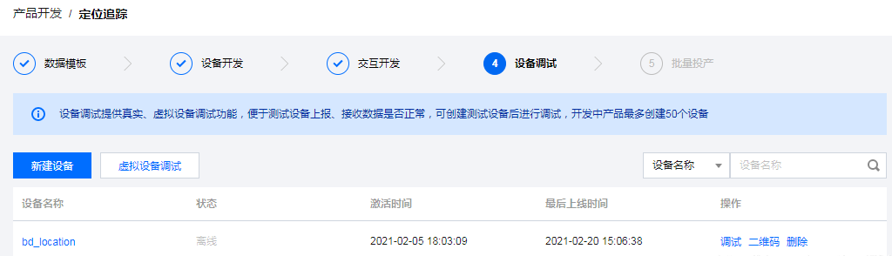
## 2. 设备侧操作
使用 Keil-MDK 打开 mqttclientiotexplorerlocation 工程：  
TencentOS-tiny\board\BDW01-STM32L496VG\KEIL\mqttclient_iot_explorer_locator_ll
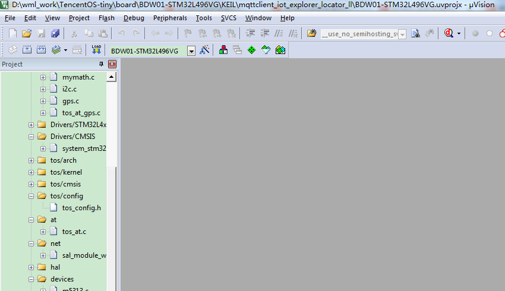
### 2.1 配置使用的网络设备
打开mqttclient_iot_explorer_locator_ll.c

打开M5313宏定义
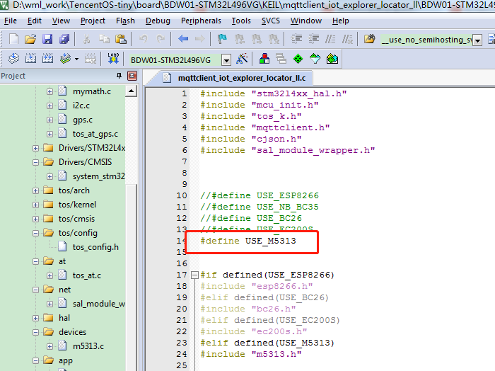
#### 2.1.1 修改MQTT对接参数

在腾讯云物联网开发平台可以看到一些产品ID、设备ID、设备秘钥三个参数，如图：
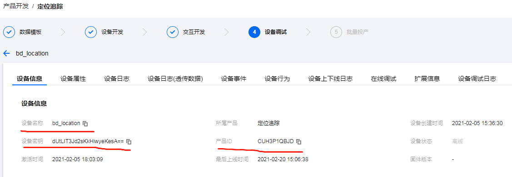  
接下来进入TencentOS-tiny仓库中的tools目录，使用python运行脚本mqttconfiggen.py，按照提示输出刚刚在平台查询到的三个参数，脚本会自动生成mqtt配置参数：
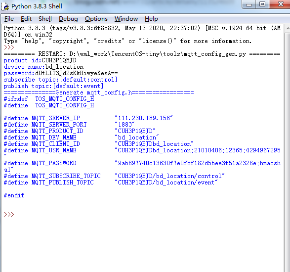  
① 输入产品ID；
② 输入设备名称
③ 输入设备秘钥；
④ ⑤ 保持默认，直接回车；
⑥ 需要的生成信息。
接下来在代码中修改配置信息：
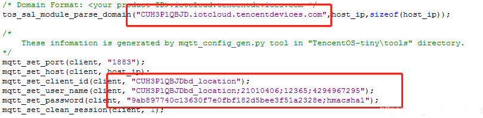  
#### 2.1.2 修改mqtt对接topic

设备向云端上报数据的topic如下：

上行请求 Topic： $thing/up/property/{ProductID}/{DeviceName}

上行响应 Topic： $thing/down/property/{ProductID}/{DeviceName}

修改代码，首先根据自己的产品ID和设备ID修改上报topic：
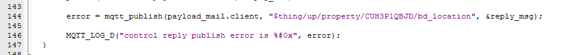  

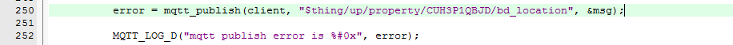  
然后修改订阅topic：
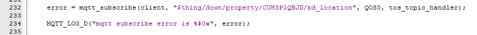  
打开2g模块M5313和GPS的串口接收：
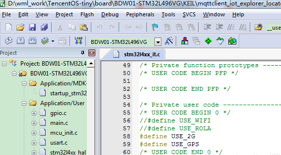  
#### 2.1.3 编译下载

修改完成之后编译工程，下载到开发板中，重新上电开始运行，在串口助手中查看打印日志：
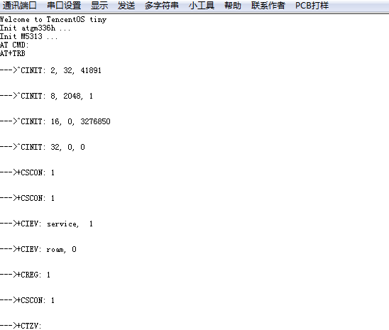  
#### 2.1.4 上报定位
GPS获取到定位时，串口会打印GPS定位信息：  
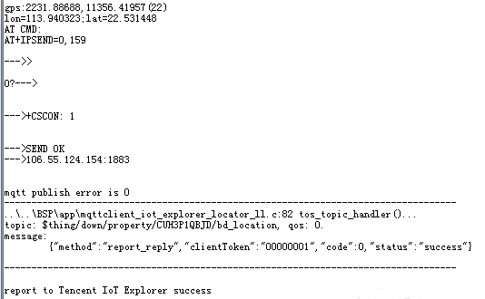  
同时将定位上传到云端， 在云端查看上报日志：
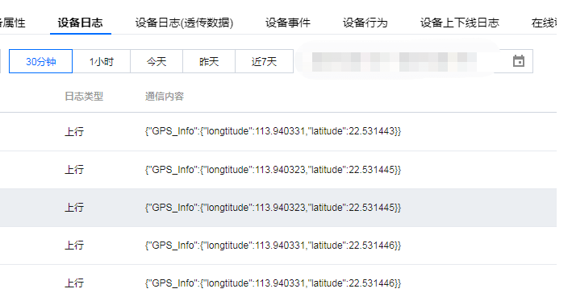  
## 3. 腾讯连连小程序操作步骤
### 3.1 在平台测添加面板
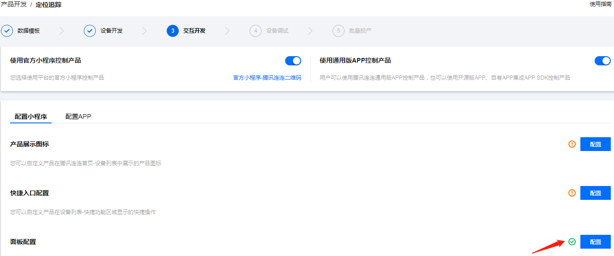  
选择免开发面板
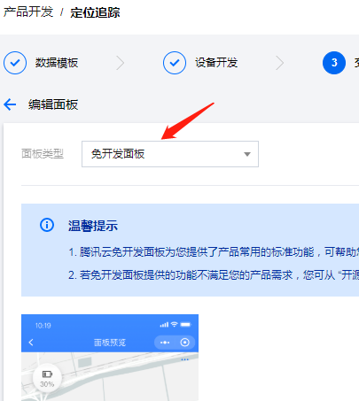  
### 3.2 添加家庭
手机端在【微信】搜索【腾讯连连】小程序，首次使用需要进入后点击【我的】->【家庭管理】，添加一个你喜欢的名称即可。
### 3.3 添加设备
进入后在中下方点击+号，开始扫描二维码  
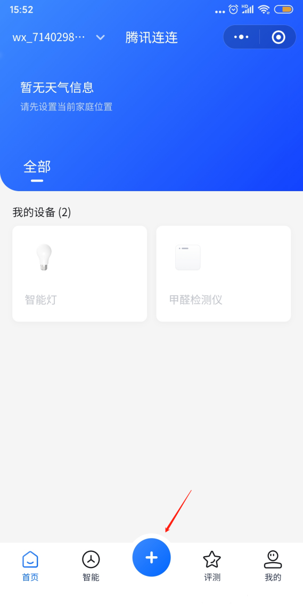  
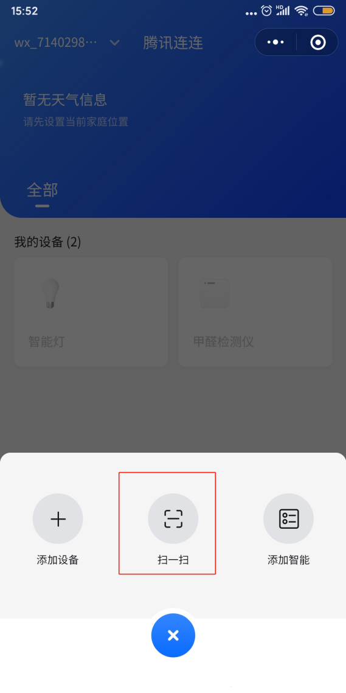  
在腾讯云物联网开发平台进入【设备调试】，点击对应设备后的【二维码】：
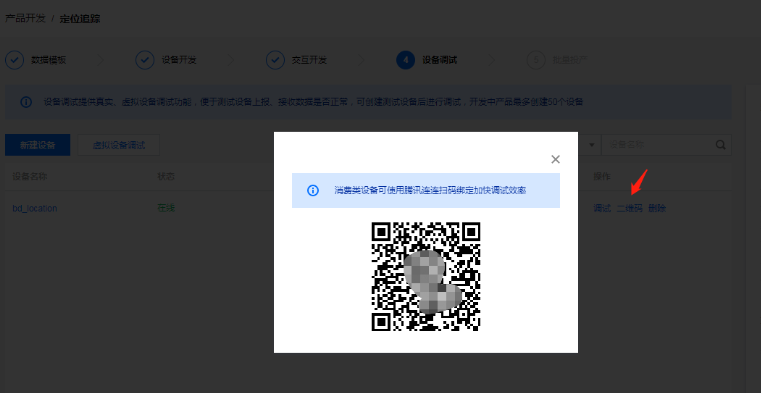  
腾讯连连扫描此二维码即可成功添加设备，添加成功之后如图：
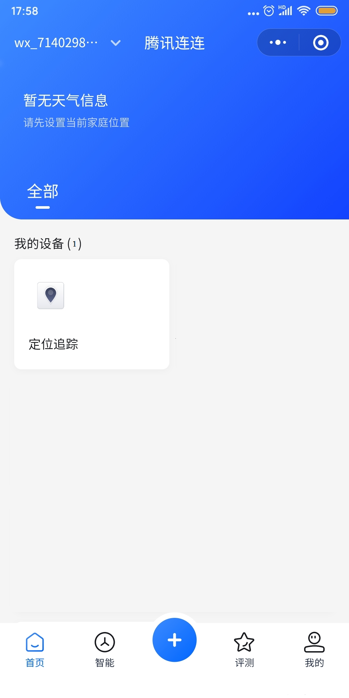  
给设备上电，等一会可以看到设备上线，等待拿到定位，点进去可以看到设备的位置
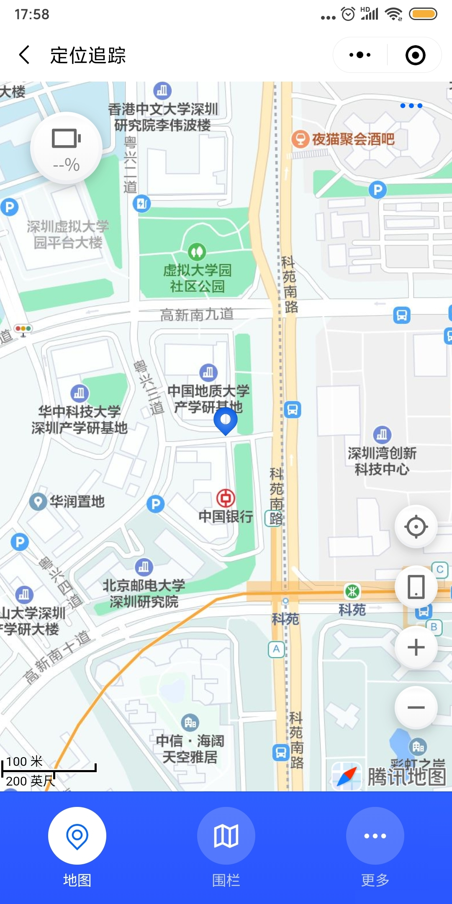  

开发板购买链接地址二维码：  
  