# OTA-HTTP方式
## 1. TencentOS-tiny OTA
### 1.1 OTA与IAP
IAP全称 In Application Programming，什么是在应用编程呢？  
正常开发流程如下：  
1. 使用Keil MDK工具编写应用程序；  
2. 编译出.axf可执行程序或者.bin文件，或者.hex文件；  
3. 使用Keil MDK工具直接烧录.axf文件到STM32 Flash中，或者使用类似STM32CubeProg之类的软件烧录.bin文件到STM32 Flash中；  
4. 复位，单片机从Flash起始地址处读取程序并执行；  

当产品开发完成用于生产后，通常不会再引出下载器接口给用户，所以也就无法连接各种各样的下载器，更别说用Keil或者STM32CubeProg这些工具下载程序，如果发现应用程序有漏洞，或者要修改部分功能，都已经无法完成。
#### 1.1.1 IAP设计思想
IAP巧妙的解决了这个问题，即在应用程序正常工作的时候，还可以接收新的固件并烧录到Flash中。  

- 应用程序如何接收新的固件？  
 
	一般产品设计时都会留一个用于打印日志信息的串口，可以直接利用此串口来接收PC发送到新固件，传输协议大多都采用Y-Modem协议。  

- 接收之后的新固件存放到哪里？  

	固件大小一般都有几十KB或者上百KB，应用程序接收到新的固件之后，如果是以数组的形式暂存在RAM空间中，不仅会浪费RAM空间，而且容易发生固件数据丢失，所以直接存储到空闲的Flash空间中是最好的方式。  
eg. 官方开发板使用的芯片是STM32L496VGTx，Flash空间有1024KB，如果应用程序的大小只有100KB，那么接收进来的新固件就可以存放在剩余的156KB空间中。
同时会人为的对Flash划分分区，也就是对某一段地址空间起个名字，如下图：  
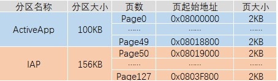  

- 如何将老固件替换为为新固件？  
上电之后CPU会从Flash的起始地址处读取数据开始执行，这点无法改变，正在运行的应用程序如果进行自己擦除自己的操作，设备直接变砖。  
bootloader可以完美的解决这一问题，即写一小段应用程序，放在Flash的起始位置处，使得每次上电之后最先运行bootloader，完成两个功能：  
① 检查升级标志，是否有新的固件被下载到IAP分区中；  
② 如果无升级标志，则跳转到ActiveAPP分区，开始执行应用程序；  
③ 如果有升级标志，则先将IAP分区中的固件拷贝到ActiveAPP分区中，然后跳转到ActiveAPP分区，开始执行新的应用程序；  
加入bootloader之后，整个Flash的分区情况如下：  
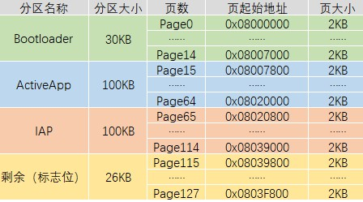  

#### 1.1.2 OTA设计思想
在IAP的这种设计思想之上，因为当前的物联网设备都已经具备基本的网络通信功能，所以无需通过串口传输新的固件，直接通过网络传输新的固件即可，称之为OTA IAP(Over The Air In Application Programming)，也就是平常所说的空中升级，简称OTA。  

### 1.2 OTA组件概述、特性及优势
TencentOS-tiny中提供的OTA组件完全开源免费，相较于其他的OTA功能，TencentOS-tiny OTA组件提供更小的差分升级包，耗用更少的传输流量，占用更小的内存空间，提供更可靠的升级服务。  
TencentOS-tiny OTA组件有以下的特性：  
传输差分升级包，而不是整个固件  
灵活的分区表功能  
支持原地升级  
支持乒乓升级，可以在升级中断的情况下进行版本回滚  
支持通过HTTP从自建服务器拉取固件  
支持从腾讯云平台进行统一的固件拉取和管理  

### 1.3 OTA组件开发调试推荐流程
OTA的整个流程调试较复杂，如果分步来做会比较容易：  
(1)调试bootloader是否可以正常读取分区表信息；  
(2)调试bootloader是否可以正常跳转到Active APP;  
(3)调试bootloader是否直接可以根据patch包进行升级;  
(4)调试Active APP是否可以通过网络拉取patch升级包并下载到 OTA 分区;  
(5)综合调试。  

## 2. 分区规划及分区表的生成、烧录
### 2.1 分区规划
TencentOS-tiny支持两种升级方式，两种升级方式对应有不同的分区表  
原地升级方式中，bootloader直接根据旧固件+patch升级包生成新的固件，一旦开始升级，无论升级成功与否都无法回滚到上一个版本，主要有五个分区：  
Bootloader分区：执行引导、分区升级功能；  
Active APP分区：当前正在运行的固件存放分区；  
OTA分区：新固件存放分区；  
KV分区：记录系统升级中的一些环境变量；  
分区表：存放分区表（固定大小32B，一般放在Flash的最后一个扇区中）  

乒乓升级方式中，bootloader在升级之前会将原来的固件拷贝一份，一旦开始升级，无论新固件升级成功与否，都可以回滚到上一个版本，主要有六个分区：  
Bootloader分区：执行引导、分区升级功能；  
Active APP分区：当前正在运行的固件存放分区；  
Backup分区：备份当前正在运行的固件；  
OTA分区：新固件存放分区；  
KV分区：记录系统升级中的一些环境变量；  
分区表：存放分区表（固定大小32B，一般放在Flash的最后一个扇区中）  

在实际应用中，两种方式的选择要根据设备需求，设备Flash空间大小，设备Flash扇区大小综合考虑。  
本文接下来如无特殊说明，都是以第一种方式（原地升级）为例，官方板的Flash大小为1024KB，可以如下分区：  
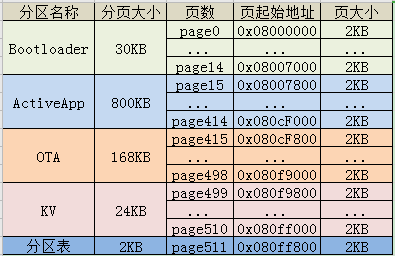  

### 2.2 分区表工具的使用方法
TencentOS-tiny 源码中提供了一个生成分区表的命令行工具，需要先使用gcc编译，没有gcc环境可以安装MinGW。  
#### 2.2.1 编译
进入\components\ota\tools\partition_table目录，执行make命令开始编译，编译之后进入到当前目录下的out\target即可看到工具 ptbl.exe：  
cd out/target/ 
该工具有如下参数：  

1. h：打印帮助信息  
2. p <ip/pp>：选择升级方式,ip或者pp  
3. a <start,end>：Active APP分区的起始和结束地址  
4. b <start,end>：Backup 分区的起始和结束地址，选了pp方式才需要  
5. o <start,end>：OTA分区的起始和结束地址  
6. k <start,end>：KV分区的起始和结束地址  
7. v <major>.<minor>：初识固件版本号  

为官方板生成分区表文件的命令如下：  
./ptbl.exe -p ip -a 0x08007800,0x080CF800 -o 0x080CF800,0x080F9800 -k 0x080F9800,0x080FF800 -v 0.1 ptbl.bin  
运行之后即可在当前目录下看到生成的分区表文件ptbl.bin。  

### 2.3 分区表烧录方法
生成的分区表文件ptbl.bin可以通过STM32CubeProg直接烧录到Flash中，按照之前规划的分区，烧录位置为 0x0803F800 ，烧录方法如下：   
(1)使用下载器连接开发板到PC，打开STM32CubeProg工具，点击Connect连接到开发板：  
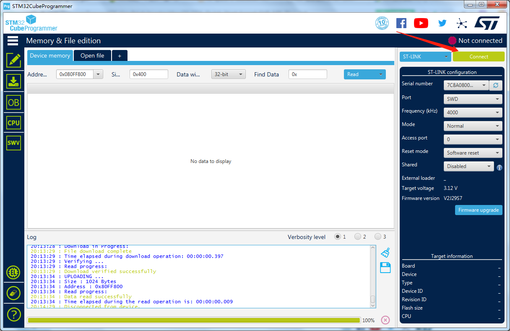  
(2)如果是第一次使用OTA，点击左侧的烧录按钮，点击全片擦除：  
  
第一次使用的时候，KV分区中的数据不确定，可靠起见直接选择全片擦除。

(3)点击左侧的烧录按钮，选择刚刚生成的ptbl.bin，下载地址填写 0x080FF800，点击烧录：  
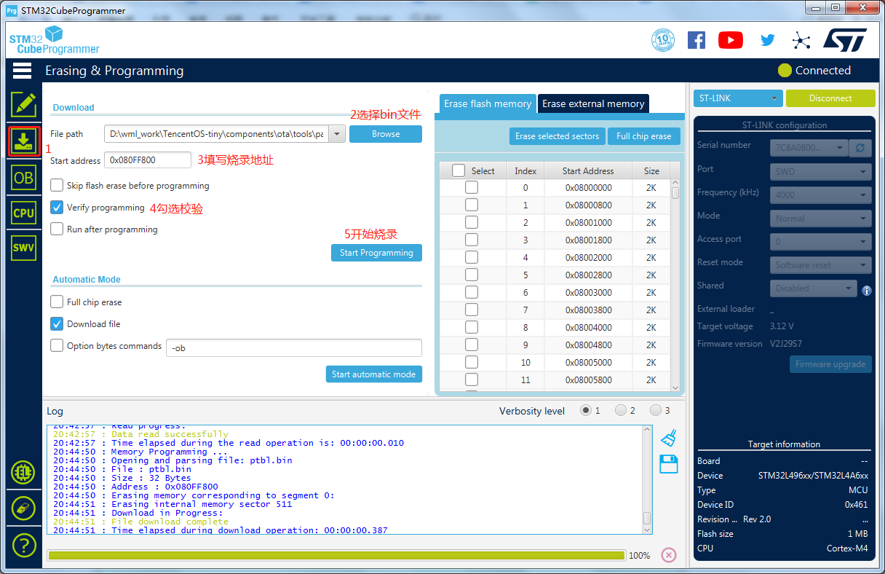  
出现烧录成功弹窗即可。

## 3. 测试Bootloader程序
进入board\BDW01-STM32L496VG\KEIL\ota目录，打开官方提供的bootloader示例工程：    ota_bootloader_recovery。  
bootloader其实是一个裸机程序，在 main 函数中主要有三部分，分别对应三个功能：  
读取分区表  
根据patch包进行升级  
跳转到Active APP分区开始执行  
接下来将完成 1.3 节所给出的OTA组件开发调试推荐流程前三步。  
### 3.1 测试bootloader是否可以读取分区表
首先需要指定分区表地址：  
  
如下初始化环境变量的代码，在初始化之后打印分区表的代码，最后的while(1)用于停止程序，防止进行后面的功能：  
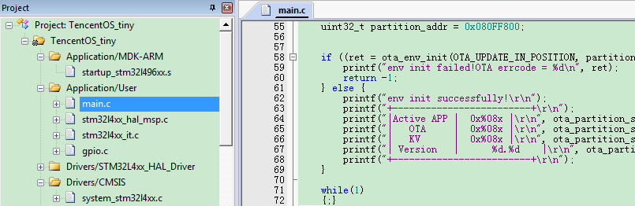  
修改程序编译地址和大小，与Bootloader分区的划分相对应：  
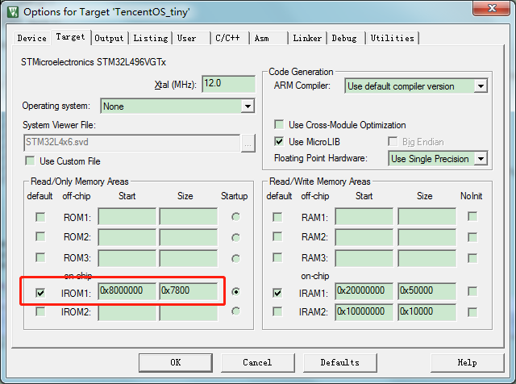  
编译程序。  
编译成功之后修改下载设置，选择扇区擦除方式、设置程序烧录起始地址、设置程序烧录大小，同样与bootloader分区的划分相对应：  
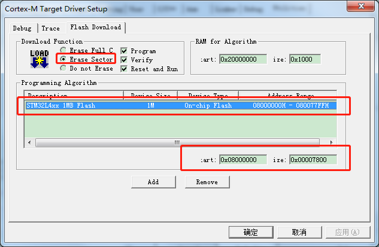  
下载程序，在串口助手中观察输出：  
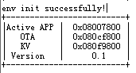  

### 3.2 测试bootloader是否可以跳转到Active APP分区
打开和bootloader在一个目录下的app工程：ota_application_download_through_http。  
目前我们只是测试bootloader是否可以跳转过来执行此程序，所以如图所示修改代码，不要触发OTA固件拉取功能：  
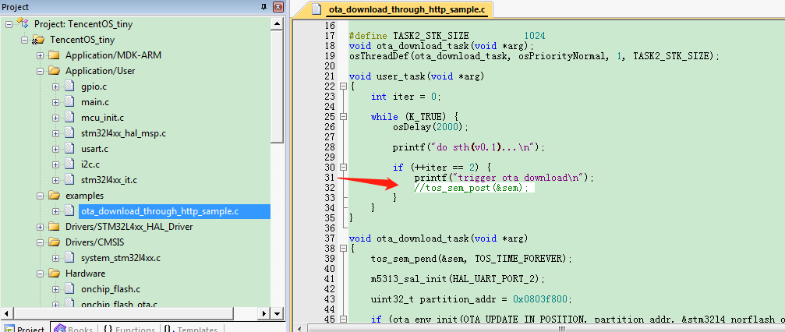  
另外，因为此程序被烧录到 Active APP 分区，是从Active APP分区的起始地址开始运行的，所以需要修改中断向量表的偏移地址，如图：  
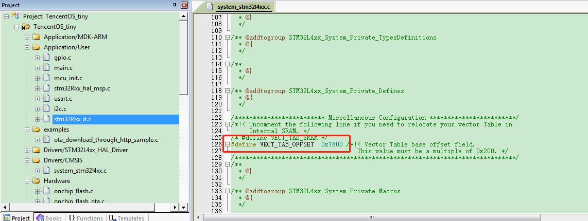  
同样修改程序编译的起始地址和大小，与规划的 Active APP分区信息相对应：  
  
编译程序。  
编译成功之后修改下载设置，烧录到Actice APP分区中：  
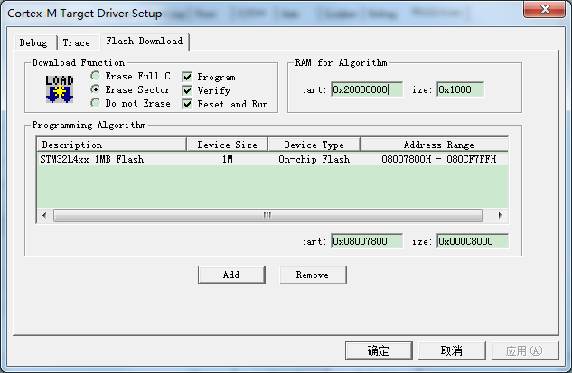  
最后再修改bootloader程序，屏蔽while(1)，屏蔽OTA固件升级功能，开启跳转功能：  
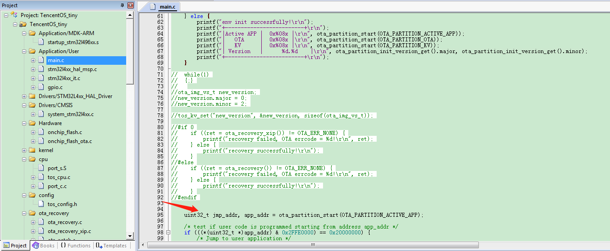   
再次编译，下载bootloader，复位开发板，查看串口助手中的输出，可以看到bootloader成功跳转到Actice APP开始执行：  
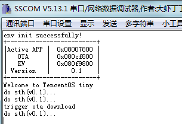  

### 3.3 差分patch包生成方法
#### 3.3.1 准备老固件和新固件
官方示例工程已经在MDK中配置编译后生成.bin固件，如图：  
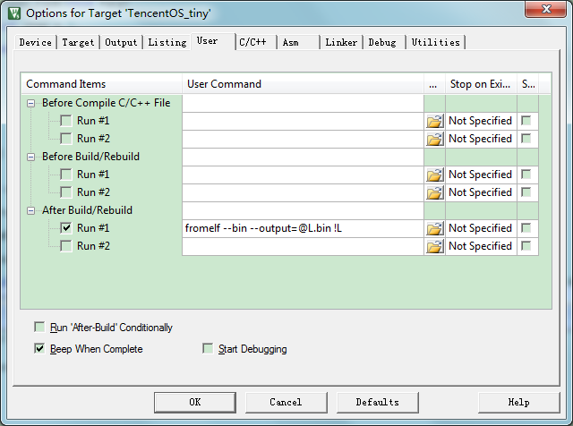  
编译之后会在工程目录下生成TencentOS_tiny.bin文件，拷贝一份出来，重命名为:TencentOS_tiny_0_1.bin，表示这是0.1版本的固件。  
修改app工程，将打印信息中的0.1改为0.2，以验证是否升级成功：  
   
重新编译，生成新固件TencentOS_tiny.bin，同样拷贝一份，重命名为：TencentOS_tiny_0_2，表示这是0.2版本的固件。  
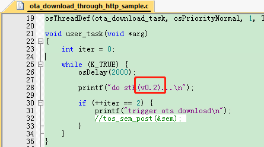   

#### 3.3.2 差分升级包生成工具的使用
编译此工具同样需要gcc环境。    
进入\components\ota\tools\diff目录，执行make命令开始编译，编译之后进入到当前目录下的out\target即可看到工具 diff.exe：  
cd out/target/   
该工具有如下参数：  
1. h：打印帮助信息  
2. v：打印更多信息  
3. s：<待定...>
4. b <n>：指定扇区大小，单位：字节Byte  
5. n <major>.<minor>：新的固件版本号  
6. o <major>.<minor>：旧的固件版本号  

将3.3.1节准备的两个固件拷贝到当前工具所在目录下。  
根据前面准备的两个新旧固件，制作差分升级包的命令如下：  
./diff.exe -v -b 2048 -n 0.2 -o 0.1 TencentOS_tiny_0_1.bin TencentOS_tiny_0_2.bin patch.bin
运行之后即可在当前目录下看到生成的差分升级包patch.bin。  
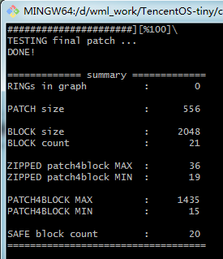  

### 3.4 测试bootloader是否可以根据patch进行升级
使用STM32CubeProg直接将差分升级包patch.bin下载到OTA分区：  
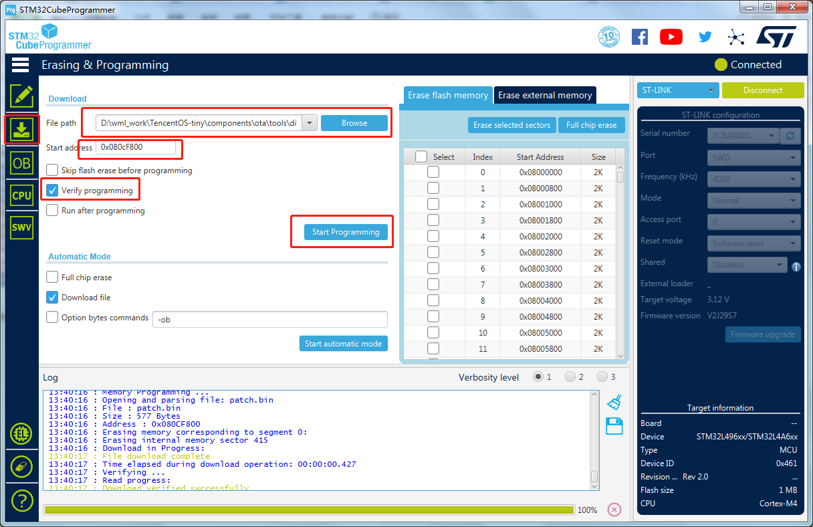  
下载成功后，因为bootloader通过检测KV分区中的环境变量new_version来判断是否有新的固件，但是环境变量在app程序拉取固件成功之后才会设置，所以我们手动在bootloader中来设置此环境变量。  
在main.c中引入KV的头文件：  

```c
#include "tos_kv.h"
```  
在环境变量初始化代码之后，升级代码之前添加（打开）如下的代码：  
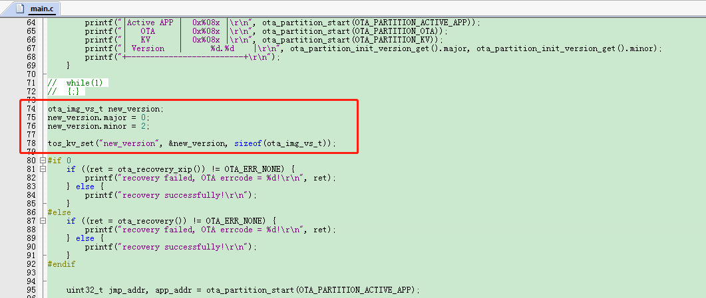  
添加之后编译，下载，在串口助手中查看输出：  
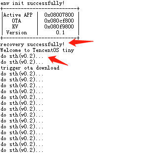  
可以看到bootloader成功根据patch差分包和旧的固件，还原出了新的固件并成功升级。  

## 4. 使用HTTP方式获取固件并升级
TencentOS-tiny OTA组件支持使用 HTTP 协议拉取差分升级patch包，并烧写到OTA分区中。  
### 4.1 准备HTTP服务器
HTTP服务器的选择非常多，常用选择有：  
在Windows上使用类似MyWebServer的小工具开启HTTP服务  
1)优点：简单方便，用于测试  
2)缺点：需要在路由端做一个端口映射，可以通过外网进行访问  
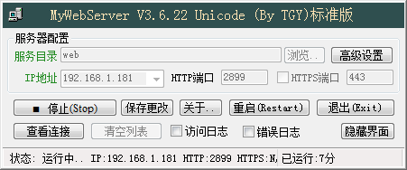  
在云服务器上安装类似Nginx的工具，开启HTTP访问  
1)优点：性能强劲、有公网ip、支持高并发（大量设备同时开机拉取固件）  
2)缺点：安装过程较复杂  
除了这两种方式外，还有很多的方式可供选择，只需要开启HTTP服务即可，本文中我使用第一种方式。  
开启之后将第3步中生成的差分升级固件 patch.bin 上传/复制到HTTP服务目录中，然后使用浏览器访问http://<已经开启HTTP服务PC的ip,外网ip>:<HTTP服务端口>/patch.bin，测试正常获取之后方可进行后续操作。  
开启HTTP服务之后记得关闭各种防火墙，比如Win10网络防火墙，云服务器安全组等。  
### 4.2 HTTP获取固件并升级
(1)使用STM32CubeMX Prog全片擦除，烧写分区表到0x080ff800;  
(2)修改bootloader程序，去除手动设置new_version环境变量代码，编译，下载，**不要复位**:  
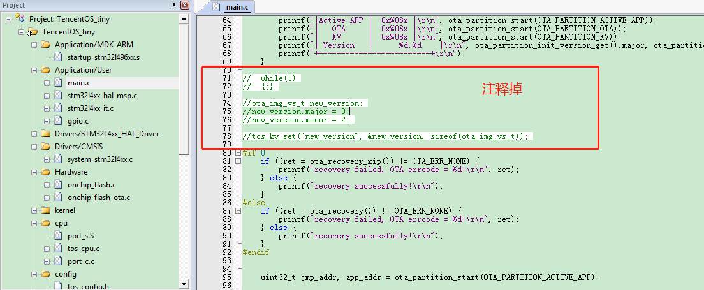  

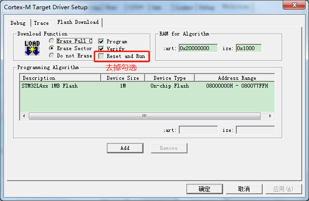  
(3)修改Actice APP工程(ota_application_download_through_http)，开启HTTP固件拉取和升级功能:  
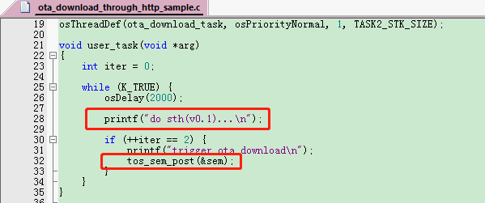  
打开串口可接收M5313的数据：  
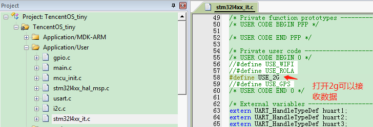  
修改分区表地址，根据自己的外网ip配置：  
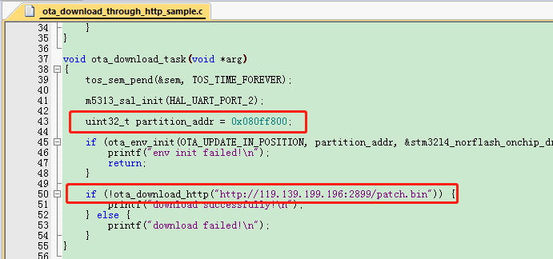  
修改之后编译，下载，**不要复位**。  
特别注意，此时0.1版本的程序已经被我们修改，所以之前生成的patch包无法完成升级，重新在0.1版本的基础上修改处0.2版本的程序，并制作patch包。  
重复一遍之前的制作流程即可：  
① 将当前固件拷贝出来，重命名为TencentOS_tiny_0_1.bin;  
② 修改打印提示，表示这是0.2版本的程序：  
printf("do sth(v0.2)...\n");  
③ 将新固件拷贝出来命名为TencentOS_tiny_0_2.bin;  
④ 使用diff命令行工具或者可视化工具制作差分升级包patch.bin；  
⑤ 将制作出的差分升级包拷贝/上传到HTTP服务器目录；  
此时，一切准备就绪，复位设备，即可在串口助手中看到OTA的升级状况：  
上电启动  
  
等待连接，请求，下载，后  
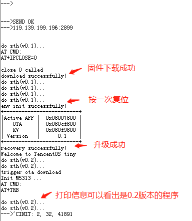  


