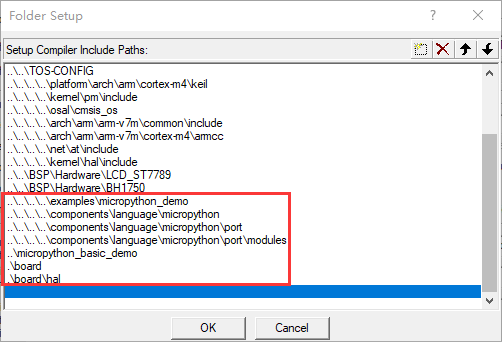
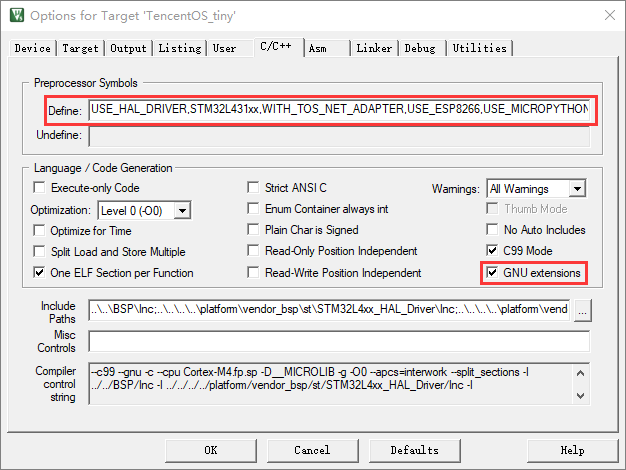
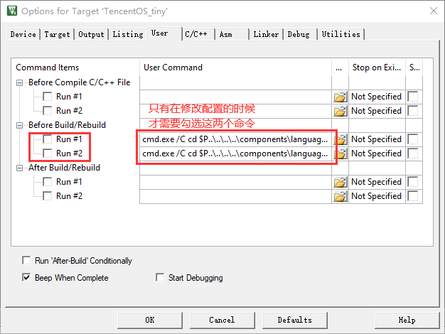
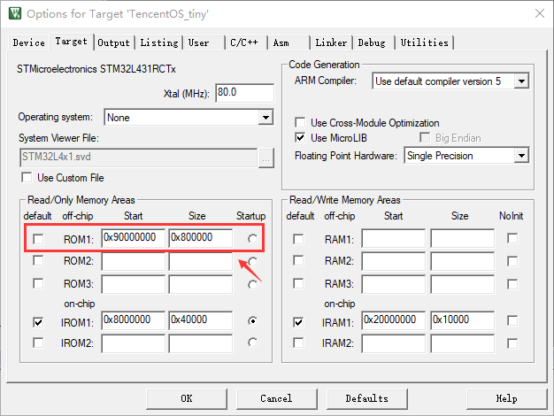
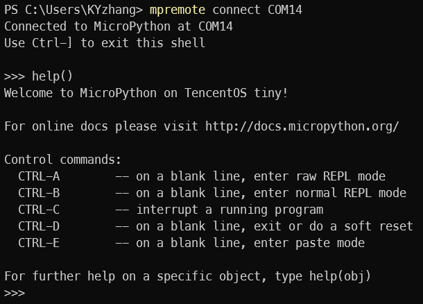
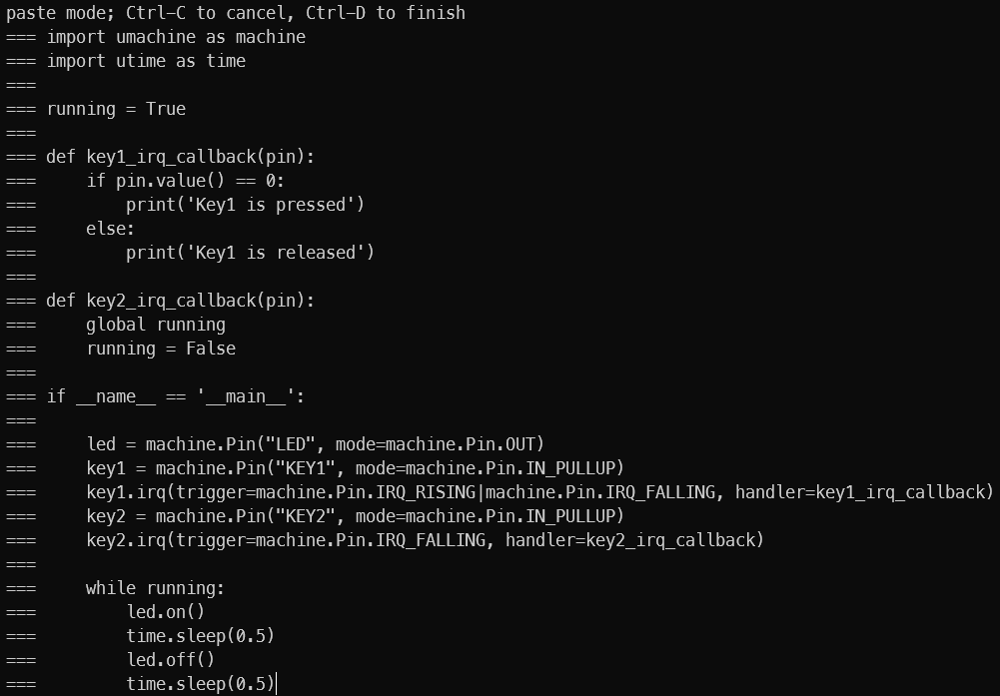

# 如何使用 TencentOS-tiny 上移植的 MicroPython 组件

## 1 基础Keil工程

### 1.1 源代码

* micropython/py 组中添加
  * components/language/micropython/py 目录下的 *.c 文件

* micropython/shared 组中添加：
  * components/language/micropython/shared/readline 目录下的 readline.c 文件
  * components/language/micropython/shared/runtime 目录下的  pyexec.c, stdout_helpers.c, sys_stdio_mphal.c, interrupt_char.c 文件

* micropython/extmod 组中添加：
  * components/language/micropython/extmod 目录下的 utime_mphal.c, machine_signal.c, virtpin.c, machine_mem.c 文件

* micropython/port 组中添加：
  * components/language/micropython/port 目录下的 *.c 文件
  * components/language/micropython/port/modules 目录下的 *.c 文件
  * 工程目录中 board/ 目录下的 mphalboard.c 文件

*  hal 组中添加：
  * 工程目录下 board/hal/ 目录下的 *.c 文件

*  examples 组中添加：
  * examples/micropython_demo/micropython_demo.c文件

### 1.2 头文件

在工程配置界面 C/C++ 页面中的 Include Paths 中添加下列目录：



* 添加 examples/micropython_demo
* 添加 components/language/micropython
* 添加 components/language/micropython/port
* 添加 components/language/micropython/port/modules
* 添加工程目录
* 添加工程目录下的 board 目录
* 添加工程目录下的 board/hal 目录

### 1.3 其他选项

在工程配置界面的 C/C++ 页面下勾选 GNU extensions 选项，并在 Define 中添加 `USE_MICROPYTHON`。



### 1.4 编译脚本

MicroPython 采用了字符串驻留（String interning）技术节省 ROM 和 RAM 空间，在工程编译前需要先生成内部字符串 QSTR（uniQue STRing）。本工程中采用 Makefile 搜索代码中所有需要预先生成的 QSTR，然后在工程目录下的 genhdr 目录中生成 qstrdefs.generated.h 等文件。关于QSTR的更详细信息，可以在[官方文档](https://docs.micropython.org/en/latest/develop/qstr.html)中获取。

在工程配置界面 User 页面下的 Before Build/Rebuild 中添加以下两个命令：

```shell
cmd.exe /C cd $P..\..\..\..\components\language\micropython\port & make clean-build V=1
```

```shell
cmd.exe /C cd $P..\..\..\..\components\language\micropython\port & make genhdr V=1 PYTHON=python PORT_BOARD_DIR=$Pboard TARGET_GENHDR_DIR=$Pgenhdr
```



该命令的作用是生成工程目录下的 genhdr 目录中的头文件，这些头文件通常只有在修改配置之后才需要重新生成，因此**在不修改配置的情况下，不需要勾选这两个命令**。

> 使用前请确保安装了make等unix工具，gcc工具链以及Python3，并将它们加入到系统环境变量中。如果没有安装，gcc工具链和unix命令行工具可以在MinGW中获取。访问[MinGW官方网站](https://www.mingw-w64.org/)和[Python官方网站](https://www.python.org/)分别可以获取MinGW和Python的相关信息。

第二条命令中指定了多个变量的值，这些变量的含义分别是：

* **PYTHON**：表示命令行可以使用的python命令，根据当前环境中的python命令修改
* PORT_BOARD_DIR：表示与开发板相关的代码目录，该目录下至少需要包含mpconfigboard.h 文件和 mphalboard.h 文件
* TARGET_GENHDR_DIR：表示生成的头文件所在的代码目录

### 1.5 外部Flash扩展

> 该功能目前只能在小熊派开发板上使用

MicroPython对ROM的需求量较大，上述基础Keil工程编译后需要占用239.70kB的ROM空间，对于包括ROM空间较少的开发板（比如：小熊派开发板）不太友好，为了能够在这样的开发板上运行更加完整的MicroPython功能，可以利用开发板的外部Flash对ROM空间进行扩展。

1. micropython_extra_demo 工程目录下包含了小熊派开发板的Keil外部Flash下载算法文件 BearPi_W25Q64JV.FLM，将该文件拷贝到 **<Keil软件目录>/ARM/Flash** 目录下。

2. 在Keil工程中配置外部 ROM，并选择 Flash 下载算法

   * 在工程配置的 Target 页面中，添加一个 ROM 区域，起始地址为 **0x90000000**，区域大小为 **0x800000**（ROM区域大小取决于外部 Flash 芯片容量）

     

   * 在 Debug 页面中，点击右上角的 Settings，选择 Flash Download 选项卡，进入下图界面

     

   * 添加描述为**“BearPi W25Q84JV 8MB Flash”**的 Flash 下载算法，并将右上角的 Size 调整到**0x8000**。

3. 将特定文件或者组的存储位置改到外部 ROM 中。

   

4. 添加 W25Q64JV 的驱动代码，启用内存映射模式。（在 MicroPython 的工程中，只需要启用第二节 “[功能配置和扩展](#2-功能配置和扩展)” 中的`MP_USING_QSPI_FLASH`宏并添加相应文件即可）

> 中断相关的代码以及内存映射模式启动前就需要执行的代码，不能放在外部 Flash 中。推荐将 MicroPython 相关的代码（除了移植的代码）都放在外部 Flash 中。

## 2 功能配置和扩展

与开发板相关的配置文件主要包括 mpconfigboard.h 和 mphalboard.h/c，其中 mpconfigboard.h 包含对 MicroPython 的配置，mphalboard.h/c 包含开发板特有的 MicroPython 函数的部分功能实现。

mpconfigboard.h 主要由宏定义构成，可以使用的定义以及对应的含义如下表：

| 名称                     | 含义                                        | 取值范围                                              | 说明                                                         |
| ------------------------ | ------------------------------------------- | ----------------------------------------------------- | ------------------------------------------------------------ |
| MICROPY_HW_BOARD_NAME    | 开发板名称                                  | 字符串                                                |                                                              |
| MICROPY_HW_MCU_NAME      | 微控制器名称                                | 字符串                                                |                                                              |
| MICROPY_HW_UART_NUM      | UART数量                                    | 整数                                                  | 需要与 tos_hal 的实现一致                                    |
| MICROPY_HW_UART_REPL     | 用于 MicroPython 交互式命令行的 UART 的编号 | 整数                                                  | 需要与 tos_hal 的实现一致                                    |
| MICROPY_HW_SPI_NUM       | SPI 数量                                    | 整数                                                  | 需要与 tos_hal 的实现一致                                    |
| MICROPY_CONFIG_ROM_LEVEL | ROM 水平                                    | MICROPY_CONFIG_ROM_LEVEL<br>\_<BASIC/EXTRA>\_FEATURES | 代表 MicroPython 的功能裁剪程度，这里只列出两个典型值，其他取值需要参考 py/mpconfig.h 文件 |

除了以上配置之外，还有一些可选的功能配置，采用定义`MP_USING_xxx`宏的形式进行功能扩展：

| 宏定义                                     | 描述                              | 依赖的文件/组件                                              |
| ------------------------------------------ | --------------------------------- | ------------------------------------------------------------ |
| MP_USING_QSPI_FLASH                        | 使用外部QSPI-Flash扩展内部ROM空间 | 开发板目录/BSP/Hardware/W25Qxx-QSPI/w25qxx.c，详见第一节的外部Flash扩展部分 |
| MP_USING_VFS                               | 启用uos模块，启用VFS功能          | tos_vfs组件，<br>extmod/vfs.c，<br>extmod/vfs_reader.c，<br>extmod/moduos.c |
| MP_USING_MACHINE_SPI                       | 在umachine库中启用SPI功能         | extmod/machine_spi.c，<br>drivers/bus/softspi.c，            |
| MP_USING_MACHINE_I2C                       | 在umachine库中启用I2C功能         | extmod/machine_i2c.c                                         |
| MP_USING_NETWORK                           | 启用network模块                   | socket_wrapper组件，<br>sal_wrapper组件，<br>extmod/modnetwork.c，<br>extmod/modusocket.c，<br>shared/netutils/netutils.c |
| MP_USING_USELECT                           | 启用uselect模块                   | extmod/moduselect.c                                          |
| 以下模块在ROM_LEVEL为EXTRA的时候会默认启用 | -----                             | -----                                                        |
| MP_USING_CMATH                             | 启用cmath模块                     | -                                                            |
| MP_USING_UASYNCIO                          | 启用uasyncio模块                  | extmod/moduasyncio.c                                         |
| MP_USING_UCTYPES                           | 启用uctypes模块                   | extmod/moductypes.c                                          |
| MP_USING_UZLIBS                            | 启用uzlibs模块                    | extmod/moduzlibs.c                                           |
| MP_USING_UJSON                             | 启用ujson模块                     | extmod/modujson.c                                            |
| MP_USING_URE                               | 启用ure模块                       | extmod/modure.c                                              |
| MP_USING_HEAPQ                             | 启用uheapq模块                    | extmod/moduheapq.c                                           |
| MP_USING_UHASHLIB                          | 启用uhashlib模块                  | extmod/moduhashlib.c                                         |
| MP_USING_UBINASCII                         | 启用ubinascii模块                 | extmod/modubinascii.c                                        |
| MP_USING_URANDOM                           | 启用urandom模块                   | extmod/modurandom.c                                          |
| MP_USING_FRAMEBUF                          | 启用framebuf模块                  | extmod/modframebuf.c                                         |

## 3 使用MicroPython

下载 MicroPython 固件后，可以使用支持串口功能的 shell 连接到 MicroPython 的交互式解释器（REPL）上，也可以使用 MicroPython 提供的 mpremote 工具连接到 REPL。REPL 所关联的串口由第二节 “[功能配置和扩展](#2-功能配置和扩展)” 中的 `MICROPY_HW_UART_REPL` 宏设定。

### 3.1 mpremote

#### 3.1.1 使用 pip 安装 mpremote

```shell
pip install mpremote
```

#### 3.1.2 使用 mpremote 可以在常规的 shell 上连接到串口 REPL

```shell
mpremote connect <device>
```

例如：连接COM14端口

```shell
mpremote connect COM14
```

按下 ”Ctrl-]“ 可以退出REPL

#### 3.1.3 使用 mpremote 还可以在开发板上执行本地的 python 脚本

   ```shell
mpremote connect <device> run <file>
   ```

例如：使用mpremote运行示例脚本led.py文件

   ```shell
mpremote connect COM14 run ./led.py
   ```

mpremote还包含其他功能，参考[官方文档]( https://docs.micropython.org/en/latest/reference/mpremote.html)了解详情。

### 3.2 REPL

#### 3.2.1 help() 命令

进入 REPL 后，可以使用 help() 命令，查看与 MicroPython 控制命令相关的提示信息：



其中 Ctrl-C 可以用来中断正在运行的程序，Ctrl-D 可以用来软复位，Ctrl-E 可以进入粘贴模式。

#### 3.2.2 help('modules') 命令

在交互式解释器中可以使用 help('modules') 命令查看当前可以引入的模块：


#### 3.2.3 粘贴模式

在正常交互模式下，输入 Ctrl-E 可以进入粘贴模式。

在粘贴模式下可以方便地将 python 脚本粘贴到 REPL 中。

> 由于输入缓冲区大小只有512B，所以比较长的脚本需要分段粘贴。

粘贴完成后，输入 Ctrl-D 可以退出粘贴模式，并开始执行脚本。

下图展示了使用粘贴模式粘贴 pin.py 脚本的情况：



#### 3.2.4 其他功能

REPL还有自动缩进，自动补全以及特殊变量"_"等功能，详细内容可以参考[官方文档](https://docs.micropython.org/en/latest/reference/repl.html)。

### 3.3 自动执行脚本

对于启用文件系统的 MicroPython 工程，可以在文件系统根目录中存放 boot.py 和 main.py 脚本，这两个脚本会在 MicroPython 启动时依次执行。

## 4 示例工程和示例脚本说明

### 4.1 示例工程

项目针对小熊派开发板提供了两个不同的示例工程：

* micropython_basic_demo 是一个基础版的 MicroPython 工程，在第一节 ”[基础Keil工程](#1-基础Keil工程)“ 中给出了比较详细的该工程的创建流程。该工程包含了 MicroPython 的REPL功能、_thread线程模块功能以及基本的 machine 模块功能。
* micropython_extra_demo 是在 micropython_basic_demo 工程的基础上，参考第二节 “[功能配置和扩展](#2-功能配置和扩展)” 中的内容进行配置得到的扩展版的 MicroPython 工程。由于小熊派开发板的 ROM 不足以支持所有的 MicroPython 功能，该工程内使用了外部 Flash 扩展 ROM 容量。该工程在 micropython_basic_demo 工程的基础上，添加了 MicroPython 的一系列扩展模块，还添加了uos 模块以及 network 模块等移植模块。

### 4.2 示例脚本

在工程目录下的 scripts 目录中给出了三个示例脚本文件：

* pin.py：脚本展示了 umachine 模块和 utime 模块的使用方式

  ```python
  import umachine as machine
  import utime as time
  
  running = True
  
  def key1_irq_callback(pin):
      if pin.value() == 0:
          print('Key1 is pressed')
      else:
          print('Key1 is released')
  
  def key2_irq_callback(pin):
      global running
      running = False
  
  if __name__ == '__main__':
  
      led = machine.Pin("LED", mode=machine.Pin.OUT)
      key1 = machine.Pin("KEY1", mode=machine.Pin.IN_PULLUP)
      key1.irq(trigger=machine.Pin.IRQ_RISING|machine.Pin.IRQ_FALLING, handler=key1_irq_callback)
      key2 = machine.Pin("KEY2", mode=machine.Pin.IN_PULLUP)
      key2.irq(trigger=machine.Pin.IRQ_FALLING, handler=key2_irq_callback)
  
      while running:
          led.on()
          time.sleep(0.5)
          led.off()
          time.sleep(0.5)
  ```

  脚本运行现象是：LED每过0.5s亮灭变化一次；按下按键1，打印一行文本 ”key1 is pressed“，释放按键1，打印一行文本 ”key1 is released“；按下按键2，LED不再闪烁，脚本退出。

* thread.py：脚本展示了 _thread 模块的使用方法

  ```python
  import _thread
  
  lock = _thread.allocate_lock()
  n_thread = 4
  n_finished = 0
  
  def thread_entry(no):
      print(no)
      with lock:
          global n_finished
          n_finished += 1
  
  if __name__ == '__main__':
      for i in range(n_thread):
          _thread.start_new_thread(thread_entry, (i,))
  
      while n_finished < n_thread:
          pass
      print("done")
  ```

  脚本运行现象是：创建四个线程，序号分别为0~3，每个线程打印自己的序号后退出。

* os.py：该脚本展示了 uos 模块中的文件操作和目录操作

  > 该脚本只有在启用 VFS 的前提下才能运行
  
  ```python
  import uos as os
  
  # test mkdir()
  print('{:-^40}'.format('test mkdir'))
  print(os.listdir())
  os.mkdir('test_dir')
  print(os.listdir())
  
  # test file open() and write()
  print('{:-^40}'.format('test write'))
  f = open('test_dir/test_file', 'w')
  f.write("Hello TencentOS-tiny\n")
  print("Hello MicroPython", file=f)
  f.close()
  print(os.listdir('test_dir'))
  
  # test file open() and read()
  print('{:-^40}'.format('test read'))
  f = open('test_dir/test_file', 'r')
  print(f.readlines())
  f.close()
  
  # test 'with' statement and iterator
  print('{:-^40}'.format('test with statement'))
  with open('test_dir/test_file', 'r') as file:
      for line in file:
          print(line)
  
  # test rename()
  print('{:-^40}'.format('test rename'))
  os.rename('test_dir', 'test_dir2')
  print(os.listdir())
  print(os.listdir('test_dir2'))
  
  # test unlink()
  print('{:-^40}'.format('test unlink'))
  os.unlink('test_dir2/test_file')
  print(os.listdir('test_dir2'))
  os.unlink('test_dir2')
  print(os.listdir())
  ```

  脚本运行现象是：输出以下内容
  
  ```
  ---------------test mkdir---------------
  ['System Volume Information']
  ['test_dir', 'System Volume Information']
  ---------------test write---------------
  ['test_file']
  ---------------test read----------------
  ['Hello TencentOS-tiny\n', 'Hello MicroPython\n']
  ----------test with statement-----------
  Hello TencentOS-tiny
  
  Hello MicroPython
  
  --------------test rename---------------
  ['System Volume Information', 'test_dir2']
  ['test_file']
  --------------test unlink---------------
  []
['System Volume Information']
  ```
  
  


