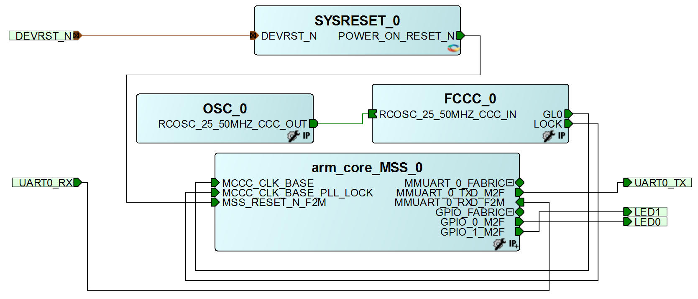
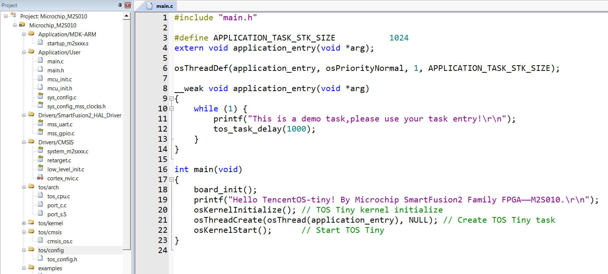
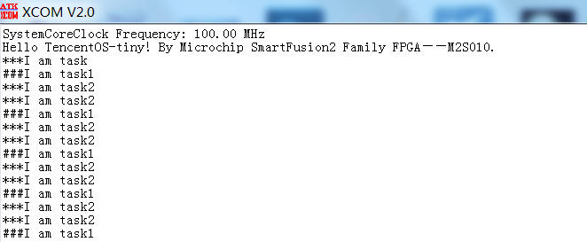

## 移植TencentOS-tiny到Microchip SmartFusion2系列FPGA芯片上

### 1. BSP简介

移植 [TencentOS-tiny](https://cloud.tencent.com/product/tos-tiny) 实时操作系统到一款 **FPGA 芯片——M2S010** ，运行hello_world示例程序。该芯片属于 Microchip（原Microsemi）公司SmartFusion2系列，是一款**智能混合型FPGA**，片上除了 FPGA Fabric 逻辑部分，还包括一个 **ARM® Cortex™-M3 内核的 MCU**，主频最高 166MHz ，256KB eNVM，64KB eSRAM，集成GPIO、UART、I2C、SPI、CAN、USB等基本外设。

SmartFusion2 内部框图

### 2. 使用说明

#### 2.1 FPGA 工程设计 

FPGA 部分使用 SmartDesign 图形化设计，只使用到了内部ARM处理器，不需要写 HDL 代码，时钟采用内部50M RC晶振输入，PLL 倍频 100M 提供给 MCU 使用，顶层配置如下图所示：

MSS 部分仅使用到了GPIO 和UART，GPIO_0和GPIO_1配置成输出输出模式用于驱动LED。

配置完成的 FPGA 工程下载：[fpga_prj.rar](https://wcc-blog.oss-cn-beijing.aliyuncs.com/Libero/TencentOS-tiny/fpga_prj.rar)

管脚分配说明：

| 管脚名称 | 方向 | 管脚 |
| -------- | ---- | ---- |
| UART0_RX | 输入 | 1    |
| UART0_TX | 输出 | 2    |
| LED0     | 输出 | 129  |
| LED1     | 输出 | 128  |
| DEVRST_N | 输入 | 72   |

#### 2.2 ARM 程序设计

ARM 程序使用 Keil MDK 5.26 开发，需要安装 M2S 系列芯片支持包：[Microsemi.M2Sxxx.1.0.64.pack](http://www.actel-ip.com/repositories/CMSIS-Pack/Microsemi.M2Sxxx.1.0.64.pack)

如果官网下载失败，可以到以下地址下载：[Microsemi.M2Sxxx.1.0.64.pack](https://wcc-blog.oss-cn-beijing.aliyuncs.com/Libero/TencentOS-tiny/Microsemi.M2Sxxx.1.0.64.pack)

在官方生成的示例工程目录下，添加 TencentOS-tiny 内核文件，并实现一些对接函数，最终的文件结构：

#### 2.3. 下载和运行

为了能让 J-Link 调试器连接到 ARM 内核，需要把 JTAG_SEL 引脚置为低电平，如果连接正常，可以检测到 ARM 芯片，如下图所示：

配置对应的 Flash 编程算法：

下载完成：

如果编译 & 烧写无误，下载完成之后，会在串口上看到 TencentOS-tiny 的运行信息：

### 3. 注意事项

- FPGA 开发环境基于 Libero V11.8.2.4，向上兼容，不支持低版本 Libero SoC。
- ARM 开发环境基于 Keil MDK 5.26，使用 MDK5 需要安装对应器件支持包，MDK4 不用。
- 调试器连接内部 ARM 核时，需要把 JTAG_SEL 拉低，否则调试器连接不上。 
- 内核时钟需要和 FPGA 中 MSS 配置的对应，Libero 自动生成的时钟文件，可以直接替换`TencentOS-tiny\board\Microchip_M2S010\BSP\sys_config`文件夹 。

### 4. 参考资料

- [TencentOS Tiny 简介-贡献代码](https://github.com/Tencent/TencentOS-tiny/blob/master/README.md)
- [TencentOS Tiny 内核移植参考指南（Keil版）](https://github.com/Tencent/TencentOS-tiny/blob/master/doc/10.Porting_Manual_for_KEIL.md)
- [Microsemi Libero系列中文教程](https://blog.csdn.net/whik1194/article/details/102901710)
- [SmartFusion从FPGA到ARM系列教程](https://blog.csdn.net/whik1194/article/details/107104960)

### 5. 联系我

- Github：[whik](https://github.com/whik)
- E-Mail：wangchao149@foxmail.com