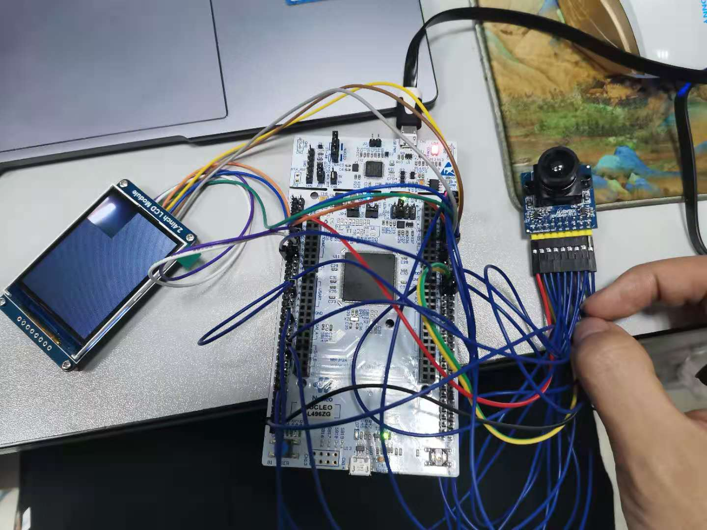
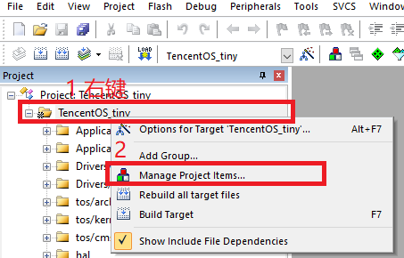
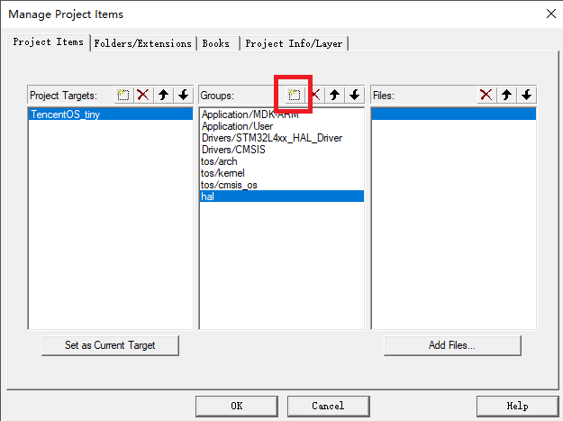
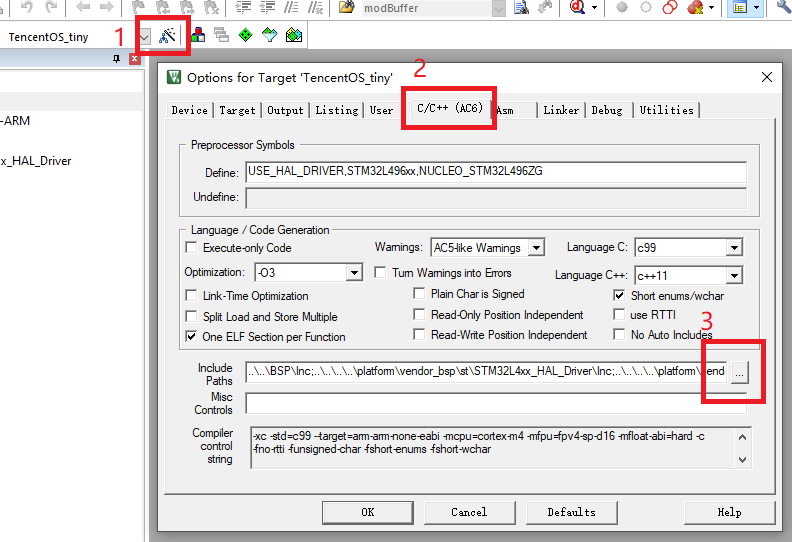
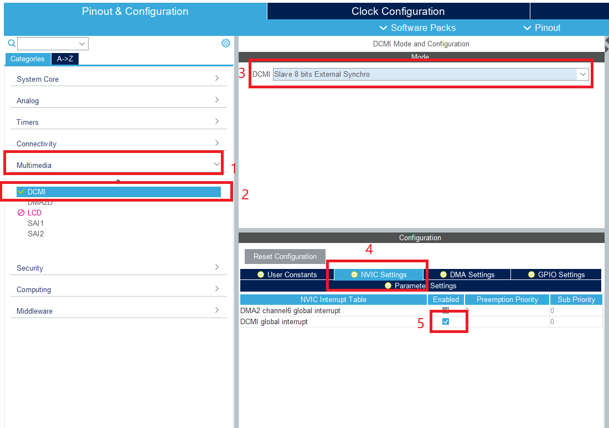
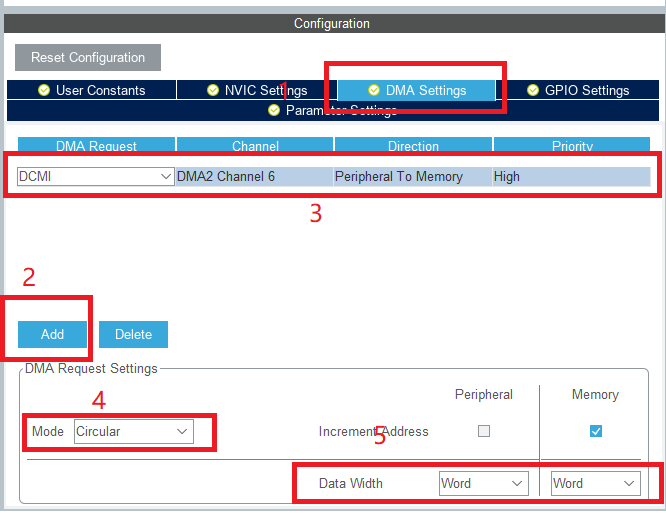
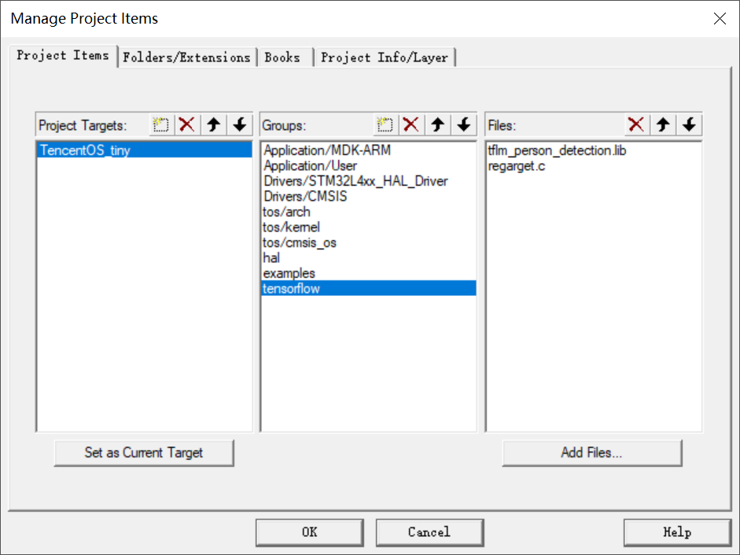
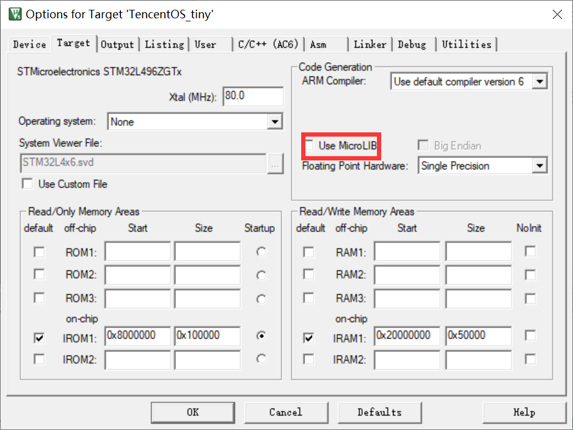
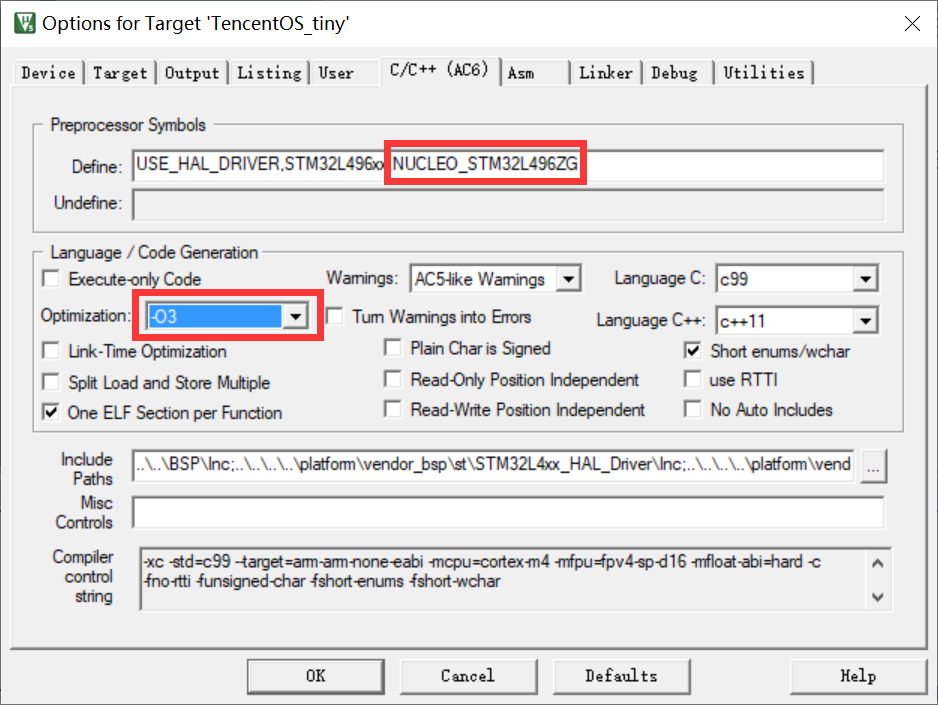
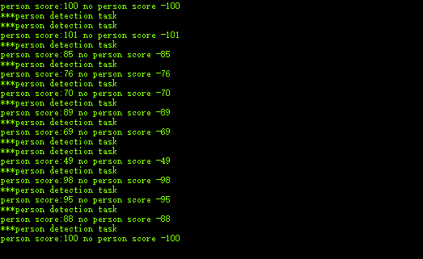

# TensorFlow Lite Micro移植参考指南（Keil版）

**作者：**

Github: [Derekduke](https://github.com/Derekduke)   E-mail:  dkeji627@gmail.com 

Github: [QingChuanWS](https://github.com/QingChuanWS)  E-mail: bingshan45@163.com

Github: [yangqings](https://github.com/yangqings)  E-mail: yangqingsheng12@outlook.com

## 概述

本教程是基于STM32 NUCLEO-L496ZG（Cortex-M4, 80Mhz）开发板，在运行TencentOS tiny的基础上，使用Tensorflow Lite Micro框架和CMSIS-NN库（算子加速），在STM32L496ZG上实现了**行人检测模型**的推理。

关于Tensorflow Lite Micro组件的详细介绍可以参考`TencentOS-tiny\components\ai\tflite_micro`目录下的TFlite_Micro_Component_User_Guide.md文档。

本例程中，传入神经网络的RGB图像大小为 18kb（96*96 * 2byte），在STM32L496平台消耗的内存资源（经过优化后）如下：

- SRAM：168 Kbyte
- Flash：314 Kbyte

理论上满足以上内存要求的STM32 Cortex-M系列MCU可以参考本指南进行移植。

## 一、移植前的准备

####   1. 准备目标硬件（开发板/传感器/模组）

需要准备如下硬件：

- 开发板：NUCLEO-L496ZG，MCU为STM32L496ZG；
- Camera：获取RGB图像，本例程使用OV2640摄像头；
- LCD：显示RGB图像，本例程使用2.4寸LCD（SPI通信）；

硬件实物图如下：

<div align=center>

</div>

####   2.准备TencentOS tiny基础keil工程代码

- 首先，参考TencentOS tiny基于keil的移植教程进行移植：
  https://github.com/Tencent/TencentOS-tiny/blob/master/doc/10.Porting_Manual_for_KEIL.md
- 为了方便初始化MCU的外设，后续要继续使用STM32CubeMX软件，请确保安装了该软件；

- 移植成功后，工程可以进行线程任务切换，通过串口打印"hello world"，基础keil工程代码准备完毕。

####   3. 获取Tensorflow Lite Micro

有三种方式获取tflite_micro：

1. 从TencentOS tiny 代码仓库 `components\ai\tflite_micro`目录获取；
2. 以lib文件的形式使用tflite_micro组件，lib文件`TencentOS-tiny\components\ai\tflite_micro`的ARM_CortexM4_lib、ARM_CortexM7_lib和ARM_CortexM55_lib文件夹；
3. 从Tensorflow代码仓库获取，TFlite_Micro的源码已经开源，github仓库地址为：https://github.com/tensorflow/tensorflow ，可根据google TFLite Micro官方教程获得Tensorflow Lite Micro的全部源码。

如果没有tflite_micro开发经验，建议以**第一种**或者**第二种**方式获取tflite_micro，希望自行获取最新源码，或者编译lib文件，请参考`TencentOS-tiny\components\tflite_micro`目录的TFlite_Micro_Component_User_Guide.md文档，本指南将直接使用TencentOS tiny 代码仓库内的tflite_micro组件。

## 二、BSP准备

### 1. 工程目录规划

以下是整个例程的目录规划：

| 一级目录  |           二级目录           |       三级目录        |                             说明                             |
| :-------: | :--------------------------: | :-------------------: | :----------------------------------------------------------: |
|   arch    |             arm              |                       | TencentOS tiny适配的IP核架构（含M核中断、调度、tick相关代码） |
|   board   |      NUCLEO_STM32L496ZG      |                       |                    移植目标芯片的工程文件                    |
|           |                              |          BSP          |            板级支持包，外设驱动代码在Hardware目录            |
| component |              ai              |     tflite_micro      |                 tflite_micro源码及有关库文件                 |
| examples  | tflitemicro_person_detection |                       |                       行人检测demo示例                       |
|           |                              | tflu_person_detection |                       行人检测实例代码                       |
|  kernel   |             core             |                       |                    TencentOS tiny内核源码                    |
|           |              pm              |                       |                 TencentOS tiny低功耗模块源码                 |
|   osal    |           cmsis_os           |                       |              TencentOS tiny提供的cmsis os 适配               |

完成TencentOS tiny基础keil工程准备工作后，在这个keil工程的基础上继续添加外设驱动代码。

### 2. LCD驱动

本例程选用一款2.4寸LCD屏幕，分辨率为 240*320， SPI 接口通信，内部控制芯片为IL9341。

开发者也可以使用其他LCD，自行完成LCD的驱动代码移植，方便调试摄像头，以及查看图像是否正常。

#### 2.1 SPI初始化

进入`TencentOS-tiny\board\NUCLEO_STM32L496ZG\BSP`目录，打开TencentOS_tiny.ioc工程，使用STM32CubeMX初始化MCU外设。

<div align=center>

</div>
#### 2.2 打开keil的Manage Project Items

<div align=center>

</div>

#### 2.3 在project中加入新的文件夹hal

<div align=center>

</div>


#### 2.3 添加驱动代码

添加`lcd_2inch4.c`和`lcd_config.c`,

<div align=center>

</div>


添加头文件`lcd_2inch4.h`和`lcd_config.h`路径

<div align=center>

</div>


<div align=center>

</div>
外设驱动的头文件.h文件都在`TencentOS-tiny\board\NUCLEO_STM32L496ZG\BSP\Hardware\Inc`路径下。

### 3. 摄像头驱动

#### 3.1 外设初始化

进入`TencentOS-tiny\board\NUCLEO_STM32L496ZG\BSP`目录，打开TencentOS_tiny.ioc工程，初始化DCMI外设，打开DCMI全局中断，并打开DMA通道，DMA的Direction设置为Peripheral To Memory。

<div align=center>

</div>

<div align=center>

</div>


#### 3.2 添加驱动代码

<div align=center>

</div>

**在mcu_init函数重写DCMI帧中断回调函数：**

值得注意的是，代码需要写在CubeMx生成的注释语句内，当使用CubeMX重新配置外设并生成代码时，所添加的代码才不会被覆盖掉，如下所示，代码添加在/* USER CODE BEGIN 4 */ 和 /* USER CODE END 4 */注释语句之间：

```C
/* USER CODE BEGIN 4 */
void HAL_DCMI_FrameEventCallback(DCMI_HandleTypeDef *hdcmi)
{
	if(hdcmi->State == 2 && frame_flag != 1){
		frame_flag = 1; 
	}
}
/* USER CODE END 4 */
```

### 4. LCD显示摄像头图像

本例程的任务函数在

`TencentOS-tiny\examples\tflitemicro_person_detection\tflitemicro_person_detection.c`

```c
void task1(void *arg)
{
    while (1) {
      if(frame_flag == 1){
				
				if(HAL_DCMI_Stop(&hdcmi))Error_Handler(); //stop DCMI
				LCD_2IN4_Display(camera_buffer,OV2640_PIXEL_WIDTH,OV2640_PIXEL_HEIGHT);
                //display
				frame_flag = 0;
				if(HAL_DCMI_Start_DMA(&hdcmi,DCMI_MODE_CONTINUOUS,\   //restart DCMI
                                     (uint32_t)camera_buffer ,\
					                 (OV2640_PIXEL_WIDTH*OV2640_PIXEL_HEIGHT)/2))
                    Error_Handler(); 
				osDelay(50);
    }
}
```

经过以上步骤，如果能顺利地驱动摄像头，并在LCD实时显示图像，BSP就准备完毕了，如果使用的是不同的LCD或者Camera，请根据实际情况进行外设初始化和驱动的移植。

## 三、Tensorflow Lite Micro移植

### 1. tflite_micro组件加入到keil工程

由于NUCLEO-L496ZG芯片中的内核为ARM Cortex M4，所以本次我们可以直接使用ARM Cortex M4版本的tensorflow_lite_micro.lib库来简化tflite_micro搭建流程。

#### 1.1 在project中加入新的文件夹tensorflow

<div align=center>

</div>

#### 1.2 添加本次与行人检测demo有关的源文件

<div align=center>

</div>


其中，retarget.c的路径为：`TencentOS-tiny\components\ai\tflite_micro\KEIL\retarget.c`

tensorflow_lite_micro.lib的路径为：`TencentOS-stiny\components\ai\tflite_micro\ARM_CortexM4_lib\tensorflow_lite_micro.lib`

其余.cc文件和.h均在`examples\tflu_person_detection\tflu_person_detection`文件夹中。

#### 1.3 关闭Keil的MicroLib库

<div align=center>

</div>

#### 1.4 添加tflite_micro需要的头文件

<div align=center>

</div>

注：最下方的路径为：

```
TencentOS-tiny\components\ai\tflite_micro\ARM_CortexM4_lib\tensorflow\lite\micro\tools\make\downloads
```

#### 1.5 调整优化等级和tflite_micro的交互信息输出串口：

<div align=center>

</div>

其中宏`NUCLEO_STM32L496ZG`是指定Nucleo STM32L496的hlpuart1为系统printf函数的输出串口，具体定义在Nucleo STM32L496的BSP文件夹中的`mcu_init.c`中。

### 2. 编写Person_Detection 任务函数

本例程的任务函数在

`TencentOS-tiny\examples\tflitemicro_person_detection\tflitemicro_person_detection.c`

#### 2.1 图像预处理

<div align=center>

</div>

在本例程中，模型要求输入神经网络的图像为灰度图，为完成摄像头获取的RGB彩图到模型输入需要的灰度图转换，需从输入的RGB565像素格式中解析出R、G、B三通道的值，再根据心理学公式计算出单个像素点的灰度，具体代码如下：

```c
uint8_t rgb565_to_gray(uint16_t bg_color)
{
    uint8_t bg_r = 0;
    uint8_t bg_g = 0;
    uint8_t bg_b = 0;
    bg_r = ((bg_color>>11)&0xff)<<3;
    bg_g = ((bg_color>>5)&0x3f)<<2;
    bg_b = (bg_color&0x1f)<<2;
    uint8_t gray = (bg_r*299 + bg_g*587 + bg_b*114 + 500) / 1000;
    return gray;
}

void input_convert(uint16_t* camera_buffer , uint8_t* model_buffer)
{
	for(int i=0 ; i<OV2640_PIXEL_WIDTH*OV2640_PIXEL_HEIGHT ; i++)
	{
		model_buffer[i] = rgb565_to_gray(camera_buffer[i]);
	}
}
```

#### 2.2 行人检测线程任务函数

```c
void task1(void *arg)
{
    while (1) {
      if(frame_flag == 1){
				printf("***person detection task\r\n");
				if(HAL_DCMI_Stop(&hdcmi))Error_Handler(); //stop DCMI
				input_convert(camera_buffer,model_buffer);//convert input
				person_detect(model_buffer);              //inference
				LCD_2IN4_Display(camera_buffer,OV2640_PIXEL_WIDTH,OV2640_PIXEL_HEIGHT);
                //display
        
				frame_flag = 0;
				
				if(HAL_DCMI_Start_DMA(&hdcmi,DCMI_MODE_CONTINUOUS,\   //restart DCMI
                                     (uint32_t)camera_buffer ,\
					                 (OV2640_PIXEL_WIDTH*OV2640_PIXEL_HEIGHT)/2))
                    Error_Handler(); 
			}
			osDelay(50);
    }
}

void task2(void *arg)
{
    while (1) {
        printf("***task2\r\n");
        osDelay(50);
    }
}
```

#### 2.3 运行效果

通过串行输出实时打印信息，移动摄像头，没有对准行人时，输出如下：

<div align=center>

</div>

当摄像头对准行人时，输出如下：

<div align=center>

</div>

执行一帧图像推理，耗时约633 ms。

更多关于tflite_micro的介绍，请参考[tensorflow](https://tensorflow.google.cn/lite/microcontrollers?hl=zh_cn)官网以及`TencentOS-tiny\components\tflite_micro`目录的TFlite_Micro_Component_User_Guide.md

