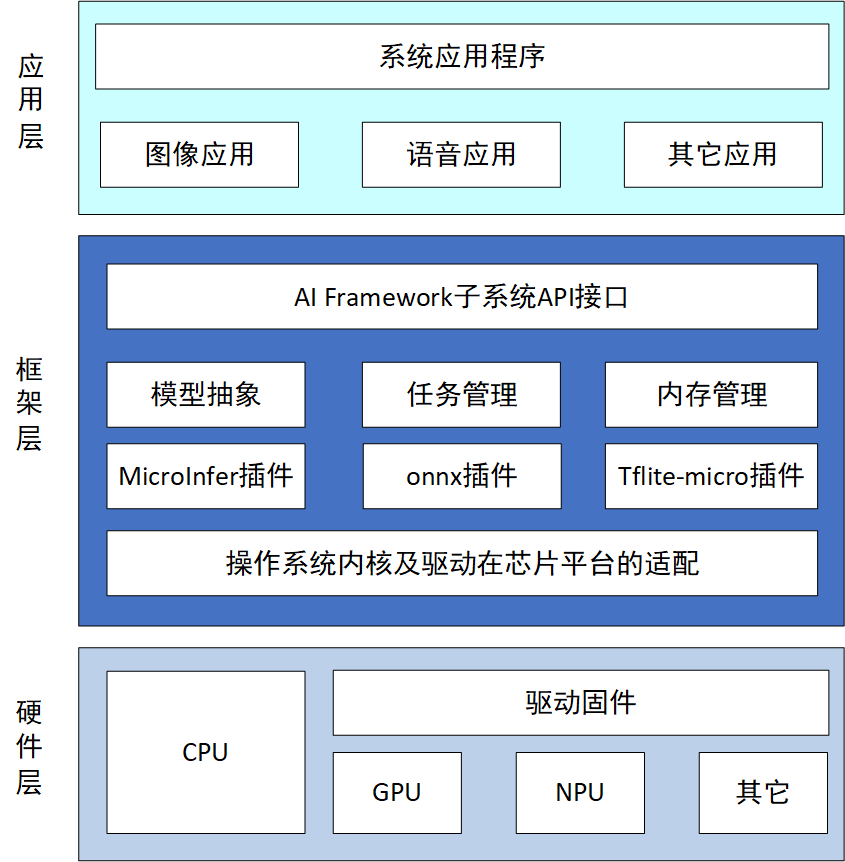

# TencentOS-tiny AI SIG

## SIG组工作目标和范围
### 工作目标
tos AI Framework是一个适用于TencentOS-Tiny操作系统，用于在轻量小型IOT设备上快速部署深度学习模型的框架。为开发者提供了简洁清晰的使用工具和开发接口，面向不同芯片平台和不同AI模型提供了标准化的一站式模型解析、模型验证、模型部署方案，降低了开发者在边缘设备上开发AI功能的难度。

### 内容简介
#### 整体架构图

#### 使用场景
上位机：
- 支持语言：Python
- 工具：Tensorflow
- 操作系统：Windows

下位机：
- 支持语言：C
- 工具：Keil
- 操作系统：TencentOS-tiny
#### 目录
/TencentOS-tiny/components/AI SIG

### 工作计划

参考：

./doc/early_plan.md

### SIG组成员
#### Leader
- @derekduke
#### Committers
- @spaceman NU-LL

### 会议
- 会议时间：待通知
- 会议方式：腾讯会议

### 联系方式
- dkeji627@gmail.com

### 如何加入
发送一份简单的自我介绍至以上联系方式，应至少包括如下内容：
- 如何称呼
- 所在学校or公司
- 介绍相关开源经历及git链接
- 加入SIG组后的目标