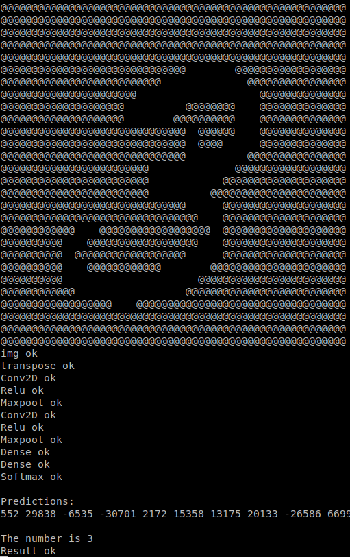

# ONNX

**通用神经网络模型推理框架 onnx 在 TencentOS-tiny 上的移植**

[ONNX](https://onnx.ai/) (Open Neural Network Exchange) 是机器学习模型的通用格式，可以融合不同机器学习框架的模型。

ONNX是一个用于表示深度学习模型的标准，可使模型在不同框架之间进行转移。Tensorflow, Keras, Pytorch, Caffe2, mxnet等知名深度学习框架训练的模型可以转化为onnx格式，于是便可以在RTOS上运行。


## 支持算子

- Conv2D
- Relu
- Maxpool
- Softmax
- Matmul
- Add
- Flatten
- Transpose

## mnist例程

当前有两个手写体识别的例程：

mnist_int 和 mnist_float

分别适用用于整形推理和浮点推理，根据平台不同而定，其中mnist_int在imx6ull上通过验证，mnist_float在stm32L4上通过验证。最小的 demo 只需要 16KB 内存，因此在STM32F103C8T6 上也可以运行，其中mnist_int相当于是做了int32的量化，针对归一化后的浮点double型参数乘以1000倍，并修改了softmax层的算子，最后可以完成速度更快的整形数推理：

| 例程文件      | 说明                                     |
| ------------- | ---------------------------------------- |
| mnist_int.c       | 整形推理，模型参数保存在 mnist_int.h   |
| mnist_float.c    | 浮点推理，模型参数保存在mnist_float.h |

####  模型结构

```
_________________________________________________________________
Layer (type)                 Output Shape              Param #   
=================================================================
conv2d_5 (Conv2D)            (None, 28, 28, 2)         20        
_________________________________________________________________
max_pooling2d_5 (MaxPooling2 (None, 14, 14, 2)         0         
_________________________________________________________________
dropout_5 (Dropout)          (None, 14, 14, 2)         0         
_________________________________________________________________
conv2d_6 (Conv2D)            (None, 14, 14, 2)         38        
_________________________________________________________________
max_pooling2d_6 (MaxPooling2 (None, 7, 7, 2)           0         
_________________________________________________________________
dropout_6 (Dropout)          (None, 7, 7, 2)           0         
_________________________________________________________________
flatten_3 (Flatten)          (None, 98)                0         
_________________________________________________________________
dense_5 (Dense)              (None, 4)                 396       
_________________________________________________________________
dense_6 (Dense)              (None, 10)                50        
=================================================================
Total params: 504
Trainable params: 504
Non-trainable params: 0
_________________________________________________________________

```
推理测试




## 注意事项

由于 onnx 的模型是 Google Protobuf v3 的格式，所以在protobuf文件夹中也包含了模型解析部分，可以配合文件系统进行模型读取。

- protobuf-c
- onnx-pb-c

在 platform 中是对于不同平台的特殊适配，比如malloc、free的实现等

- tencentos_libc_malloc


## Todo List

- 解析更加复杂的模型
- 针对不同硬件适配加速算子

## 参考
https://github.com/wuhanstudio/onnx-backend
##  联系方式

- 维护：derek
- 邮箱：dkeji627@gmail.com

