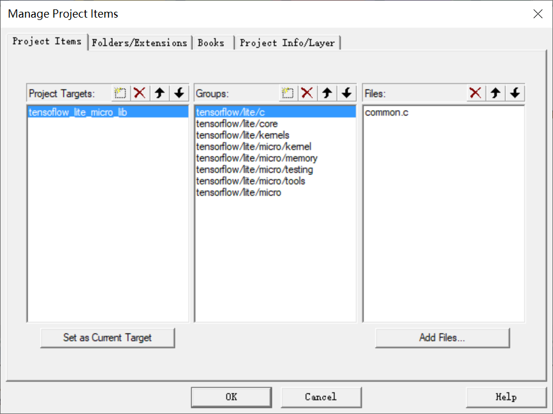
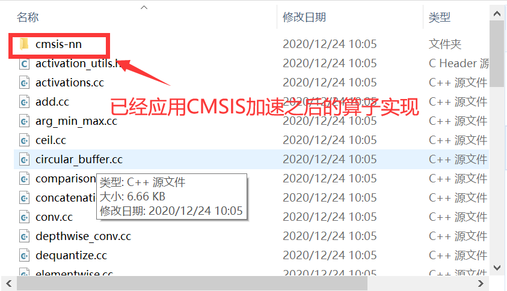
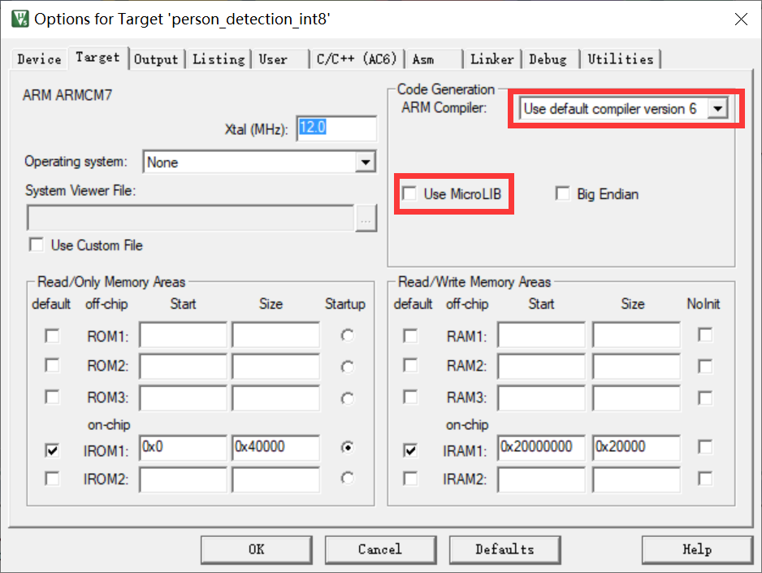
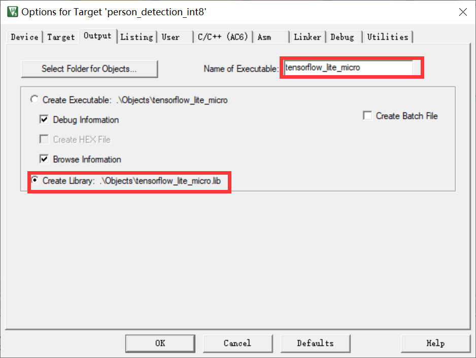
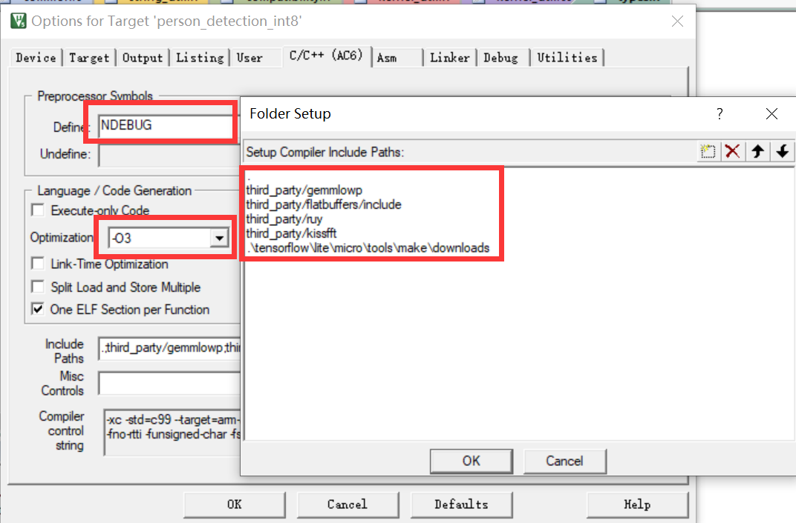

# Tensorflow Lite Micro组件使用说明

Github ID: [Derekduke](https://github.com/Derekduke)   E-mail:  dkeji627@gmail.com 

Github ID: [QingChuanWS](https://github.com/QingChuanWS)  E-mail: bingshan45@163.com

Github ID: [yangqings](https://github.com/yangqings)  E-mail: yangqingsheng12@outlook.com

# 概述

`Tensorflow Lite Micro` 是` TensorFlow Lite `针对MCU的实验性端口，专门用于在微控制器和其他只有几千字节内存的设备上运行机器学习模型。

# 1. 建立与转换模型

由于嵌入式设备具有有限的 RAM 和存储空间，因此限制了深度学习模型的规模。同时，TensorFlow Lite Micro 目前只支持有限的一部分深度学习运算算子，因此并非所有的模型结构都是可行的。

本部分将介绍由 TensorFlow 模型转换为可在嵌入式设备中上运行的过程。本部分也概述了可支持的运算，并对设计与训练一个模型以使其符合内存限制给出了一些指导。

## 1.1 模型转换

将一个已训练好的 TensorFlow 模型转换为可以在嵌入式设备中运行的Tensorflow Lite模型可以使用 [TensorFlow Lite 转换器 Python API](https://tensorflow.google.cn/lite/microcontrollers/build_convert) 。它能够将模型转换成 [`FlatBuffer`](https://google.github.io/flatbuffers/) 格式，减小模型规模，并修改模型以使用 TensorFlow Lite 支持的运算。

### 1.1.1  量化

为了获得尽可能小的模型规模，你应该考虑使用[训练后量化](https://tensorflow.google.cn/lite/performance/post_training_quantization)。它会降低你模型中数字的精度，从而减小模型规模。不过，这种操作可能会导致模型推理准确性的下降，对于小规模模型来说尤为如此, 所有我们需要在量化前后分析模型的准确性变换以确保这种损失在可接受范围内。

以下这段 Python 代码片段展示了如何使用预训练量化进行模型转换：

```python
import tensorflow as tf
converter = tf.lite.TFLiteConverter.from_saved_model(saved_model_dir)
converter.optimizations = [tf.lite.Optimize.OPTIMIZE_FOR_SIZE]
tflite_quant_model = converter.convert()
open("converted_model.tflite", "wb").write(tflite_quant_model)
```

### 1.1.2  转换为一个 C 数组

许多微控制器平台没有本地文件系统的支持。从程序中使用一个模型最简单的方式是将其以一个 C 数组的形式并将其编译进你的程序。

以下的 unix 命令会生成一个以 `char` 数组形式包含 TensorFlow Lite 模型的 C 源文件：

```bash
xxd -i converted_model.tflite > model_data.cc
```

其输出类似如下：

```c
unsigned char converted_model_tflite[] = {
  0x18, 0x00, 0x00, 0x00, 0x54, 0x46, 0x4c, 0x33, 0x00, 0x00, 0x0e, 0x00,
  // <Lines omitted>
};
unsigned int converted_model_tflite_len = 18200;
```

在生成了此文件之后，你可以将它包含到你的程序。在嵌入式平台上，我们需要将该数组声明为 `const` 类型以获得更好的内存效率。

## 1.2 模型结构与训练

在设计一个面向微控制器的模型时，考虑模型的规模、工作负载，以及用到的运算是非常重要的。

### 1.2.1 模型规模

一个模型必须在二进制和运行时方面都足够小，以使其可以和你程序的其他部分一起符合你目标设备的内存限制。

为了创建一个更小的模型，你可以在你的结构里使用更少和更小的层。然而，小规模的模型更易面临欠拟合问题。这意味着对于许多问题，尝试并使用符合内存限制的尽可能大规模的模型是有意义的。但是，使用更大规模的模型也会导致处理器工作负载的增加。

注：在一个 Cortex M3 上，面向微控制器的 TensorFlow Lite 的核心运行时占 16 KB。

### 1.2.2 工作负载

工作负载受到模型规模与复杂度的影响。大规模、复杂的模型可能会导致更高的功耗，根据实际的应用场景，这种情况所带来的功耗与热量的增加可能会成为一个问题。

### 1.2.3 运算支持

面向微控制器的 TensorFlow Lite 目前仅支持有限的部分 TensorFlow 运算，这影响了可以运行的模型结构。我们正致力于在参考实现和针对特定结构的优化方面扩展运算支持。

已支持的运算可以在文件 [`all_ops_resolver.cc`](https://github.com/QingChuanWS/tensorflow/tree/master/tensorflow/lite/micro/all_ops_resolver.cc) 中看到。

## 1.3 运行推断

以下部分将介绍软件包自带语音历程中的 [main_functions.cc](https://github.com/QingChuanWS/tensorflow/tree/master/tensorflow/lite/micro/examples/person_detection_experimental/main_functions.cc) 文件并解释了它如何使用用于微控制器的 Tensorflow Lite 来运行推断。

### 1.3.1 包含项

要使用库，必须包含以下头文件：

```C++
#include "tensorflow/lite/micro/kernels/micro_ops.h"
#include "tensorflow/lite/micro/micro_error_reporter.h"
#include "tensorflow/lite/micro/micro_interpreter.h"
#include "tensorflow/lite/schema/schema_generated.h"
#include "tensorflow/lite/version.h"
```

- [`micro_ops.h`](https://github.com/QingChuanWS/tensorflow/tree/master/tensorflow/lite/micro/kernels/micro_ops.h) 提供给解释器（interpreter）用于运行模型的操作。
- [`micro_error_reporter.h`](https://github.com/QingChuanWS/tensorflow/tree/master/tensorflow/lite/micro/micro_error_reporter.h) 输出调试信息。
- [`micro_interpreter.h`](https://github.com/QingChuanWS/tensorflow/tree/master/tensorflow/lite/micro/micro_interpreter.h) 包含处理和运行模型的代码。
- [`schema_generated.h`](https://github.com/QingChuanWS/tensorflow/tree/master/tensorflow/lite/schema/schema_generated.h) 包含 TensorFlow Lite [`FlatBuffer`](https://google.github.io/flatbuffers/) 模型文件格式的模式。
- [`version.h`](https://github.com/QingChuanWS/tensorflow/tree/master/tensorflow/lite/version.h) 提供 Tensorflow Lite 架构的版本信息。

示例还包括其他一些文件。以下这些是最重要的：

```C++
#include "tensorflow/lite/micro/examples/micro_speech/micro_features/micro_model_settings.h"
#include "tensorflow/lite/micro/examples/micro_speech/micro_features/model.h"
```

- [`model.h`](https://github.com/QingChuanWS/tensorflow/tree/master/tensorflow/lite/micro_speech/micro_features/model.h) 包含存储为 `char` 数组的模型。阅读 [“构建与转换模型”](https://tensorflow.google.cn/lite/microcontrollers/build_convert)来了解如何将 Tensorflow Lite 模型转换为该格式。
- [`micro_model_settings.h`](https://github.com/QingChuanWS/tensorflow/tree/master/tensorflow/lite/micro/examples/micro_speech/micro_features/micro_model_settings.h) 定义与模型相关的各种常量。

### 1.3.2 设置日志记录

要设置日志记录，需要使用一个指向 `tflite::MicroErrorReporter` 实例的指针来创建一个 `tflite::ErrorReporter` 指针：

```C++
tflite::MicroErrorReporter micro_error_reporter;
tflite::ErrorReporter* error_reporter = &micro_error_reporter;
```

该变量被传递到解释器（interpreter）中，解释器允许它写日志。由于微控制器通常具有多种日志记录机制，`tflite::MicroErrorReporter` 的实现是为您的特定设备所定制的。

### 1.3.3 加载模型

在以下代码中，模型是从一个 `char` 数组中实例化的，`g_tiny_conv_micro_features_model_data` （要了解其是如何构建的，请参见[“构建与转换模型”](ModelConvert.md)）。 随后我们检查模型来确保其架构版本与我们使用的版本所兼容：

```C++
const tflite::Model* model =
    ::tflite::GetModel(g_tiny_conv_micro_features_model_data);
if (model->version() != TFLITE_SCHEMA_VERSION) {
  error_reporter->Report(
      "Model provided is schema version %d not equal "
      "to supported version %d.\n",
      model->version(), TFLITE_SCHEMA_VERSION);
  return 1;
}
```

### 1.3.4实例化操作解析器

解释器（interpreter）需要一个 [`micro_ops`](https://github.com/QingChuanWS/tensorflow/tree/master/tensorflow/lite/micro/kernels/micro_ops.h) 实例来访问 Tensorflow 操作。可以扩展此类以向您的项目添加自定义操作：

```C++
tflite::ops::micro::micro_op_resolver resolver;
```

### 1.3.5 分配内存

我们需要预先为输入、输出以及中间数组分配一定的内存。该预分配的内存是一个大小为 `tensor_arena_size` 的 `uint8_t` 数组，它被传递给 `tflite::SimpleTensorAllocator` 实例：

```C++
const int tensor_arena_size = 10 * 1024;
uint8_t tensor_arena[tensor_arena_size];
tflite::SimpleTensorAllocator tensor_allocator(tensor_arena,
                                               tensor_arena_size);
```

注意：所需内存大小取决于您使用的模型，可能需要通过实验来确定。

### 1.3.6 实例化解释器（Interpreter）

我们创建一个 `tflite::MicroInterpreter` 实例，传递给之前创建的变量：

```C++
tflite::MicroInterpreter interpreter(model, resolver, &tensor_allocator,
                                     error_reporter);
```

### 1.3.7 验证输入维度

`MicroInterpreter` 实例可以通过调用 `.input(0)` 为我们提供一个指向模型输入张量的指针，其中 `0` 代表第一个（也是唯一一个）输入张量。我们检查这个张量以确认它的维度与类型是我们所期望的：

```C++
TfLiteTensor* model_input = interpreter.input(0);
if ((model_input->dims->size != 4) || (model_input->dims->data[0] != 1) ||
    (model_input->dims->data[1] != kFeatureSliceCount) ||
    (model_input->dims->data[2] != kFeatureSliceSize) ||
    (model_input->type != kTfLiteUInt8)) {
  error_reporter->Report("Bad input tensor parameters in model");
  return 1;
}
```

在这个代码段中，变量 `kFeatureSliceCount` 和 `kFeatureSliceSize` 与输入的属性相关，它们定义在 [`micro_model_settings.h`](https://github.com/QingChuanWS/tensorflow/tree/master/tensorflow/lite/micro/examples/micro_speech/micro_features/micro_model_settings.h) 中。枚举值 `kTfLiteUInt8` 是对 Tensorflow Lite 某一数据类型的引用，它定义在 [`common.h`](https://github.com/QingChuanWS/tensorflow/tree/master/tensorflow/lite/c/common.h) 中。

### 1.3.8 生成特征

我们输入到模型中的数据必须由微控制器的音频输入生成。[`feature_provider.h`](https://github.com/QingChuanWS/tensorflow/tree/master/tensorflow/lite/micro/examples/micro_speech/feature_provider.h) 中定义的 `FeatureProvider` 类捕获音频并将其转换为一组将被传入模型的特征集合。当该类被实例化时，我们用之前获取的 `TfLiteTensor` 来传入一个指向输入数组的指针。`FeatureProvider` 使用它来填充将传递给模型的输入数据：

```C++
  FeatureProvider feature_provider(kFeatureElementCount,
                                   model_input->data.uint8);
```

以下代码使 `FeatureProvider` 从最近一秒的音频生成一组特征并填充进输入张量：

```C++
TfLiteStatus feature_status = feature_provider.PopulateFeatureData(
    error_reporter, previous_time, current_time, &how_many_new_slices);
```

在此例子中，特征生成和推断是在一个循环中发生的，因此设备能够不断地捕捉和处理新的音频。

当在编写自己的程序时，您可能会以其它的方式生成特征，但您总需要在运行模型之前就用数据填充输入张量。

### 1.3.9 运行模型

要运行模型，我们可以在 `tflite::MicroInterpreter` 实例上调用 `Invoke()`：

```C++
TfLiteStatus invoke_status = interpreter.Invoke();
if (invoke_status != kTfLiteOk) {
  error_reporter->Report("Invoke failed");
  return 1;
}
```

我们可以检查返回值 `TfLiteStatus` 以确定运行是否成功。在 [`common.h`](https://github.com/QingChuanWS/tensorflow/tree/master/tensorflow/lite/c/common.h) 中定义的 `TfLiteStatus` 的可能值有 `kTfLiteOk` 和 `kTfLiteError`。

### 1.3.10 获取输出

模型的输出张量可以通过在 `tflite::MicroIntepreter` 上调用 `output(0)` 获得，其中 `0` 代表第一个（也是唯一一个）输出张量。

在示例中，输出是一个数组，表示输入属于不同类别（“是”（yes）、“否”（no）、“未知”（unknown）以及“静默”（silence））的概率。由于它们是按照集合顺序排列的，我们可以使用简单的逻辑来确定概率最高的类别：

```C++
    TfLiteTensor* output = interpreter.output(0);
    uint8_t top_category_score = 0;
    int top_category_index;
    for (int category_index = 0; category_index < kCategoryCount;
         ++category_index) {
      const uint8_t category_score = output->data.uint8[category_index];
      if (category_score > top_category_score) {
        top_category_score = category_score;
        top_category_index = category_index;
      }
    }
```

在示例其他部分中，使用了一个更加复杂的算法来平滑多帧的识别结果。该部分在 [recognize_commands.h](https://github.com/QingChuanWS/tensorflow/tree/master/tensorflow/lite/micro/examples/micro_speech/recognize_commands.h) 中有所定义。在处理任何连续的数据流时，也可以使用相同的技术来提高可靠性。

# 2. 制作tensorflow_lite_micro.lib

## 2.1 获得Tensorflow Lite Micro库

要构建库并从主 TensorFlow 存储库中运行测试，请执行以下命令：

从 GitHub 中把 TensorFlow 存储库克隆到方便的地方。

```
git clone --depth 1 https://github.com/QingChuanWS/tensorflow.git
```

注：由于Tensorflow官方仓库的迭代速度较快，所以笔者将本组件目前使用的tensorflow版本上传到了个人仓库；同时本教程主要是为了方便开发者学习.lib库的制作方法。

进入上一步创建的目录。

```
cd tensorflow
```

项目中的 `Makefile` 能够生成包含所有必需源文件的独立项目，并支持导入目前成熟的嵌入式开发环境。目前支持的环境主要有 Arduino, Keil, Make 和 Mbed。

注意：我们为其中一些环境托管预建项目。参阅 [支持的平台](https://tensorflow.google.cn/lite/microcontrollers/overview#supported_platforms) 以下载。

要在 Make 中生成项目，请使用如下指令：

```
make -f tensorflow/lite/micro/tools/make/Makefile generate_projects
```

这需要几分钟，因为它需要下载一些大型工具链依赖。结束后，你应看到像这样的路径中，创建了一些文件夹： `tensorflow/lite/micro/tools/make/gen/linux_x86_64/prj/` （确切的路径取决于您的主机操作系统）。这些文件夹包含生成的项目和源文件。例如： `tensorflow/lite/micro/tools/make/gen/linux_x86_64/prj/hello_world/keil` 包含了hello world 的 Keil uVision 目标。

以下我们以hello_world工程为例，分离出与实际应用无关的tflite_micro源文件，用于后续的.lib库生成。

运行本目录下的`lib_extra.py`生成tflite micro源文件包：

| 参数               | 含义                                            |
| ------------------ | ----------------------------------------------- |
| --tensorflow_path  | 所下载的tensorflow仓库的仓库根目录（绝对路径）  |
| --tflitemicro_path | 存放生成的tensorflow lite micro路径（绝对路径） |

成功运行之后会打印`--tensorflow lite micro source file extract successful--`字样，并在对应的`tflitemicro_path`路径下生成`Source`文件夹存放生成的tensorflow Lite Micro源文件。

## 2. 将源文件加入KEIL工程并生成.lib库

新建目标芯片的KEIL工程（本次示例以ARM Cortex M4为例），将Source目录下的`tensorflow`和`third_party`文件夹拷贝到KEIL工程的根目录下，并添加`tensorflow`目录下除`lite/micro/kernels`以及`lite/micro/tools`文件夹以外的所有源文件（包含.c和.cc)，例如下图所示：

<div align=center>

</div>
**注意**

在添加`tensorflow/lite/micro/kernel`目录下的源文件时需要区分`reference`算子和应用`CMSIS-NN`加速之后的算子，`tensorflow/lite/micro/kernel`文件夹内容如下图中所示：

<div align=center>

</div>

如果在生成lib库时想要采用CMSIS的算子的话，则：

1. 添加`tensorflow/lite/micro/kernel/cmsis-nn`文件夹中的源文件；
2. 在添加`tensorflow/lite/micro/kernel/`中的算子时，请不要添加`add.cc`，`conv.cc`，`depthwise_conv.cc`，`softmax.cc`，`fully_connected.cc`，`pooling.cc`，`mul.cc`这七个源文件。
3. 添加`tensorflow/lite/micro/tools`文件夹下的全部源文件。

如果在生成lib库时想要采用reference的算子的话，则：

1. 添加`tensorflow/lite/micro/kernel/`中的全部算子；
2. 无需添加`tensorflow/lite/micro/tools`文件夹下的源文件。

同时采用compiler version 6编译器并关闭Microlib：

<div align=center>

</div>

选择编译为库并编辑库名为`tensorflow_lite_micro`：

<div align=center>

</div>

最后包含的文件路径和优化等级，宏等：

<div align=center>

</div>

最后点击编译链接之后，即可在工程根目录的`Objects`文件夹下生成ARM Cortex M4对应的.lib库，其他内核型号的tflite_micro库以此类推。

