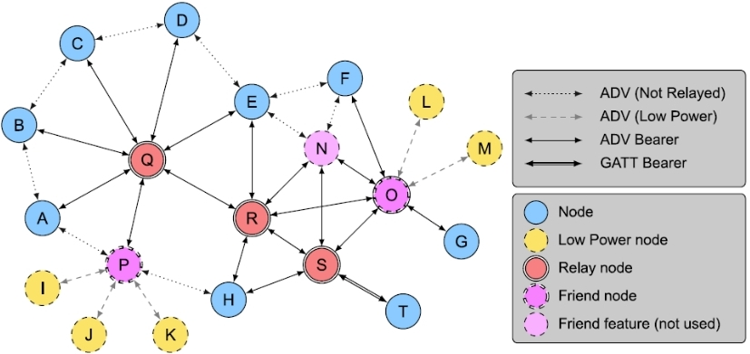
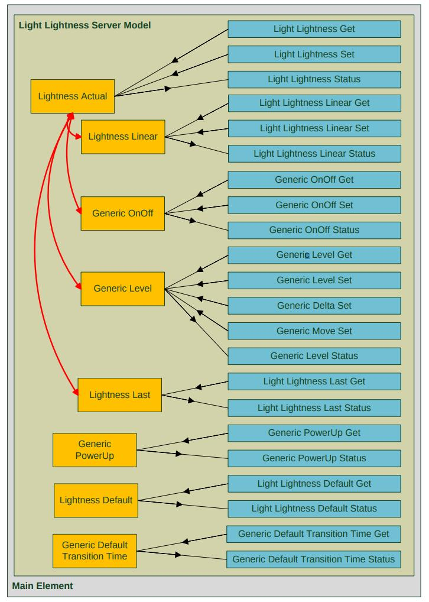

Bluetooth Mesh
--------------

.. toctree::
   :hidden:
   :titlesonly:

   sample

.. contents::
   :local:
   :depth: 2

Introduction to Mesh
~~~~~~~~~~~~~~~~~~~~

Bluetooth Mesh is a new standard from Bluetooth SIG that was released in 2017. It enables many-to-many device
communication (as opposed to point-to-point approach in BLE) and is optimised for large-scale networks like building
automation or sensors network. It utilizes managed flood based approach where only mains-powered nodes relay messages
making it very power efficient (battery powered low-power nodes that don't relay messages can operate in mesh network for years).

Bluetooth Mesh is complementary to Bluetooth specification and requires features from 4.0 release only. This allows
deployment of networks using hardware already available on the market.

Topology
~~~~~~~~

Bluetooth Mesh defines few features (roles) for devices in network. Those are:

-  Relay - receive and retransmit mesh messages over the advertising bearer to enable larger networks
-  Proxy - receive and retransmit mesh messages between GATT and advertising bearers.
-  Low Power - operate within a mesh network at significantly reduced receiver duty cycles only in conjunction with a
   node supporting the Friend feature
-  Friend - the ability to help a node supporting the Low Power feature to operate by storing messages destined for those nodes

Bearers
~~~~~~~

Mesh Profile specification allows two kinds of bearers for transmitting data:

-  Advertising Bearer

   -  Uses LE advertising to broadcast messages to all nodes that are listening at this time
   -  Uses non-connectable advertising only
   -  29 octets of network message

-  GATT Bearer

   -  Uses LE Connections to send messages
   -  Uses standard GATT service (one for Provisioning and one for Proxy)

Provisioning
~~~~~~~~~~~~

Provisioning is a process of adding an unprovisioned device to a mesh network managed by a Provisioner. A Provisioner
provides the unprovisioned device with provisioning data that allows it to become a mesh node (network key, current IV
index and unicast address). A Provisioner is typically a smart phone or other mobile computing device.

Models
~~~~~~

Models define basic functionality of nodes on a mesh network. Mesh Profile Specification defines foundation models used
to configure and manage network. Mesh Model Specification includes models defininig functionality that is standard
across device types. Those consists of:

-  Generics - root models

   -  On/Off
   -  Level
   -  Battery Server
   -  Location
   -  Client Property
   -  and others

-  Sensors - defines a standard way of interfacing with sensors
-  Time and Scenes - defines a set of functionalities related to time and saved states on devices
-  Lighting - defines a set functionalities related to lighting control

Complex models e.g. Lighting may contain other models eg Generic On/Off. The following image shows an example of Light
Lightness Server Model.

Mesh Node features supported by Apache Mynewt
~~~~~~~~~~~~~~~~~~~~~~~~~~~~~~~~~~~~~~~~~~~~~

-  Advertising and GATT bearers
-  PB-GATT and PB-ADV provisioning
-  Foundation Models (server role)
-  Relay support
-  GATT Proxy
