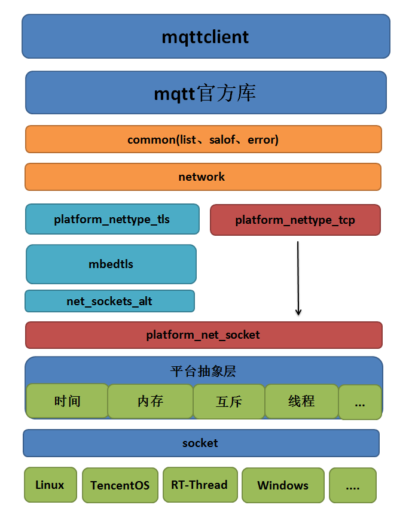

# mqttclient
**一个基于socket API之上的跨平台MQTT客户端**

## 整体框架


> 备注：目前只支持linux及encentOS tiny系统

## linux平台下测试使用
### 安装cmake：
```bash
sudo apt-get install cmake
```

### 配置
在`mqttclient/test/test.c`文件中修改以下内容：
```c
    init_params.connect_params.network_params.network_ssl_params.ca_crt = test_ca_get();    /* CA证书 */
    init_params.connect_params.network_params.addr = "xxxxxxx";                             /* 服务器域名 */
    init_params.connect_params.network_params.port = "8883";
    init_params.connect_params.user_name = "xxxxxxx";                                       /* 用户名 */
    init_params.connect_params.password = "xxxxxxx";                                        /* 密码 */
    init_params.connect_params.client_id = "xxxxxxx";                                       /* 客户端id */
```

### 打开salof
[salof](https://github.com/jiejieTop/salof) 全称是：`Synchronous Asynchronous Log Output Framework`（同步异步日志输出框架）

它是一个异步日志输出库，在空闲时候输出对应的日志信息，并且该库与mqttclient无缝衔接，如果不需要则将 `LOG_IS_SALOF` 定义为0即可。
```c
#define LOG_IS_SALOF    0
```
在`mqttclient/common/log/config.h`配置文件中打开对应的日志输出级别：
```c
#define BASE_LEVEL      (0)
#define ASSERT_LEVEL    (BASE_LEVEL + 1)            /* 日志输出级别：断言级别（非常高优先级） */
#define ERR_LEVEL       (ASSERT_LEVEL + 1)          /* 日志输出级别：错误级别（高优先级） */
#define WARN_LEVEL      (ERR_LEVEL + 1)             /* 日志输出级别：警告级别（中优先级） */
#define INFO_LEVEL      (WARN_LEVEL + 1)            /* 日志输出级别：信息级别（低优先级） */
#define DEBUG_LEVEL     (INFO_LEVEL + 1)            /* 日志输出级别：调试级别（更低优先级） */

#define         SALOF_OS                    USE_LINUX       /* 选择对应的平台：Linux/FreeRTOS/TencentOS */
#define         LOG_LEVEL                   WARN_LEVEL      /* 日志输出级别 */
```

### mqttclient的配置
配置文件是：`mqttclient/mqtt_config.h`，在这里可以根据自身需求配置对应的信息。
如是否选择`mbedtls`加密层：
```c
#define     MQTT_NETWORK_TYPE_TLS               MQTT_YES
```

### 编译 & 运行
```bash
./build.sh
```
运行`build.sh`脚本后会在 `./build/bin/`目录下生成可执行文件`mqtt-client`，直接运行即可。

## 设计思想
- 整体采用分层式设计，代码实现采用异步设计方式，降低耦合。
- 消息的处理使用回调的方式处理：用户指定`[订阅的主题]`与指定`[消息的处理函数]`
- 不对外产生依赖
## API
`mqttclient`拥有非常简洁的`api`接口
```c
int mqtt_keep_alive(mqtt_client_t* c);
int mqtt_init(mqtt_client_t* c, client_init_params_t* init);
int mqtt_release(mqtt_client_t* c);
int mqtt_connect(mqtt_client_t* c);
int mqtt_disconnect(mqtt_client_t* c);
int mqtt_subscribe(mqtt_client_t* c, const char* topic_filter, mqtt_qos_t qos, message_handler_t msg_handler);
int mqtt_unsubscribe(mqtt_client_t* c, const char* topic_filter);
int mqtt_publish(mqtt_client_t* c, const char* topic_filter, mqtt_message_t* msg);
int mqtt_yield(mqtt_client_t* c, int timeout_ms);
```
## 核心
**mqtt_client_t 结构**

```c
typedef struct mqtt_client {
    unsigned short              packet_id;
    unsigned char               *read_buf;
    unsigned char               *write_buf;
    unsigned char               ping_outstanding;
    unsigned char               ack_handler_number;
    unsigned int                cmd_timeout;
    unsigned int                read_buf_size;
    unsigned int                write_buf_size;
    unsigned int                reconnect_try_duration;
    void                        *reconnect_date;
    reconnect_handler_t         reconnect_handler;
    client_state_t              client_state;
    platform_mutex_t            write_lock;
    platform_mutex_t            global_lock;
    list_t                      msg_handler_list;
    list_t                      ack_handler_list;
    network_t                   *network;
    platform_thread_t           *thread;
    platform_timer_t            reconnect_timer;
    platform_timer_t            ping_timer;
    connect_params_t            *connect_params;
} mqtt_client_t;
```
该结构主要维护以下内容：
1. 读写数据缓冲区`read_buf、write_buf`
2. 命令超时时间`cmd_timeout`（主要是读写阻塞时间、等待响应的时间、重连等待时间）
3. 维护`ack`链表`ack_handler_list`，这是异步实现的核心，所有等待响应的报文都会被挂载到这个链表上
4. 维护消息处理列表`msg_handler_list`，这是`mqtt`协议必须实现的内容，所有来自服务器的`publish`报文都会被处理（前提是订阅了对应的消息）
5. 维护一个网卡接口`network`
6. 维护一个内部线程`thread`，所有来自服务器的mqtt包都会在这里被处理！
7. 两个定时器，分别是掉线重连定时器与保活定时器`reconnect_timer、ping_timer`
8. 一些连接的参数`connect_params`

## 初始化
```c
int mqtt_init(mqtt_client_t* c, client_init_params_t* init)
```
主要是配置`mqtt_client_t`结构的相关信息，如果没有指定初始化参数，则系统会提供默认的参数。
但连接部分的参数则必须指定：
```c
    init_params.connect_params.network_params.addr = "[你的mqtt服务器IP地址或者是域名]";
    init_params.connect_params.network_params.port = 1883;	//端口号
    init_params.connect_params.user_name = "jiejietop";
    init_params.connect_params.password = "123456";
    init_params.connect_params.client_id = "clientid";
```

## 连接服务器
```c
int mqtt_connect(mqtt_client_t* c);
```
连接服务器则是使用非异步的方式设计，因为必须等待连接上服务器才能进行下一步操作。
过程如下
1. 调用底层的连接函数连接上服务器：
```c
c->network->connect(c->network);
```
2. 序列化`mqtt`的`CONNECT`报文并且发送
```c
MQTTSerialize_connect(c->write_buf, c->write_buf_size, &connect_data)
mqtt_send_packet(c, len, &connect_timer)
```
3. 等待来自服务器的`CONNACK`报文

```c
mqtt_wait_packet(c, CONNACK, &connect_timer)
```
4. 连接成功后创建一个内部线程`mqtt_yield_thread`

```c
platform_thread_init("mqtt_yield_thread", mqtt_yield_thread, c, MQTT_THREAD_STACK_SIZE, MQTT_THREAD_PRIO, MQTT_THREAD_TICK)
```
## 订阅报文
```c
int mqtt_subscribe(mqtt_client_t* c, const char* topic_filter, mqtt_qos_t qos, message_handler_t handler)
```
订阅报文使用异步设计来实现的：
过程如下：
1. 序列化订阅报文并且发送给服务器
```c
MQTTSerialize_subscribe(c->write_buf, c->write_buf_size, 0, mqtt_get_next_packet_id(c), 1, &topic, (int*)&qos)
mqtt_send_packet(c, len, &timer)
```
2. 创建对应的消息处理节点，这个消息节点在收到服务器的`SUBACK`订阅应答报文后会挂载到消息处理列表`msg_handler_list`上
```c
mqtt_msg_handler_create(topic_filter, qos, handler)
```
3. 在发送了报文给服务器那就要等待服务器的响应了，记录这个等待`SUBACK`
```c
mqtt_ack_list_record(c, SUBACK, mqtt_get_next_packet_id(c), len, msg_handler)
```
## 取消订阅
与订阅报文的逻辑基本差不多的~

## 发布报文
```c
int mqtt_publish(mqtt_client_t* c, const char* topic_filter, mqtt_message_t* msg)
```
核心思想都差不多，过程如下：
1. 先序列化发布报文，然后发送到服务器
```c
MQTTSerialize_publish(c->write_buf, c->write_buf_size, 0, msg->qos, msg->retained, msg->id,
              topic, (unsigned char*)msg->payload, msg->payloadlen);
mqtt_send_packet(c, len, &timer)
```
2. 对于QOS0的逻辑，不做任何处理，对于QOS1和QOS2的报文则需要记录下来，在没收到服务器应答的时候进行重发
```c
    if (QOS1 == msg->qos) {
        rc = mqtt_ack_list_record(c, PUBACK, mqtt_get_next_packet_id(c), len, NULL);
    } else if (QOS2 == msg->qos) {
        rc = mqtt_ack_list_record(c, PUBREC, mqtt_get_next_packet_id(c), len, NULL);
    }
```
## 内部线程
```c
static void mqtt_yield_thread(void *arg)
```
主要是对`mqtt_yield`函数的返回值做处理，比如在`disconnect`的时候销毁这个线程。

## 核心的处理函数`mqtt_yield`
1. 数据包的处理`mqtt_packet_handle`
```c
static int mqtt_packet_handle(mqtt_client_t* c, platform_timer_t* timer)
```
对不同的包使用不一样的处理：

```c
    switch (packet_type) {
        case 0: /* timed out reading packet */
            break;

        case CONNACK:
            break;

        case PUBACK:
        case PUBCOMP:
            rc = mqtt_puback_and_pubcomp_packet_handle(c, timer);
            break;

        case SUBACK:
            rc = mqtt_suback_packet_handle(c, timer);
            break;
            
        case UNSUBACK:
            rc = mqtt_unsuback_packet_handle(c, timer);
            break;

        case PUBLISH:
            rc = mqtt_publish_packet_handle(c, timer);
            break;

        case PUBREC:
        case PUBREL:
            rc = mqtt_pubrec_and_pubrel_packet_handle(c, timer);
            break;

        case PINGRESP:
            c->ping_outstanding = 0;
            break;

        default:
            goto exit;
    }
```
并且做保活的处理：
```c
mqtt_keep_alive(c)
```

2. `ack`链表的扫描，当收到服务器的报文时，对ack列表进行扫描操作
```c
mqtt_ack_list_scan(c);
```
当超时后就销毁ack链表节点：
```c
mqtt_ack_handler_destroy(ack_handler);
```
当然下面这几种报文则需要重发操作：（`PUBACK 、PUBREC、 PUBREL 、PUBCOMP`，保证QOS1 QOS2的服务质量）
```c
if ((ack_handler->type ==  PUBACK) || (ack_handler->type ==  PUBREC) || (ack_handler->type ==  PUBREL) || (ack_handler->type ==  PUBCOMP))
	mqtt_ack_handler_resend(c, ack_handler);
```

3. 保持活性的时间过去了，可能掉线了，需要重连操作
```c
mqtt_try_reconnect(c);
```
重连成功后尝试重新订阅报文，保证恢复原始状态~
```c
mqtt_try_resubscribe(c)
```
## `发布应答`与`发布完成`报文的处理
```c
static int mqtt_puback_and_pubcomp_packet_handle(mqtt_client_t *c, platform_timer_t *timer)
```
1. 反序列化报文
```c
MQTTDeserialize_ack(&packet_type, &dup, &packet_id, c->read_buf, c->read_buf_size)
```
2. 取消对应的ack记录
```c
mqtt_ack_list_unrecord(c, packet_type, packet_id, NULL);
```
## `订阅应答`报文的处理
```c
static int mqtt_suback_packet_handle(mqtt_client_t *c, platform_timer_t *timer)
```
1. 反序列化报文
```c
MQTTDeserialize_suback(&packet_id, 1, &count, (int*)&granted_qos, c->read_buf, c->read_buf_size)
```
2. 取消对应的ack记录
```c
mqtt_ack_list_unrecord(c, packet_type, packet_id, NULL);
```
3. 安装对应的订阅消息处理函数，如果是已存在的则不会安装
```c
mqtt_msg_handlers_install(c, msg_handler);
```
## `取消订阅应答`报文的处理
```c
static int mqtt_unsuback_packet_handle(mqtt_client_t *c, platform_timer_t *timer)
```
1. 反序列化报文
```c
MQTTDeserialize_unsuback(&packet_id, c->read_buf, c->read_buf_size)
```
2. 取消对应的ack记录
```c
mqtt_ack_list_unrecord(c, UNSUBACK, packet_id, &msg_handler)
```
3. 销毁对应的订阅消息处理函数
```c
mqtt_msg_handler_destory(msg_handler);
```
## 来自服务器的`发布`报文的处理
```c
static int mqtt_publish_packet_handle(mqtt_client_t *c, platform_timer_t *timer)
```
1. 反序列化报文
```c
MQTTDeserialize_publish(&msg.dup, &qos, &msg.retained, &msg.id, &topic_name,
        (unsigned char**)&msg.payload, (int*)&msg.payloadlen, c->read_buf, c->read_buf_size)
```
2. 对于QOS0、QOS1的报文，直接去处理消息
```c
mqtt_deliver_message(c, &topic_name, &msg);
```
3. 对于QOS1的报文，还需要发送一个`PUBACK`应答报文给服务器
```c
MQTTSerialize_ack(c->write_buf, c->write_buf_size, PUBACK, 0, msg.id);
```
4. 而对于QOS2的报文则需要发送`PUBREC`报文给服务器，除此之外还需要记录`PUBREL`到ack链表上，等待服务器的发布释放报文，最后再去处理这个消息
```c
MQTTSerialize_ack(c->write_buf, c->write_buf_size, PUBREC, 0, msg.id);
mqtt_ack_list_record(c, PUBREL, msg.id + 1, len, NULL)
mqtt_deliver_message(c, &topic_name, &msg);
```
> 说明：一旦注册到ack列表上的报文，当具有重复的报文是不会重新被注册的，它会通过`mqtt_ack_list_node_is_exist`函数判断这个节点是否存在，主要是依赖等待响应的消息类型与msgid。

## `发布收到`与`发布释放`报文的处理
```c
static int mqtt_pubrec_and_pubrel_packet_handle(mqtt_client_t *c, platform_timer_t *timer)
```
1. 反序列化报文
```c
MQTTDeserialize_ack(&packet_type, &dup, &packet_id, c->read_buf, c->read_buf_size)
```
2. 产生一个对应的应答报文
```c
mqtt_publish_ack_packet(c, packet_id, packet_type);
```
3. 取消对应的ack记录
```c
mqtt_ack_list_unrecord(c, UNSUBACK, packet_id, &msg_handler)
```

## 在后台测试
nohup ./mqtt-client > log.out 2>&1 &
