# TencentOS tiny端云对接开发指南（IoTHub）

| Revision | Date      | Description |
| -------- | --------- | ----------- |
| 1.0      | 2019-1-15 | 文档初版    |
| 2.0      | 2019-8-13 | 文档V2.0    |

概览
----

腾讯物联网通信（IoT Hub）服务，旨在提供一个安全、稳定、高效的连接平台，帮助开发者低成本、快速地实现“设备-设备”、“设备-用户应用”、“设备-云服务”之间可靠、高并发的数据通信。也就是说，腾讯物联网通信可以实现设备之间的互动、设备的数据上报和配置下发，还可以基于规则引擎和腾讯云产品打通，方便快捷的实现海量设备数据的存储、计算以及智能分析。总之，基于腾讯物联网通信，开发者可以低成本实现“设备-数据-应用-云服务”的连接，快速搭建物联网应用平台。

**腾讯云物联网通信产品架构**

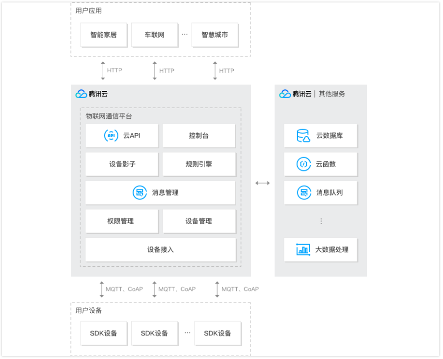

在上图所示的架构中, 本文只讨论"用户设备"和腾讯云的对接. 这上图中可以看到, "用户设备"和腾讯云之间是基于**MQTT**协议或是**CoAP**协议进行通信的. 因此, 在"用户设备"上, 需要包含连接SDK或是实现了MQTT或CoAP协议的代码. 本文讲述MQTT连接方法, CoAP协议类似.

**MQTT简介**

物联网 (IoT) 设备必须连接互联网. 通过连接到互联网, 设备就能相互协作, 以及与后端服务协同工作. 互联网的基础网络协议是 TCP/IP. MQTT(消息队列遥测传输)是基于 TCP/IP 协议栈而构建的, 已成为 IoT 通信的标准. MQTT本身是个轻量级的协议, 可以在硬件受限设备上实现. 同时, MQTT协议支持在各方之间异步通信的消息协议, 异步消息协议在空间和时间上将消息发送者与接收者分离, 因此可以在不可靠的网络环境中进行扩展. MQTT的灵活性使得为 IoT 设备和服务的多样化应用场景提供支持成为可能.


MQTT协议基于发布(Publish)和订阅(Subscribe)模型. 在网络中定义了两种实体类型: **消息代理端(Broker)**和**客户端(Client)**, 代理是一个服务器, 它从客户端接收所有消息, 然后将这些消息路由到相关的目标客户端. 客户端是能够与代理交互来发送和接收消息的任何事物. 客户端可以是现场的 IoT 传感器, 或者是数据中心内处理 IoT 数据的应用程序.

Client和Broker之间的发布和订阅是根据主题(Topic)来进行的, 不同的客户端可以向不同的主题发布消息, 设备只有在订阅了某个主题后, 才能收到相应主题的消息.


云端设置
--------

云端设置主要包含了, 创建新产品, 创建新设备

登录腾讯云, 搜索"云产品"下的"物联网通信"产品, 或直接访问 https://console.cloud.tencent.com/iotcloud


**创建新产品**

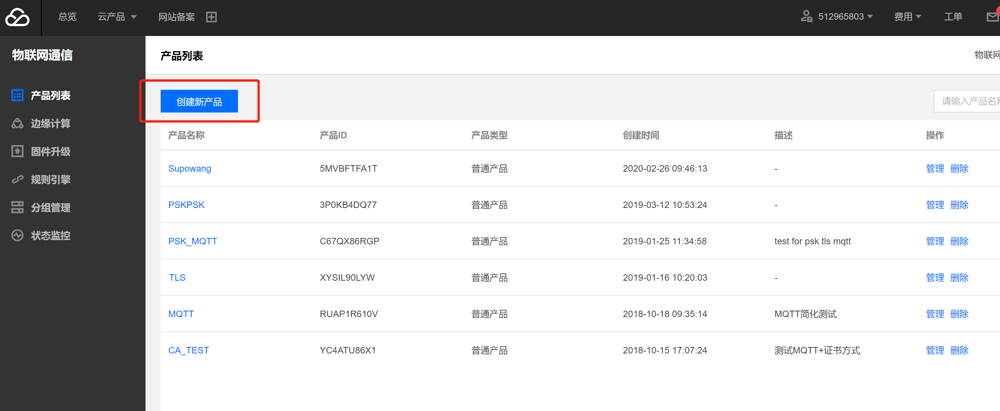

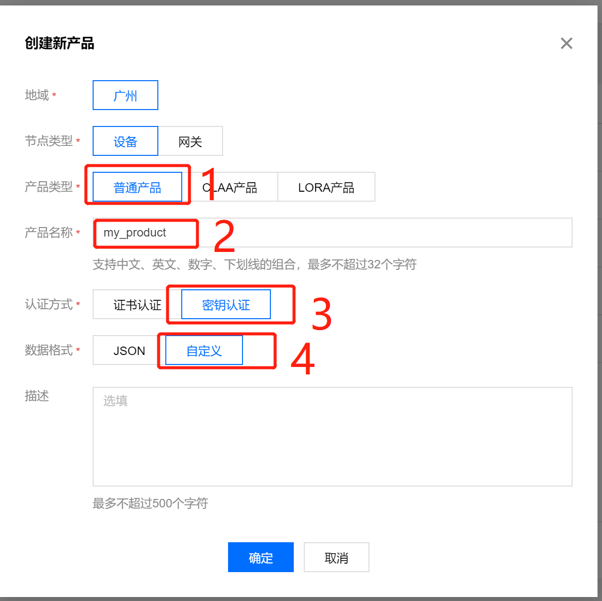

在"添加新产品"的时候, 注意选择. 产品类型选择**普通产品**, 产品名称随意, 认证方式选择**密钥认证**, 数据格式选择**自定义**.

> 关于认证方式和数据格式的选择解释
>
> 认证方式默认的是证书认证, 数据格式默认的是json格式.
>
> 对于认证方式, 指定了设备通过何种方式和云端进行双向认证. 默认的证书方式相对于密钥认证安全性高一点, 但是问题在于证书方式需要在嵌入式设备端存储证书同时实现证书的相关处理, 对设备的RAM和ROM要求较高, 相对而言, 密钥认证的方式资源占用量就小点, 由于我们主要支持的设备都是小型嵌入式设备, 因此选用密钥认证.
>
> 数据格式指的是设备和云端进行数据交互时候使用的格式, json格式为文本字符串, 可读性高, 并且便于解析, 对于功能复杂的设备交互而已比较理想, 但是对于小型设备或是定制设备, 数据单一, 或是有自定义的格式(二进制或是文本), 这种时候, 用自定义的数据格式, 一方面节约流量, 另一方面比较灵活. 

注: 这里的数据格式选择会影响之后腾讯云"规则引擎"组件的设置.

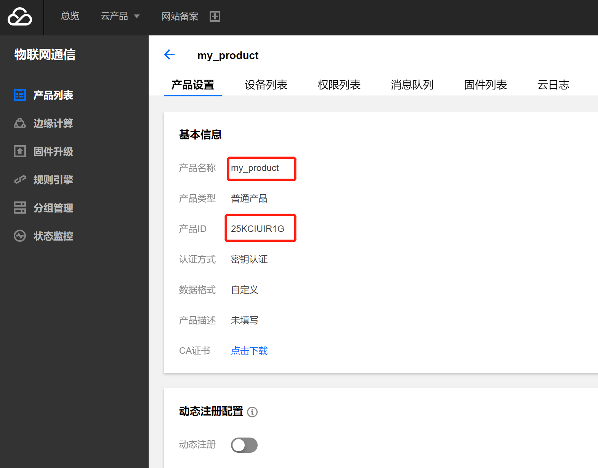

新建完产品后, 会获得一个平台分配的**productID**.


**创建新设备**

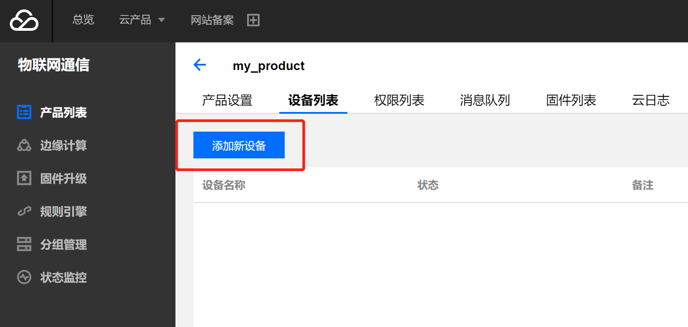

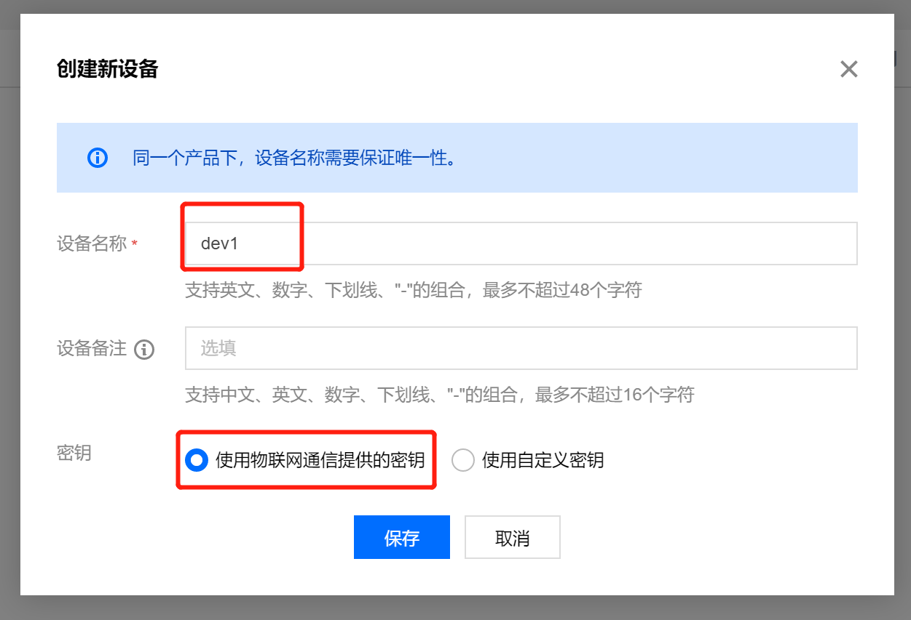

设置的时候只需要设置设备名称即可, 由于我们在创建产品的时候, 认证方式选择了密钥认证, 因此在创建设备的时候将会提供设备对应的密钥, 这里选择默认的"使用物联通通信提供的密钥"即可.


添加完设备后, 会告知设备对应的密钥. 该密钥将会用于之后设备与平台通信时的认证.

为了实现设备间的通信, 我们还需要创建第二个设备, 操作同上, 不妨将其命名为"dev2".

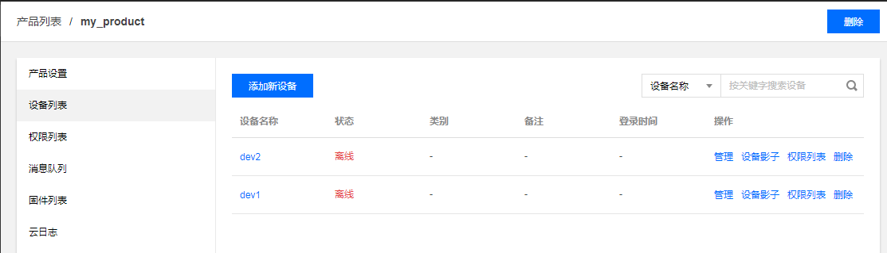

此时, 在产品"my_product"下面, 有2个我们添加的设备, 分别为"dev1"和"dev2".


**Topic设置**

我们知道, 设备通过MQTT协议进行通信, 是基于发布(publish)和订阅(subscribe)相关的话题(topic)来进行的, 因此, 还需要在云端对话题进行设置.

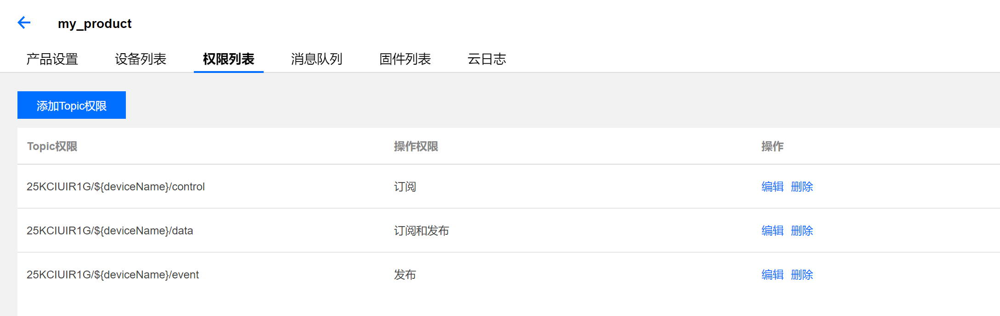

我们可以在"权限列表"中看到Topic对应的操作权限, 此处还可以添加新的Topic.

在这里, 我们可以看到, 平台默认配置了两类的Topic, 用于执行发布和订阅. 这里之所以是两类而不是两个, 是因为Topic里使用了变量. 这里的`QOW7EO9S31`实际上是productID; `${deviceName}`为平台设置的变量, 即设备名; `control`和`event`为Topic名字. 所以, 在我们创建了2个设备dev1和dev2的情况下, 在my_product产品下, 即存在4个Topic, 分别为:

- QOW7EO9S31/dev1/control 订阅权限
- QOW7EO9S31/dev1/event 发布权限
- QOW7EO9S31/dev2/control 订阅权限
- QOW7EO9S31/dev2/event 发布权限

这里默认的Topic已经足够我们使用, 不需要额外添加Topic和权限了.

> MQTT的Topic本身是一个普通的字符串, 但是可以由多个层级组成, 根据`/`来划分. 这种分层的Topic结构使得主题的过滤和匹配变得相对灵活.
>
> 多层通配符"#"
>
> 必须位于最后一个字符, 匹配多层级. 例如对于`QOW7EO9S31/#`, 将会匹配`QOW7EO9S31/dev1`, `QOW7EO9S31/dev2`, `QOW7EO9S31/dev1/control`, `QOW7EO9S31/dev1/event`, `QOW7EO9S31/dev2/control`和`QOW7EO9S31/dev2/event`主题.
>
> 单层通配符"+"
>
> 匹配单个层级, 在主题的任何层级都可以使用, 包括第一个层级和最后一个层级.
>
> 例如, 对于`QOW7EO9S31/+/event`, 将会匹配`QOW7EO9S31/dev1/event`和`QOW7EO9S31/dev2/event`.


**设置规则引擎**

规则引擎本身不属于MQTT协议的范畴, 但是平台侧出于安全角度考虑添加了规则引擎, 实现了Topic之间的转发操作, 我们需要合理的设置规则引擎才能实现多个设备之间的数据收发, 由于理解起来比较复杂, 我们这里简要讲解下为什么需要规则引擎, 规则引擎的作用, 如何设置规则引擎.

1. 为什么需要规则引擎

   在上节的Topic中, 我们知道, 在平台侧, 对于不同的Topic, 规定了不同的权限, 例如, 对于`QOW7EO9S31/dev1/event`这个Topic, 只具有发布权限, 而对于`QOW7EO9S31/dev1/control`这个Topic, 只具有订阅权限. 对于设备dev1, 很自然的, 会朝`QOW7EO9S31/dev1/event`这个Topic发送数据, 并且订阅`QOW7EO9S31/dev1/control`这个Topic的消息. 但是这里就会涉及到, event的数据最后到哪去, control的数据从哪里来的问题.

   在本文的例子中, 我们希望dev1和dev2发生交互, 即相互收发消息. 由于MQTT是基于Topic的发布订阅机制, 因此, dev1想要获得dev2的数据, 直觉上, 需要订阅dev2发布消息的那个Topic. 假定dev2朝`QOW7EO9S31/dev2/event`Topic上发送数据, 那么dev1想要获得dev2发布的消息, 最直接的办法是订阅同样的Topic, 即`QOW7EO9S31/dev2/event`, 但是这里存在几个问题, 首先, event Topic只具有发布权限, 没有订阅权限, 其次, **在平台侧, 规定了, 不允许跨设备发布或是订阅Topic**, 也就是说, 对于dev1, 只能看到或只允许访问`QOW7EO9S31/dev1`这个Topic以及其下属的Topic, 不能访问`QOW7EO9S31/dev2`及其下属Topic.

   > 平台侧添加不允许跨设备访问Topic的规则虽然不直观, 但却是合理的. 如果不添加这条限制, 那么一个设备可以不加限制的订阅同一个产品下所有其他设备的Topic, 获取其上报的消息, 这存在潜在的安全漏洞.

2. 规则引擎的作用

   因为不允许直接跨设备访问Topic, 所以需要依靠"规则引擎"来手动添加规则, 将指定的Topic消息转发到另一个Topic上, 实现不同设备之间的通信.

   

   上图介绍了规则引擎的主要作用"republish", 即将一个Topic下的消息republish到另一个Topic下. 从图中我们可以看到, 规则引擎将`QOW7EO9S31/dev2/event`的消息republish到了`QOW7EO9S31/dev1/control`下. 将`QOW7EO9S31/dev1/event`的消息republish到了`QOW7EO9S31/dev2/control`下.

   这样, 对于dev1而言, 只需要订阅`QOW7EO9S31/dev1/control`就可以接收来自`QOW7EO9S31/dev2/event`的消息了. dev2同理.

3. 设置规则引擎

   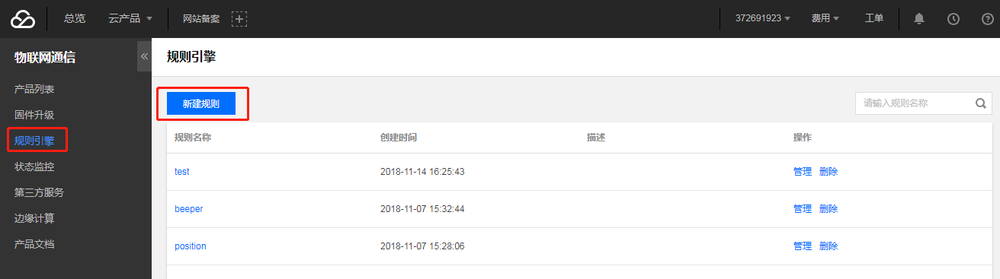

   在物联网通信界面选择"规则引擎"--"新建规则", 随意指定一个规则名称, 我们这里不妨设置为"1to2".

   

   这里, 我们看到规则的详细设置信息, 主要包括"筛选数据"和"行为操作". "筛选数据"针对指定Topic接收到的消息内容进行进一步的筛选, 比如匹配消息中的字段来决定是否执行之后的设置的"行为操作". 而"行为操作"则是指定对通过匹配的消息进行何种操作, 主要的操作有"数据转发到另一个Topic(Republish)", "转发到第三方服务(Forward)"以及转发到腾讯云各个对应组件中.

   

   上图是设置好的规则, 这里, 我们将"筛选数据"部分的筛选字段设置为`*`, 筛选的Topic为`QOW7EO9S31/dev1/event`, 条件设置为空, 即不筛选数据, 全部匹配. 然后, 执行的操作是将数据转发到`QOW7EO9S31/dev2/control`, 设置完这条规则, 就实现了dev2通过订阅control就能收到dev1发送到event的数据.

   > 关于"筛选数据"的设定
   >
   > 由于我们在新建产品, 设置数据格式的时候选择了自定义数据格式, 在自定义数据格式的情况下, 当前平台将其当做二进制流来处理, 也就无法通过匹配字段进行数据筛选.
   >
   > 如果在进行产品的时候, 使用数据格式是json, 那么此处就可以根据json中的字段进行SQL的匹配和筛选.

   同理, 我们再设置新的一个规则"2to1", 实现`QOW7EO9S31/dev2/event`到`QOW7EO9S31/dev1/control`的转发.

   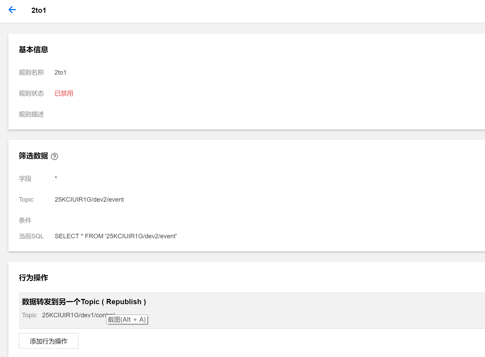

   这样, 在平台侧dev1到dev2的双向数据通路就打通了.

**云日志和消息队列CMQ**

在平台侧都设置好后, 我们在之后的测试过程或是通信过程中, 往往还需要查看平台是否收到了设备发送上来的消息, 对消息执行了哪些操作, 消息的具体内容(payload)是什么. 腾讯云提供了物联网通信产品的"云日志"功能和腾讯云组件"消息队列CMQ".

云日志

可以在产品列表下找到"云日志", 点击搜索即可显示对应的行为日志

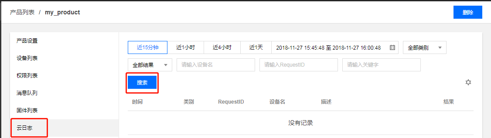

参考日志如下, 可以看到日志记录了设备的连接, 连接断开, 发布, 订阅等行为, 也记录了规则引擎的操作, 还有CMQ队列的一些行为日志. 但是关于设备发布的消息内容, 在云日志中无法查看, 需要借助消息队列CMQ.

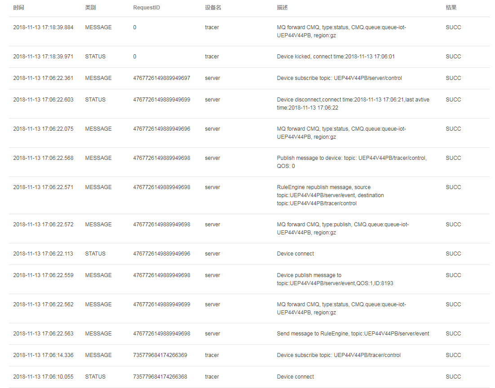

消息队列CMQ

可以在产品列表中找到"消息队列"选项, 设置队列所想要接收的消息类型后保存配置, 即可将平台侧收到的设备消息额外发送到腾讯云消息队列CMQ组件中.


设置完消息队列后可以在"云产品"中搜索CMQ, 即可找到对应的消息队列, 点击"开始接收消息" 接收消息队列中的内容, 参考如下

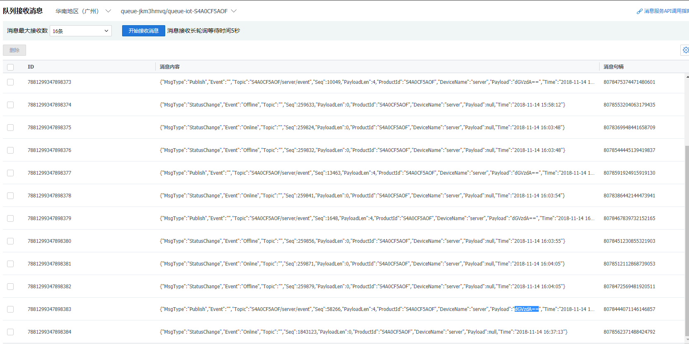

其中可以看到有些消息带有"PayloadLen"和"Playload"字段, 即为具体的消息内容.

> 在密钥认证下, 消息的内容(payload)是经过base64编码的, 所以在平台侧看到的数据类似乱码实际上是经过编码后的结果, 想要查看具体的内容, 可以在linux下, `echo <payload> | base64 --decode`.

设备终端设置
------------

在前文中我们提到, 设备终端跟腾讯云之间的通信采用的是MQTT协议, 而MQTT协议需要消息代理端和客户端相互配合, 因此, 我们在终端设备上, 需要**实现一个MQTT Client**. 腾讯云上支持的MQTT协议和标准协议区别不大, 可以在[MQTT协议说明](https://cloud.tencent.com/document/product/634/14065)查看具体区别. 因此, 技术上来说, 设备终端只要实现了标准的MQTT客户端, 均可以跟腾讯云正常通信.

在本节中, 我们介绍如何使用腾讯IoT OS与腾讯云通过MQTT进行通信.

腾讯IoT OS集成了对MQTT和腾讯云的支持, 开发者只需要通过简单的设置即可实现与腾讯云的通信, 整体步骤主要包含:

- 项目工程中添加MQTT组件相关文件
- 适配AT HAL层串口及网络接口函数
- 执行脚本生成MQTT配置头文件
- 调用OS提供的接口完成和腾讯云的对接

**项目工程中添加MQTT组件相关文件**

在工程中新建`hal`、`at`和`mqtt`组, 并添加下列源文件，可以参考TencentOS_tiny\board\TencentOS_tiny_EVB_MX\KEIL\tencent_os_mqtt工程:


上述文件分别位于`TencentOS_tiny\net\at`, `TencentOS_tiny\components\connectivity\Eclipse-Paho-MQTT`和`TencentOS_tiny\platform\hal\st\stm32l4xx\src`目录下.

相应的, 也需要引入对应的头文件

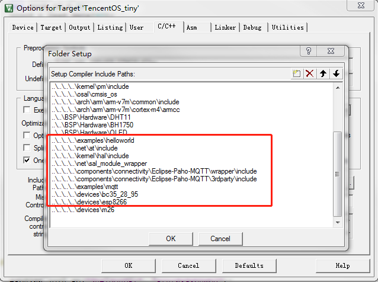

**适配AT HAL层串口及网络接口函数**

上层MQTT的操作最终都会转为为对底层通信设备的socket操作, OS集成了sal_module_wrapper层, 但是由于各个开发板硬件不同, 因此需要对sal_module_wrapper进行适配. 适配过程的核心数据结构为`sal_module_t`, 在`TencentOS_tiny\net\sal_module_wrapper\sal_module_wrapper.h`文件中定义:

```c
typedef struct sal_module_st{
    int (*init)(void);
    int (*get_local_mac)(char *mac);
    int (*get_local_ip)(char *ip, char *gw, char *mask);
    int (*parse_domain)(const char *host_name, char *host_ip, size_t host_ip_len);
    int (*connect)(const char *ip, const char *port, sal_proto_t proto);
    int (*send)(int sock, const void *buf, size_t len);
    int (*recv_timeout)(int sock, void *buf, size_t len, uint32_t timeout);
    int (*recv)(int sock, void *buf, size_t len);
    int (*sendto)(int sock, char *ip, char *port, const void *buf, size_t len);
    int (*recvfrom)(int sock, char *ip, char *port, void *buf, size_t len);
    int (*recvfrom_timeout)(int sock, char *ip, char *port, void *buf, size_t len, uint32_t timeout);
    int (*close)(int sock);
}sal_module_t;
```

在使用的时候, 并不需要全部实现, 只需实现下列几个核心的接口即可:

```c
sal_module_t sal_module_esp8266 = {
    .init               = esp8266_init,
    .connect            = esp8266_connect,
    .send               = esp8266_send,
    .recv_timeout       = esp8266_recv_timeout,
    .recv               = esp8266_recv,
    .sendto             = esp8266_sendto,
    .recvfrom           = esp8266_recvfrom,
    .recvfrom_timeout   = esp8266_recvfrom_timeout,
    .close              = esp8266_close,
    .parse_domain       = esp8266_parse_domain,
};
```

这里接口对应的`esp8266_xxx`函数需要开发者根据硬件上具有的通信模组进行相应的适配.

该结构填充完后, 需要在使用MQTT之前, 调用一下初始化接口注册串口和网络API函数:

```c
esp8266_sal_init(hal_uart_port_t uart_port);
```

**执行脚本生成MQTT配置头文件**

从之前介绍腾讯云端配置的章节中可以知道, 在MQTT客户端, 所需要的核心信息只包含:

- Product ID
- Device Name
- Password

开发者在终端节点开发过程中, 可以使用`TencentOS_tiny\tools`下的`mqtt_config_gen.py`脚本来动态生成MQTT配置文件`mqtt_config.h`

```shell
$ python mqtt_config_gen.py
product id:QOW7EO9S31
device name:dev1
password:k05qMb3EXM5CE5ocNcsDvA==
subscribe topic:[default:control]
publish topic:[default:event]
===============Generate tos_mqtt_config.h==================
#ifndef  TOS_MQTT_CONFIG_H
#define  TOS_MQTT_CONFIG_H

#define MQTT_SERVER_IP          "111.230.189.156"
#define MQTT_SERVER_PORT        "1883"
#define MQTT_PRODUCT_ID         "QOW7EO9S31"
#define MQTT_DEV_NAME           "dev1"
#define MQTT_CLIENT_ID          "QOW7EO9S31dev1"
#define MQTT_USR_NAME           "QOW7EO9S31dev1;21010406;12365;2147483648"
#define MQTT_PASSWORD           "49344dd251a98d07e33ba54d4d2a0640303c6e8c;hmacsha1"
#define MQTT_SUBSCRIBE_TOPIC    "QOW7EO9S31/dev1/control"
#define MQTT_PUBLISH_TOPIC      "QOW7EO9S31/dev1/event"

#endif
```

如上所示, 只需要按提示依次输入腾讯云端提供的`Product ID`, `Device Name`和`Password`即可, 至于订阅/发布的topic, 如果采用默认的control和event直接回车, 也可自行设置. 脚本会在脚本所在目录下生成一个`tos_mqtt_config.h`的头文件, 开发者将其放置到自己的工程目录下任意位置并在工程中添加头文件引用即可.

**调用TencentOS tiny提供的接口完成和腾讯云的对接**

以下是与腾讯云对接并收发信息的例程:

```c
void mqtt_demo(void)
{
    int count = 1;
    int sock_id = 0;
    uint8_t read_data[40];
    int read_len;
    char topic[30];
    char buffer[32];

    mqtt_con_param_t con_param;
    con_param.keep_alive_interval = 2000;
    con_param.cleansession = 1;
    con_param.username = MQTT_USR_NAME;
    con_param.password = MQTT_PASSWORD;
    con_param.client_id = MQTT_CLIENT_ID;

    mqtt_pub_param_t pub_param;
    pub_param.dup = 0;
    pub_param.qos = 0;
    pub_param.retained = 0;
    pub_param.id = 0;
    pub_param.topic = MQTT_PUBLISH_TOPIC;

    mqtt_sub_param_t sub_param;
    sub_param.count = 1;
    sub_param.dup = 0;
    sub_param.id = 1;
    sub_param.req_qos = 0;
    sub_param.topic = MQTT_SUBSCRIBE_TOPIC;

#ifdef USE_ESP8266 
    esp8266_sal_init(HAL_UART_PORT_0);
    esp8266_join_ap("SheldonDai", "srnr6x9xbhmb0");
#endif

#ifdef USE_NB_BC35
    int bc35_28_95_sal_init(hal_uart_port_t uart_port);
    bc35_28_95_sal_init(HAL_UART_PORT_0);
#endif

    sock_id = tos_mqtt_connect(MQTT_SERVER_IP, MQTT_SERVER_PORT, &con_param);

    printf("socket id: %d\r\n",sock_id);

    if (tos_mqtt_subscribe(sock_id, &sub_param) != 0) {
        printf("subscribe failed!!!\n");
    }

    while (1) {
        memset(buffer, 0, sizeof(buffer));

        snprintf(buffer, sizeof(buffer), "@%3.1f@%3.1f@%.1f", 25.8,80.6, 90.1);

        printf("publish topic\r\n");
        pub_param.topic = MQTT_PUBLISH_TOPIC;
        pub_param.payload = (unsigned char *)buffer;
        pub_param.payload_len = sizeof(buffer);
        if (tos_mqtt_publish(sock_id, &pub_param) != 0) {
            printf("publish failed!!!\n");
        }

        printf("MQTT count: %d\r\n",count);
        printf("read buf\r\n");
        read_len = tos_mqtt_receive(topic, sizeof(topic), read_data, sizeof(read_data));
        if (read_len >= 0) {
            printf("---------->topic: %s, payload: %s, payload_len: %d\n", topic, read_data, read_len);
        }

        count++;
        osDelay(1000);
    }
}
```

可以看到, 其中核心的接口为:

`tos_mqtt_connect`: 连接腾讯云

`tos_mqtt_subscribe`: 订阅Topic

`tos_mqtt_receive`: 读取订阅消息

`tos_mqtt_publish`: 发布消息

开发者可以根据自己的业务需求来调用这些接口完成特定的业务逻辑.
