# TencentOS tiny 定制开发板 EVB_MX+快速入门指南

| Revision | Date      | Description |
| -------- | --------- | ----------- |
| 1.0      | 2019-9-15 | 文档初版    |
| 2.0      | 2020-2-12 | 文档 V2.0    |

## 1. 定制开发板 EVB_MX+硬件简介

### 1.1 开发板简介

EVB_MX+是腾讯物联网操作系统 TencentOS tiny 团队联合南京厚德物联网有限公司设计的一款物联网评估板，用于 TencentOS tiny 基础内核和 IoT 组件功能体验和评估。
开发板功能图如下所示：
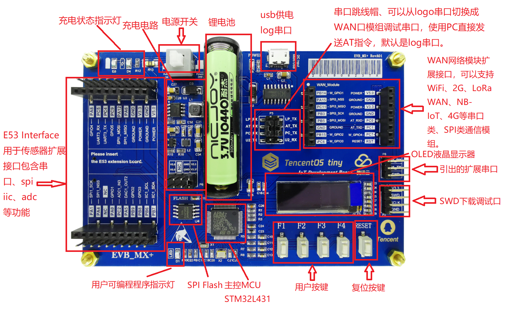

### 1.2 开发板特性
**CPU** ：STM32L431RCT6, 80MHz，256K Flash，64KB SRAM

**显示屏** ：OLED，128*32 分辨率

**电源特性** ：Micro USB 接口，5V 供电，内部有 5V 转 3.3V 的 DCDC，MCU 供电电压为 3.3V，系统 IO 电压也为 3.3V

**按键** ：一个复位按键，四个功能按键

**外部扩展存储** ：SPI FLASH，TF 卡

**LED 指示灯** ：上电指示 LED，红色；充电指示 LED，红色；一个用户定义 LED，蓝色

**调试接口** ：SWD 外接 ST-Link，UART2 串口连接 PC

**XTAL** ：8MHz，32.768KHz

**传感器扩展接口 E53 Interface** ：支持 E53 传感器案例扩展板（支持 UART、SPI、IIC、GPIO、ADC、DAC 等）

**网络模块扩展接口 WAN Interface** ：支持多种无线通信模组扩展（UART&SPI&GPIO）

**操作系统支持** ：TencentOS tiny


### 1.3 开发板硬件详解

#### 1.3.1 电源电路
1）锂电池充放电电源管理
为适应广大开发者对于物联网低功耗应用的需求，EVB_MX+开发板加入了锂电池供电模块，本锂电池供电模块采用的是 TP5410 芯片，该芯片是一款单节锂电池专用的电池充电及 5V 恒压升压控制器，充电部分集高精度电压和充电电流调节器、预充、充电状态指示和充电截止等功能于一体，可以输出最大 1A 的充电电流。升压电路采用 CMOS 工艺制造的空载电流极低的 VFM 开关型 DC/DC 升压转换器，具备极低的空载功耗（小于 10uA），且升压输出驱动电流能力达到 1A。
在下图的 TP5410 电路中，VBUS 为 USB 接口提供的电压，为总电压。BAT_VCC 是锂电池充电电压，该引脚接锂电池。VOUT 引脚输出 +5V 电压，该电压可由锂电池升压产生，供给后续电路使用。
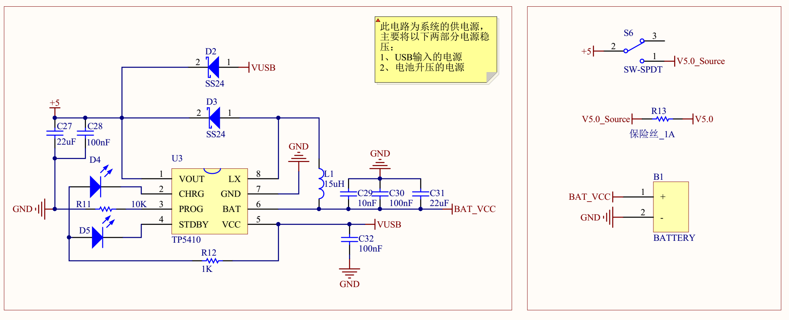
2）电源稳压电路
锂电池电源管理电路可以将 3.7V 锂电池升压至 5V，但这并不能直接作为电源给 EVB_MX+直接供电，EVB_MX+上的元器件供电电压范围普遍在 1.8V-3.6V，推荐电压均为 3.3V，（BC35 供电范围是：3.1V-4.2V，推荐电压 3.8V，使用 3.3V 也可以正常工作），因此需要将 5V 的电平转换成 3.3V 供给 EVB_MX+开发板使用，这里使用 RT8059 作为 3.3V 稳压器芯片。
RT8059是一款高效率脉冲宽度降压型DC/DC转换器。输入电压2.8V-5.5V，输出电压可调范围为：0.6V-Vin，输出电流可以达到1A。在我们提供的电路中将输出调节至3.3V，让开发板正常工作。
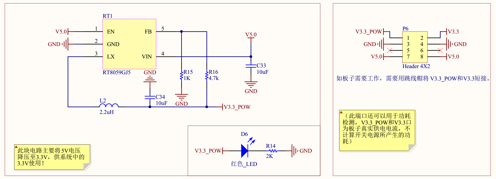

#### 1.3.2  STM32 最小系统电路
单片机最小系统或者叫最小硬件单元电路，指用最少元器件组成的单片机可以正常工作的系统。最小系统基本由电源、单片机、晶振、复位电路、程序烧录接口组成，电源使用 3.3V 直接供电，其他部分原理图如下：
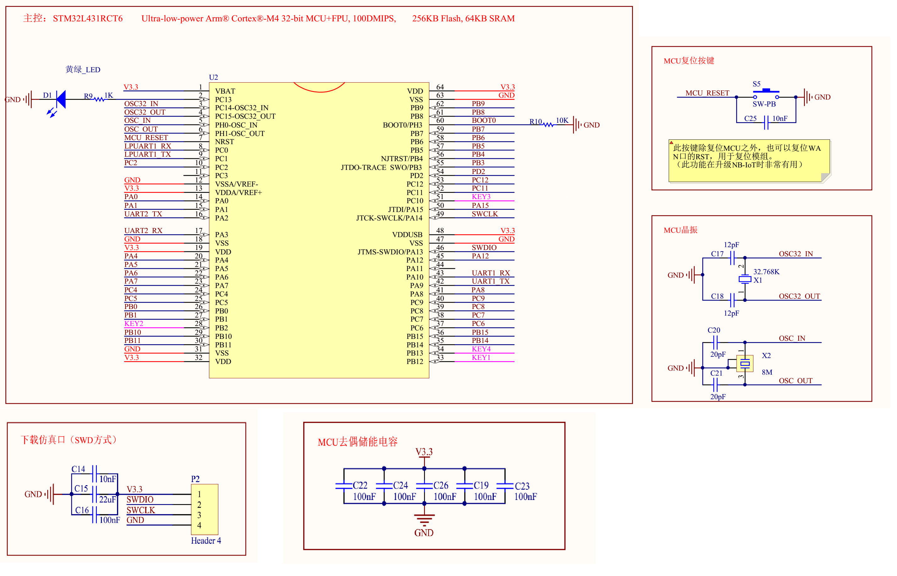

#### 1.3.3  USB 电平转换电路
USB 电平转换电路是用于 MCU 和 PC 通信的场景中。PC 机上的通信接口使用 USB 接口，相应的电平逻辑需要遵照 USB 电平规则，而 MCU 的串行通信接口是串口，相应电平需要遵循 TTL 原则。为了使两者可以互相通信，就需要一个电平转换器，EVB_MX+上使用了 CH340 芯片作为转换器，CH340 外围只需要接很少的元器件即可以实现 USB 总线转接，使用非常方便也广泛运用在 USB 转 TTL 工具上，电路如下：
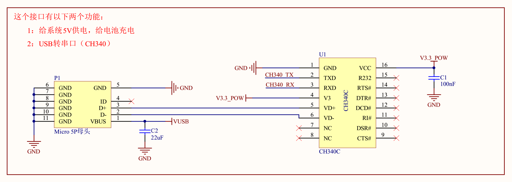

#### 1.3.4  OLED 显示电路
OLED 液晶显示模块用来向用户显示系统状态、参数或者要输入系统的功能。为了展示良好的视觉效果，模块使用 SSD1306 驱动的 OLED 显示屏，分辨率为 128*32。SSD1306 芯片专为共阴极 OLED 面板设计，嵌入了对比控制器、显示 RAM 和晶振，并减少了外部器件和功耗，有 256 级亮度控制。
该款 OLED 使用 IIC 接口，由于 IIC 接口空闲时引脚要上拉，因此下面的原理图中接了 10k 电阻上拉，然后才接入 MCU 引脚。
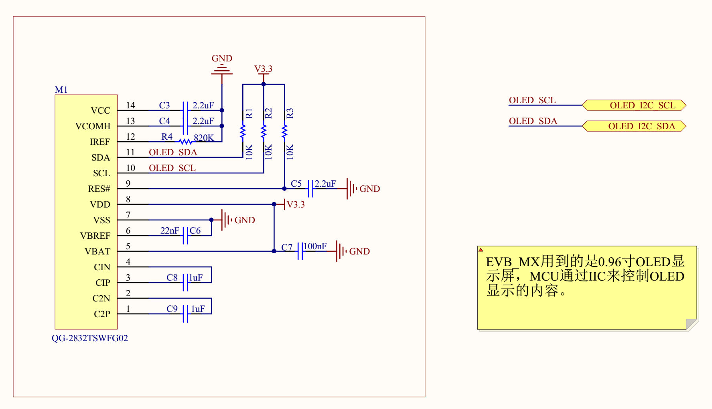

#### 1.3.5 用户按键
开发板带有一个系统 Reset 按键，和四个功能按键。复位按键是直接接入 STM32L431 和 MCU 的硬件复位 Pin，按下复位按键，系统自动重启复位。功能按键可以提供给开发者做功能定义开发，都是使用 GPIO 口，方向为输入，低电平有效。其原理图如下图所示。
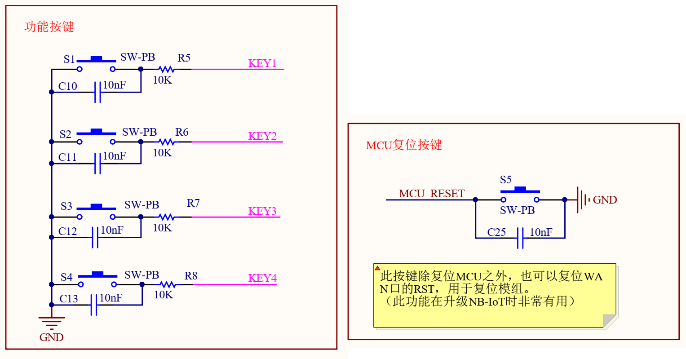

#### 1.3.6 LED 程序指示灯
为了方便项目开发调试，EVB_MX 开发板接出来一个 LED 灯，供用户自己设置状态使用，该 LED 灯接 MCU 的 PC13 引脚，当 PC13 引脚输出高电平时，会点亮 LED 灯。
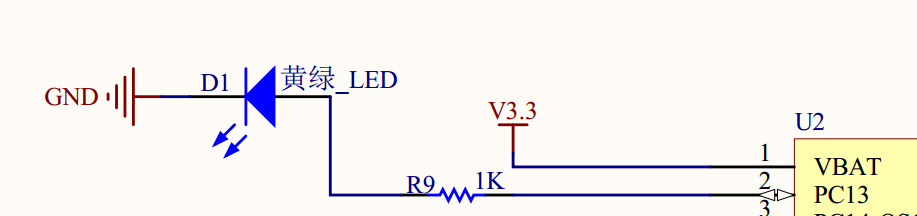

#### 1.3.7  Flash 存储电路扩展
开发板带有一个 SPI Nor Flash 芯片扩展，用户存储一部分用户数据和存储空间扩展，电路图如下：
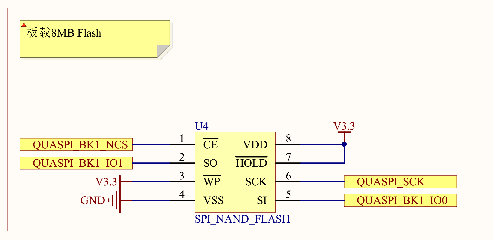

#### 1.3.8  Flash 存储电路扩展
开发板带有一个 micro tf 卡扩展，可用于存储空间扩展，文件系统组件测试等，电路图如下：
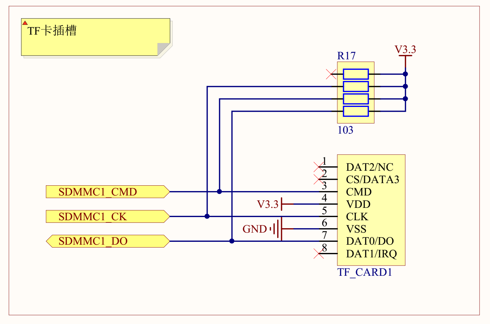

#### 1.3.9 E53 传感器扩展接口
开发板设计有 E53 接口的传感器扩展板接口，该接口可兼容所有 E53 接口的传感器扩展板，实现不同物联网案例场景的快速搭建。该接口可接入 UART、SPI、I2C、ADC 等通信协议的传感器，其原理图如下图所示。
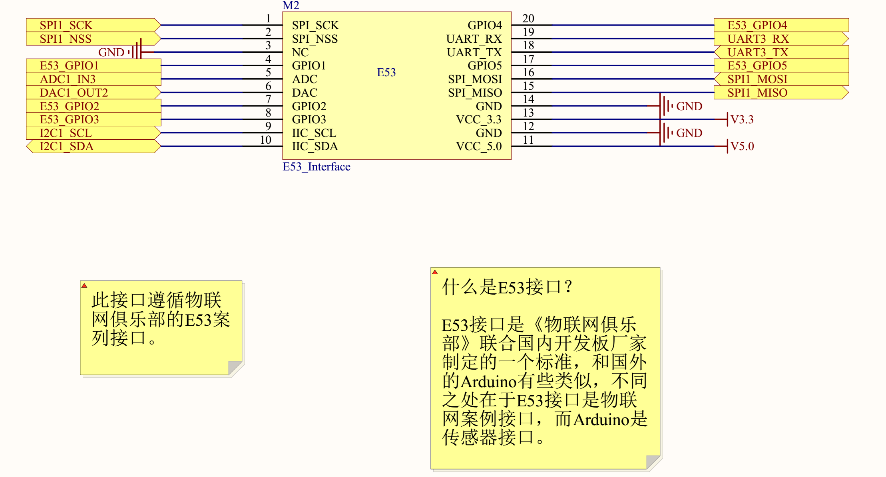
#### 1.3.10 WAN 通信模块扩展接口
开发板设计有通信扩展板的扩展接口，该接口可接入 WIFI、NB-IoT、2G、腾讯定制 IoT 模组、LoRaWAN 等不同通信方式的通信扩展板，以满足不同场景上云的需求，其原理图如下图所示。
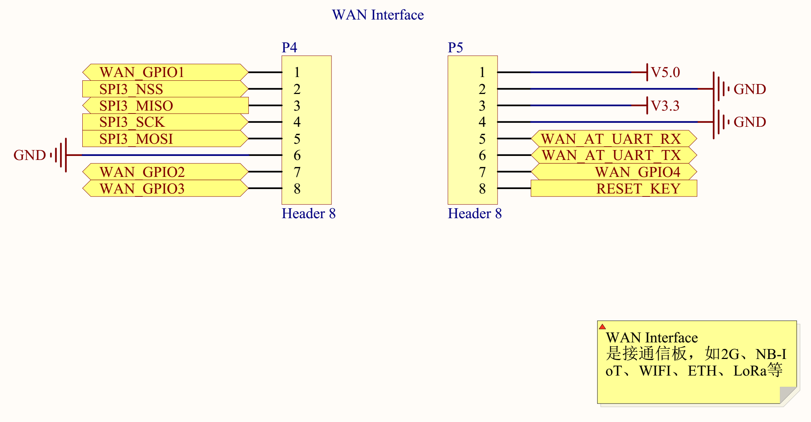

#### 1.3.11 开发板部分引脚和模块映射关系
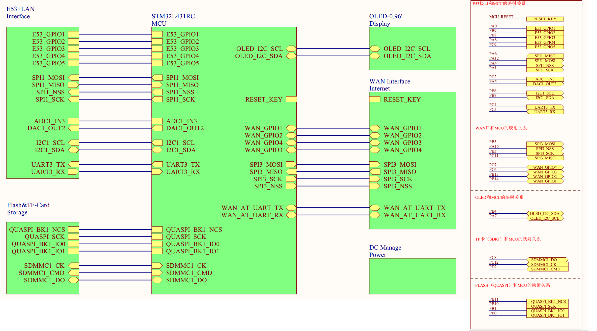

### 1.4 开发板开箱安装指南

#### 1.4.1  检查配套设备
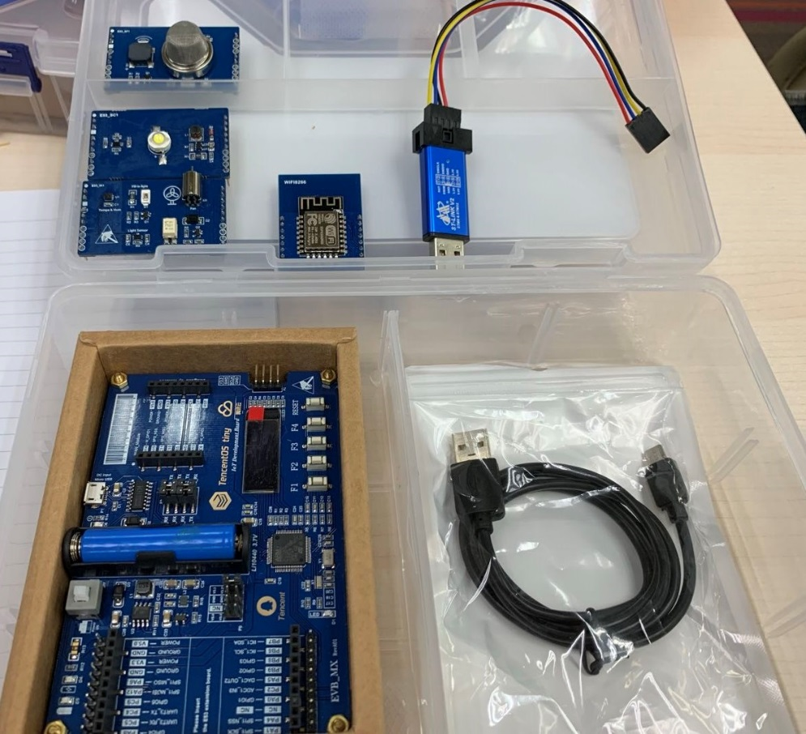
打开开发套件箱子后，开发者可以在箱子左侧找到开发板主板，右侧放了一个 WAN 口 wifi 扩展板 ESP8266、STlink 下载器、和一个传感器扩展板，可能是（E53_SC1 智慧城市灯光模块、E53_SF1 智慧消防烟感模块、E53_IA1 智慧农业模块）其中一个（标配仅一个传感扩展板，如需要更多传感扩展板可自行找合作供应商（物联网俱乐部）购买），如上图所示。

#### 1.4.2 安装 WAN 口 WiFi 模块
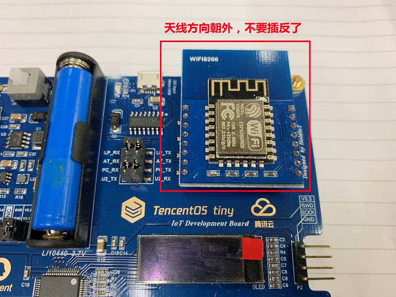

#### 1.4.3 安装传感器扩展板
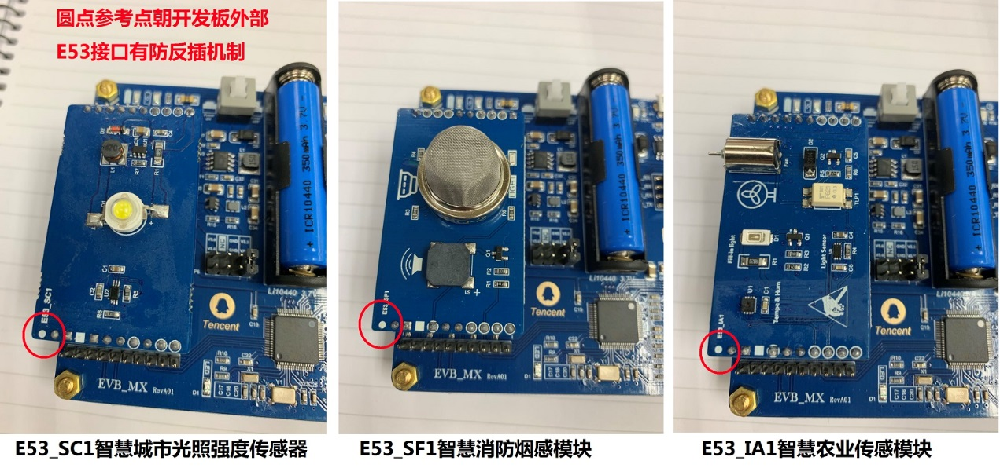
根据您开发套件配套的传感扩展板安装其中一个即可。

#### 1.4.4  连接 Micor USB 线
Micro USB 线的功能是供电及调试，将线一头与开发板的 Micro 接口连接，另一头接到电脑的 USB 口上。


#### 1.4.5  连接 ST-Link 程序下载器
把开发板内提供的配套下载线接在开发板的程序下载接口（SWD 口），另一端与 ST-Link 程序下载器对应引脚相连，注意连接紧密，防止接触不良，红色为 VCC，一定参考下图进行连接，不要接错。
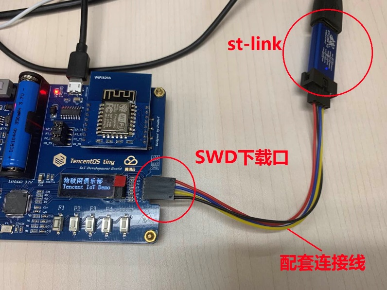

## 2. 定制开发板 EVB_MX+软件开发环境准备

### 2.1 MDK 软件介绍
MDK 即 RealView MDK 或 MDK-ARM（Microcontroller Development kit），是 ARM 公司收购 Keil 公司以后，基于 uVision 界面推出的针对 ARM7、ARM9、Cortex-M0、Cortex-M1、Cortex-M2、Cortex-M3、Cortex-R4 等 ARM 处理器的嵌入式软件开发工具。MDK-ARM 集成了业内最领先的技术，包括 uVision4 集成开发环境与 RealView 编译器 RVCT。支持 ARM7、ARM9 和最新的Cortex-M3/M1/M0 核处理器，自动配置启动代码，集成 Flash 烧写模块，强大的 Simulation 设备模拟，性能分析等功能，与 ARM 之前的工具包 ADS 等相比，RealView 编译器的最新版本可将性能改善超过 20%。
Keil 公司开发的 ARM 开发工具 MDK，是用来开发基于 ARM 核的系列微控制器的嵌入式应用程序。它适合不同层次的开发者使用，包括专业的应用程序开发工程师和嵌入式软件开发的入门者。MDK 包含了工业标准的 Keil C 编译器、宏汇编器、调试器、实时内核等组件，支持所有基于 ARM 的设备，能帮助工程师按照计划完成项目。

### 2.2 MDK 安装
登录 MDK 官网，下载 MDK5 软件，下载地址：
http://www2.keil.com/mdk5  或者 https://www.keil.com/download/product/
下载的版本最好在 5.24 以上，本开发教程以 5.24 版本为例，双击 MDK524 应用程序文件，点击 next>>。


打上 I agree 前面的勾勾，即是同意一些安装协议。点击 next>>。


选择安装路径，可以默认也可以安装在我们自己建立的文件夹下。点击 next>>。


这里填写的是我们的一些信息，填写完整后，继续 next>>。


然后等待安装完成即可。


安装完成，点击 Finish。

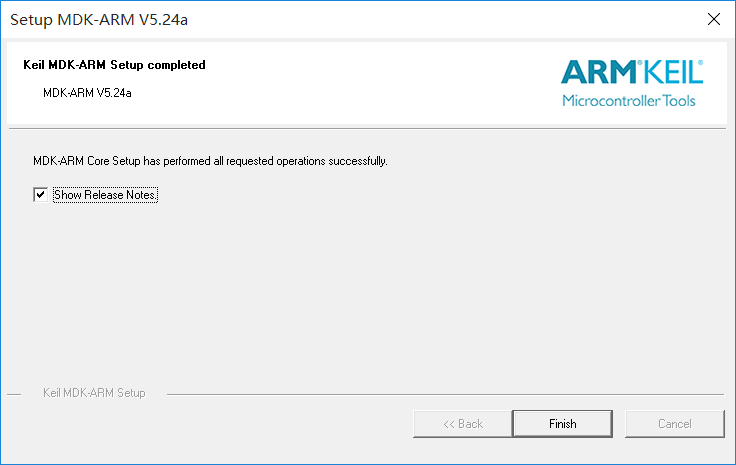

然后会跳出来这个界面，这个我们后面再讲，先点 OK，把弹框都叉掉。

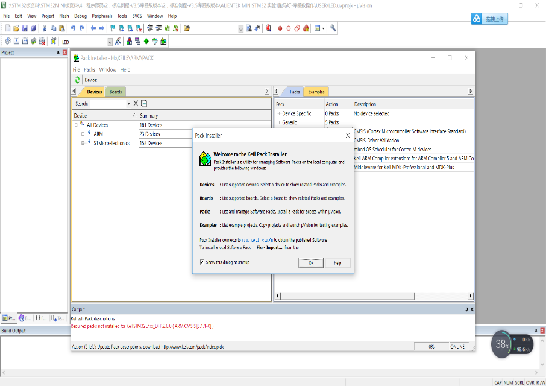

激活 MDK，导入 License，激活 MDK 后便可使用了。


特别提示：一定要输入 License 激活 MDK 软件，建议购买正版 License。

### 2.3 MDK 安装
安装完 MDK 后，我们需要安装开发套件中单片机型号对应的 Pack。
**安装方式一**  登录官网：http://www.keil.com/dd2/pack/ 
下载 Keil.STM32L4xx_DFP.2.0.0.pack 后安装，如下图

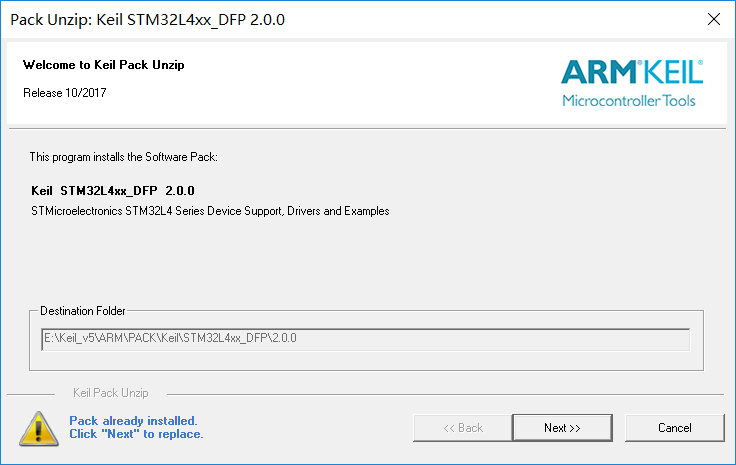

**安装方式二**  MDK 软件上在线安装

打开软件，在导航栏打开 Pack 安装界面，然后选择 ok 选项。


进入在线安装界面，选着 STM32L4XX Pack，点击 Install 进行安装。

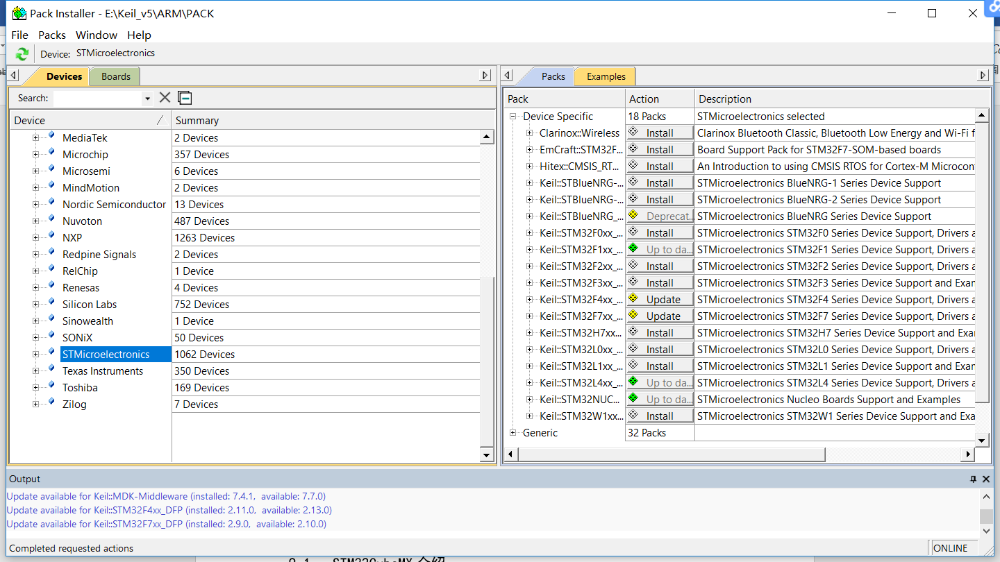

至此，我们开发板的单片机程序开发环境已经搭建完毕，重启 MDK 软件就可以使用了。

### 2.4 ST-Link 驱动安装
前面讲了开发板单片机程序的开发环境的搭建，但是为了将程序烧录到开发板中我们还需要使用仿真器。我们这套开发板选用 ST 公司的 ST-Link V2 仿真器进行开发板程序的烧写和仿真，下面介绍 ST-Link 驱动的安装及环境搭建。
在 ST 官网下载 ST-Link 驱动，
https://www.st.com/content/st_com/zh/products/development-tools/software-development-tools/stm32-software-development-tools/stm32-utilities/stsw-link009.html

（驱动有 2 种：32 位电脑系统安装“dpinst_x86”、64 位电脑系统安装“dpinst_amd64”）。 


运行对应的驱动，安装 ST-Link V2 驱动程序。安装路径尽量保持默认路径。


安装完成后，将 ST-Link 通过 USB 接口连入电脑。打开“设备管理器”。若看到如下图所示，表示驱动安装成功。


这里提醒 2 点：
1，	各种 windows 版本设备名称和所在设备管理器栏目可能不一样，例如 WIN10 插上 STLINK 后显示的是 STM32 STLINK。
2，	如果设备名称旁边显示的是黄色的叹号，请直接点击设备名称，然后在弹出的界面点击更新设备驱动
至此，ST-Link 驱动已经安装完成。接下来大家只需要在 MDK 工程里面配置一下 ST-Link 即可。

### 2.5  编程软件 (MDK) 配置
安装驱动成功后，打开 MDK 软件，配置程序烧写和仿真的环境。
点击进入工程配置界面按纽，进入工程配置界面。


选择 Debug 选项，进入仿真器设置界面。

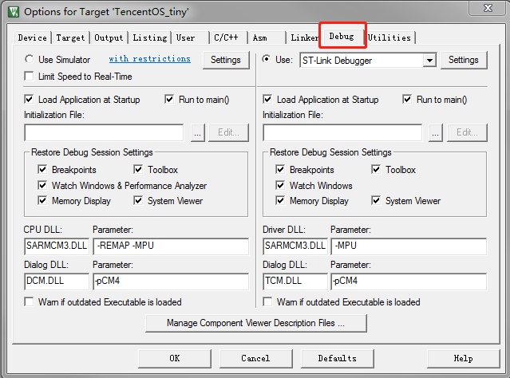

下拉仿真器选择列表，选着 ST-Link Debugger 并勾选右侧 Use，点击 Settings 进入 ST-Link V2 仿真器配置界面。


开发板设计的程序烧录方式为 SW，此处 Unit 选择 ST-Link/V2，且 Port 选择 SW，并确认右侧框内是否检测出 SW 设备，点击<确认>保存配置。


### 2.6  CH340 串口驱动安装

互联网搜索下载 CH340 串口芯片的驱动
安装方法：打开驱动安装程序点击安装即可。


注：若安装失败，请先点击卸载，后点击安装。

### 2.7 串口调试助手的安装与使用

工具下载：http://www.daxia.com/download/sscom.rar

安装方法：串口调试助手 sscom5.13.1 是免安装的，解压出压缩包即可直接使用。


根据 PC 和终端之间的连接，选择正确的串行端口。
打开电脑的设备管理器，在端口列表可以看到 PC 与开发板连接的端口号。


我这里显示的是 COM6，所以要在 sscom 工具中选择 COM6，开发板程序波特率设置为 115200，所以我在 sscom 串口工具中选择 115200 波特率。

## 3. TencentOS tiny 基础内核实验

### 3.1 打开 TencentOS tiny 提供的 Hello_world 工程

TencentOS tiny 官方开源仓下载源码，地址为：
https://github.com/Tencent/TencentOS-tiny

进入 < TencentOS-tiny/board/TencentOS_tiny_EVB_MX_Plus/KEIL/hello_world> 目录，打开 TencentOS_tiny.uvprojx 工程：


### 3.2 编译 HelloWorld 工程

打开工程后，我们在左侧的工程文件导航页面展开 examples 目录，可以看到 helloworld.c 源码，这里创建了两个 TencentOS tiny 的任务，交替运行打印任务。开发者安装下图指示，点击编译按钮即可编译工程，如图：

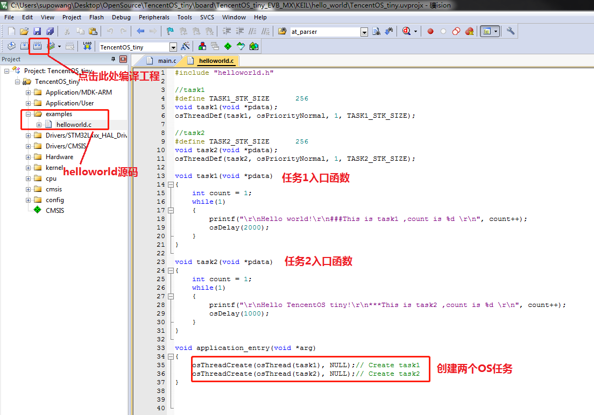

### 3.3 下载运行

首先需要配置下载环境


按下图所示配置下载参数


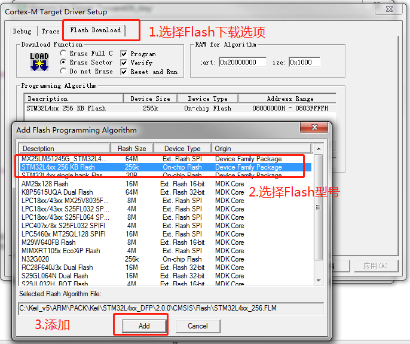

编译完成后点击如图所示”LOAD”按钮下载程序即可。


### 3.4 查看运行结果

连接好串口，在 PC 的串口助手中可以看到 TencentOS tiny 的两个任务交替运行，打印消息并完成任务计数，如下图所示：

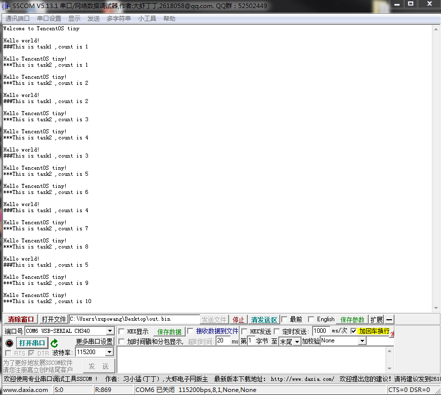

更多 TencentOS tiny 基础内核的使用，请参考内核开发指南文档：
- [TencentOS tiny 内核开发指南](../doc/04.Development_Manual.md)
- [TencentOS tiny API 参考](../doc/05.SDK_Manual.md)

## 4. 使用 TencentOS tiny 定制开发板对接腾讯云 IoT Explorer
### 4.1 入门概述
物联网开发平台的用户，可以通过快速入门的 Demo 示例加快对开发平台的了解。
快速入门准备了一个智能灯接入开发平台的应用场景，该场景模拟一款灯接入开发平台进行数据上报，并能接收控制指令，上报事件，此业务场景可以帮助用户理解如何将一款设备接入到开发平台。
•	如何通过物联网开发平台提供的设备 SDK 接入云端。
•	如何通过控制台在线调试设备。
•	如何通过控制台定义数据模板，查看设备上报数据、通信日志、事件等信息。

### 4.2 智能灯接入指引

#### 4.2.1 操作场景
假设一款智能灯接入到物联网开发平台，通过物联网开发平台可以远程控制灯的亮度、颜色、开关，并实时获取智能灯上报到开发平台的数据。本文档主要指导您如何在物联网开发平台控制台接入智能灯。

#### 4.2.2 前提条件
为了通过下面的步骤快速理解该业务场景，需要做好以下准备工作：
•	申请物联网开发平台服务。

#### 4.2.3 操作步骤
**创建项目和产品**

1.	登录[物联网开发平台控制台](https://cloud.tencent.com/product/iotexplorer)，【项目管理】，选择【新建项目】。
2.	在新建项目页面，填写项目基本信息。
* 项目名称：输入“智能灯演示”或其他名称。
* 项目描述：按照实际需求填写项目描述。
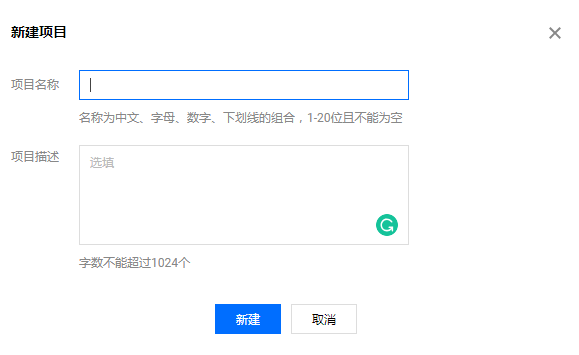
3.	项目新建成功后，进入该项目的产品列表页。单击【新建产品】。
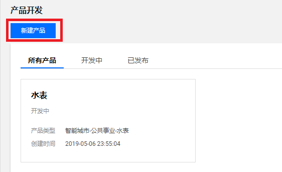
4.	在新建产品页面，填写产品基本信息。
* 产品名称输入“智能灯”或其他产品名称。

* 产品类型选择“路灯照明”。 

* 认证方式选择“密钥认证”。

* 通信方式随意选择。

* 其他都为默认选项。
  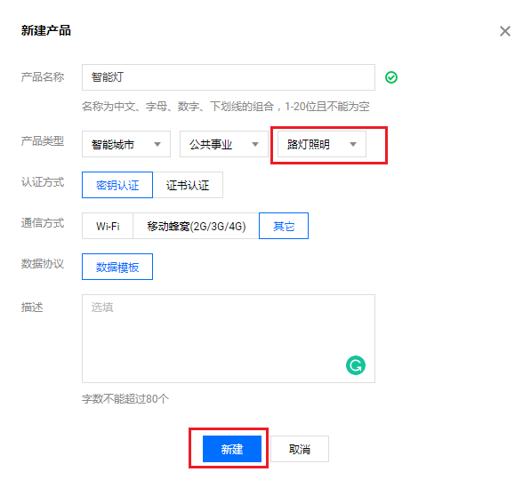
  产品新建成功后，您可在产品列表页查看到“智能灯”。

  **创建数据模板**

选择“智能灯”类型后，系统会自动生成标准功能。
  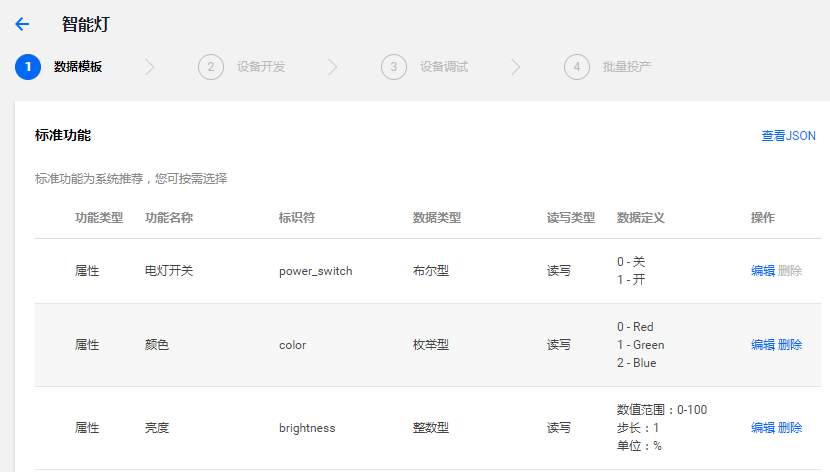

  **创建测试设备**
  在【设备调试】页面中，单击【新建设备】，设备名为 dev001。
  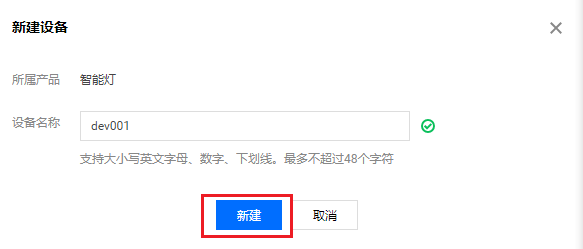
  **运行 Demo 程序**
  1. 打开 lightdemo 例程

    TencentOS tiny 项目工程中包含了 explorer 的 demo 工程：
    进入 TencentOS-tiny\board\TencentOS_tiny_EVB_MX_plus\KEIL\qcloud_iot_explorer_sdk_data_template 目录，双击 TencentOS_tiny.uvprojx，用 mdk 打开。

Demo 工程中 example 分组下的配置文件说明：

- `data_config.c`：设备属性功能相关参数配置
- `action_config.c`：行为调用相关参数配置
- `events_config.c`：事件调用相关参数配置

2. 填写配置信息

    进入 TencentOS-tiny\components\connectivity\qcloud-iot-explorer-sdk\port\TencentOS_tiny 目录，修改 HAL_Device_tencentos_tiny.c 文件：
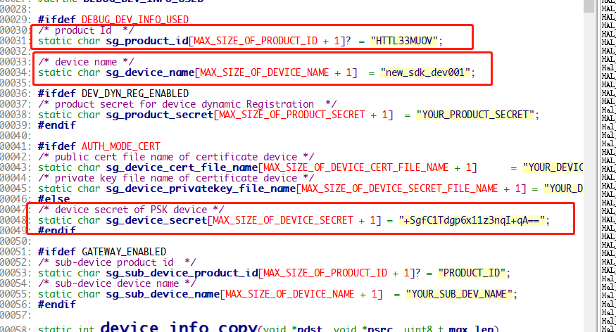
将上图红色线框中的数据分别替换为控制台“设备详情页“中的参数并保存。

* 产品 ID：将控制台的产品 ID，复制到上图 sg_product_id。
* 设备名称：将控制台的设备名称，复制到上图 sg_device_name。
* 设备密钥：将控制台的设备密钥，复制到上图 sg_device_secret。
注：demo 工程中已添加了一个用于调试的 explorer 设备信息，可以直接与 explorer 平台对接。

 进入 TencentOS-tiny\examples\qcloud_iot_explorer_sdk_data_template 目录，修改 entry.c：
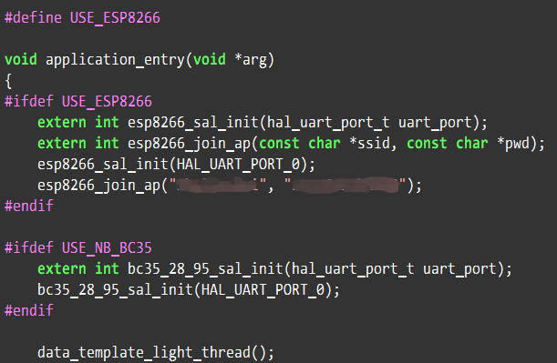

这里 esp8266_join_ap 函数的入参，填写用户自己的 wifi 热点名字及密码。

 将 esp8266 模组插入到开发板模组接口上。（如果选择 BC35 模组，请打开 BC35 的宏并插上 BC35 模组即可）

3. 编译

   选择 project 菜单，点击 Build Project 编译工程。

   如果工具栏上有编译按钮快捷键，可以直接点击工具栏上的编译按钮：
    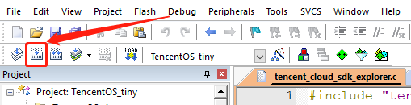 

4. 运行 Demo 程序

选择 Flash 菜单，点击 Download 下载程序到开发板上并运行。

如果工具栏上有下载按钮快捷键，可以直接点击工具栏上的下载按钮：
    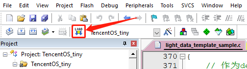 
开发板上程序运行后，前往控制台查看该设备的数据。
#### 4.2.4 查看设备状态
1.	保持 light Demo 程序为运行状态。
2.	进入【控制台】>【产品开发】>【设备调试】，可查看到设备 "dev001" 的状态为“上线”状态，表示 Demo 程序已成功连接上开发平台。
3.	单击【查看】，可进入设备详情页。
    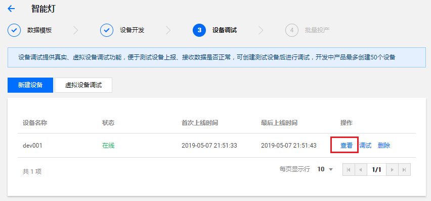 
4.	单击【当前上报状态】，可查询设备上报到开发平台的最新数据及历史数据。
* 当前上报数据的最新值：会显示设备上报的最新数据
* 当前上报数据的更新时间：显示数据的更新时间
    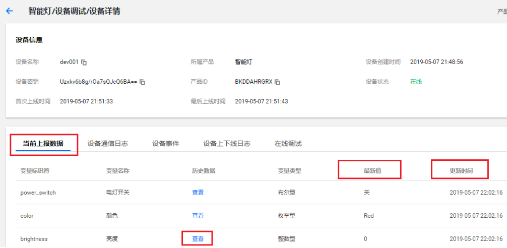 
5.	单击【查看】，可查看某个属性的历史上报数据。
#### 4.2.5 查看设备通信日志
1.	单击【设备通信日志】，可查询该设备某段时间范围的所有上下行数据。
* 上行：上行指设备端上报到开发平台的数据。
* 下行：下行指从开发平台下发到设备的数据。
    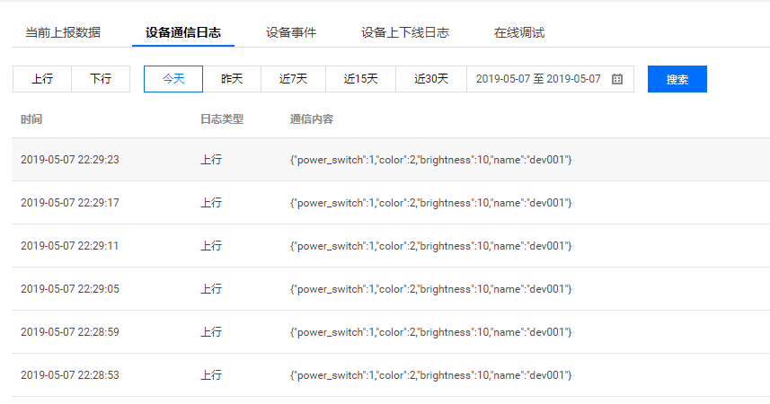 

#### 4.2.6 在线调试
1.	当 Light Demo 成功连接到物联网开发平台后，您可在控制台【设备调试】列表，单击【调试】，进入在线调试。
    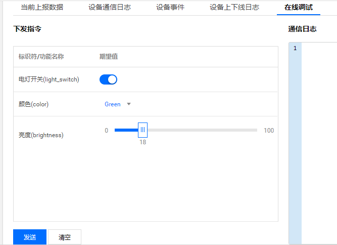 
2.	将亮度设置为 68，颜色设置为“Red”，单击【发送】。
3.	查看 Light Demo 程序，可查看到成功接收到下发的数据。
    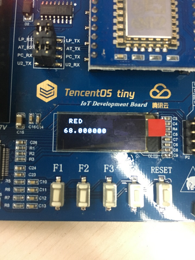 
4.	通信日志会显示如下日志，表示成功下发了指令到设备端。

```c
{
 "Payload": {
     "type": "update",
     "state": {
         "desired": {
             "color": 0,
             "brightness": 68
         }
     },
     "version": 312,
     "clientToken": "API-ControlDeviceData-1557240385"
  }
}
```

5.	查看通信日志，即可查看到设备成功接收到下行指令，并上报最新数据到开发平台的详细日志。

### 4.2.7 设备事件上报

1. 修改工程中的`config.h`文件，开启事件支持：

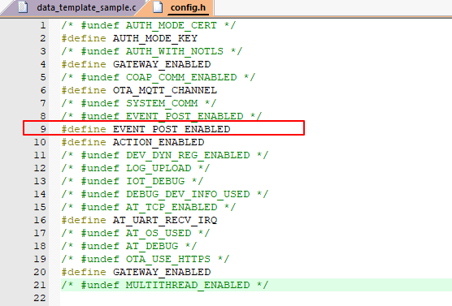

2. 修改`data_template_sample.c`文件，开启事件上报示例：

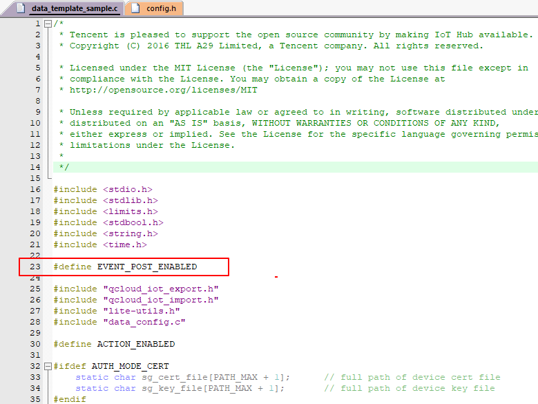

3. 编译程序，下载到开发板中，复位开发板，程序开始运行。

4. 在平台端可以看到设备上报事件的日志：

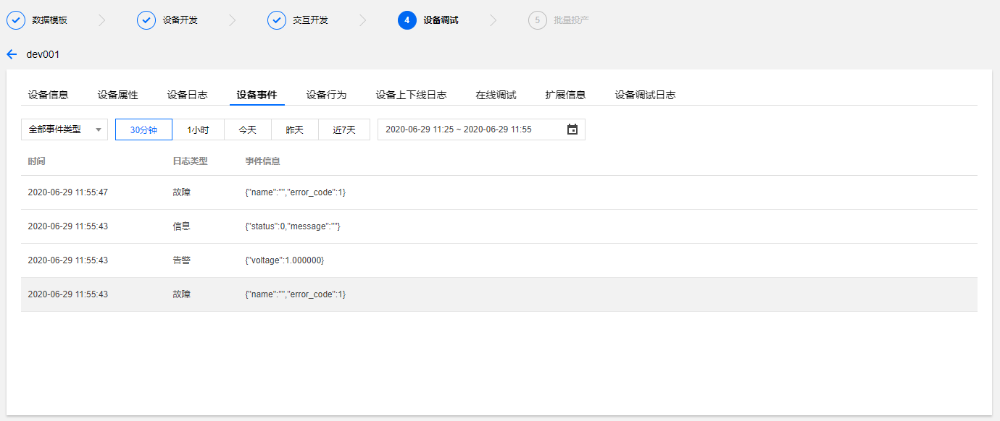

### 4.2.8 设备行为调用

1. 在云端的数据模板中，选择自定义功能版块，手动新建一个设备行为功能：

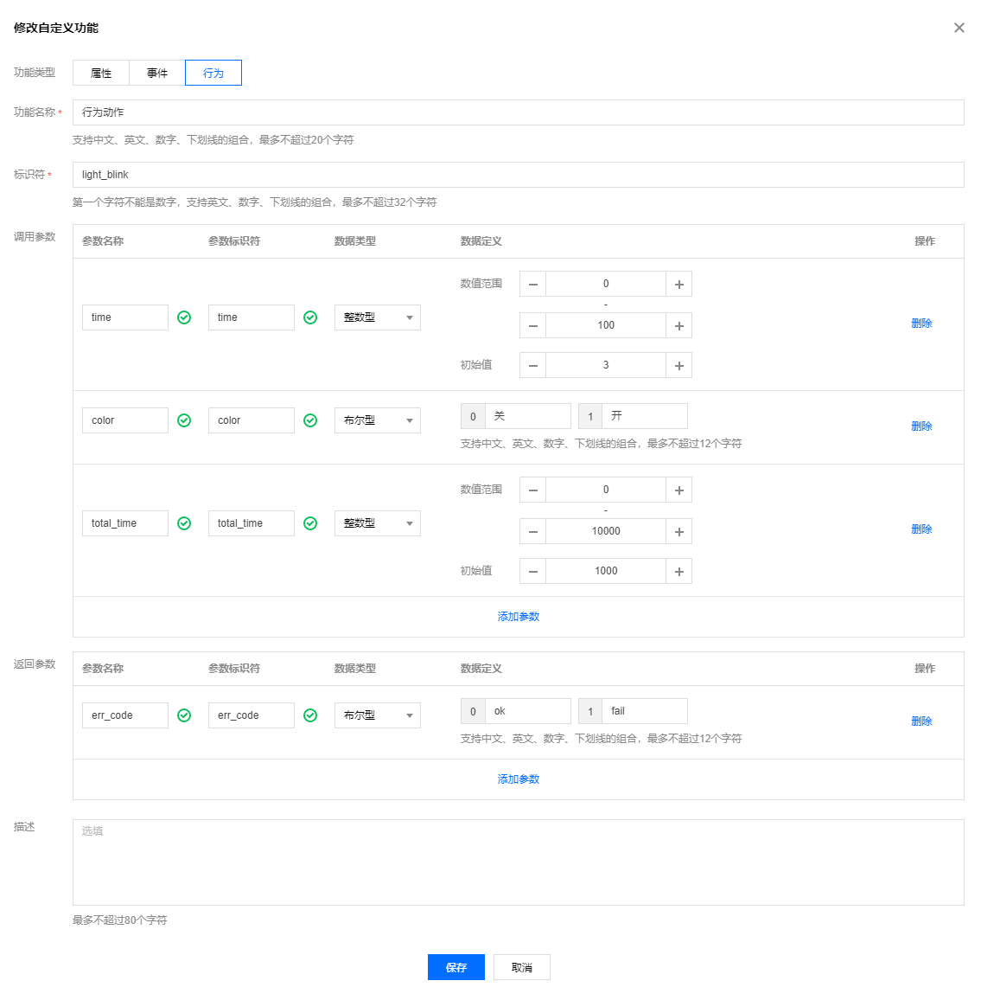

2. 在`data_template_sample.c`文件中使能 Action 示例：

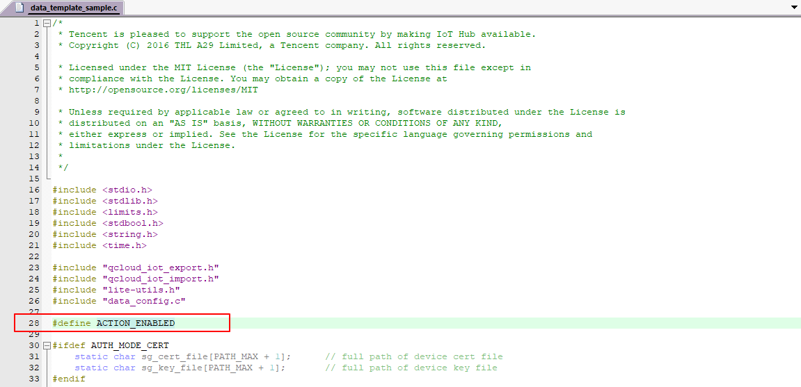

3. 编译程序，下载到开发板中，复位开发板，程序开始运行。

4. 在云端下发设备行为调用：

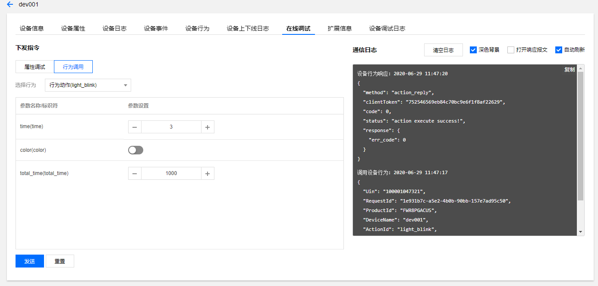

5. 在串口助手中可以看到设备行为被调用：

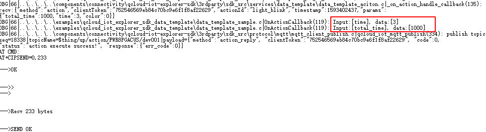