# 1. 小程序开发快速指引

<!-- TOC -->

- [1. 小程序开发快速指引](#1-小程序开发快速指引)
    - [1.1. 开发环境准备](#11-开发环境准备)
        - [1.1.1. 申请小程序账号](#111-申请小程序账号)
        - [1.1.2. 小程序管理后台](#112-小程序管理后台)
        - [1.1.3. 安装开发工具](#113-安装开发工具)
    - [1.2. 智能灯小程序Demo](#12-智能灯小程序demo)
        - [1.2.1. 概述](#121-概述)
        - [1.2.2. 前置工作](#122-前置工作)
        - [1.2.3. 普通开发方式（SDK）](#123-普通开发方式sdk)
            - [1.2.3.1. 导入工程](#1231-导入工程)
            - [1.2.3.2. 修改配置](#1232-修改配置)
            - [1.2.3.3. 功能扩展](#1233-功能扩展)
        - [1.2.4. 云开发方式（云函数）](#124-云开发方式云函数)
            - [1.2.4.1. 导入工程](#1241-导入工程)
            - [1.2.4.2. 开通云开发，创建环境](#1242-开通云开发创建环境)
            - [1.2.4.3. 部署云函数](#1243-部署云函数)
            - [1.2.4.4. 修改配置](#1244-修改配置)
            - [1.2.4.5. 功能扩展：结合API 3.0 Explorer工具快速实现云函数](#1245-功能扩展结合api-30-explorer工具快速实现云函数)
        - [1.2.5. 调试和发布](#125-调试和发布)
        - [1.2.6. 配置信息说明](#126-配置信息说明)
    - [1.3. FAQ](#13-faq)
        - [1.3.1. 网络请求报错: reqeust:fail url not in domain list](#131-网络请求报错-reqeustfail-url-not-in-domain-list)
        - [1.3.2. 云开发: 初始化错误 cloud init error](#132-云开发-初始化错误-cloud-init-error)
        - [1.3.3. 云开发：云环境不存在 env not exists](#133-云开发云环境不存在-env-not-exists)
        - [1.3.4. 云开发：云函数不存在 Function not found](#134-云开发云函数不存在-function-not-found)
        - [1.3.5. 可以接入第三方服务吗？](#135-可以接入第三方服务吗)

<!-- /TOC -->

## 1.1. 开发环境准备

> 更详细小程序开发指南，请参见：[官方小程序开发指南](https://developers.weixin.qq.com/miniprogram/dev/framework/quickstart/getstart.html)

### 1.1.1. 申请小程序账号

进入 [小程序注册页](https://mp.weixin.qq.com/wxopen/waregister?action=step1&token=&lang=zh_CN) `https://mp.weixin.qq.com/` 根据指引填写信息和提交相应的资料，就可以拥有自己的小程序帐号

### 1.1.2. 小程序管理后台

申请小程序成功后，登录[小程序管理后台](https://mp.weixin.qq.com/) 。在小程序管理平台，你可以管理你的小程序的权限，查看数据报表，发布小程序等操作。

AppID：在菜单 “设置”-“开发设置” 可以看到小程序的 AppID，小程序的 AppID 相当于小程序平台的一个身份证，在小程序项目的基本信息中需要配置AppID。

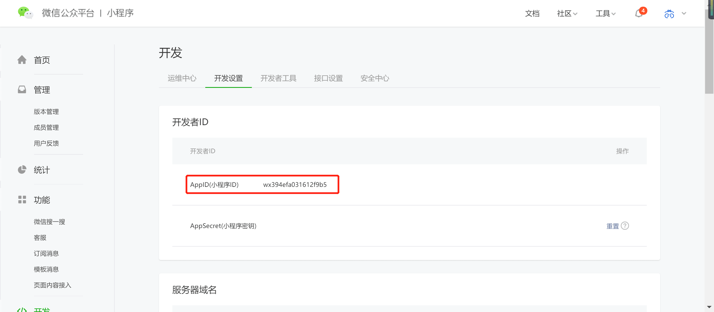

### 1.1.3. 安装开发工具

前往 [开发者工具下载页面](https://developers.weixin.qq.com/miniprogram/dev/devtools/download.html) ，根据自己的操作系统下载对应的安装包进行安装。安装成功后，打开小程序开发者工具，用微信扫码登录开发者工具

## 1.2. 智能灯小程序Demo

### 1.2.1. 概述

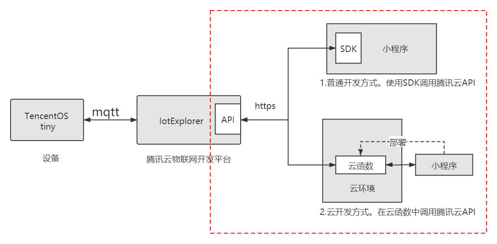

基于腾讯云开发物联网小程序应用，关键是如何在小程序上方便的调用腾讯云物联网平台的API（如图所示的红框部分）。

TencentOS tiny 提供了两种开发方式的小程序Demo案例，帮助开发者的小程序更快接入腾讯云：

1. 普通开发方式，使用SDK调用腾讯云API
2. 云开发方式，在云函数中调用腾讯云API

### 1.2.2. 前置工作
Demo案例以开发智能灯应用为例子，在小程序开发之前，应该先完成以下工作：

+ 在腾讯云物联网开发平台IotExplorer创建智能灯产品和设备

参考[腾讯云智能灯接入指引](https://cloud.tencent.com/document/product/1081/41155)。只需要关注控制台操作部分：创建项目和产品, 新建产品, 创建数据模板, 创建测试设备

+ 基于TencentOS tiny完成设备和IotExplorer对接
   
参考智能灯数据模案例：TencentOS_tiny/examples/qcloud_iot_explorer_sdk_data_template

### 1.2.3. 普通开发方式（SDK）
#### 1.2.3.1. 导入工程
在小程序开发工具中，导入项目：
TencentOS_tiny\tools\Mini_Program\iotexplorer_mp_demo

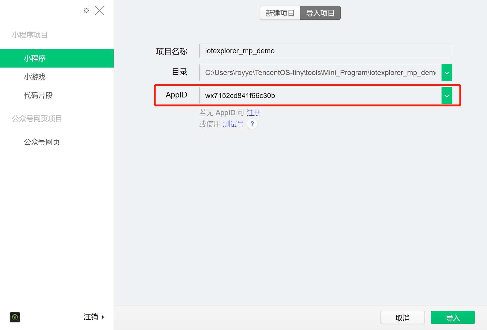

> 注：AppID可在小程序管理后台获取，本地调试可以先使用测试号

#### 1.2.3.2. 修改配置
在miniprogram/app.js里更新配置信息，参考[配置信息说明](#配置信息说明)
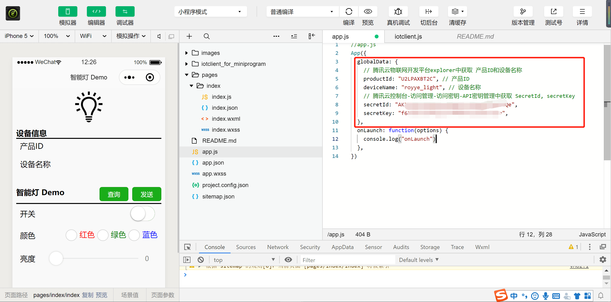

#### 1.2.3.3. 功能扩展
SDK支持的api参见iotclient.js，开发者可以基于案例进行功能扩展：TencentOS_tiny\tools\Mini_Program\iotexplorer_mp_demo\iotclient_for_miniprogram\iotclient.js

> 注：腾讯云暂时没有提供小程序端的API SDK，本案例的小程序SDK(iotclient_for_miniprogram)是基于[腾讯云的NodeJS SDK](https://github.com/TencentCloud/tencentcloud-sdk-nodejs/tree/master/tencentcloud/iotexplorer)移植过来的

### 1.2.4. 云开发方式（云函数）

> 更详细的云开发指南，请参见[官方的云开发快速指引](https://developers.weixin.qq.com/miniprogram/dev/wxcloud/basis/quickstart.html)

#### 1.2.4.1. 导入工程

在小程序开发工具中，导入云开发Demo项目：
TencentOS_tiny\tools\Mini_Program\iotexplorer_mp_cloudfunctions_demo

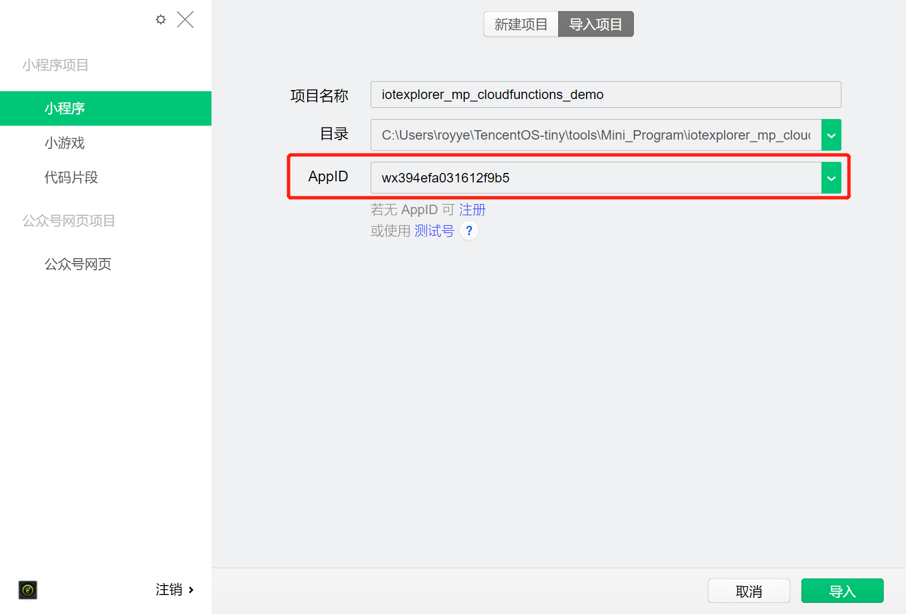

> 注：AppID可在小程序管理后台获取；测试号不支持云开发，必须申请小程序账号

#### 1.2.4.2. 开通云开发，创建环境

在使用云开发能力之前需要先开通云开发。在开发者工具工具栏左侧，点击 “云开发” 按钮即可打开云控制台、根据提示开通云开发、创建云环境。

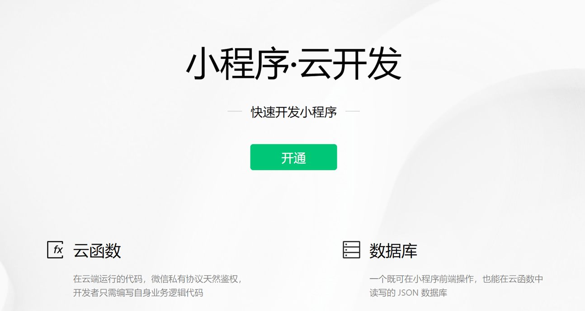

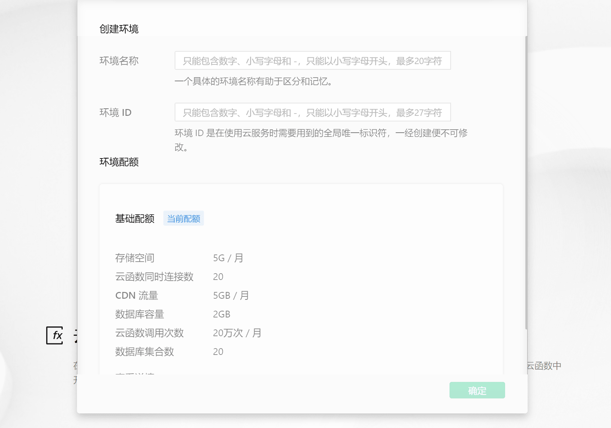

> 例如：填入环境名称为tos-demo, 环境ID为tos-demo。

#### 1.2.4.3. 部署云函数

云函数需要部署到云环境中才能生效。在云函数目录上，点击右键，选择"创建并部署：云端安装依赖（不上传node_modules）"

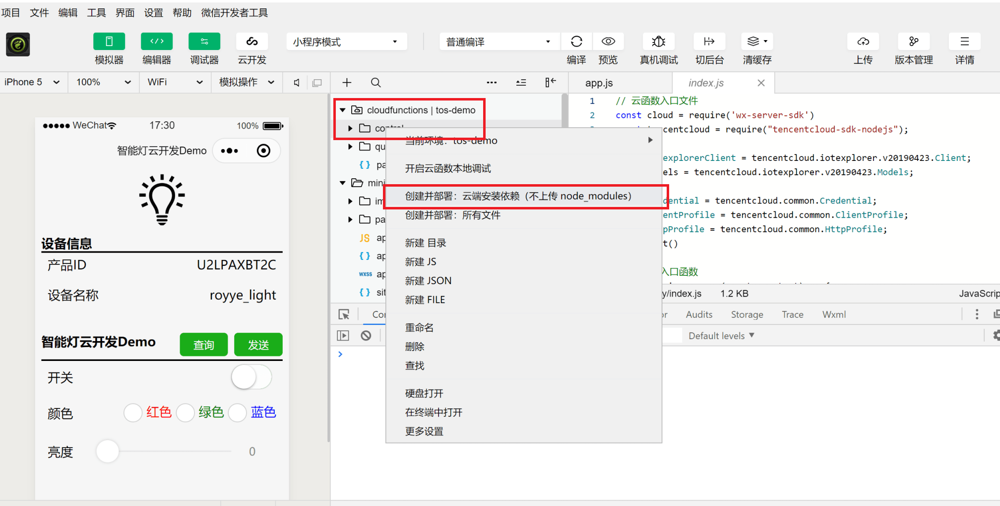

案例的cloudfunctions目录提供了两个云函数query和control，通过调用Iotexplorer的查询和控制接口，实现了对设备的查询和控制。

分别将control和query云函数部署到云环境中。部署成功后，可以在云开发控制台里看到对应的云函数。

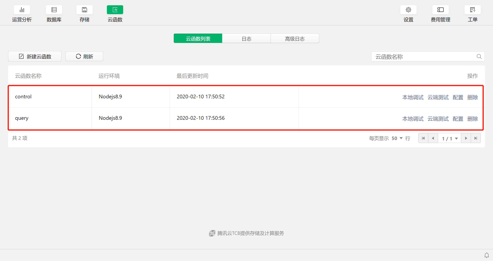

#### 1.2.4.4. 修改配置
在miniprogram/app.js里更新配置信息，参考[配置信息说明](#配置信息说明)
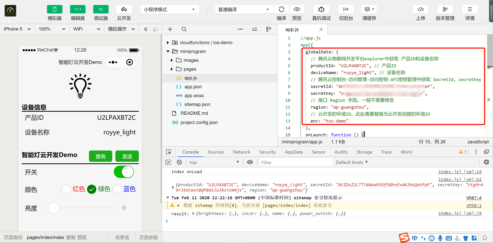

#### 1.2.4.5. 功能扩展：结合API 3.0 Explorer工具快速实现云函数  

腾讯云提供的[API 3.0 Explorer](https://cloud.tencent.com/document/api)，可以非常方便的生成 API SDK代码。只需要稍微修改，就可以直接在云函数中使用。

+ 自动生成API SDK代码
  + 进入[API 3.0 Explorer工具](https://console.cloud.tencent.com/api/explorer)
  + 左侧选择对应服务，如：“物联网开发平台”
  + 继续选择对应接口，如：“数据查询相关接口”-“获取设备属性数据”
  + 填写个人密钥和输入参数。参见[配置信息说明](#配置信息说明)
  + 使用在线调用，测试接口是否调用成功
  + 测试完成后，选择生成NodeJS代码。将代码拷贝，后续用于云函数中


+ 创建并实现云函数
  + 创建云函数query，将自动生成的NodeJS代码拷贝到云函数，并稍作修改即可使用。参考：[TencentOS-tiny\tools\Mini_Program\iotexplorer_mp_cloudfunctions_demo\cloudfunctions\query\index.js](https://github.com/Tencent/TencentOS-tiny/blob/master/tools/Mini_Program/iotexplorer_mp_cloudfunctions_demo/cloudfunctions/query/index.js)

  + 记得上传部署修改后的云函数

+ 调用云函数
  + 调用云函数的代码也很简单。参考：[TencentOS-tiny\tools\Mini_Program\iotexplorer_mp_cloudfunctions_demo\miniprogram\pages\index\index.js#queryDeviceData()](https://github.com/Tencent/TencentOS-tiny/blob/master/tools/Mini_Program/iotexplorer_mp_cloudfunctions_demo/miniprogram/pages/index/index.js)

```javascript
    // 调用云函数query
    wx.cloud.callFunction({
      name: 'query',
      data: queryData,
      success: res => {
        try {
          let deviceData = JSON.parse(res.result.Data)
          this.setData({
            deviceData: deviceData
          })
          console.log("result:", deviceData)
          wx.showToast({
            title: '调用成功',
          })
        } catch (e) {
          wx.showToast({
            icon: 'none',
            title: '调用失败',
          })
          console.log(res.result.Data, e)
        }
      },
      fail: err => {
        wx.showToast({
          icon: 'none',
          title: '调用失败',
        })
        console.error('[云函数] [iotexplorer] 调用失败：', err)
      }
    })  
```

### 1.2.5. 调试和发布
上文的步骤完成后，就可以对基本功能进行调试，如：查询和控制设备。

+ 本地调试。点击菜单栏的"编译"按钮进行编译，左侧模拟器中点击查询和发送按钮，下侧调试器中查看调试信息


+ 真机调试。点击菜单栏"真机调试"，手机微信扫描弹出的二维码，进入真机调试。可在手机小程序页面点击按钮进行调试。
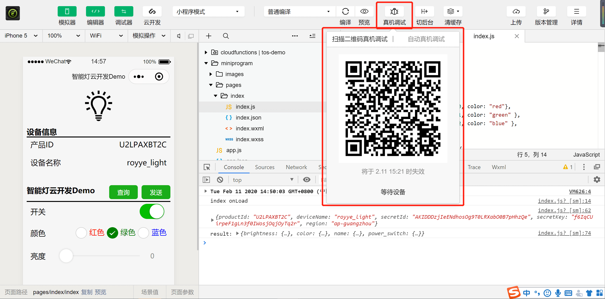
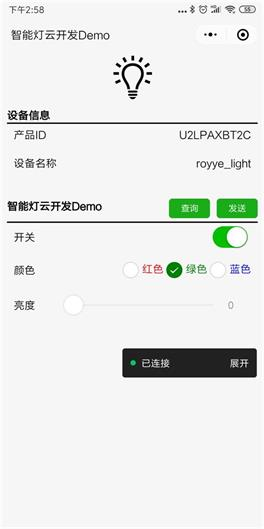

调试OK后，就可以发布小程序了
+ 上传代码。点击菜单栏“上传”，填写版本信息，上传开发版本到小程序管理后台
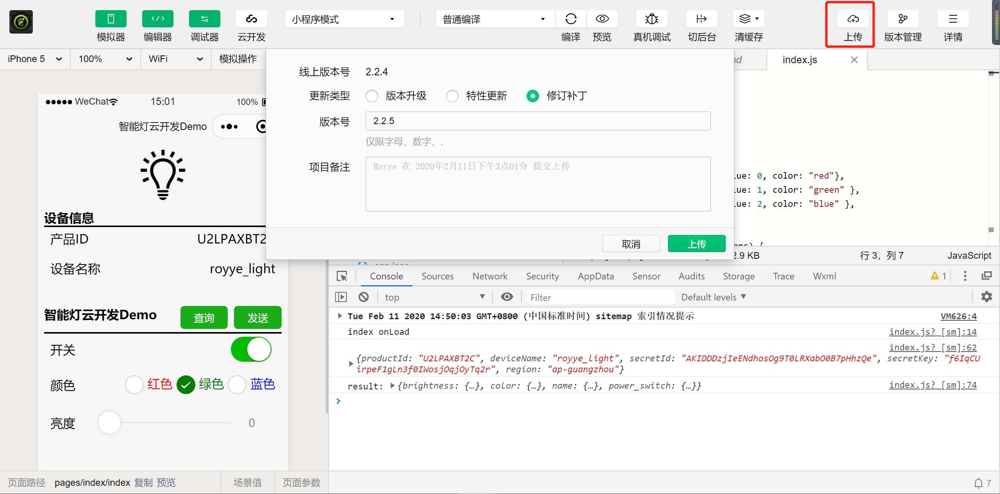

+ 发布版本。登录小程序管理后台，进入“管理”-“版本管理”。将开发版本提交审核，等待审核通过后，点击发布版本。

### 1.2.6. 配置信息说明
+ productId, deviceName

产品ID和设备名称。用于IotExplorer API接口调用的参数。在腾讯云控制台-物联网开发平台-产品开发-设备调试中，获取产品ID和设备名称

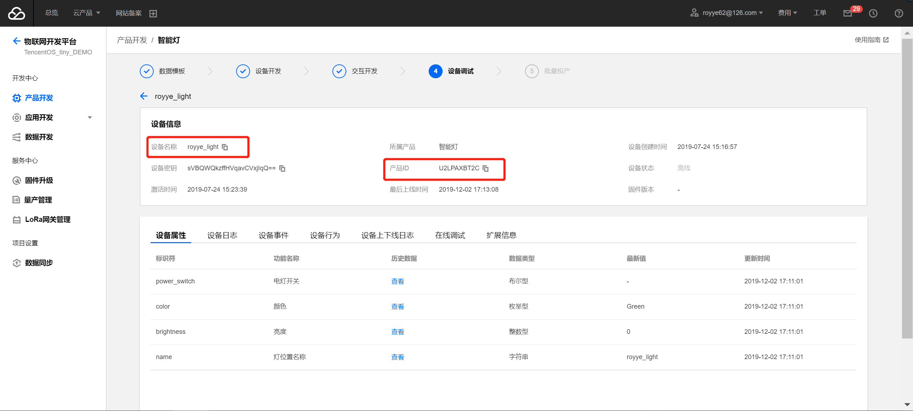

+ secretId, secretKey
  
腾讯云API密钥信息，用于IotExplorer API 接口调用的鉴权。在腾讯云控制台-访问管理-访问密钥-API密钥管理中，获取 secretId, secretKey

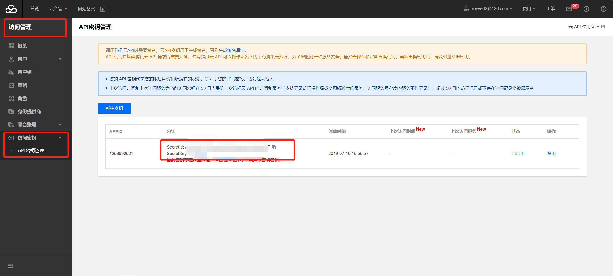

+ region

Region字段，接口服务的地域，填写"ap-guangzhou"即可

+ env

云开发的环境ID。填入云开发创建的环境ID

## 1.3. FAQ
### 1.3.1. 网络请求报错: reqeust:fail url not in domain list
 
报错信息:
````
https://iotexplorer.tencentcloudapi.com 不在以下 request 合法域名列表中，请参考文档：https://developers.weixin.qq.com/miniprogram/dev/framework/ability/network.html

{errMsg: "request:fail url not in domain list"}
````

解决方式：

+ 如果是本地调试，可以在本地设置中勾选`不校验合法域名`
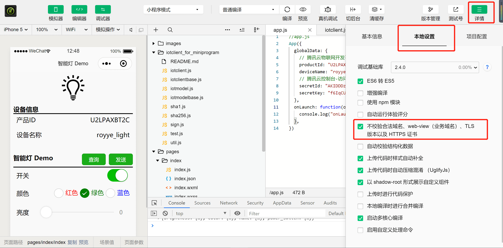

+ 如果是真机调试或发布小程序，则需要在小程序管理后台进行服务器域名配置：进入微信公众平台小程序后台 - 开发 - 开发设置 - 服务器域名 - 输入域名。参见[微信小程序添加服务器端接口域名](https://jingyan.baidu.com/article/ce09321bb6e9c12bff858f92.html)
  + 如果使用物联网开发平台 IoT Explorer，输入域名: `iotexplorer.tencentcloudapi.com`
  + 如果使用物联网通信平台 IoT Hub，输入域名：`iotcloud.tencentcloudapi.com`
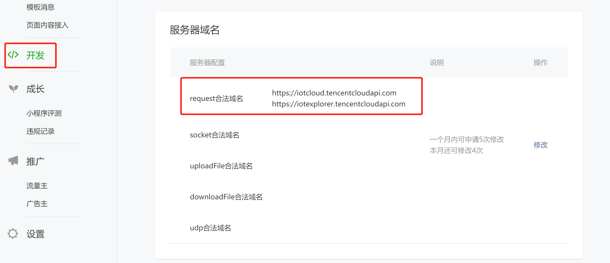

### 1.3.2. 云开发: 初始化错误 cloud init error
报错信息
````
cloud init error：{ errMsg: "invalid scope" }
````
首次开通云环境后，需等待大约 10 分钟方可正常使用云 API，在此期间官方后台服务正在做准备服务，如尝试在小程序中调用云 API 则会报 cloud init error：{ errMsg: "invalid scope" } 的错误

### 1.3.3. 云开发：云环境不存在 env not exists

报错信息：
````
Error: errCode: -404011 cloud function execution error | errMsg: cloud.callFunction:fail requestID , cloud function service error code -501000, error message [100004] env not exists;
````

+ 确定是否开通云开发并创建环境
+ 确定配置文件app.js中env字段是否和云开发中创建的云环境ID一致

### 1.3.4. 云开发：云函数不存在 Function not found
````
Error: errCode: -404011 cloud function execution error | errMsg: cloud.callFunction:fail requestID , cloud function service error code -504002, error message Function not found [query]; at cloud.callFunction api
````

+ 确认云函数是否部署到对应云环境

### 1.3.5. 可以接入第三方服务吗？

可以。只要是符合要求的服务，小程序都能访问。简单来说，有以下几个要求：必须使用https/wss请求，请求域名需要做备案，并带有可信任的SSL证书。详细参见[小程序网络能力使用说明](https://developers.weixin.qq.com/miniprogram/dev/framework/ability/network.html)
