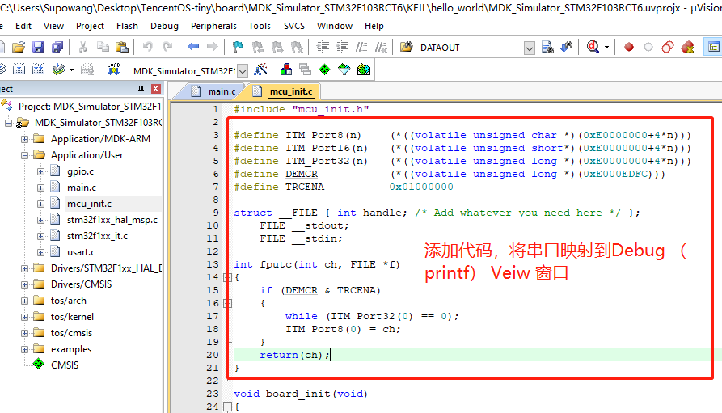
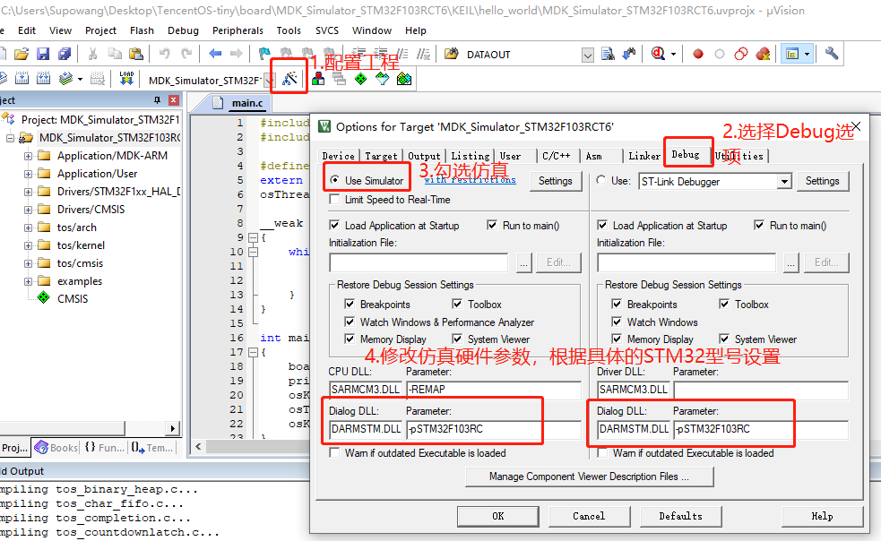
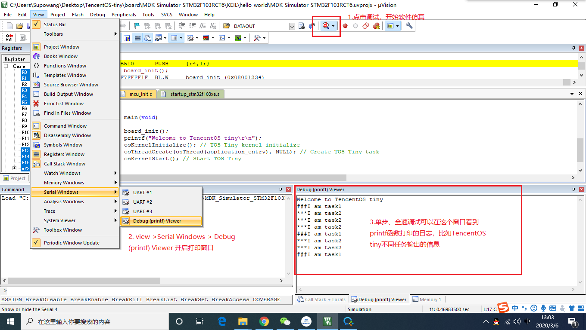

# 使用MDK软件全仿真调试体验TencentOS Tiny

有许多朋友想体验或者学习一下TencentOS Tiny内核，但是手上却没有合适的硬件，没关系！本文将教您如何使用MDK软件来仿真调试TencentOS Tiny内核。

参考工程连接：https://github.com/Tencent/TencentOS-tiny/tree/master/board/MDK_Simulator_STM32F103RCT6/KEIL/hello_world

我们首先在TencentOS Tiny官库上找到一个STM32工程，用MDK软件打开，修改printf 函数映射，如图所示：


需要添加的代码如下：

```
#include "stdio.h"

#define ITM_Port8(n)    (*((volatile unsigned char *)(0xE0000000+4*n)))
#define ITM_Port16(n)   (*((volatile unsigned short*)(0xE0000000+4*n)))
#define ITM_Port32(n)   (*((volatile unsigned long *)(0xE0000000+4*n)))
#define DEMCR           (*((volatile unsigned long *)(0xE000EDFC)))
#define TRCENA          0x01000000

struct __FILE { int handle; /* Add whatever you need here */ };
    FILE __stdout;
    FILE __stdin;
    
int fputc(int ch, FILE *f) 
{
    if (DEMCR & TRCENA) 
    {
        while (ITM_Port32(0) == 0);
        ITM_Port8(0) = ch;
    }
    return(ch);
}
```
添加完毕后，在MDK工程上打开option选项，选择debug选项开，调试方式选择User Simulator，并修改调试参数，如下图：


完成软件仿真参数配置后，就可以点击debug按钮开始调试了，打开调试窗口后，选择view->Serial windows->debug 就可以打开调试日志窗口了，如图，可以看到TencentOS Tiny内核的两个任务输出的日志信息。



