# 基于 TencentOS tiny 官方 EVB MX+开发板的 IAP

## 1. 什么是 IAP

以下内容引自正点原子《STM32F429 开发指南-HAL 库版本\_v1.1》第五十七章，如侵权请联系删除。

> ​ IAP（In Application Programming）即在应用编程，IAP 是用户自己的程序在运行过程中对 User Flash 的部分区域进行烧写，目的是为了在产品发布后可以方便地通过预留的通信口对产品中的固件程序进行更新升级。通常实现 IAP 功能时，即用户程序运行中作自身的更新操作，需要在设计固件程序时编写两个项目代码，第一个项目程序不执行正常的功能操作，而只是通过某种通信方式 (如 USB、USART) 接收程序或数据，执行对第二部分代码的更新；第二个项目代码才是真正的功能代码。这两部分项目代码都同时烧录在 User Flash 中，当芯片上电后，首先是第一个项目代码开始运行，它作如下操作：
> ​ 1）检查是否需要对第二部分代码进行更新
> ​ 2）如果不需要更新则转到 4）
> ​ 3）执行更新操作
> ​ 4）跳转到第二部分代码执行
> ​ 第一部分代码必须通过其它手段，如 JTAG 或 ISP 烧入；第二部分代码可以使用第一部分代码 IAP 功能烧入，也可以和第一部分代码一起烧入，以后需要程序更新时再通过第一部分 IAP 代码更新。
>
> ​ 我们将第一个项目代码称之为 Bootloader 程序，第二个项目代码称之为 APP 程序，他们存放在 STM32F429 FLASH 的不同地址范围，一般从最低地址区开始存放 Bootloader，紧跟其后的就是 APP 程序。

## 2. TencentOS tiny 的 IAP 程序

### 2.1 BootLoader 程序

​ 如第一章所言，一个 IAP 例程一般由 BootLoader 及 APP 两部分构成，其中 BootLoader 起引导板子启动并提供 APP 下载烧录选项。

​ 基于 TencentOS tiny 官方 EVB MX+开发板，提供了官方 IAP BootLoader 程序，对应的 keil 工程位于：

```
board\TencentOS_tiny_EVB_MX_Plus\KEIL\iap\bootloader
```

​ 与正常的应用程序编译烧写流程一致，双击打开 keil 工程后，将 BootLoader 烧写进开发板。

​ 按下复位键后，BootLoader 会直接进入加载并运行 APP 的流程。

​ 这里为了演示 IAP 流程，让 BootLoader 进入 APP 升级模式，具体的做法是按住板上 F2 按键的同时，再按下复位键：

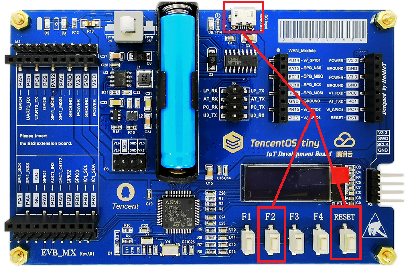

​ 将 microUSB（板上 USART2）接到电脑上，打开串口调试助手，并将波特率选为 115200，可以看到 BootLoader 的菜单：

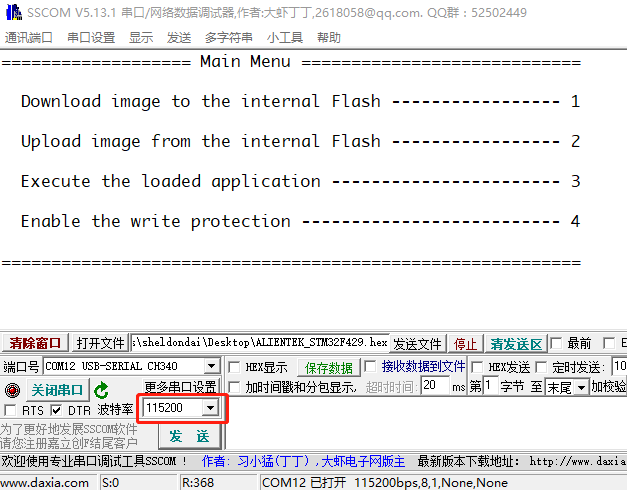

​ BootLoader 的四个菜单选项分别是：

1. 通过串口 ymodem 协议下载 APP 镜像到板子内部 FLASH

2. 通过串口 ymodem 协议上传板子内部 FLASH 上的 APP 镜像
3. 执行 APP
4. 使能内部 FLASH 写保护

## 2.2 APP 程序

​ 基于 TencentOS tiny 官方 EVB MX+开发板，提供了官方示例 APP 程序，由 hello world 示例修改而来，对应的 keil 工程位于：

```
board\TencentOS_tiny_EVB_MX_Plus\KEIL\iap\application
```

​ 因为 IAP 中的 APP 是由 BootLoader 来跳转执行的，BootLoader 只能跳转执行 bin 格式的 APP 程序，因此需要添加将 APP 程序转成 bin 格式的流程：

### 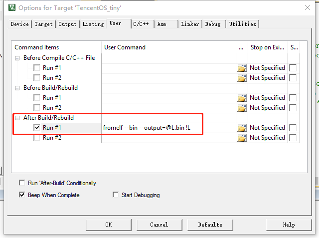

​ 同时，要确保 system_stm32l4xx.c 中的 VECT_TAB_OFFSET 宏被定义成 0x8000：

```
#define VECT_TAB_OFFSET  0x8000 /*!< Vector Table base offset field.
                                   This value must be a multiple of 0x200. */
```

​ 编译 application 程序，在 board\TencentOS_tiny_EVB_MX_Plus\KEIL\iap\application 目录下会生成 TencentOS_tiny.bin，这个就是在 IAP 升级中要传输并烧录进开发板的 APP 镜像。

## 3. IAP APP 升级演示

### 3.1 基于 xshell 与普通串口的 APP 升级

​ 因为 APP 传输到开发板上是通过 ymodem 协议，普通的串口调试工具没有集成 ymodem 协议，这里通过 xshell 来演示 APP 的 ymodem 协议。实际上，通过 SecureCRT 等其他集成有 ymodem 及串口协议的终端皆可。

​ 用 xshell 连接到开发板串口上，并按住开发板 F2 键同时复位开发板进入 BootLoader 升级模式，在 BootLoader 菜单提示下，xshell 中输入“1”进入 APP 下载及升级模式。

​ 此时开发板会进入等待串口通过 ymodem 发送 APP 的状态。在 xshell 的文件——传输——YMODEM(Y)——用 YMODEM 发送 (S)：

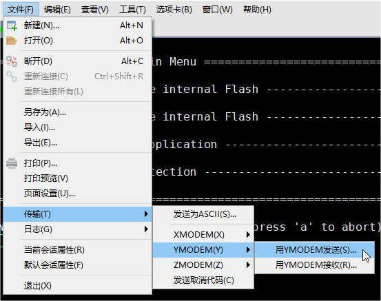

​ 在弹出的对话框中，选择 2.2 节中编译生成的 bin 格式的 APP：

```
board\TencentOS_tiny_EVB_MX_Plus\KEIL\iap\application\TencentOS_tiny.bin
```

​ 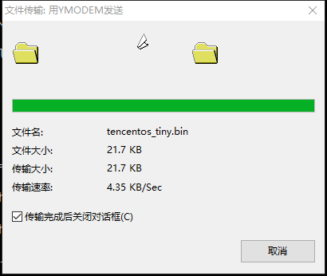

​ 开发板接收完毕后会将接收到的 APP bin 写入内部 FLASH，写入完成后会打印提示：

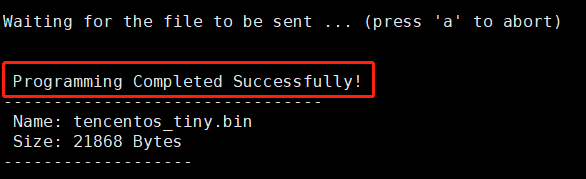

​ 此时 BootLoader 会再次进入菜单模式，在菜单模式下输入 3 即可执行刚刚写入的 APP bin：

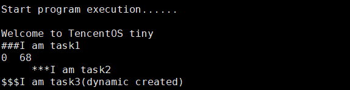

### 3.2 基于小程序与 BLE 透传串口的 APP 升级

​ 除了 3.1 节的传统串口升级，TencentOS tiny 官方另外提供了基于 BLE 透传串口的 IAP APP 升级配套小程序。

​ 这里基于 HC-08 蓝牙透传模块讲解如何使用小程序进行 IAP APP 升级。

​ 我假设你的 HC-08（或其他相似的蓝牙透传串口）波特率为 115200，如果不是，可以通过查阅相关产品资料手册将波特率修改为 115200；或者改动 BootLoader 及 application 中 USART2 的波特率为你的模块的波特率。

​ HC-08 与开发板的接线参考下图：

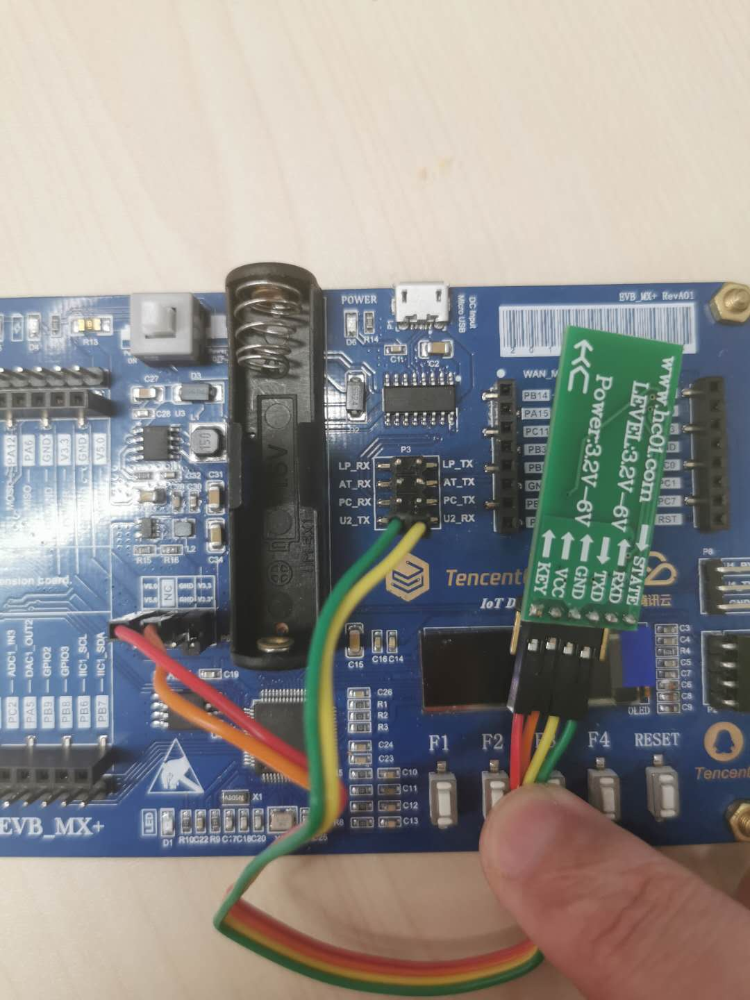

| HC-08 | EVB MX+ |
| ----- | ------- |
| RXD   | U2_TX   |
| TXD   | U2_RX   |
| GND   | GND     |
| VCC   | V5.0    |

​ 打开 tools\Mini_Program\iap 目录中的小程序，用微信扫码开始使用小程序：

1. 打开手机蓝牙

2. 搜索连接 HC-08 的蓝牙广播

   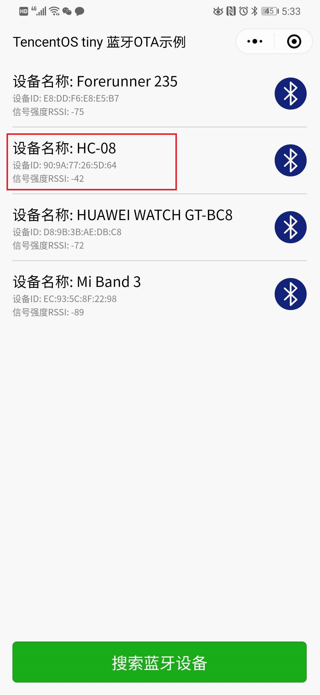

3. 按住 F2 复位开发板可以在小程序中的串口输出中收到开发板的 BootLoader 菜单

   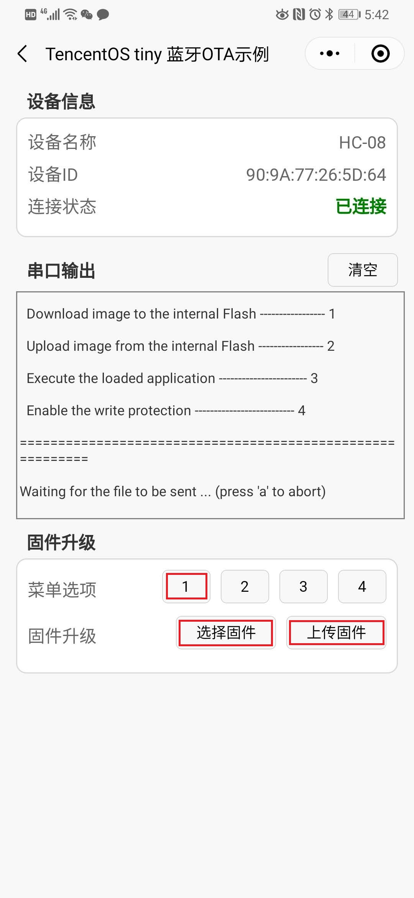

4. 在固件升级中，点击菜单选项“1”，再点击"选择固件"，通过文件传输助手选择 TencentOS_tiny.bin

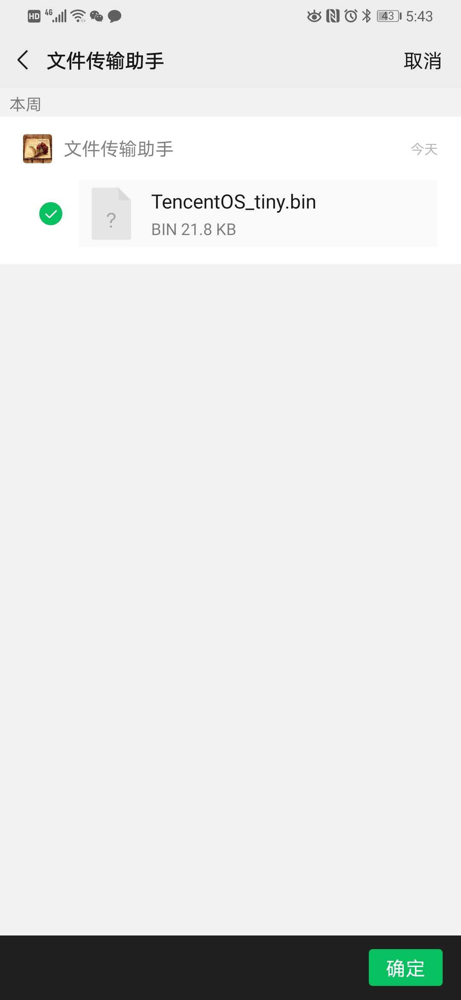

5. 点击“上传固件”，等待 APP 传输并烧写完毕：

   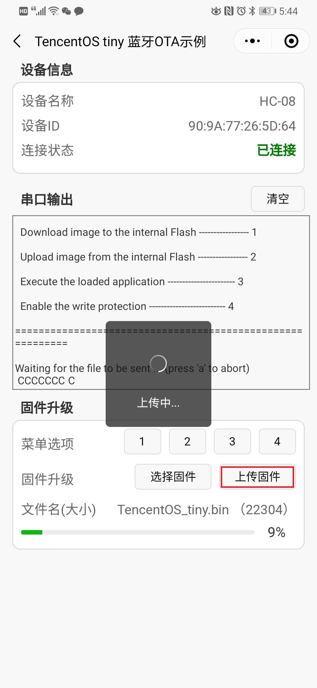

6. 等待镜像传输并烧写完毕后，在 BootLoader 的菜单选项下，点击菜单选项“3”执行刚才烧录的 APP：

   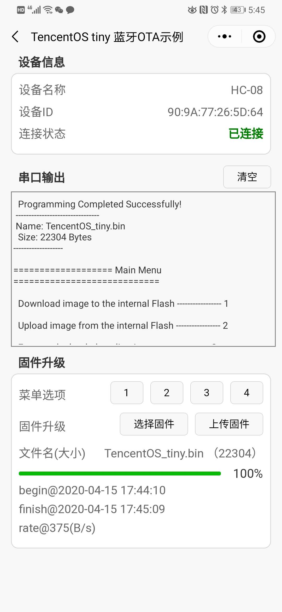

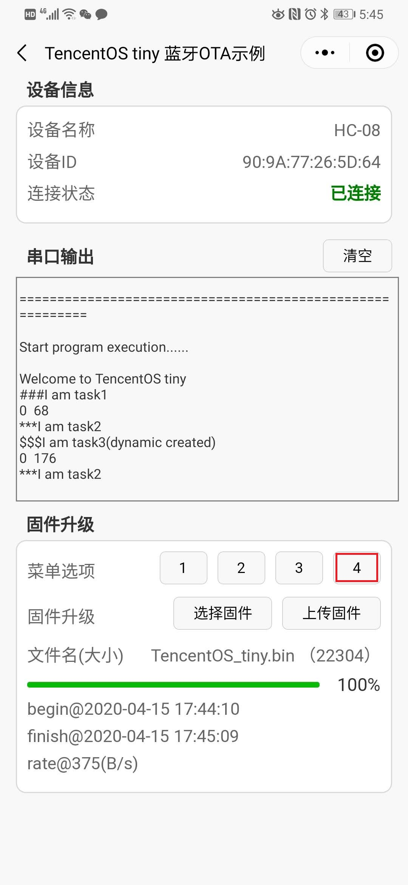
