# 1. TencentOS-tiny OTA

## 1.1. OTA 与 IAP

IAP 全称 In Application Programming，什么是在应用编程呢？

正常开发流程如下：

- 使用 Keil MDK 工具编写应用程序；
- 编译出.axf 可执行程序或者.bin 文件，或者.hex 文件；
- 使用 Keil MDK 工具直接烧录.axf 文件到 STM32 Flash 中，或者使用类似 STM32CubeProg 之类的软件烧录.bin 文件到 STM32 Flash 中；
- 复位，单片机从 Flash 起始地址处读取程序并执行；

当产品开发完成用于生产后，通常不会再引出下载器接口给用户，所以也就无法连接各种各样的下载器，更别说用 Keil 或者 STM32CubeProg 这些工具下载程序，如果发现应用程序有漏洞，或者要修改部分功能，都已经无法完成。

### 1.1.1. IAP 设计思想

IAP 巧妙的解决了这个问题，即在应用程序正常工作的时候，还可以接收新的固件并烧录到 Flash 中。

- 应用程序如何接收新的固件？

一般产品设计时都会留一个用于打印日志信息的串口，可以直接利用此串口来接收 PC 发送到新固件，传输协议大多都采用 Y-Modem 协议。

- 接收之后的新固件存放到哪里？

固件大小一般都有几十 KB 或者上百 KB，应用程序接收到新的固件之后，如果是以数组的形式暂存在 RAM 空间中，不仅会浪费 RAM 空间，而且容易发生固件数据丢失，所以直接存储到空闲的 Flash 空间中是最好的方式。

eg. 官方开发板使用的芯片是 STM32L431RCT6，Flash 空间有 256KB，如果应用程序的大小只有 100KB，那么接收进来的新固件就可以存放在剩余的 156KB 空间中。

同时会人为的对 Flash 划分分区，也就是对某一段地址空间起个名字，如下图：

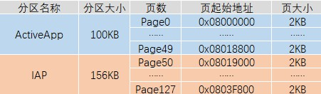

- 如何将老固件替换为为新固件？

上电之后 CPU 会从 Flash 的起始地址处读取数据开始执行，这点无法改变，正在运行的应用程序如果进行自己擦除自己的操作，设备直接变砖。

bootloader 可以完美的解决这一问题，即写一小段应用程序，放在 Flash 的起始位置处，使得每次上电之后最先运行 bootloader，完成两个功能：

- 检查升级标志，是否有新的固件被下载到 IAP 分区中；
- 如果无升级标志，则跳转到 ActiveAPP 分区，开始执行应用程序；
- 如果有升级标志，则先将 IAP 分区中的固件拷贝到 ActiveAPP 分区中，然后跳转到 ActiveAPP 分区，开始执行新的应用程序；

加入 bootloader 之后，整个 Flash 的分区情况如下：

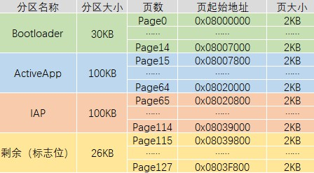

### 1.1.2. OTA 设计思想

在 IAP 的这种设计思想之上，因为当前的物联网设备都已经具备基本的网络通信功能，所以无需通过串口传输新的固件，直接通过网络传输新的固件即可，称之为 OTA IAP(Over The Air In Application Programming)，也就是平常所说的空中升级，简称 OTA。

## 1.2. OTA 组件概述、特性及优势

TencentOS-tiny 中提供的 OTA 组件完全开源免费，相较于其他的 OTA 功能，TencentOS-tiny OTA 组件提供更小的差分升级包，耗用更少的传输流量，占用更小的内存空间，提供更可靠的升级服务。

TencentOS-tiny OTA 组件有以下的特性：

- 传输差分升级包，而不是整个固件
- 灵活的分区表功能
- 支持原地升级
- 支持乒乓升级，可以在升级中断的情况下进行版本回滚
- 支持通过 HTTP 从自建服务器拉取固件
- 支持从腾讯云平台进行统一的固件拉取和管理

## 1.3. OTA 组件开发调试推荐流程

OTA 的整个流程调试较复杂，如果分步来做会比较容易：

(1) 调试 bootloader 是否可以正常读取分区表信息；

(2) 调试 bootloader 是否可以正常跳转到 Active APP;

(3) 调试 bootloader 是否直接可以根据 patch 包进行升级;

(4) 调试 Active APP 是否可以通过网络拉取 patch 升级包并下载到 OTA 分区;

(5) 综合调试。

# 2. 分区规划及分区表的生成、烧录

## 2.1. 分区规划

TencentOS-tiny 支持两种升级方式，两种升级方式对应有不同的分区表

原地升级方式中，bootloader 直接根据旧固件+patch 升级包生成新的固件，一旦开始升级，无论升级成功与否都无法回滚到上一个版本，主要有五个分区：

- Bootloader 分区
- Active APP 分区：当前正在运行的固件存放分区；
- OTA 分区：新固件存放分区；
- KV 分区：记录系统升级中的一些环境变量；
- 分区表：存放分区表（固定大小 32B，一般放在 Flash 的最后一个扇区中）

乒乓升级方式中，bootloader 在升级之前会将原来的固件拷贝一份，一旦开始升级，无论新固件升级成功与否，都可以回滚到上一个版本，主要有六个分区：

- Bootloader 分区
- Active APP 分区：当前正在运行的固件存放分区；
- **Backup 分区**：备份当前正在运行的固件；
- OTA 分区：新固件存放分区；
- KV 分区：记录系统升级中的一些环境变量；
- 分区表：存放分区表（固定大小 32B，一般放在 Flash 的最后一个扇区中）

在实际应用中，两种方式的选择要根据设备需求，设备 Flash 空间大小，设备 Flash 扇区大小综合考虑。

本文接下来如无特殊说明，都是以第一种方式（原地升级）为例，官方板的 Flash 大小为 256KB，可以如下分区：

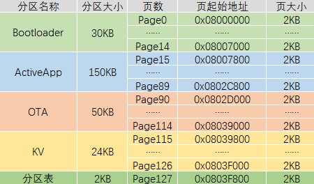

## 2.2. 分区表工具的使用方法

TencentOS-tiny 源码中提供了一个生成分区表的命令行工具，需要先使用 gcc 编译，没有 gcc 环境可以安装 MinGW。

### 2.2.1. 编译

进入`\components\ota\tools\partition_table`目录，执行 make 命令开始编译，编译之后进入到当前目录下的`out\target`即可看到工具 `ptbl.exe`：

```bash
cd out/target/
```

该工具有如下参数：

- `-h`：打印帮助信息
- `-p <ip/pp>`：选择升级方式，ip 或者 pp
- `-a <start,end>`：Active APP 分区的起始和结束地址
- `[-b <start,end>]`：Backup 分区的起始和结束地址，选了 pp 方式才需要
- `-o <start,end>`：OTA 分区的起始和结束地址
- `-k <start,end>`：KV 分区的起始和结束地址
- `-v <major>.<minor>`：初识固件版本号

为官方板生成分区表文件的命令如下：

```bash
./ptbl.exe -p ip -a 0x08007800,0x0802D000 -o 0x0802D000,0x08039800 -k 0x08039800,0x0803F800 -v 0.1 ptbl.bin
```

运行之后即可在当前目录下看到生成的分区表文件`ptbl.bin`。

## 2.3. 分区表烧录方法

生成的分区表文件`ptbl.bin`可以通过 STM32CubeProg 直接烧录到 Flash 中，按照之前规划的分区，烧录位置为 0x0803F800，烧录方法如下：

(1) 使用下载器连接开发板到 PC，打开 STM32CubeProg 工具，点击 Connect 连接到开发板：

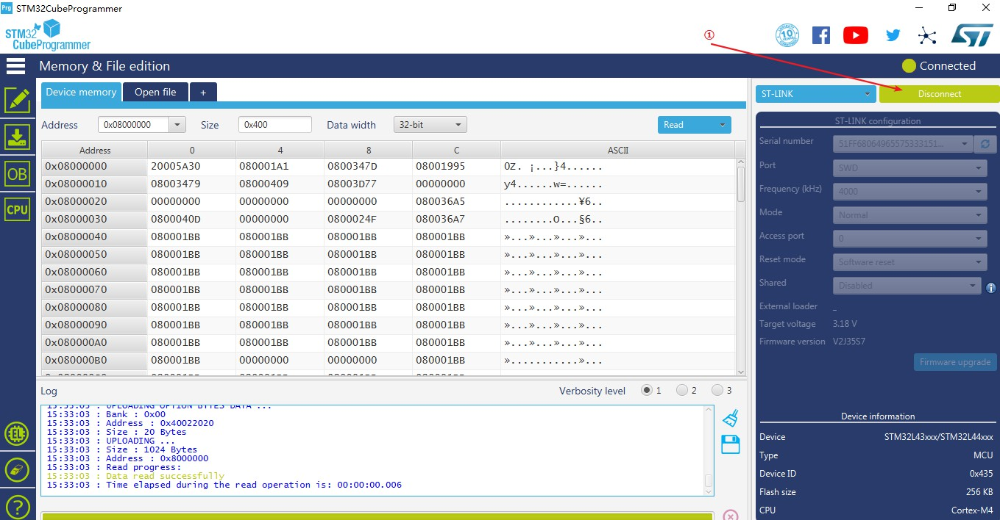

(2) 如果是**第一次使用 OTA**，点击左侧的烧录按钮，点击全片擦除：

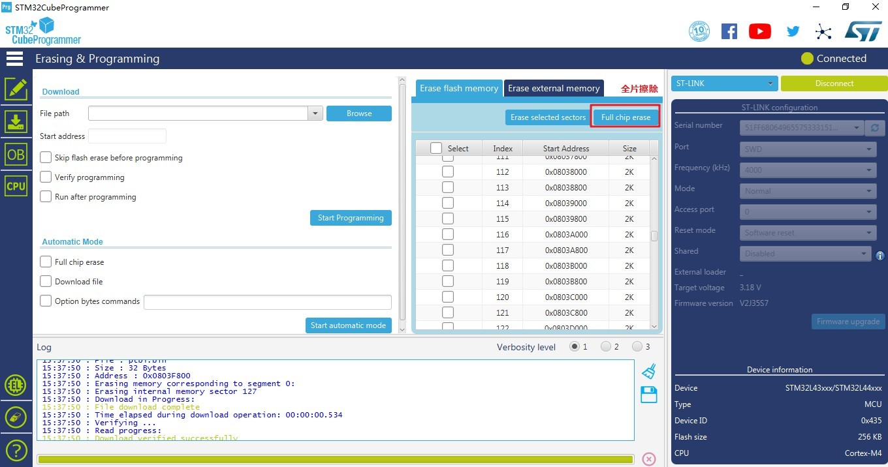

> 第一次使用的时候，KV 分区中的数据不确定，可靠起见直接选择全片擦除。

(3) 点击左侧的烧录按钮，选择刚刚生成的`ptbl.bin`，下载地址填写 0x0803F800，点击烧录：

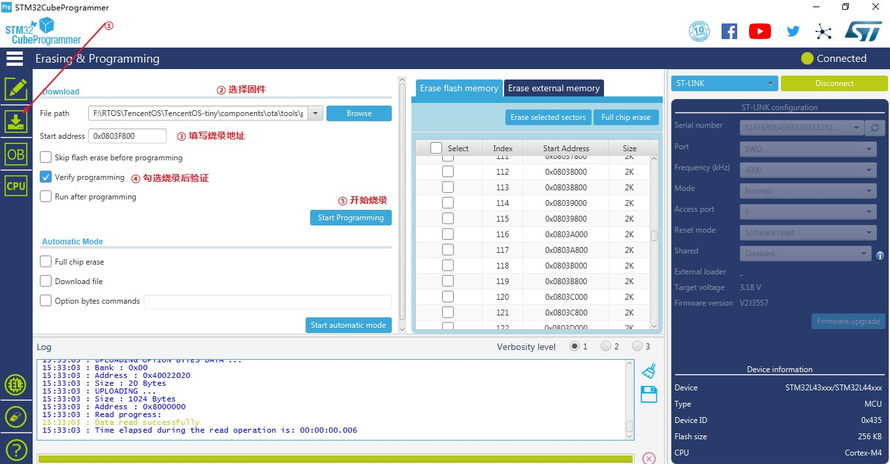

出现烧录成功弹窗即可。

# 3. 测试 Bootloader 程序

进入`board\TencentOS_tiny_EVB_MX_Plus\KEIL\ota`目录，打开官方提供的 bootloader 示例工程：`ota_bootloader_recovery`。

bootloader 其实是一个裸机程序，在 main 函数中主要有三部分，分别对应三个功能：

- 读取分区表
- 根据 patch 包进行升级
- 跳转到 Active APP 分区开始执行

接下来将完成 1.3 节所给出的 OTA 组件开发调试推荐流程前三步。

## 3.1. 测试 bootloader 是否可以读取分区表

首先需要指定分区表地址：

```c
uint32_t partition_addr = 0x0803f800;
```

完善初始化环境变量的代码，在初始化之后手动添加打印分区表的代码，最后的 while(1) 用于停止程序，防止进行后面的功能：

```c
    if ((ret = ota_env_init(OTA_UPDATE_IN_POSITION, partition_addr, &stm32l4_norflash_onchip_drv_ota, &stm32l4_norflash_onchip_prop_ota)) != OTA_ERR_NONE) {
        printf("env init failed!OTA errcode = %d\n", ret);
        return -1;
    } else {
		printf("env init successfully!\r\n");
		printf("+-------------------------+\r\n");
		printf("|Active APP |  0x%08x |\r\n", ota_partition_start(OTA_PARTITION_ACTIVE_APP));
		printf("|   OTA     |  0x%08x |\r\n", ota_partition_start(OTA_PARTITION_OTA));
		printf("|   KV      |  0x%08x |\r\n", ota_partition_start(OTA_PARTITION_KV));
		printf("| Version   |      %d.%d    |\r\n", ota_partition_init_version_get().major, ota_partition_init_version_get().minor);
		printf("+-------------------------+");
	}

	while(1);
```

修改程序编译地址和大小，与 Bootloader 分区的划分相对应：

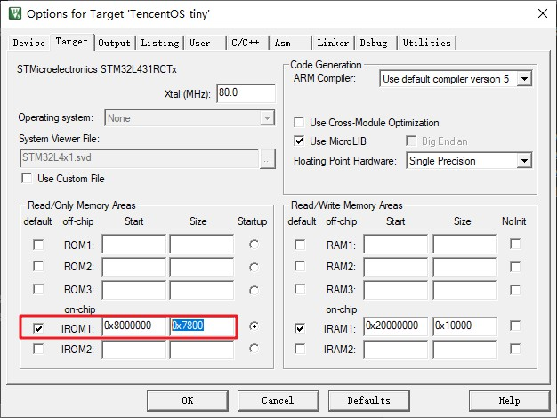

编译程序。

编译成功之后修改下载设置，选择扇区擦除方式、设置程序烧录起始地址、设置程序烧录大小，同样与 bootloader 分区的划分相对应：

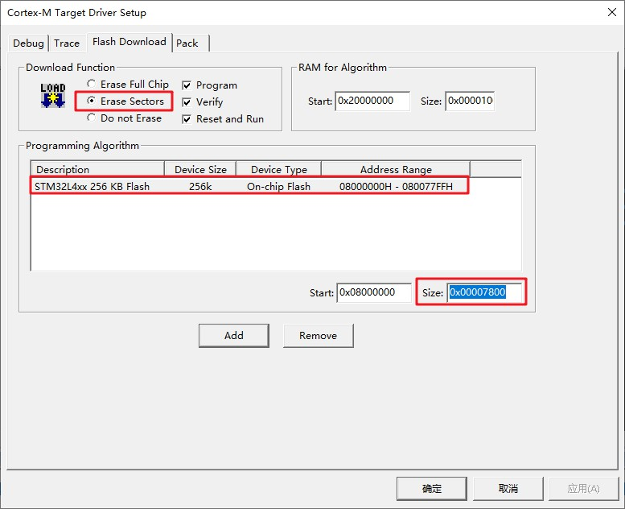

下载程序，在串口助手中观察输出：

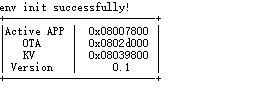

## 3.2. 测试 bootloader 是否可以跳转到 Active APP 分区

打开和 bootloader 在一个目录下的 app 工程：`ota_application_download_through_http`。

目前我们只是测试 bootloader 是否可以跳转过来执行此程序，所以如图所示修改代码，不要触发 OTA 固件拉取功能：

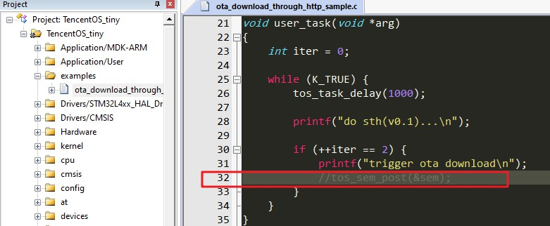

另外，因为此程序被烧录到 Active APP 分区，是从 Active APP 分区的起始地址开始运行的，所以需要修改中断向量表的偏移地址，如图：

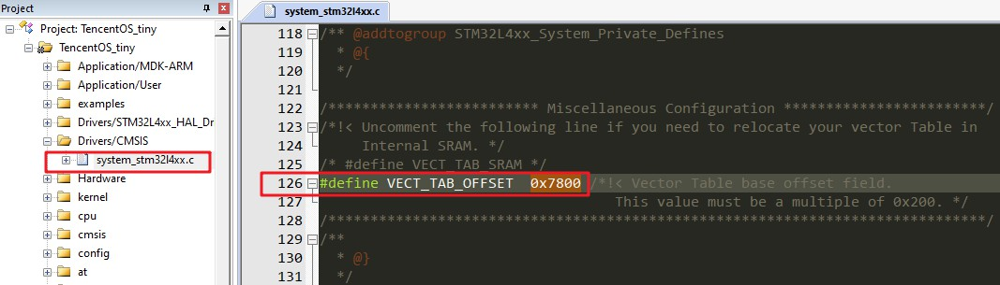

同样修改程序编译的起始地址和大小，与规划的 Active APP 分区信息相对应：

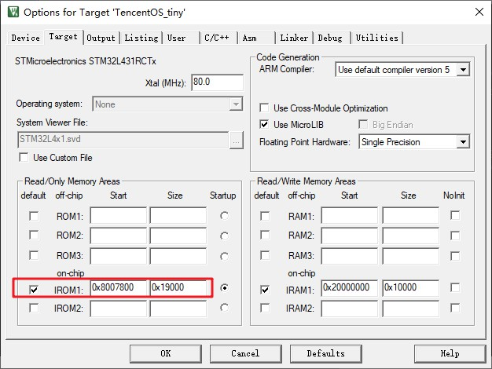

编译程序。

编译成功之后修改下载设置，烧录到 Actice APP 分区中：

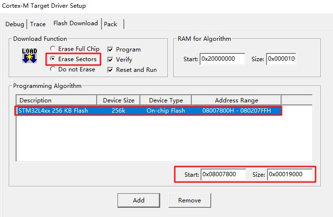

最后再修改 bootloader 程序，屏蔽 while(1)，屏蔽 OTA 固件升级功能，开启跳转功能：

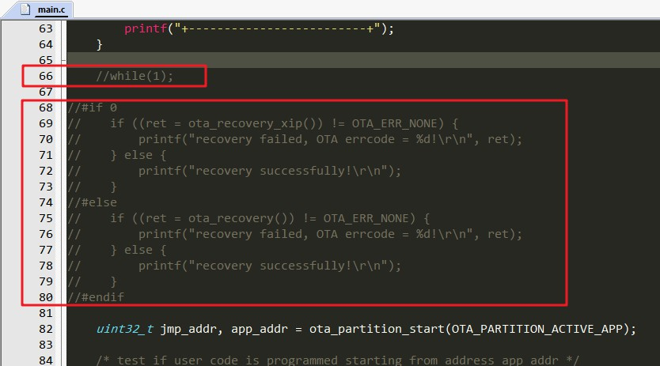

再次编译，下载 bootloader，复位开发板，查看串口助手中的输出，可以看到 bootloader 成功跳转到 Actice APP 开始执行：

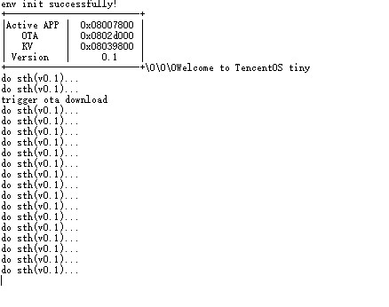

## 3.3. 差分 patch 包生成方法

### 3.3.1. 准备老固件和新固件

官方示例工程已经在 MDK 中配置编译后生成.bin 固件，如图：

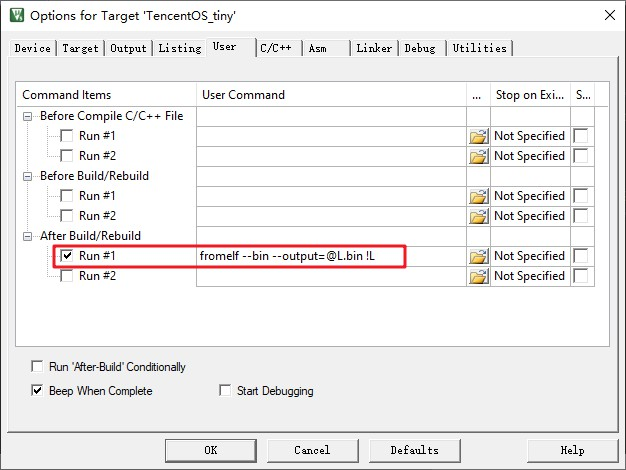

编译之后会在工程目录下生成 TencentOS_tiny.bin 文件，拷贝一份出来，重命名为:TencentOS_tiny_0_1.bin，表示这是 0.1 版本的固件。

修改 app 工程，将打印信息中的 0.1 改为 0.2，以验证是否升级成功：

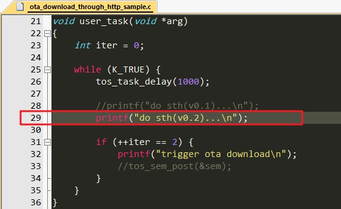

重新编译，生成新固件 TencentOS_tiny.bin，同样拷贝一份，重命名为：TencentOS_tiny_0_2，表示这是 0.2 版本的固件。

### 3.3.2. 差分升级包生成工具的使用

> 编译此工具同样需要 gcc 环境。

进入`\components\ota\tools\diff`目录，执行 make 命令开始编译，编译之后进入到当前目录下的`out\target`即可看到工具 `diff.exe`：

```bash
cd out/target/
```

该工具有如下参数：

- `-h`：打印帮助信息
- `-v`：打印更多信息
- `-s`：<待定...>
- `-b <n>`：指定扇区大小，单位：字节 Byte
- `-n <major>.<minor>`：新的固件版本号
- `-o <major>.<minor>`：旧的固件版本号

将 3.3.1 节准备的两个固件拷贝到当前工具所在目录下。

根据前面准备的两个新旧固件，制作差分升级包的命令如下：

```bash
./diff.exe -v -b 2048 -n 0.2 -o 0.1 TencentOS_tiny_0_1.bin TencentOS_tiny_0_2.bin patch.bin
```

运行之后即可在当前目录下看到生成的差分升级包`patch.bin`。

## 3.4. 测试 bootloader 是否可以根据 patch 进行升级

使用 STM32CubeProg 直接将差分升级包 patch.bin 下载到 OTA 分区：

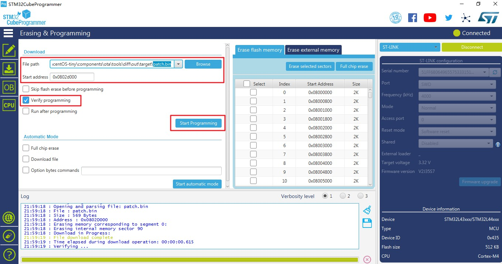

下载成功后，因为 bootloader 通过检测 KV 分区中的环境变量 new_version 来判断是否有新的固件，但是环境变量在 app 程序拉取固件成功之后才会设置，所以我们手动在 bootloader 中来设置此环境变量。

在 main.c 中引入 KV 的头文件：

```c
#include "tos_kv.h"
```

在环境变量初始化代码之后，升级代码之前添加如下的代码：

```c
ota_img_vs_t new_version;
new_version.major = 0;
new_version.minor = 2;

tos_kv_set("new_version", &new_version, sizeof(ota_img_vs_t));
```

添加之后编译，下载，在串口助手中查看输出：

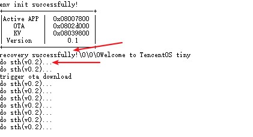

可以看到 bootloader 成功根据 patch 差分包和旧的固件，还原出了新的固件并成功升级。

# 4. 使用 HTTP 方式获取固件并升级

TencentOS-tiny OTA 组件支持使用 HTTP 协议拉取差分升级 patch 包，并烧写到 OTA 分区中。

## 4.1. 准备 HTTP 服务器

HTTP 服务器的选择非常多，常用选择有：

- 在 Windows 上使用类似 MyWebServer 的小工具开启 HTTP 服务
  - 优点：简单方便，用于测试
  - 缺点：无公网 ip，只能在同一个局域网内被访问

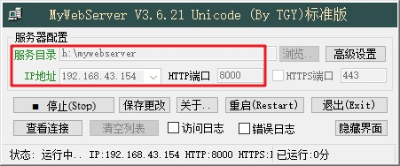

- 在云服务器上安装类似 Nginx 的工具，开启 HTTP 访问
  - 优点：性能强劲、有公网 ip、支持高并发（大量设备同时开机拉取固件）
  - 缺点：安装过程较复杂

除了这两种方式外，还有很多的方式可供选择，只需要开启 HTTP 服务即可，本文中我使用第一种方式。

开启之后将第 3 步中生成的差分升级固件 patch.bin 上传/复制到HTTP服务目录中，然后使用浏览器访问`http://<已经开启HTTP服务PC的ip>:<HTTP服务端口>/patch.bin`，测试正常获取之后方可进行后续操作。

> 开启 HTTP 服务之后记得关闭各种防火墙，比如 Win10 网络防火墙，云服务器安全组等。

## 4.2. HTTP 获取固件并升级

(1) 使用 STM32CubeMX Prog 全片擦除，烧写分区表到 0x0803f800;

(2) 修改 bootloader 程序，去除手动设置 new_version 环境变量代码，编译，下载，**不要复位**:

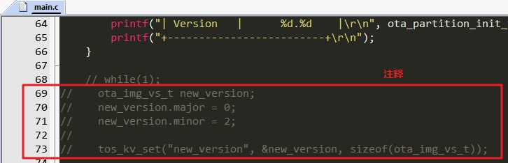

(3) 修改 Actice APP 工程 (`ota_application_download_through_http`)，开启 HTTP 固件拉取和升级功能：

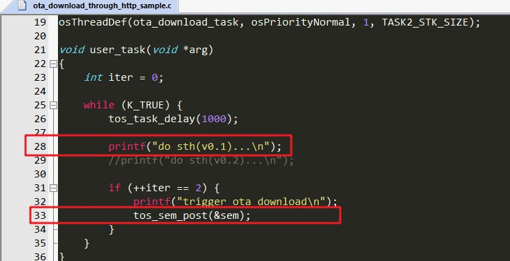

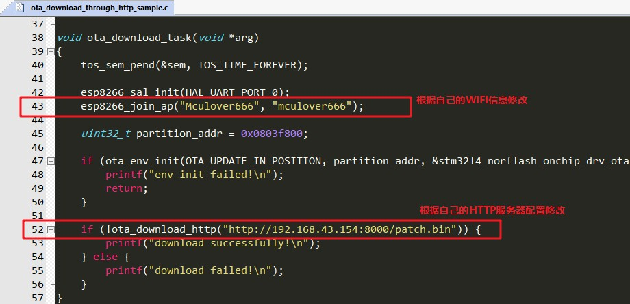

修改之后编译，下载。

特别注意，**此时 0.1 版本的程序已经被我们修改，所以之前生成的 patch 包无法完成升级**，重新在 0.1 版本的基础上修改处 0.2 版本的程序，并制作 patch 包。

重复一遍之前的制作流程即可：

- ① 将当前固件拷贝出来，重命名为`TencentOS_tiny_0_1.bin`;
- ② 修改打印提示，表示这是 0.2 版本的程序：

```c
printf("do sth(v0.2)...\n");
```

- ③ 将新固件拷贝出来命名为`TencentOS_tiny_0_2.bin`;
- ④ 使用 diff 命令行工具或者可视化工具制作差分升级包 patch.bin；
- ⑤ 将制作出的差分升级包拷贝/上传到HTTP服务器目录；

此时，一切准备就绪，复位设备，即可在串口助手中看到 OTA 的升级状况：

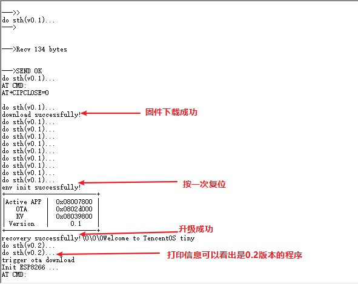
