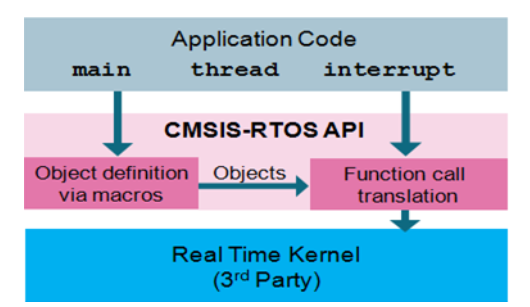

# 1. CMSIS-RTOS API是什么
CMSIS-RTOS是用于实时操作系统（RTOS）的一层通用API，它提供了一套标准的API接口，可以移植到各种各样的RTOS上，使得上层的软件、中间件、库以及其他组件在不同的RTOS之上都可以正常工作。

这套API表现为两个文件：cmsis-os.h和cmsis-os.c，在TencentOS-tiny中如下。

- 基于TencentOS-tiny的CMSIS-RTOS API v1.02版本实现：
  - `cmsis_os.h`
  - `cmsis_os.c`
- 基于TencentOS-tiny的CMSIS-RTOS API v2.1.3版本实现：
  - `cmsis_os2.h`
  - `cmsis_os2.c`

CMSIS-RTOS API的整体架构如下图：

CMSIS-RTOS API官方参考文档链接：[https://www.keil.com/pack/doc/CMSIS/RTOS/html/index.html](https://www.keil.com/pack/doc/CMSIS/RTOS/html/index.html/)

# 2. CMSIS-RTOS API列表
下面列出了 CMSIS-RTOS API <font color="red">v1.02</font> 版本提供的所有API。

CMSIS-RTOS 所有API使用的错误码（cmsis-os.h）：
```c
typedef enum {
    osOK                    =     0,       ///< function completed; no error or event occurred.
    osEventSignal           =  0x08,       ///< function completed; signal event occurred.
    osEventMessage          =  0x10,       ///< function completed; message event occurred.
    osEventMail             =  0x20,       ///< function completed; mail event occurred.
    osEventTimeout          =  0x40,       ///< function completed; timeout occurred.
    osErrorParameter        =  0x80,       ///< parameter error: a mandatory parameter was missing or specified an incorrect object.
    osErrorResource         =  0x81,       ///< resource not available: a specified resource was not available.
    osErrorTimeoutResource  =  0xC1,       ///< resource not available within given time: a specified resource was not available within the timeout period.
    osErrorISR              =  0x82,       ///< not allowed in ISR context: the function cannot be called from interrupt service routines.
    osErrorISRRecursive     =  0x83,       ///< function called multiple times from ISR with same object.
    osErrorPriority         =  0x84,       ///< system cannot determine priority or thread has illegal priority.
    osErrorNoMemory         =  0x85,       ///< system is out of memory: it was impossible to allocate or reserve memory for the operation.
    osErrorValue            =  0x86,       ///< value of a parameter is out of range.
    osErrorOS               =  0xFF,       ///< unspecified RTOS error: run-time error but no other error message fits.
    os_status_reserved      =  0x7FFFFFFF  ///< prevent from enum down-size compiler optimization.
} osStatus;
```
CMSIS-RTOS API一些可选项控制是否开启（cmsis-os.h）：
```c
#define osFeature_MainThread   1       ///< main thread      1=main can be thread, 0=not available
#define osFeature_Pool         1       ///< Memory Pools:    1=available, 0=not available
#define osFeature_MailQ        1       ///< Mail Queues:     1=available, 0=not available
#define osFeature_MessageQ     1       ///< Message Queues:  1=available, 0=not available
#define osFeature_Signals      0       ///< maximum number of Signal Flags available per thread
#define osFeature_Semaphore    30       ///< maximum count for \ref osSemaphoreCreate function
#define osFeature_Wait         0       ///< osWait function: 1=available, 0=not available
#define osFeature_SysTick      1       ///< osKernelSysTick functions: 1=available, 0=not available
```


## 2.1. 内核信息和控制（Kernel information and control）

|API|描述|
|:---:|:---:|
|osKernelInitialize|初始化RTOS内核|
|osKernelStart|启动RTOS内核|
|osKernelRunning|Query if the RTOS kernel is running|
|osKernelSysTick (可选)|Get RTOS kernel system timer counter|
|osKernelSysTickFrequency (可选)|RTOS kernel system timer frequency in Hz|
|osKernelSysTickMicroSec (可选)|Convert microseconds value to RTOS kernel system timer value|

- `osKernelInitialize`
```c
osStatus osKernelInitialize(void);
```
返回值：status code

- `osKernelStart`
```c
osStatus osKernelStart(void);
```
返回值：status code

- `osKernelRunning`
```c
int32_t osKernelRunning(void);
```
返回值：0表示RTOS未启动，1表示RTOS已经启动

- `osKernelSysTick`
```c
uint32_t osKernelSysTick(void);
```
返回值：RTOS内核系统当前的时间

## 2.2. 线程管理（Thread management）

>`##`连接符的作用是连接两个字符串，合为一个字符串。

CMSIS-RTOS API 存放线程参数管理的结构体如下：
```c
typedef struct os_thread_def {
    char           *name;       ///< Thread name
    os_pthread      pthread;    ///< start address of thread function
    osPriority      tpriority;  ///< initial thread priority
    uint32_t        instances;  ///< maximum number of instances of that thread function
    k_stack_t      *stackbase;  ///< base address of task
    uint32_t        stacksize;  ///< stack size requirements in bytes; 0 is default stack size
    k_timeslice_t   timeslice;  ///< timeslice
    k_task_t       *task;
} osThreadDef_t;
```

CMSIS-RTOS API 定义线程的宏如下：
```c
#define osThreadDef(name, priority, instances, stacksz)  \
    k_task_t task_handler_##name; \
    k_stack_t task_stack_##name[(stacksz)]; \
    const osThreadDef_t os_thread_def_##name = \
        { #name, (os_pthread)(name), (osPriority)(priority), (instances), \
        (&((task_stack_##name)[0])), (stacksz), ((k_timeslice_t)0u), (&(task_handler_##name)) }
```
>宏定义中的 instances 表示基于此任务参数，创建出几个任务实例，比如instances为2，则会创建出两个任务。

CMSIS-RTOS API定义的获取线程参数结构体的宏如下：
```c
#define osThread(name)  \
    &os_thread_def_##name
```

管理线程参数的API如下：

|API|描述|
|:---:|:---:|
|osThreadCreate|创建线程并开始执行|
|osThreadTerminate|停止线程执行|
|osThreadYield|线程主动让出|
|osThreadGetID|获取当前正在运行线程的ID|
|osThreadSetPriority|改变线程优先级|
|osThreadGetPriority|获取线程优先级|

- `osThreadCreate`
```c
osThreadId osThreadCreate(const osThreadDef_t *thread_def, void *argument);
```
其中osThreadId被定义为k_task_t指针类型：
```c
typedef k_task_t *osThreadId;
```
返回值：TencentOS-tiny中的任务控制块类型指针。

- `osThreadTerminate`
```c
osStatus osThreadTerminate(osThreadId thread_id);
```
返回值：osStatus

- `osThreadYield`
```c
osStatus osThreadYield(void);
```
返回值：osStatus

- `osThreadGetID`
```c
osThreadId osThreadGetId(void);
```
- `osThreadSetPriority`
```c
osStatus osThreadSetPriority(osThreadId thread_id, osPriority priority);
```

- `osThreadGetPriority`
```c
osPriority osThreadGetPriority(osThreadId thread_id);
```

>使用时需要特别注意，在TencentOS-tiny中，调用CMSIS-RTOS API提供的优先级选项设置之后，实际设置的任务值是不同的。

CMSIS-RTOS API提供的线程优先级宏定义如下：
```c
typedef enum {
    osPriorityIdle          = -3,          ///< priority: idle (lowest)
    osPriorityLow           = -2,          ///< priority: low
    osPriorityBelowNormal   = -1,          ///< priority: below normal
    osPriorityNormal        =  0,          ///< priority: normal (default)
    osPriorityAboveNormal   = +1,          ///< priority: above normal
    osPriorityHigh          = +2,          ///< priority: high
    osPriorityRealtime      = +3,          ///< priority: realtime (highest)
    osPriorityError         =  0x84        ///< system cannot determine priority or thread has illegal priority
} osPriority;
```
在TencentOS-tiny中实现的时候进行了转化：
```c
static k_prio_t priority_cmsis2knl(osPriority prio)
{
    if (prio == osPriorityError) {
        return K_TASK_PRIO_INVALID;
    }

    return (k_prio_t)(3 - prio);
}

static osPriority priority_knl2cmsis(k_prio_t prio)
{
    return (osPriority)(3 - prio);
}
```
比如创建线程时设置为 osPriorityNormal=0，则<font color="red">**实际设置的任务优先级为3**</font>。

## 2.3. 通用等待函数
CMSIS-RTOS提供的等待函数API如下：

|API|描述|
|:---:|:---:|
|osDelay|等待指定的时间|
|osWait（可选）|等待信号、消息、邮箱的某个事件|

- `osDelay`
```c
osStatus osDelay(uint32_t millisec);
```
返回值：osStatus。

## 2.4. 软件定时器管理
CMSIS-RTOS API提供的存储定时器参数的结构体如下：
```c
typedef struct os_timer_def {
    os_ptimer                 cb;   ///< start address of a timer function
    k_timer_t                *timer;
} osTimerDef_t;
```

CMSIS-RTOS API提供的定义一个软件定时器的宏定义如下：
```c
#define osTimerDef(name, function)  \
    k_timer_t timer_handler_##name; \
    const osTimerDef_t os_timer_def_##name = \
        { (os_ptimer)(function), (&(timer_handler_##name)) }
```
CMSIS-RTOS API定义的获取软件定时器参数结构体的宏如下：
```c
#define osTimer(name) \
    &os_timer_def_##name
```
CMSIS-RTOS API提供的软件定时器管理API如下：

|API|描述|
|:---:|:---:|
|osTimerCreate|创建一个软件定时器|
|osTimerStart|启动软件定时器|
|osTimerStop|停止软件定时器|
|osTimerDelete|删除软件定时器|

- `osTimerCreate`
```c
osTimerId osTimerCreate(const osTimerDef_t *timer_def, os_timer_type type, void *argument);
```
其中osTimerId被定义为k_timer_t指针类型：
```c
typedef k_timer_t *osTimerId;
```
type参数为 os_timer_type 类型，表示软件定时器的类型为单次触发或者周期触发：
```c
typedef enum  {
    osTimerOnce             =     0,       ///< one-shot timer
    osTimerPeriodic         =     1        ///< repeating timer
} os_timer_type;
```

- `osTimerStart`
```c
osStatus osTimerStart(osTimerId timer_id, uint32_t millisec);
```
返回值：osStatus。

- `osTimerStop`
```c
osStatus osTimerStop(osTimerId timer_id)
```
返回值：osStatus。

- `osTimerDelete`
```c
osStatus osTimerDelete(osTimerId timer_id);
```
返回值：osStatus。

## 2.5. 信号量管理
CMSIS-RTOS API提供的存储信号量参数的结构体如下：
```c
typedef struct os_semaphore_def {
    uint32_t                    dummy;  ///< dummy value.
    k_sem_t                    *sem;
} osSemaphoreDef_t;
```

CMSIS-RTOS API提供的定义一个信号量的宏定义如下：
```c
#define osSemaphoreDef(name)  \
    k_sem_t sem_handler_##name; \
    const osSemaphoreDef_t os_semaphore_def_##name = { 0, (&(sem_handler_##name)) }
```
CMSIS-RTOS API定义的获取信号量参数结构体的宏如下：
```c
#define osSemaphore(name)  \
    &os_semaphore_def_##name
```
CMSIS-RTOS API提供的信号量管理API如下：

|API|描述|
|:---:|:---:|
|osSemaphoreCreate|创建一个信号量|
|osSemaphoreWait|等待信号量|
|osSemaphoreRelease|释放信号量|
|osSemaphoreDelete|删除信号量|

- `osSemaphoreCreate`
```c
osSemaphoreId osSemaphoreCreate(const osSemaphoreDef_t *semaphore_def, int32_t count);
```
其中 osSemaphoreId 被定义为k_sem_t指针类型：
```c
typedef k_sem_t *osSemaphoreId;
```

- `osSemaphoreWait`
```c
int32_t osSemaphoreWait(osSemaphoreId semaphore_id, uint32_t millisec);
```
返回值：int32_t ，正常返回当前count数，失败返回-1。

如果需要阻塞延时，参数应该设置为CMSIS-RTOS API提供的宏定义 osWaitForever ：
```c
#define osWaitForever     0xFFFFFFFF     ///< wait forever timeout value
```

- `osSemaphoreRelease`
```c
osStatus osSemaphoreRelease(osSemaphoreId semaphore_id);
```
返回值：osStatus。

- `osSemaphoreDelete`
```c
osStatus osSemaphoreDelete(osSemaphoreId semaphore_id);
```
返回值：osStatus。

## 2.6. 互斥锁管理
CMSIS-RTOS API提供的存储互斥锁参数的结构体如下：
```c
typedef struct os_mutex_def {
    uint32_t                    dummy;  ///< dummy value.
    k_mutex_t                  *mutex;
} osMutexDef_t;
```

CMSIS-RTOS API提供的定义一个互斥锁的宏定义如下：
```c
#define osMutexDef(name)  \
    k_mutex_t mutex_handler_##name; \
    const osMutexDef_t os_mutex_def_##name = { 0, (&(mutex_handler_##name)) }
```
CMSIS-RTOS API定义的获取互斥锁参数结构体的宏如下：
```c
#define osMutex(name)  \
    &os_mutex_def_##name
```
CMSIS-RTOS API提供的互斥锁管理API如下：

|API|描述|
|:---:|:---:|
|osMutexCreate|创建一个互斥锁|
|osMutexWait|等待获取互斥锁|
|osMutexRelease|释放互斥锁|
|osMutexDelete|删除互斥锁|

- `osMutexCreate`
```c
osMutexId osMutexCreate(const osMutexDef_t *mutex_def);
```
其中 osMutexId 被定义为k_mutex_t指针类型：
```c
typedef k_mutex_t *osMutexId;
```

- `osMutexWait`
```c
osStatus osMutexWait(osMutexId mutex_id, uint32_t millisec);
```
返回值：osStatus 。

如果需要阻塞延时，参数应该设置为CMSIS-RTOS API提供的宏定义 osWaitForever ：
```c
#define osWaitForever     0xFFFFFFFF     ///< wait forever timeout value
```

- `osMutexRelease`
```c
osStatus osMutexRelease(osMutexId mutex_id);
```
返回值：osStatus。

- `osMutexDelete`
```c
osStatus osMutexDelete(osMutexId mutex_id);
```
返回值：osStatus。

## 2.7. 静态内存池管理
CMSIS-RTOS API提供的存储静态内存池参数的结构体如下：
```c
typedef struct os_pool_def {
    uint32_t                    pool_sz;    ///< number of items (elements) in the pool
    uint32_t                    item_sz;    ///< size of an item
    void                       *pool;       ///< pointer to memory for pool
    k_mmblk_pool_t             *mmblk_pool; ///< memory blk pool handler
} osPoolDef_t;
```

CMSIS-RTOS API提供的定义一个互斥锁的宏定义如下：
```c
#define osPoolDef(name, no, type)   \
    k_mmblk_pool_t mmblk_pool_handler_##name; \
    uint8_t mmblk_pool_buf_##name[(no) * sizeof(type)]; \
    const osPoolDef_t os_pool_def_##name = \
        { (no), sizeof(type), (&((mmblk_pool_buf_##name)[0])), (&(mmblk_pool_handler_##name)) }
```
CMSIS-RTOS API定义的获取互斥锁参数结构体的宏如下：
```c
#define osPool(name) \
	&os_pool_def_##name
```
CMSIS-RTOS API提供的互斥锁管理API如下：

|API|描述|
|:---:|:---:|
|osPoolCreate|创建一块固定大小的静态内存池|
|osPoolAlloc|申请分配内存|
|osPoolCAlloc|申请分配一块内存并全部初始化为0|
|osPoolFree|申请回收内存|

- `osPoolCreate`
```c
osPoolId osPoolCreate(const osPoolDef_t *pool_def);
```
其中 osPoolId 被定义为 k_mmblk_pool_t 指针类型：
```c
typedef k_mmblk_pool_t *osPoolId;
```

- `osPoolAlloc`
```c
void *osPoolAlloc(osPoolId pool_id);
```

- `osPoolCAlloc`
```c
void *osPoolCAlloc(osPoolId pool_id);
```

- `osPoolFree`
```c
osStatus osPoolFree(osPoolId pool_id, void *block);
```
返回值：osStatus。

## 2.8. 消息队列管理
CMSIS-RTOS API提供的存储消息队列参数的结构体如下：
```c
typedef struct os_messageQ_def {
    uint32_t                    queue_sz;   ///< number of elements in the queue
    uint32_t                    item_sz;    ///< size of an item
    void                       *pool;       ///< memory array for messages
    k_msg_q_t                  *queue;      ///< queue handler
} osMessageQDef_t;
```

CMSIS-RTOS API提供的定义一个消息队列的宏定义如下：
```c
#define osMessageQDef(name, queue_sz, type)   \
    k_msg_q_t msg_q_handler_##name; \
    const osMessageQDef_t os_messageQ_def_##name = \
        { (queue_sz), sizeof(type), NULL, (&(msg_q_handler_##name)) }
```
CMSIS-RTOS API定义的获取消息队列参数结构体的宏如下：
```c
#define osMessageQ(name) \
    &os_messageQ_def_##name
```
CMSIS-RTOS API提供的消息队列管理API如下：

|API|描述|
|:---:|:---:|
|osMessageCreate|初始化一个消息队列|
|osMessagePut|向消息队列中加入数据|
|osMessageGet|从消息队列中取出数据|

- `osMessageCreate`
```c
osMessageQId osMessageCreate(const osMessageQDef_t *queue_def, osThreadId thread_id);
```
其中 osMessageQId 被定义为 k_msg_q_t 指针类型：
```c
typedef k_msg_q_t *osMessageQId;
```

- `osMessagePut`
```c
osStatus osMessagePut(osMessageQId queue_id, uint32_t info, uint32_t millisec);
```
返回值：osStatus 。

>因为TencentOS-tiny中消息队列实现机制的不同，此API中的 millisec 参数未用到。

- `osMessageGet`
```c
osEvent osMessageGet(osMessageQId queue_id, uint32_t millisec);
```
返回值：osEvent ，其中包含了事件信息和错误码，以及消息队列收到的值。


如果需要阻塞延时，参数应该设置为CMSIS-RTOS API提供的宏定义 osWaitForever ：
```c
#define osWaitForever     0xFFFFFFFF     ///< wait forever timeout value
```

# 3. 使用示例
## 3.1. 任务创建示例
```c
#include <cmsis_os.h>

void task1_entry(void *arg)
{
    while(1)
    {
        printf("task1 is running...\r\n");
        osDelay(1000);
    }
}
osThreadDef(task1_entry, osPriorityNormal, 1, 512);

void task2_entry(void *arg)
{
    
    while(1)
    {
        printf("task2 is running...\r\n");
        osDelay(1000);
    }
}
osThreadDef(task2_entry, osPriorityNormal, 1, 512);

void application_entry(void *arg)
{

    osThreadCreate(osThread(task1_entry), NULL);
    osThreadCreate(osThread(task2_entry), NULL);
    
    return;
}
```
任务运行结果如下：
```c
task1 is running...
task2 is running...
task1 is running...
task2 is running...
task1 is running...
task2 is running...
```

## 3.2. 软件定时器使用示例
```c
#include <cmsis_os.h>

void timer1_cb(void *arg)
{
    printf("timer1 is timeout!\r\n");
}

void timer2_cb(void *arg)
{
    printf("timer2 is timeout!\r\n");
}

osTimerDef(timer1, timer1_cb);
osTimerDef(timer2, timer2_cb);

void application_entry(void *arg)
{
    osTimerId timer1;
    osTimerId timer2;
    
    timer1 = osTimerCreate(osTimer(timer1), osTimerOnce, NULL);
    timer2 = osTimerCreate(osTimer(timer2), osTimerPeriodic, NULL);
    
    osTimerStart(timer1, 5000);
    osTimerStart(timer2, 1000);
    
    return;
}
```
运行结果如下：
```c
timer2 is timeout!
timer2 is timeout!
timer2 is timeout!
timer2 is timeout!
timer1 is timeout!
timer2 is timeout!
timer2 is timeout!
timer2 is timeout!
timer2 is timeout!
```

## 3.3. 信号量使用示例
```c
#include <cmsis_os.h>

osSemaphoreId sync_sem_id;
osSemaphoreDef(sync_sem);

void task1_entry(void *arg)
{
    while(1)
    {
        printf("task1 is waiting sem forever...\r\n");
        osSemaphoreWait(sync_sem_id, osWaitForever);
        printf("task1 get sem!\r\n");
    }
}
osThreadDef(task1_entry, osPriorityNormal, 1, 512);

void task2_entry(void *arg)
{
    
    while(1)
    {
        printf("task2 will release a sem...\r\n");
        osSemaphoreRelease(sync_sem_id);
        osDelay(1000);
    }
}
osThreadDef(task2_entry, osPriorityNormal, 1, 512);

void application_entry(void *arg)
{
    sync_sem_id = osSemaphoreCreate(osSemaphore(sync_sem), 0);

    osThreadCreate(osThread(task1_entry), NULL);
    osThreadCreate(osThread(task2_entry), NULL);
    
    return;
}
```
运行结果为：
```c
task1 is waiting sem forever...
task1 get sem!
task1 is waiting sem forever...
task2 will release a sem...
task1 get sem!
task1 is waiting sem forever...
task2 will release a sem...
task1 get sem!
task1 is waiting sem forever...
task2 will release a sem...
task1 get sem!
task1 is waiting sem forever...
task2 will release a sem...
task1 get sem!
task1 is waiting sem forever...
```

## 3.4. 互斥锁使用示例
```c
#include <cmsis_os.h>

osMutexId sync_mutex_id;
osMutexDef(sync_mutex);

void task1_entry(void *arg)
{
    while(1)
    {
        osMutexWait(sync_mutex_id, osWaitForever);
        
        printf("task1 get mutex,doing sth...\r\n");
        HAL_Delay(1000);    //死循环占用CPU
        printf("task1 finish do sth!\r\n");
        
        osMutexRelease(sync_mutex_id);
        
        osDelay(1000);
    }
}
osThreadDef(task1_entry, osPriorityHigh, 1, 512);

void task2_entry(void *arg)
{
    
    while(1)
    {
        osMutexWait(sync_mutex_id, osWaitForever);
        
        printf("task2 get mutex,doing sth...\r\n");
        HAL_Delay(2000);    //死循环占用CPU
        printf("task2 finish do sth!\r\n");
        
        osMutexRelease(sync_mutex_id);
        
        osDelay(1000);
    }
}
osThreadDef(task2_entry, osPriorityNormal, 1, 512);

void application_entry(void *arg)
{
    sync_mutex_id = osMutexCreate(osMutex(sync_mutex));

    osThreadCreate(osThread(task1_entry), NULL);
    osThreadCreate(osThread(task2_entry), NULL);
    
    return;
}
```
运行结果为：
```c
task1 get mutex,doing sth...
task1 finish do sth!
task2 get mutex,doing sth...
task2 finish do sth!
task1 get mutex,doing sth...
task1 finish do sth!
task1 get mutex,doing sth...
task1 finish do sth!
task2 get mutex,doing sth...
```
## 3.5. 动态内存使用示例
```c
#include <cmsis_os.h>

typedef struct blk_st {
    int   id;
    char* payload;
} blk_t;

#define MMBLK_BLK_NUM 10

osPoolDef (MemPool, MMBLK_BLK_NUM, blk_t);
osPoolId mem_pool_id;

void task1_entry(void *arg)
{   
    
    blk_t *ptr = NULL;
    osStatus err;
    
    /* 打印出一个块的大小 */
    printf("block size is %d bytes\r\n", sizeof(blk_t));
    
    /* 申请一个块 */
    ptr = osPoolAlloc(mem_pool_id);
    if (ptr == NULL) {
        printf("a mmblk alloc fail\r\n");
        return;
    }
    else {
        printf("a mmblk alloc success\r\n");
    }
    
    /* 使用该块 */
    ptr->id = 1;
    ptr->payload = "hello";
    printf("mmblk id:%d payload:%s\r\n", ptr->id, ptr->payload);
    
    /* 使用完毕之后释放 */
    err = osPoolFree(mem_pool_id, ptr);
    if (err != osOK) {
        printf("a mmblk free fail, err = %d\r\n", err);
        return;
    }
    else {
        printf("a mmblk free success\r\n");
    }
    
    while (1) {
        tos_task_delay(1000);
    }
}

#define STK_SIZE_TASK1      1024
osThreadDef(task1_entry, osPriorityNormal, 1, STK_SIZE_TASK1);

void application_entry(void *arg)
{
    //初始化静态内存池
    mem_pool_id = osPoolCreate(osPool(MemPool));
    if (mem_pool_id == NULL) {
        printf("mmblk pool create fail\r\n");
        return;
    }
    else {
        printf("mmblk pool create success\r\n");
    }

    //创建任务
    osThreadCreate(osThread(task1_entry), NULL);

    return;
}
```
运行结果为：
```
mmblk pool create success
block size is 8 bytes
a mmblk alloc success
mmblk id:1 payload:hello
a mmblk free success
```

## 3.6. 消息队列使用示例
```c
#include <cmsis_os.h>

#define STK_SIZE_TASK_RECEIVER      512
#define STK_SIZE_TASK_SENDER        512

#define MESSAGE_MAX     10

osMessageQId msg_q_id;
osMessageQDef(msg_q,MESSAGE_MAX,uint32_t);

void task_receiver_entry(void *arg)
{
    osEvent event;
    osStatus ret;
    uint32_t value;

    while (1)
    {
        event = osMessageGet(msg_q_id, osWaitForever);
        ret = event.status;
        if (ret == osOK)
        {
            value = event.value.v;
            printf("receiver: msg incoming[%s]\r\n", (char*)value);
        }
    }
}
osThreadDef(task_receiver_entry, osPriorityNormal, 1, STK_SIZE_TASK_RECEIVER);

void task_sender_entry(void *arg)
{
    char *msg_prio_0 = "msg 0";
    char *msg_prio_1 = "msg 1";
    char *msg_prio_2 = "msg 2";

    printf("sender: post a messgae:[%s]\r\n", msg_prio_2);
    osMessagePut(msg_q_id,(uint32_t)msg_prio_2,0);
    
    printf("sender: post a messgae:[%s]\r\n", msg_prio_1);
    osMessagePut(msg_q_id,(uint32_t)msg_prio_1,0);
    
    printf("sender: post a messgae:[%s]\r\n", msg_prio_0);
    osMessagePut(msg_q_id,(uint32_t)msg_prio_0,0);

}
osThreadDef(task_sender_entry, osPriorityNormal, 1, STK_SIZE_TASK_SENDER);

void application_entry(void *arg)
{
    msg_q_id = osMessageCreate(osMessageQ(msg_q),NULL);

    osThreadCreate(osThread(task_receiver_entry), NULL);
    osThreadCreate(osThread(task_sender_entry), NULL);
    
    return;
}
```

运行结果为：
```c
sender: post a messgae:[msg 2]
sender: post a messgae:[msg 1]
sender: post a messgae:[msg 0]
receiver: msg incoming[msg 2]
receiver: msg incoming[msg 1]
receiver: msg incoming[msg 0]
```
