# TencentOS tiny定制开发板EVB_WL快速入门指南

| Revision | Date      | Description |
| -------- | --------- | ----------- |
| 1.0      | 2020-7-28 | 文档初版    |
|1.1|2020-9-6|添加芯片解锁章节|

## 1. 定制开发板EVB_WL硬件简介

### 1.1 开发板简介

EVB_WL是腾讯物联网操作系统TencentOS tiny 团队联合意法半导体、瑞兴恒方、智芯云技术设计的一款loRaWAN OpenCPU评估板，用于TencentOS tiny 基础内核和LoRaWAN物联网组件功能体验和评估。
开发板功能图如下所示：
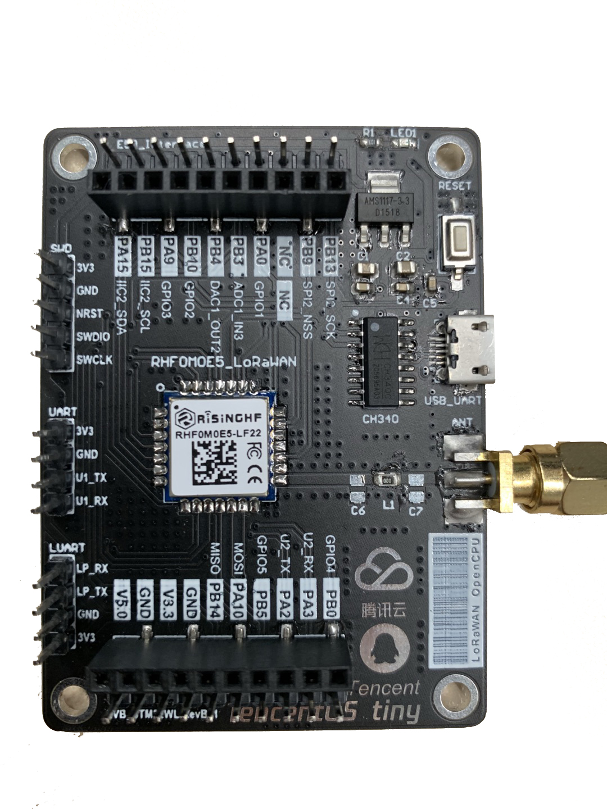

### 1.2 开发板特性
**CPU** ：使用瑞兴恒方的RHF0M0E5模组，模组内部集成意法半导体STM32WLE5芯片，单芯片集成ARM® Cortex®-M4 48MHz内核和SX126x IP；采用LoRa®扩频调制技术，LoRa®接收灵敏度高达-148dBm，通信距离达1KM～10KM；内置高效率PA，功耗更低，最大支持+22dBm输出，并在0-22dBm范围内可配置。

**电源特性** ：Micro USB接口，5V供电，内部有5V转3.3V的DCDC，MCU供电电压为3.3V，系统IO电压也为3.3V

**按键** ：一个复位按键


**LED指示灯** ：上电指示 LED，红色；

**调试接口** ：SWD外接ST-Link，UART1串口连接PC/LUART串口


**传感器扩展接口E53 Interface** ：支持E53传感器案例扩展板（支持UART、SPI、IIC、GPIO、ADC、DAC等）


**操作系统支持** ：TencentOS tiny


### 1.3 开发板硬件详解

#### 1.3.1 电源电路
Micro USB 提供5V电源，由于MCU供电电压是3.3V，所以这里采用AMS1117进行DC-DC电压转换，输出调节至3.3V，让开发板正常工作。
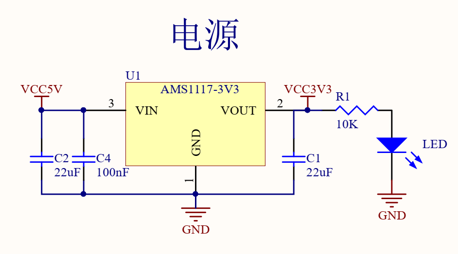

#### 1.3.2  CPU最小系统电路
单片机最小系统或者叫最小硬件单元电路，指用最少元器件组成的单片机可以正常工作的系统。最小系统基本由电源、单片机、晶振、复位电路、程序烧录接口组成，电源使用3.3V直接供电，但是EVB_WL的晶振电路封装在瑞兴恒方模组内部了，所以这里只能看到模组引脚连接和复位电路，原理图如下：
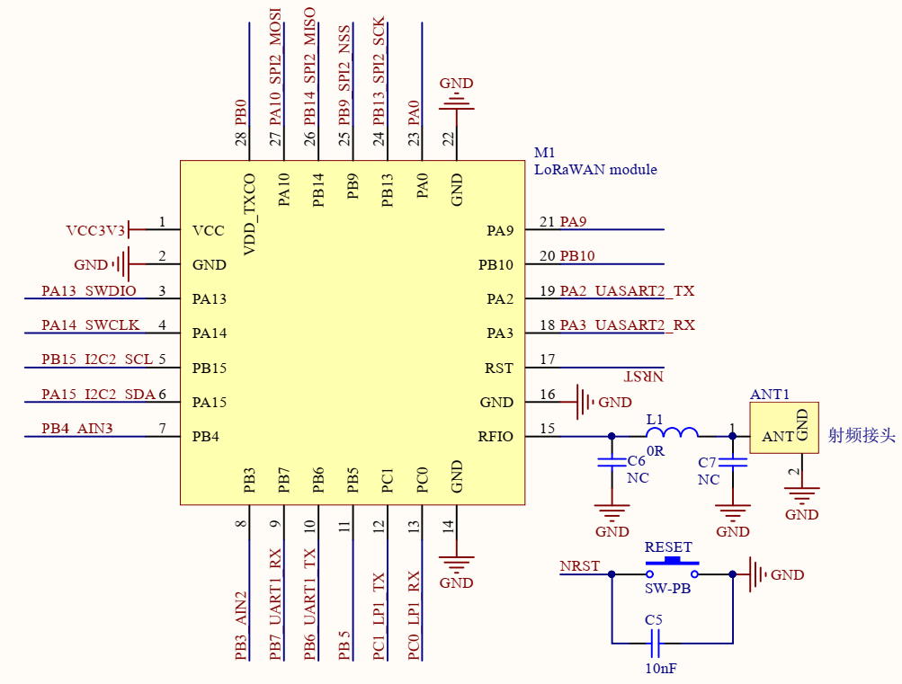

#### 1.3.3  USB电平转换电路
USB电平转换电路是用于MCU和PC通信的场景中。PC机上的通信接口使用USB接口，相应的电平逻辑需要遵照USB电平规则，而MCU的串行通信接口是串口，相应电平需要遵循TTL原则。为了使两者可以互相通信，就需要一个电平转换器，EVB_WL上使用了CH340芯片作为转换器，CH340外围只需要接很少的元器件即可以实现USB总线转接，使用非常方便也广泛运用在USB转TTL工具上，电路如下：


#### 1.3.4 E53 传感器扩展接口
开发板设计有E53接口的传感器扩展板接口，该接口可兼容所有E53接口的传感器扩展板，实现不同物联网案例场景的快速搭建。该接口可接入UART、SPI、I2C、ADC等通信协议的传感器，其原理图如下图所示。
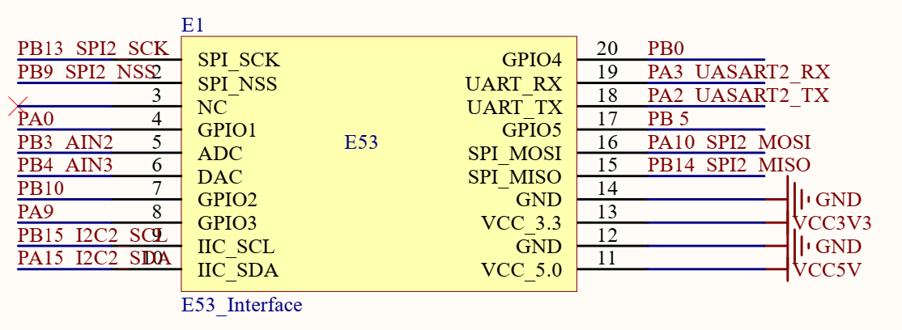

传感器扩展板有E53_SC1智慧城市灯光模块、E53_SF1智慧消防烟感模块、E53_IA1智慧农业模块等，如需要更多传感扩展板可自行找合作供应商（物联网俱乐部）购买）。
如下图：


#### 1.3.5 开发板调试烧录口
开发板预留了SWD程序下载调试口，还有UART1和低功耗串口LP_UART，方便用户下载调试程序，使用串口。
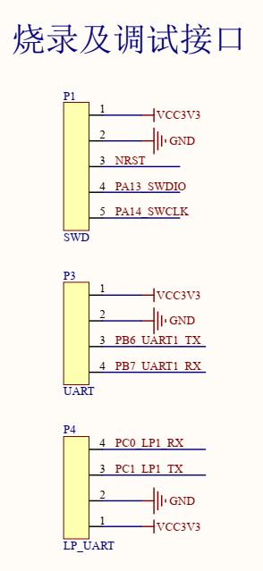


#### 1.3.6  连接Micor USB线
Micro USB线的功能是供电及调试，将线一头与开发板的Micro接口连接，另一头接到电脑的USB口上。
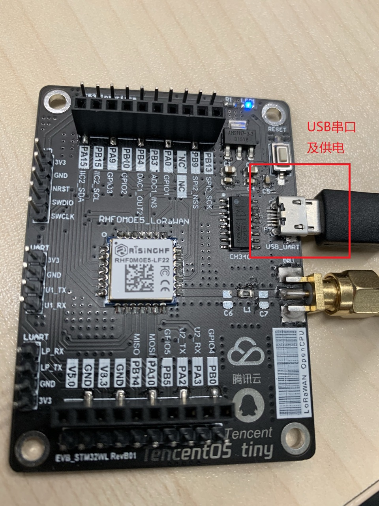

#### 1.3.7  连接ST-Link程序下载器
把开发板内提供的配套下载线接在开发板的程序下载接口（SWD口），另一端与ST-Link程序下载器对应引脚相连，注意连接紧密，防止接触不良，红色为VCC，一定参考下图进行连接，不要接错。
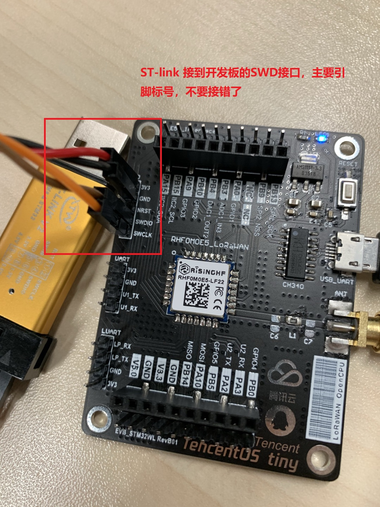

## 2. 定制开发板EVB_WL软件开发环境准备

### 2.1 MDK软件介绍
MDK 即RealView MDK 或MDK-ARM（Microcontroller Development kit），是 ARM 公司收购Keil公司以后，基于uVision界面推出的针对ARM7、ARM9、Cortex-M0、Cortex-M1、Cortex-M2、Cortex-M3、Cortex-R4等ARM处理器的嵌入式软件开发工具。MDK-ARM 集成了业内最领先的技术，包括 uVision4 集成开发环境与 RealView 编译器RVCT。支持 ARM7、ARM9 和最新的Cortex-M3/M1/M0 核处理器，自动配置启动代码，集成 Flash 烧写模块，强大的 Simulation 设备模拟，性能分析等功能，与 ARM 之前的工具包 ADS 等相比，RealView 编译器的最新版本可将性能改善超过 20%。
Keil公司开发的ARM开发工具MDK，是用来开发基于ARM核的系列微控制器的嵌入式应用程序。它适合不同层次的开发者使用，包括专业的应用程序开发工程师和嵌入式软件开发的入门者。MDK包含了工业标准的Keil C编译器、宏汇编器、调试器、实时内核等组件，支持所有基于ARM的设备，能帮助工程师按照计划完成项目。

### 2.2 MDK安装
登录MDK官网，下载MDK5软件，下载地址：
http://www2.keil.com/mdk5  或者 https://www.keil.com/download/product/
下载的版本最好在5.24以上，本开发教程以5.24版本为例，双击MDK524应用程序文件，点击next>>。


打上 I agree前面的勾勾，即是同意一些安装协议。点击next>>。


选择安装路径，可以默认也可以安装在我们自己建立的文件夹下。点击next>>。


这里填写的是我们的一些信息，填写完整后，继续next>>。


然后等待安装完成即可。


安装完成，点击Finish。


然后会跳出来这个界面，这个我们后面再讲，先点OK，把弹框都叉掉。


激活MDK，导入License,激活MDK后便可使用了。


特别提示：一定要输入License激活MDK软件，建议购买正版License。

### 2.3 MDK安装
安装完MDK后，我们需要安装开发套件中单片机型号对应的Pack。
**安装方式一**  登录官网：http://www.keil.com/dd2/pack/ 
下载Keil.STM32WLxx_DFP.1.0.0.pack 后安装，如下图

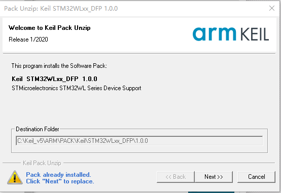

**安装方式二**  MDK软件上在线安装

打开软件，在导航栏打开Pack安装界面，然后选择ok选项。


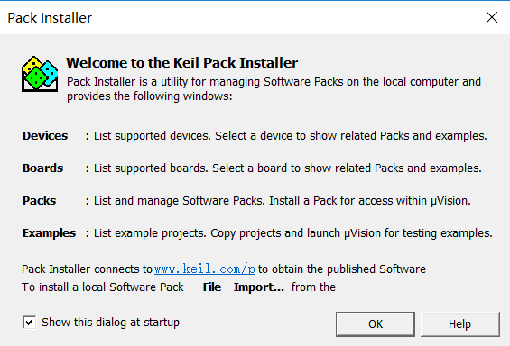

进入在线安装界面，选着STM32WLXX Pack,点击Install进行安装。


至此，我们开发板的单片机程序开发环境已经搭建完毕，重启MDK软件就可以使用了。

### 2.4 ST-Link驱动安装
前面讲了开发板单片机程序的开发环境的搭建，但是为了将程序烧录到开发板中我们还需要使用仿真器。我们这套开发板选用ST公司的ST-Link V2仿真器进行开发板程序的烧写和仿真，下面介绍ST-Link驱动的安装及环境搭建。
在ST官网下载ST-Link驱动，
https://www.st.com/content/st_com/zh/products/development-tools/software-development-tools/stm32-software-development-tools/stm32-utilities/stsw-link009.html

（驱动有2种： 32位电脑系统安装“dpinst_x86”、64位电脑系统安装“dpinst_amd64”）。 


运行对应的驱动，安装ST-Link V2驱动程序。安装路径尽量保持默认路径。


安装完成后, 将ST-Link通过USB接口连入电脑。打开“设备管理器”。若看到如下图所示，表示驱动安装成功。


这里提醒 2 点:
1，	各种 windows 版本设备名称和所在设备管理器栏目可能不一样，例如 WIN10 插上STLINK 后显示的是 STM32 STLINK。
2，	如果设备名称旁边显示的是黄色的叹号，请直接点击设备名称，然后在弹出的界面点击更新设备驱动
至此， ST-Link 驱动已经安装完成。接下来大家只需要在 MDK工程里面配置一下 ST-Link即可。

### 2.5  编程软件(MDK)配置
安装驱动成功后，打开MDK软件，配置程序烧写和仿真的环境。
点击进入工程配置界面按纽，进入工程配置界面。


选择Debug选项，进入仿真器设置界面。


下拉仿真器选择列表，选着ST-Link Debugger并勾选右侧Use,点击Settings进入ST-Link V2仿真器配置界面。


开发板设计的程序烧录方式为SW，此处Unit选择ST-Link/V2,且Port选择SW,并确认右侧框内是否检测出SW设备，点击<确认>保存配置。


### 2.6  CH340串口驱动安装

互联网搜索下载CH340 串口芯片的驱动
安装方法：打开驱动安装程序点击安装即可。

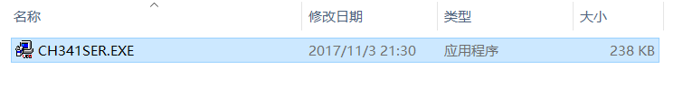
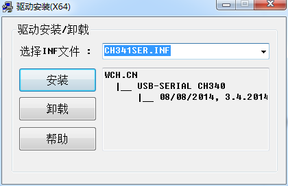

注：若安装失败，请先点击卸载，后点击安装。

### 2.7 串口调试助手的安装与使用

工具下载： http://www.daxia.com/download/sscom.rar

安装方法：串口调试助手sscom5.13.1是免安装的，解压出压缩包即可直接使用。


根据PC和终端之间的连接，选择正确的串行端口。
打开电脑的设备管理器，在端口列表可以看到PC与开发板连接的端口号。


我这里显示的是COM6，所以要在sscom工具中选择COM6，开发板程序波特率设置为115200，所以我在sscom串口工具中选择115200波特率。

## 3. 基于TencentOS tiny的STM32WL LoRaWAN 接入腾讯云IoT Explorer指引 

基于TencentOS Tiny EVB WL要完成腾讯云IoT Explorer对接，需要完成两个部分的工作。
一是：腾讯云IoT explorer 上完成项目、产品、设备创建、参数配置
二是：基于TencentOS Tiny完成LoRaWAN应用开发，向腾讯云上报业务数据。

### 3.1  腾讯云IoT explorer上创建项目、产品、设备

#### 创建项目和产品
1. 登录 [物联网开发平台控制台](https://console.cloud.tencent.com/iotexplorer)，选择【新建项目】。
2. 在新建项目页面，填写项目基本信息后，单击【保存】
    - 项目名称：输入“LoRa 温湿度演示”或其他名称。
    - 项目描述：按照实际需求填写项目描述。
3. 项目新建成功后，即可新建产品。
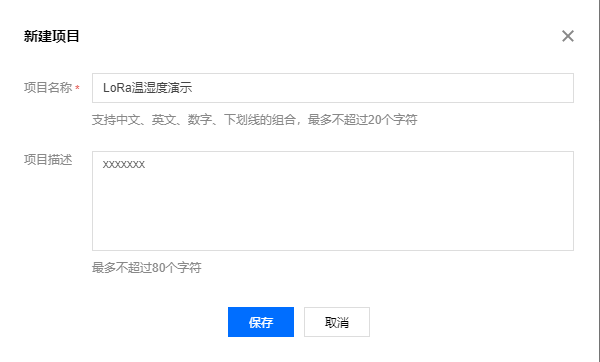


#### 新建产品
1. 进入该项目的产品列表页面，单击【新建产品】。
2. 在新建产品页面，填写产品基本信息。
    - 产品名称：输入“LoRa温湿度监测仪”或其他产品名称。
    - 产品类型：选择“用户自定义”。
    - 设备类型：选择“设备”。    
    - 认证方式：选择“密钥认证”。
    - 通信方式：选择“LoRaWAN”。
    - 数据协议：选择“自定义透传”。
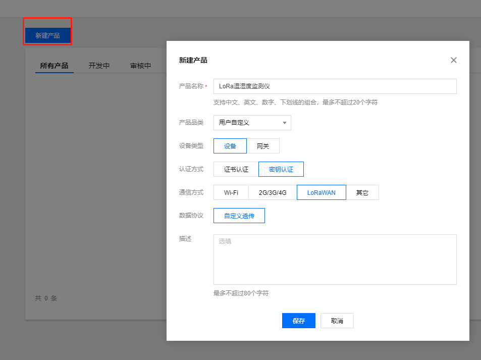
3. 产品新建成功后，您可在产品列表页查看“LoRa温湿度监测仪”。

#### 创建数据模板

单击产品名称，进入产品配置页，在【自定义功能】配置项下，单击【新建功能】，自定义产品功能。

这里我们就不一一定义数据模板了，直接导入下面的json代码:

```
{
  "version": "1.0",
  "profile": {
    "ProductId": "F2G256SY2G",
    "CategoryId": "1"
  },
  "properties": [
    {
      "id": "temperature",
      "name": "温度",
      "desc": "",
      "mode": "r",
      "define": {
        "type": "int",
        "min": "-100",
        "max": "155",
        "start": "0",
        "step": "1",
        "unit": "摄氏度"
      },
      "required": false
    },
    {
      "id": "humidity",
      "name": "湿度",
      "desc": "",
      "mode": "rw",
      "define": {
        "type": "int",
        "min": "0",
        "max": "100",
        "start": "0",
        "step": "1",
        "unit": "%"
      },
      "required": false
    },
    {
      "id": "period",
      "name": "上报周期",
      "desc": "",
      "mode": "rw",
      "define": {
        "type": "int",
        "min": "0",
        "max": "3600",
        "start": "0",
        "step": "1",
        "unit": "秒"
      },
      "required": false
    }
  ],
  "events": [],
  "actions": []
}
```


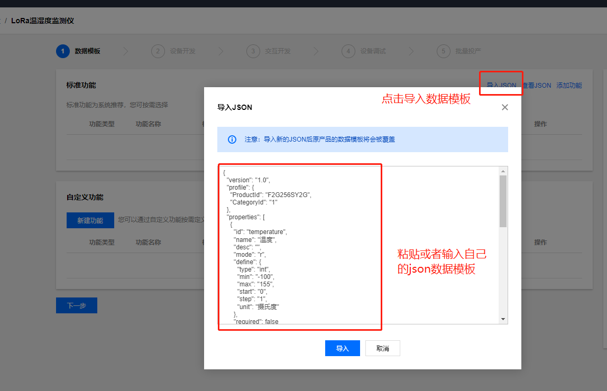

导入完成后，如下图所示：
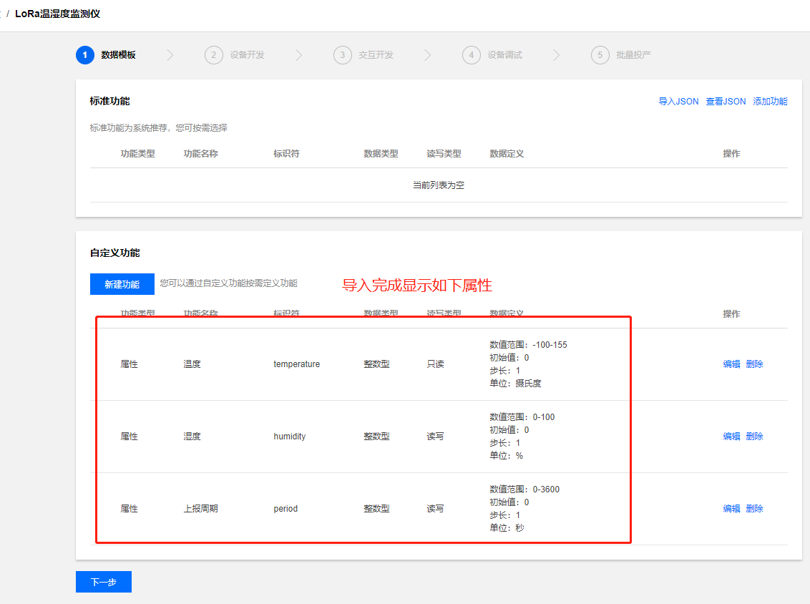

#### 配置 LoRaWAN 参数

在设备开发页面中，按需调整 LoRaWAN 参数配置。本示例中使用默认的 OTAA 配置。
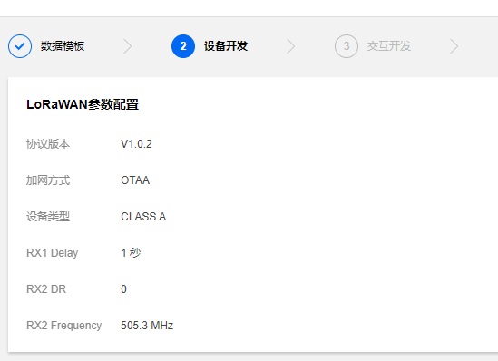

#### 设备数据解析
在设备开发页面中，按需调整设备数据解析。由于 LoRa 类资源有限设备不适合直接传输 JSON 格式数据，使用“设备数据解析”可以将设备原始数据转化为产品 JSON 数据。

##### 设备数据协议
在本示例中，设备上行数据共有3个，包括温度、湿度、上报周期3个属性数据
##### 数据解析脚本
上行数据解析的脚本主函数为 RawToProtocol，其带有 fPort、bytes 两个入参：
- fPort：设备上报的 LoRaWAN 协议数据的 FPort 字段。
- bytes：设备上报的 LoRaWAN 协议数据的 FRMPayload 字段。

脚本主函数的出参为产品数据模版协议格式的对象。

在上行数据解析部分，javascript 示例代码如下：
```javascript
function RawToProtocol(fPort, bytes) {
    var data = {
        "method": "report",
        "clientToken" : new Date(),
        "params" : {}
    };
    data.params.temperature = bytes[0];
    data.params.humidity = bytes[1];
    data.params.period = bytes[2] | (bytes[3] << 8);
    return data;
}
```

下行数据解析的脚本主函数为 ProtocolToRaw，其入参为产品数据模版协议格式的对象。

在下行数据解析部分，javascript 示例代码如下：
```javascript
function ProtocolToRaw(obj) {
    var data = new Array();
    data[0] = 5;// fport=5
    data[1] = 0;// unconfirmed mode
    data[2] = obj.params.period & 0x00FF;
    data[3] = (obj.params.period >> 8) & 0x00FF;
    return data;
}
```

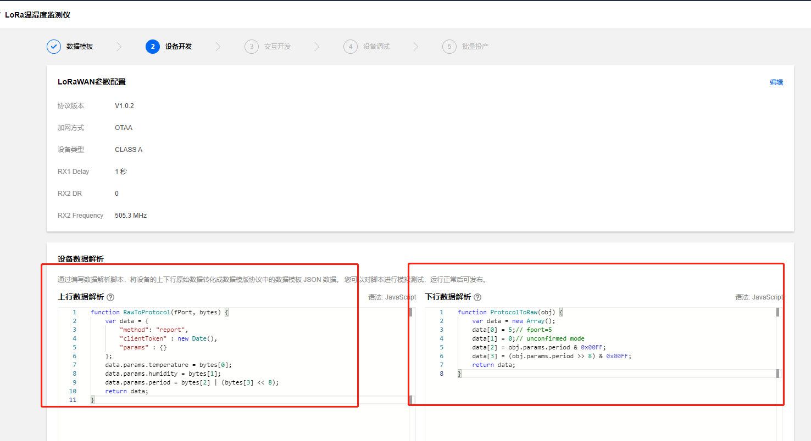


#### 创建测试设备

在设备调试页面中，单击【新建设备】，设备名为 WL_DEV_001。

DevEUI、APPKEY等信息可从 WL 开发板 终端设备获取或者设置，云平台和终端要保持一致。


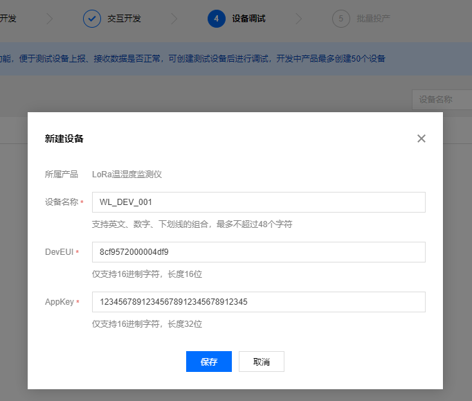

####  查看设备状态

1. 保持 LoRa 节点和 LoRa 网关 为运行状态。
2. 进入【控制台】>【产品开发】>【设备调试】，可查看到设备 "WL_DEV_001" 。
3. 单击【调试】，可进入设备详情页。
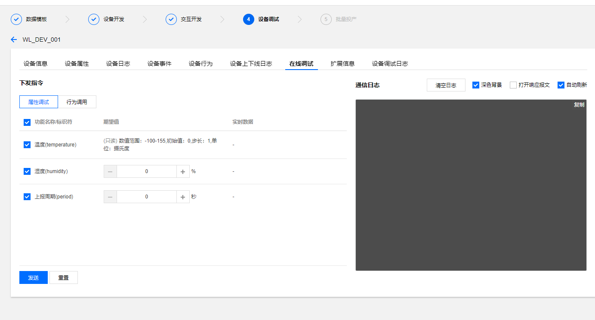
4. 单击【设备属性】，可查询设备上报到开发平台的最新数据及历史数据。
 - 设备属性的最新值：会显示设备上报的最新数据。
 - 设备属性的更新时间：显示数据的更新时间。
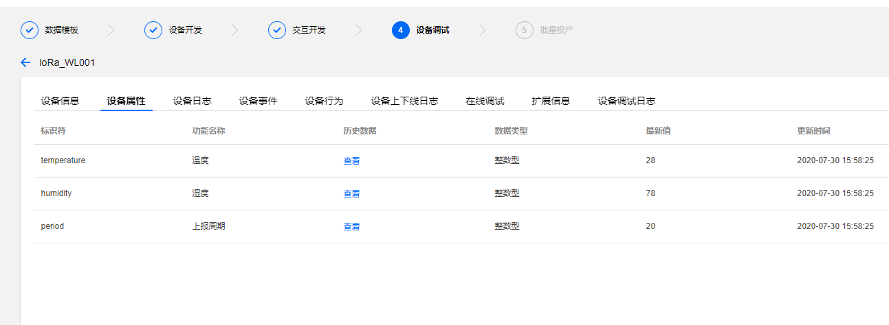
5. 单击【查看】，可查看某个属性的历史上报数据。

#### 查看设备通信日志

单击【设备日志】，可查询该设备某段时间范围的所有上下行数据。
 - 上行：上行指设备端上报到开发平台的数据。
 - 下行：下行指从开发平台下发到设备的数据。
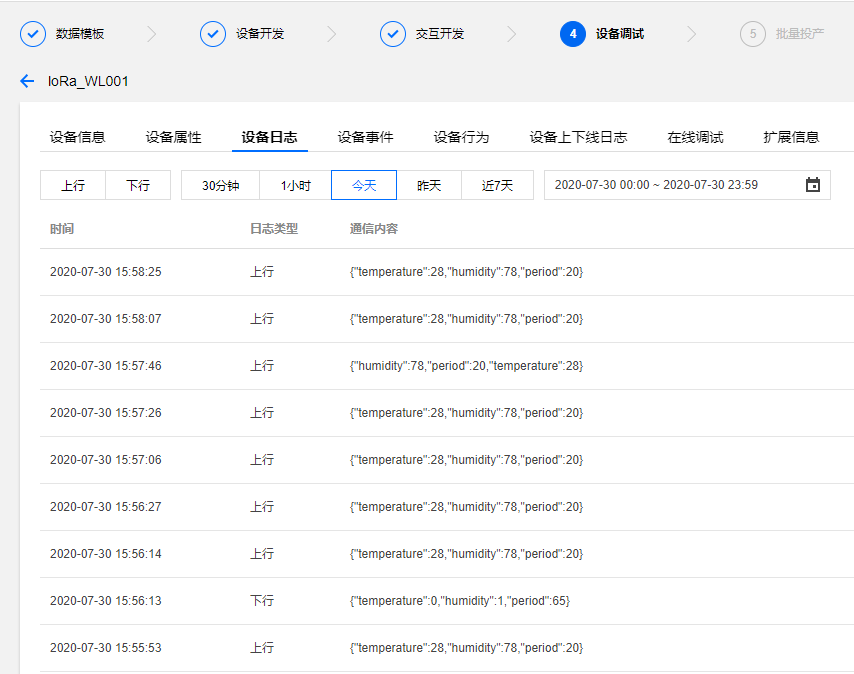


### 3.2 基于TencentOS Tiny EVB_WL开发板完成LoRaWAN应用开发

####  下载源码
TencentOS tiny官方开源仓下载源码，地址为：
https://github.com/Tencent/TencentOS-tiny

进入 < TencentOS-tiny\board\RHF0M0E5_STM32WLE5xx\KEIL\lorawan> 目录，打开TencentOS_tiny.uvprojx工程：

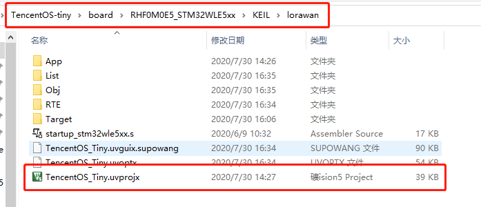

####  编译lorawan工程

打开工程后，我们在左侧的工程文件导航页面可以看到WL的LoRaWAN相关源码，这里创建了两个TencentOS tiny的任务，一个负责处理LoRaWAN MAC层协议，一个处理业务。开发者在编译前需要配置设备相关信息。
打开commissioning.h头文件，在文件中输入与前文IoT Explorer平台对应的device EUI和APP KEY，按如下图所示的格式：
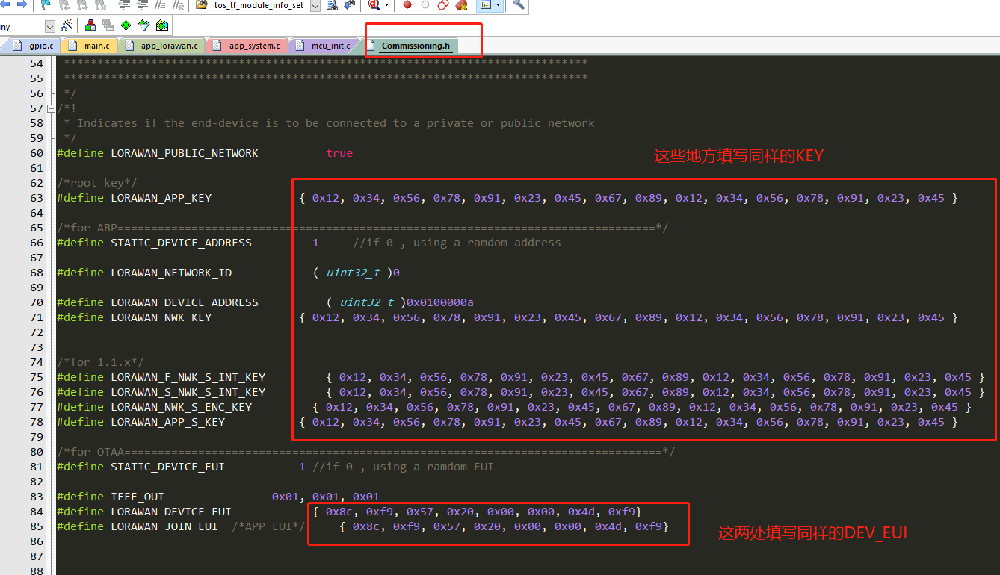

基于TencentOS Tiny的WL开发板的业务流程如下：
1. main函数中完成 板级初始化，主要是 board_init函数中初始化好基础外设和LoRa射频及LoRa协议栈；其中MX_LoRaWAN_Init函数会完成LoRaWAN协议的基础配置，比如选择CLASS、配置通道、配置ADR等；
2. main函数中，完成内核初始化、创建主线程入口application_entry，启动内核；
3. application_entry函数中再创建lora_mac_process_task；
4. application_entry函数中调用lw_send函数向LoRa网关和云端上报终端数据。示例中是模拟了3个元数据发送，开发者可以修改发送自己想发送的数据，配合腾讯云IoT平台设计好对应的数据模板即可。

修改设备信息后，开发者按照下图指示，点击编译按钮即可编译工程，如图：

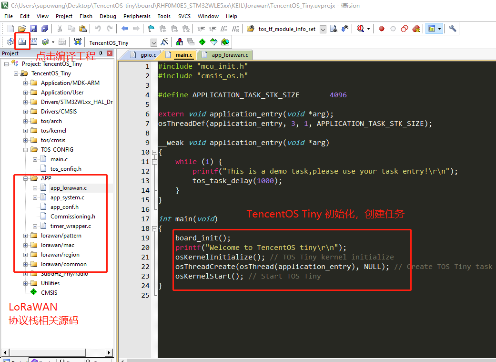

#### 下载运行

首先需要配置下载环境

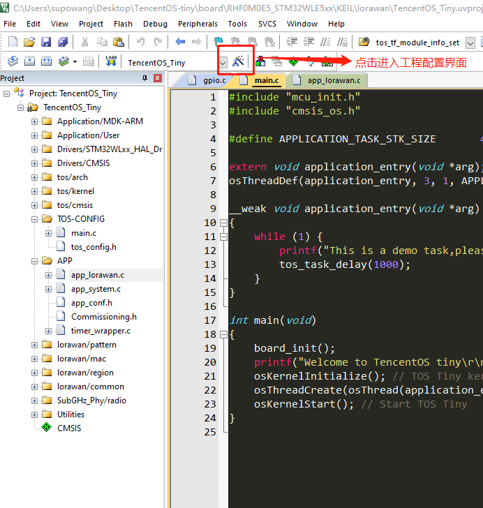

按下图所示配置下载参数


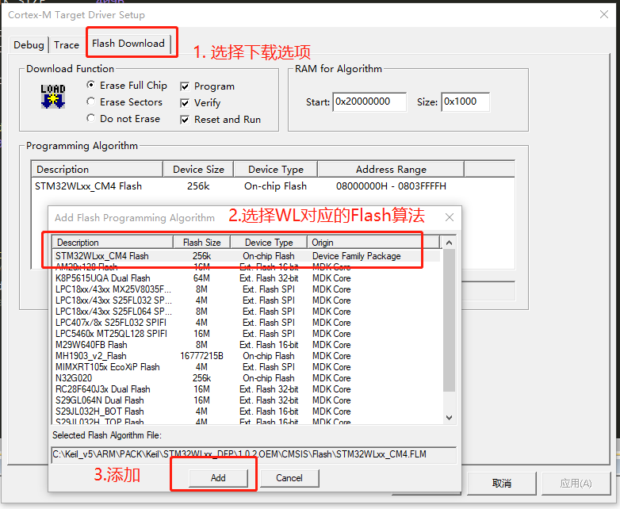

编译完成后点击如图所示”LOAD”按钮下载程序即可。

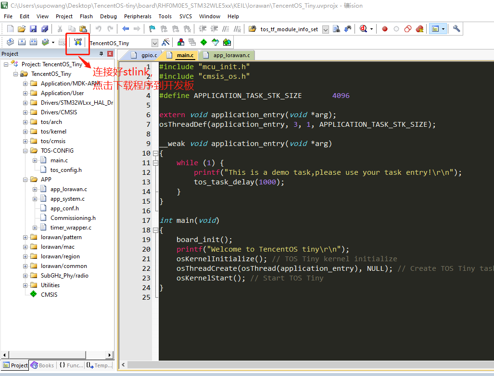

>如果出现无法下载问题，则芯片处于写保护状态，请查看本文第 4 小节的内容，去除写保护。

#### 查看运行结果

连接好串口，在PC的串口助手中可以看到TencentOS Tiny EVB_WL开发板打印LoRa业务运行的相关日志，如下图所示：

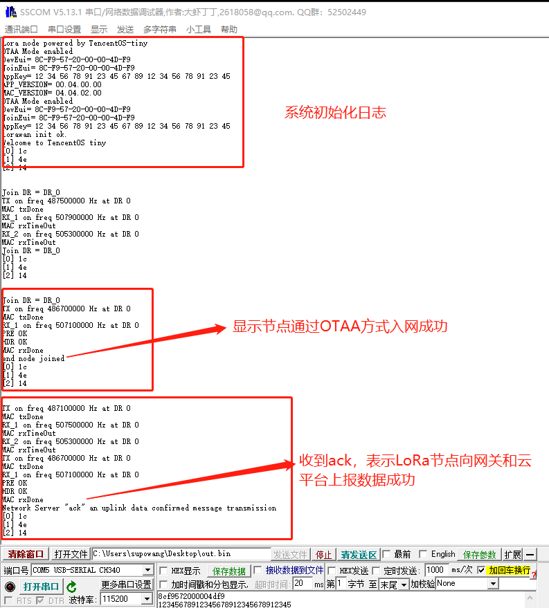

同时需要查询腾讯云IoT Explore上的设备状态和上报的数据项，如图所示：


# 4. 去除芯片写保护
### 4.1. 使用ST-Link连接开发板
确保ST-Link与开发板正常连接，并且在 MDK 中可以正常读取到信息，如图：

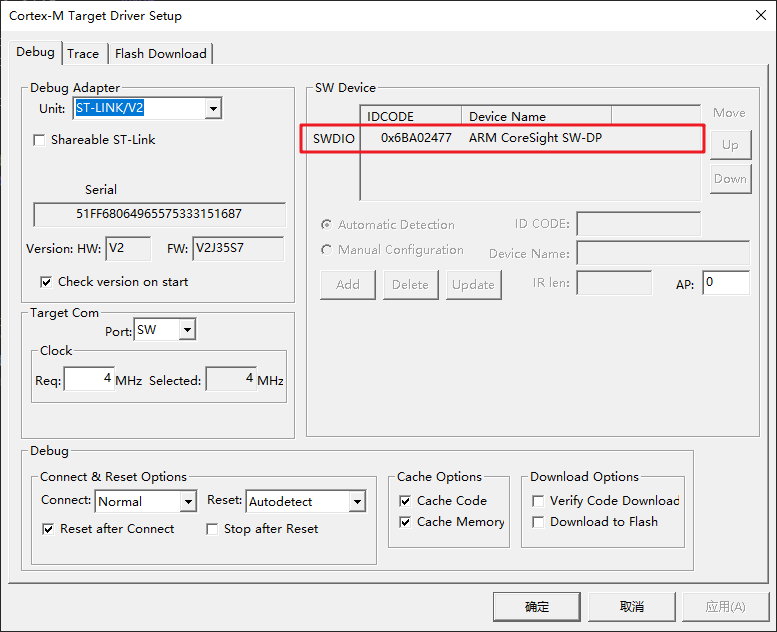

## 4.2. 使用STM32CubeProg解锁
关闭MDK，打开STM32CubeProg软件，点击右上角的 Connect，连接成功后显示Connected：

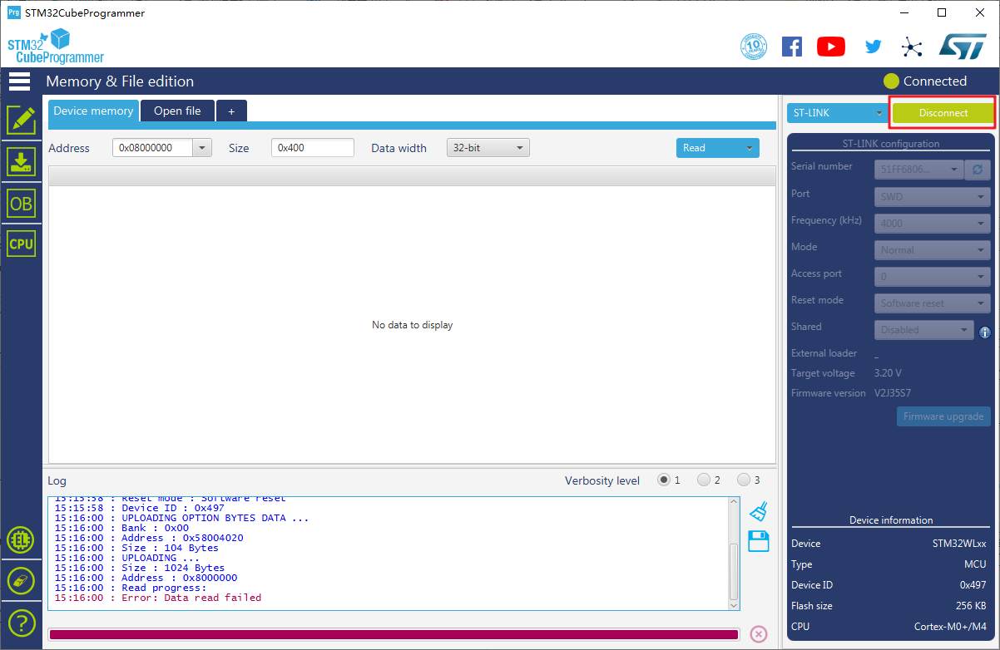

点击选择 OB 图标按钮，按照图中流程进行解锁：

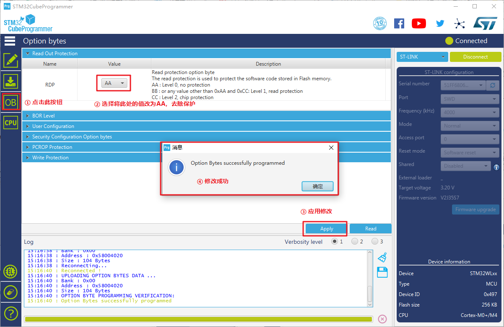

成功之后点击 dicconnnect 断开连接：

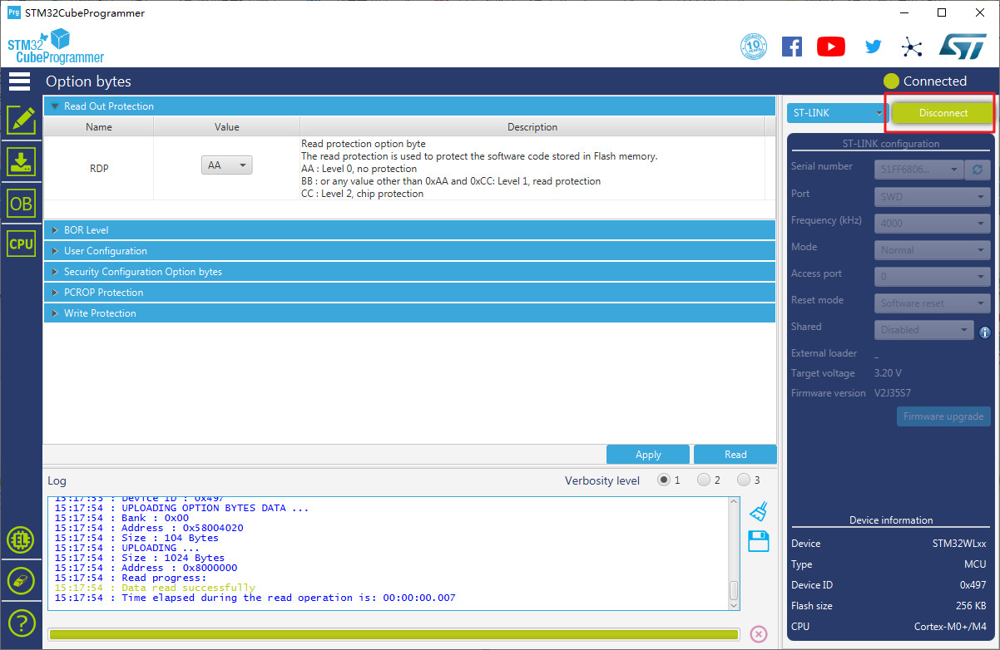

芯片解锁成功，此时即可使用MDK正常下载。

写在结尾的话：感谢大家使用TencentOS Tiny，本文难免有描述不清晰的地方，如果有任何问题，欢迎加入TencentOS Tiny 的官网QQ技术群进行交流，基于TencentOS Tiny相关的项目合作请邮件联系 supowang@tencent.com

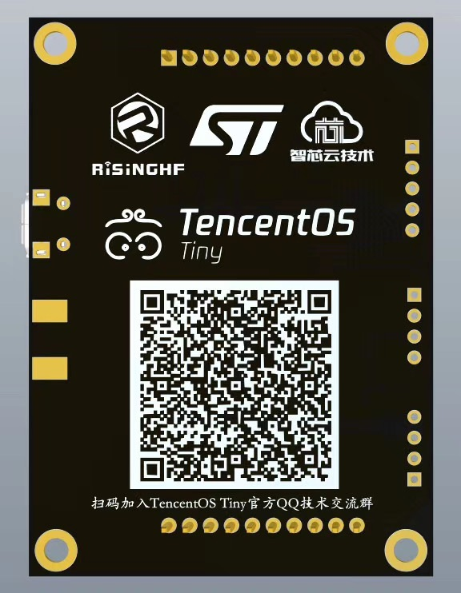
