# 1. 概述

## 1.1. 百花绽放的通信模组

随着嵌入式系统终端对网络的需求越来越多，各种通信模组百花齐放，几乎覆盖了所有的网络接入方式：WIFI、2G、4G Cat.1、4G Cat.4、NB-IoT、LoRa……未来还会有更多。

对于嵌入式系统终端而言，这些通信模组屏蔽了网络接入方式的差异化，无论使用哪种方式接入网络，设备仅仅需要提供一个串口与模组交互即可。

交互双方有了通信的硬件基础（串口），还需要制定和遵循一套有效的软件协议，目前大多数模组厂商都采用AT指令集。

## 1.2. AT指令集

AT指令有两种：

① 普通AT指令：以AT开头、换行符结束的一组字符串，每个指令执行成功与否都有相应的返回。
```
---> AT

<--- OK
```
②其他的一些非预期的信息，模块将有对应的一些信息提示，主动发送：
```
<--- +IPD:...

<--- +URC:...
```

AT指令交互类似服务器/客户端架构，一般来说模组侧作为AT服务端，MCU侧作为AT客户端，交互方式对应也有两种：

- 客户端发出一条AT指令，服务端收到处理之后返回结果给客户端；
- 服务端主动发送数据给客户端，客户端被动接收处理；

整体架构如下图：

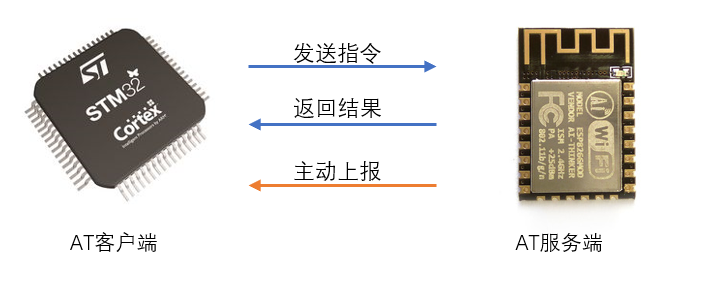

模组的功能非常丰富，有修改模组配置的AT指令、有TCP/IP协议栈通信的AT指令、甚至还有MQTT、HTTP、NTP协议栈的通信指令，这些指令合在一起构成了该模组的AT指令集。一般来说，同一家厂商的不同模组之间，AT指令集差异不大，而不同厂商之间的AT指令集之间差异较大。

## 1.3. AT指令解析方式

AT指令有三种解析方式：

- 裸机直接在串口中断处理函数中解析

因为解析时间未知，所以这种解析方式最不可取，极容易出现数据丢失问题。

- 裸机使用ringbuff（环形缓冲区）缓存数据，在main函数中构造状态机解析

串口每来一个字符就送入缓冲区，最大程度保证数据不会丢失，这种解析方式随着main函数中其它业务逻辑的增多，导致缓冲区数据迟迟得不到解析，依然会出现问题。

- RTOS使用ringbuff缓存数据，创建一个任务专门用于数据解析

同样，串口每来一个字符就送入缓冲区，保证数据不丢失，只要数据解析任务的优先级够高，数据总是会被及时解析，大幅提升系统的实时性能。

## 1.4. AT框架与SAL层

什么是AT框架？其实并不神秘~

AT框架是RTOS官方人员/社区开发者编写的一个通用AT指令解析任务，使开发者只需要调用 AT 框架提供的 API 即可处理与模组的交互数据。

SAL框架全称Socket Abstract Layer，提供了类似socket网络编程的抽象层。基于AT框架实现SAL的底层函数叫做通信模组的驱动程序。

# 2. TencentOS-tiny的AT框架

## 2.1. 整体架构


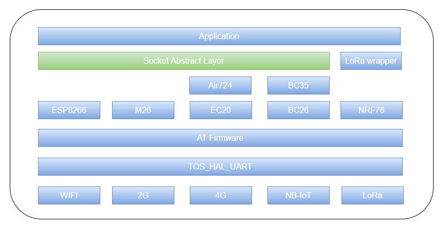


## 2.2. 实现原理

TencentOS-tiny AT 框架的实现在 `net/at` 目录下的 `tos_at.h`和`tos_at.c`两个文件中。

① AT框架所有接收数据的数据流向如图所示：

- 串口中断中逐个字节接收，写入 chr_fifo 缓冲区；
- 解析任务 at_parser 从 chr_fifo 缓冲区中逐个字节读取，读取一行数据到 recv_cache （行缓冲区）并进行处理；
- 处理之后如果不是模组上报的普通的数据，也不是AT命令期望的返回结果，也不是 "OK"、"FAIL"、"ERROR"，则为普通数据，将行缓冲区的数据复制到用户传入的 echo_buffer中，由用户处理。

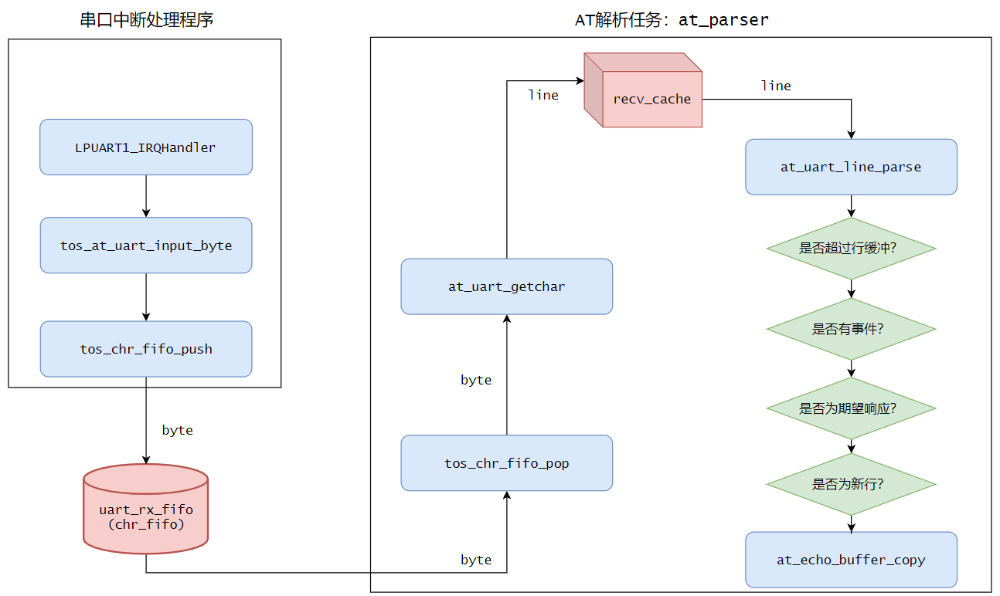

② AT框架将模组主动上报的数据作为事件，将上报数据的数据头和用户指定的回调处理函数作为事件表，在AT框架初始化时注册。

比如 ESP8266 在 TCP/IP 通信时，收到远程服务器发送来的数据时会使用+IPD头主动上报数据，将此事件注册的示例如下：
```c
/* esp8266.c */

at_event_t esp8266_at_event[] = {
    { "+IPD,", esp8266_incoming_data_process },
};
```

注册之后，每次行解析的时候都会判断是否为事件头，如果是则证明有事件发生，拉起注册的回调函数进行处理。

>注意，AT框架只从 chr_fifo 中读取出了事件头，事件头之后的所有数据依然在缓冲区中，所在开发者在编写回调函数时可以边读出数据，边解析数据。

③ 如何完成一次交互？

AT框架将每一次交互抽象为一个 at_echo_t 对象，用户交互的流程如下：

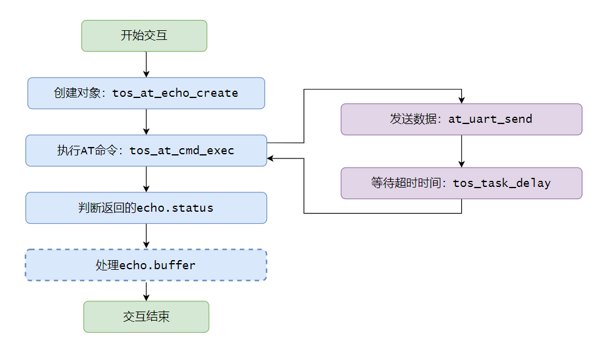

④ 如何实现多个channel同时存在？

大多数通信模组在进行 TCP/IP 通信时，支持同时创建多个socket通信（一般为6个），作为一个通用的AT框架，也为了更好的上层SAL服务，AT框架也相应的支持多channel。

每个channel对象如下：
```c
typedef struct at_data_channel_st {
    uint8_t             is_free;
    k_chr_fifo_t        rx_fifo;
    uint8_t            *rx_fifo_buffer;
    k_mutex_t           rx_lock;

    at_channel_status_t status;

    const char         *remote_ip;
    const char         *remote_port;
} at_data_channel_t;
```
每次上层发起 Socket Connect连接时，将此Socket的ip和port绑定到channel对象，然后动态申请一块内存作为该channnel的接收缓冲区，当Socket close时，随即释放此缓冲区。

## 2.3. TencentOS-tiny AT框架参数配置

AT框架的所有缓冲区内存都是使用动态内存，内部机制使用到了信号量sem、互斥锁mutex、字符流队列chr_fifo、计时表stopwatch，所以请首先保证在`tos_config.h`中这些配置处于使能模式，其中动态内存池的大小可以根据随后 AT 框架的配置修改：

```c
#define TOS_CFG_MUTEX_EN                    1u

#define TOS_CFG_SEM_EN                      1u

#define TOS_CFG_MMHEAP_EN                   1u

#define TOS_CFG_MMHEAP_DEFAULT_POOL_EN      1u

#define TOS_CFG_MMHEAP_DEFAULT_POOL_SIZE    0x8000
```
AT框架的所有可配置选项都已在`tos_at.h`中使用宏定义给出，可以根据自己的需要进行裁剪配置：
```c
#define AT_DATA_CHANNEL_NUM                     6
#define AT_DATA_CHANNEL_FIFO_BUFFER_SIZE        (2048 + 1024)

#define AT_UART_RX_FIFO_BUFFER_SIZE             (2048 + 1024)
#define AT_RECV_CACHE_SIZE                      2048

#define AT_CMD_BUFFER_SIZE                      512

#define AT_PARSER_TASK_STACK_SIZE               2048
#define AT_PARSER_TASK_PRIO                     2
```
配置项的意义如下：

|配置项|作用|
|:-----:|:-----:|
|AT_DATA_CHANNEL_NUM|AT框架支持的最大通道数|
|AT_DATA_CHANNEL_FIFO_BUFFER_SIZE|每个通道的缓冲区大小|
|AT_UART_RX_FIFO_BUFFER_SIZE|串口接收缓冲区大小|
|AT_RECV_CACHE_SIZE|行缓冲区大小|
|AT_CMD_BUFFER_SIZE|命令缓冲区大小|
|AT_PARSER_TASK_STACK_SIZE|解析任务的任务栈大小|
|AT_PARSER_TASK_PRIO|解析任务的任务优先级|

## 2.4. AT框架提供的API

- AT框架写入一个字节数据

```c
__API__ void tos_at_uart_input_byte(uint8_t data);
```
此 API 通常在串口中断中调用。

- AT框架初始化

```c
__API__ int tos_at_init(hal_uart_port_t uart_port, at_event_t *event_table, size_t event_table_size);
```

|参数|意义|
|:-----:|:------:|
|uart_port|AT框架使用的串口|
|event_table|事件表地址|
|event_table_size|事件表大小|
|返回值|成功：0，失败：-1|

- 创建一个 at_echo_t 对象

```c
__API__ int tos_at_echo_create(at_echo_t *echo, char *buffer, size_t buffer_size, char *echo_expect);
```

|参数|意义|
|:-----:|:------:|
|echo|at_echo_t对象句柄|
|buffer|用于保存命令执行结果的缓冲区|
|buffer_size|缓冲区大小|
|echo_expect|期望的字符串|
|返回值|成功：0，失败：-1|

- 执行一条AT命令,timeout超时后才返回

```c
__API__ int tos_at_cmd_exec(at_echo_t *echo, uint32_t timeout, const char *cmd, ...);
```

|参数|意义|
|:-----:|:------:|
|echo|at_echo_t对象句柄|
|timeout|命令执行之后的等待时间|
|cmd|要执行的AT命令|
|返回值|成功：0，失败：-1|

- 执行一条AT命令，一旦有期望结果立马返回，若无，则timeout超时后返回

```c
__API__ int tos_at_cmd_exec_until(at_echo_t *echo, uint32_t timeout, const char *cmd, ...);
```

|参数|意义|
|:-----:|:------:|
|echo|at_echo_t对象句柄|
|timeout|命令执行之后的等待时间|
|cmd|要执行的AT命令|
|返回值|成功：0，失败：-1|

- 发送十六进制原始数据，timeout超时后才返回

```c
__API__ int tos_at_raw_data_send(at_echo_t *echo, uint32_t timeout, const uint8_t *buf, size_t size);
```

|参数|意义|
|:-----:|:------:|
|echo|at_echo_t对象句柄|
|timeout|命令执行之后的等待时间|
|buf|待发送的缓冲区|
|size|缓冲区大小|
|返回值|成功：0，失败：-1|

- 发送十六进制数据，一旦有期望结果立马返回，若无，则timeout超时后返回
```c
__API__ int tos_at_raw_data_send_until(at_echo_t *echo, uint32_t timeout, const uint8_t *buf, size_t size);
```

|参数|意义|
|:-----:|:------:|
|echo|at_echo_t对象句柄|
|timeout|命令执行之后的等待时间|
|buf|待发送的缓冲区|
|size|缓冲区大小|
|返回值|成功：0，失败：-1|

- 直接从串口接收缓冲区中读取数据

```c
__API__ int tos_at_uart_read(uint8_t *buffer, size_t buffer_len);
```

|参数|意义|
|:-----:|:------:|
|buf|存放读取数据的缓冲区|
|size|读取数据的长度|
|返回值|成功：0，失败：-1|

- 直接从串口接收缓冲区中读取一行数据

```c
__API__ int tos_at_uart_readline(uint8_t *buffer, size_t buffer_len);
```
|参数|意义|
|:-----:|:------:|
|buf|存放读取数据的缓冲区|
|size|读取数据的长度|
|返回值|成功：0，失败：-1|

- 申请一个channel

```c
__API__ int tos_at_channel_alloc(const char *ip, const char *port);
```

|参数|意义|
|:-----:|:------:|
|ip|socket ip|
|port|socket port|
|返回值|成功：非负值、通道ID，失败：-1|

- 写入数据到channel的接收缓冲区

```c
__API__ int tos_at_channel_write(int channel_id, uint8_t *buffer, size_t buffer_len);
```

|参数|意义|
|:-----:|:------:|
|channel_id|已经申请成功的channel 通道ID|
|buf|存放写入数据的缓冲区|
|size|写入数据的长度|
|返回值|成功：0，失败：-1|

>在TCP/IP通信时，解析完AT指令上报的数据时，就可以将真正网络接收的数据调用此API写入channle的接收缓冲区。


- 从channel的接收缓冲区中读取数据

```c
__API__ int tos_at_channel_read(int channel_id, uint8_t *buffer, size_t buffer_len);
```

|参数|意义|
|:-----:|:------:|
|channel_id|已经申请成功的channel 通道ID|
|buf|存放读取数据的缓冲区|
|size|读取数据的长度|
|返回值|成功：0，失败：-1|

- 从channel的接收缓冲区中读取数据，有超时时间

```c
__API__ int tos_at_channel_read_timed(int channel_id, uint8_t *buffer, size_t buffer_len, uint32_t timeout);
```
|参数|意义|
|:-----:|:------:|
|channel_id|已经申请成功的channel 通道ID|
|buf|存放读取数据的缓冲区|
|size|读取数据的长度|
|timeout|读取等待时间|
|返回值|成功：0，失败：-1|

# 3. TencentOS-tiny的SAL框架

## 3.1. 什么是SAL框架

SAL框架全称Socket Abstract Layer，提供了类似socket网络编程的抽象层，为上层应用一层统一的网络API，屏蔽了底层不同通信模组/方式的差异。

## 3.2. SAL框架的实现原理

TencentOS-tiny SAL框架的实现在`net/sal_module_wrapper`路径中，仅有两个文件：`sal_module_wrapper.h`和`sal_module_wrapper.c`。

SAL框架的底层是一套函数指针，如下：
```c
typedef struct sal_module_st {
    int (*init)(void);

    int (*get_local_mac)(char *mac);

    int (*get_local_ip)(char *ip, char *gw, char *mask);

    int (*parse_domain)(const char *host_name, char *host_ip, size_t host_ip_len);

    int (*connect)(const char *ip, const char *port, sal_proto_t proto);

    int (*send)(int sock, const void *buf, size_t len);

    int (*recv_timeout)(int sock, void *buf, size_t len, uint32_t timeout);

    int (*recv)(int sock, void *buf, size_t len);

    int (*sendto)(int sock, char *ip, char *port, const void *buf, size_t len);

    int (*recvfrom)(int sock, void *buf, size_t len);

    int (*recvfrom_timeout)(int sock, void *buf, size_t len, uint32_t timeout);

    int (*close)(int sock);
} sal_module_t;
```
不同的通信模组驱动都去实现这一套函数指针即可，TencentOS-tiny官方已经提供了非常多的通信模组驱动实现SAL框架，覆盖常用的通信方式，比如2G、4G Cat.4、4G Cat.1、NB-IoT等，在`devices`文件夹下：

- air724
- bc26
- bc25_28_95
- bc35_28_95_lwm2m
- ec20
- esp8266
- m26
- m5310a
- m6312
- sim800a
- sim7600ce
- 欢迎贡献更多驱动...

## 3.3. SAL框架提供的网络编程API

- 注册该模组实现到SAL框架

```c
int tos_sal_module_register(sal_module_t *module);
```

|参数|作用|
|:-----:|:----:|
|module|模组实现的函数指针结构体句柄|
|返回值|成功：0，失败：-1|

- 模组初始化

```c
int tos_sal_module_init(void);
```

|参数|作用|
|:-----:|:----:|
|返回值|成功：0，失败：-1|

- 域名解析

```c
int tos_sal_module_parse_domain(const char *host_name, char *host_ip, size_t host_ip_len);
```

|参数|作用|
|:-----:|:----:|
|host_name|域名|
|host_ip|存放解析出的ip缓冲区|
|host_ip_len|缓冲区大小|
|返回值|成功：0，失败：-1|

- 建立 TCP/UDP socket连接

```c
int tos_sal_module_connect(const char *ip, const char *port, sal_proto_t proto);
```

|参数|作用|
|:-----:|:----:|
|ip|目的主机ip|
|port|目的主机port|
|proto|协议类型：TOS_SAL_PROTO_TCP或者TOS_SAL_PROTO_UDP|
|返回值|成功：socket id，失败：-1|

- TCP socket发送数据

```c
int tos_sal_module_send(int sock, const void *buf, size_t len);
```

|参数|作用|
|:-----:|:----:|
|sock|socket id|
|buf|待发送数据|
|len|待发送数据长度|
|返回值|成功：实际发送数据的长度，失败：-1|

- TCP socket接收数据

```c
int tos_sal_module_recv(int sock, void *buf, size_t len);
int tos_sal_module_recv_timeout(int sock, void *buf, size_t len, uint32_t timeout);
```

|参数|作用|
|:-----:|:----:|
|sock|socket id|
|buf|存放接收数据的缓冲区|
|len|缓冲区长度|
|timeout|等待超时时间|
|返回值|成功：实际读取数据的长度，失败：-1|

- UDP socket发送数据

```c
int tos_sal_module_sendto(int sock, char *ip, char *port, const void *buf, size_t len);
```

|参数|作用|
|:-----:|:----:|
|sock|socket id|
|ip|目的主机ip|
|port|目的主机port|
|buf|待发送数据|
|len|待发送数据长度|
|返回值|成功：实际发送数据的长度，失败：-1|

- UDP socket接收数据

```c
int tos_sal_module_recvfrom(int sock, void *buf, size_t len);
int tos_sal_module_recvfrom_timeout(int sock, void *buf, size_t len, uint32_t timeout);
```

|参数|作用|
|:-----:|:----:|
|sock|socket id|
|buf|存放接收数据的缓冲区|
|len|缓冲区长度|
|timeout|等待超时时间|
|返回值|成功：实际读取数据的长度，失败：-1|

- 关闭socket

```c
int tos_sal_module_close(int sock);
```

|参数|作用|
|:-----:|:----:|
|sock|socket id|
|返回值|成功：0，失败：-1|

# 4. AT框架+SAL框架移植方法

## 4.1. 移植前的准备

本文中我使用官方EVB_MX+开发板为例，主控芯片为STM32L431RCT6，USART1用于printf打印日志信息，LPUART1用于和通信模组交互，通信模组使用 WIFI 模组 ESP8266为例。

移植AT框架前需要准备好一个移植好TencentOS-tiny内核的工程，可以做到串口的正常收发，这里我使用 TencentOS-tiny 中`TencentOS-tiny\board\TencentOS_tiny_EVB_MX_Plus\KEIL\hello_world`中的工程。

## 4.2. 移植AT框架

TencentOS-tiny AT 框架的实现在 `net/at` 目录下的 `tos_at.h`和`tos_at.c`两个文件中，TencentOS-tiny AT框架底层使用的串口驱动HAL层在`platform\hal\st\stm32l4xx\src`目录下的文件`tos_hal_uart.c`中，头文件在`kernel\hal\include`路径中。

首先将这两个c文件添加到Keil工程中：

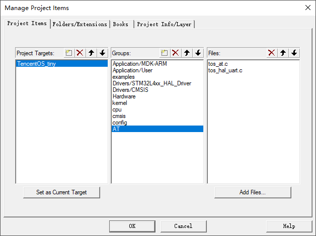

然后将头文件路径添加到Keil MDK中：

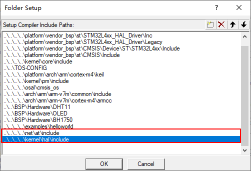

然后在串口中断中配置调用AT框架的字节接收函数，编辑`stm32l4xx_it.c`文件：

① 添加AT框架的头文件：
```c
/* Private includes ----------------------------------------------------------*/
/* USER CODE BEGIN Includes */
#include "tos_at.h"
/* USER CODE END Includes */
```

② 在文件最后添加串口中断回调函数：

```c
/* USER CODE BEGIN 1 */
void HAL_UART_RxCpltCallback(UART_HandleTypeDef *huart)
{
    extern uint8_t data;
    if (huart->Instance == LPUART1) {
        HAL_UART_Receive_IT(&hlpuart1, &data, 1);
        tos_at_uart_input_byte(data);
    }
}
/* USER CODE END 1 */
```

注意，在回调函数中声明data变量在外部定义，这是因为STM32 HAL库的机制，需要在初始化完成之后先调用一次串口接收函数，使能串口接收中断，编辑`usart.c`文件：

① 在文件开头定义data变量为全局变量：
```c
/* USER CODE BEGIN 0 */
uint8_t data;
/* USER CODE END 0 */
```

② 在串口初始化完成之后使能接收中断：
```c
/* LPUART1 init function */

void MX_LPUART1_UART_Init(void)
{
    hlpuart1.Instance = LPUART1;
    hlpuart1.Init.BaudRate = 115200;
    hlpuart1.Init.WordLength = UART_WORDLENGTH_8B;
    hlpuart1.Init.StopBits = UART_STOPBITS_1;
    hlpuart1.Init.Parity = UART_PARITY_NONE;
    hlpuart1.Init.Mode = UART_MODE_TX_RX;
    hlpuart1.Init.HwFlowCtl = UART_HWCONTROL_NONE;
    hlpuart1.Init.OneBitSampling = UART_ONE_BIT_SAMPLE_DISABLE;
    hlpuart1.AdvancedInit.AdvFeatureInit = UART_ADVFEATURE_NO_INIT;
    if (HAL_UART_Init(&hlpuart1) != HAL_OK)
    {
    Error_Handler();
    }

    //手动添加，使能串口中断
    HAL_UART_Receive_IT(&hlpuart1, &data, 1);
}
```

## 4.3. 移植SAL框架

TencentOS-tiny SAL框架的实现在`net/sal_module_wrapper`路径中，仅有两个文件：`sal_module_wrapper.h`和`sal_module_wrapper.c`。

将c文件添加到Keil MDK工程中：

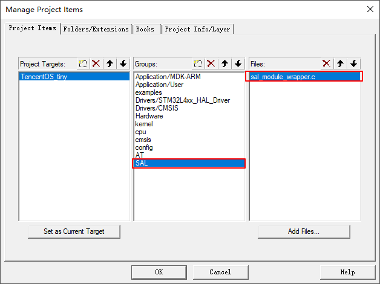

将头文件所在路径添加到Keil MDK中：

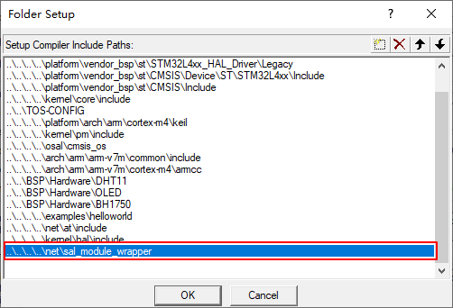

## 4.4. 移植通信模组驱动

TencentOS-tiny官方已经提供了非常多的通信模组驱动实现SAL框架，覆盖常用的通信方式，比如2G、4G Cat.4、4G Cat.1、NB-IoT等，在`devices`文件夹下,：

- air724
- bc26
- bc25_28_95
- bc35_28_95_lwm2m
- ec20
- esp8266
- m26
- m5310a
- m6312
- sim800a
- sim7600ce
- 欢迎贡献更多驱动...

因为这些驱动都是SAL框架的实现，所以这些通信模组的驱动可以根据实际硬件情况**选择一种加入到工程中**，这里我以 WIFI 模组 ESP8266为例，演示如何加入通信模组驱动到工程中。

ESP8266的驱动在`devices\esp8266`目录中。

首先将`esp8266.c`文件加入到Keil MDK工程中：

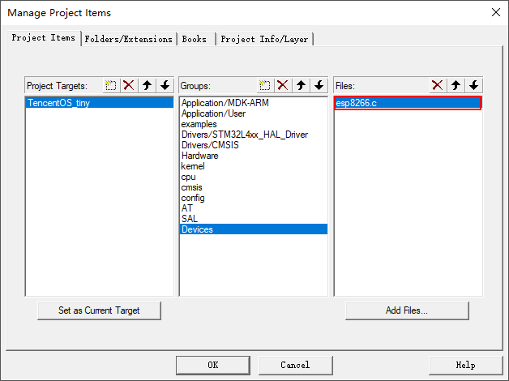

然后将`esp8266.h`头文件所在路径添加到Keil MDK工程中：

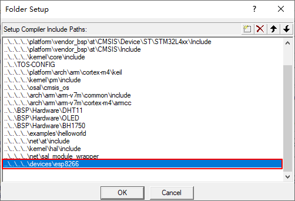

移植完成。

## 4.5. 测试网络通信

移植完成之后，可直接使用官方提供的示例代码进行测试，测试双socket进行TCP通信的测试程序为`examples\tcp_through_module\tcp_through_module.c`。

将工程中的 helloworld 示例代码更换为该文件，如图：

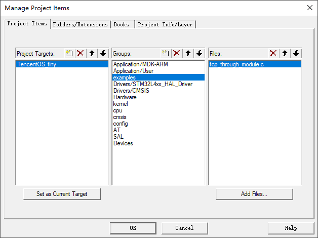

在这个示例中，首先通过宏定义来配置当前使用的是哪个模组：

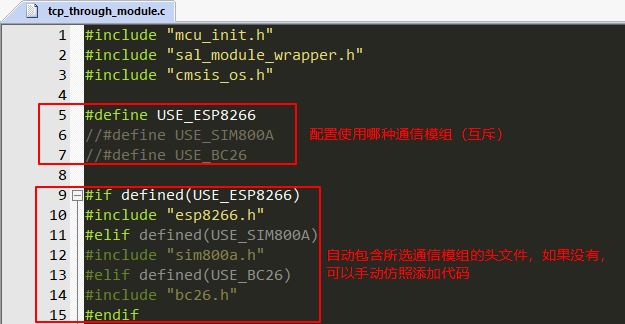

然后调用对应模组的初始化函数：

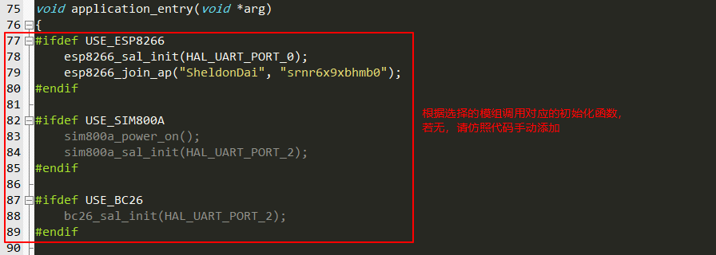

此处需要注意：初始化模组时指定的串口号即为AT通信模组所使用的串口，在`tos_hal_uart.h`中定义：

```c
typedef enum hal_uart_port_en {
    HAL_UART_PORT_0 = 0,    //对应LPUART1
    HAL_UART_PORT_1,        //对应USART1
    HAL_UART_PORT_2,        //依此类推
    HAL_UART_PORT_3,
    HAL_UART_PORT_4,
    HAL_UART_PORT_5,
    HAL_UART_PORT_6,
} hal_uart_port_t;
```

最后修改两个TCP Socket 的ip和端口为自己测试服务器的ip和端口：

```c
socket_id_0 = tos_sal_module_connect("117.50.111.72", "8080", TOS_SAL_PROTO_TCP);
socket_id_1 = tos_sal_module_connect("117.50.111.72", "8001", TOS_SAL_PROTO_TCP);
```

>TCP测试服务器需要自己搭建或者使用一些小工具，此处不再详述。

修改完成之后，编译程序，烧录到开发板中，在串口助手中查看结果：

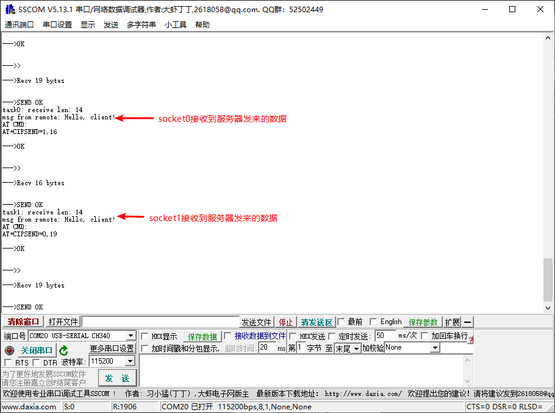

在 socket0 的服务端查看模组发送的消息：

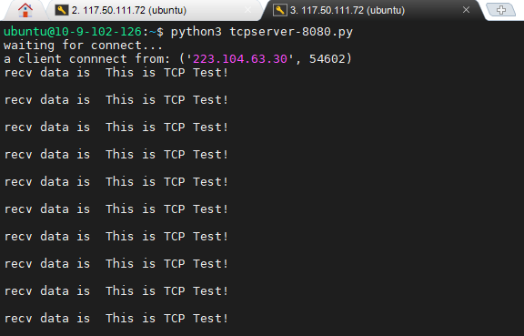

在 socket1 的服务端查看模组发送的消息：

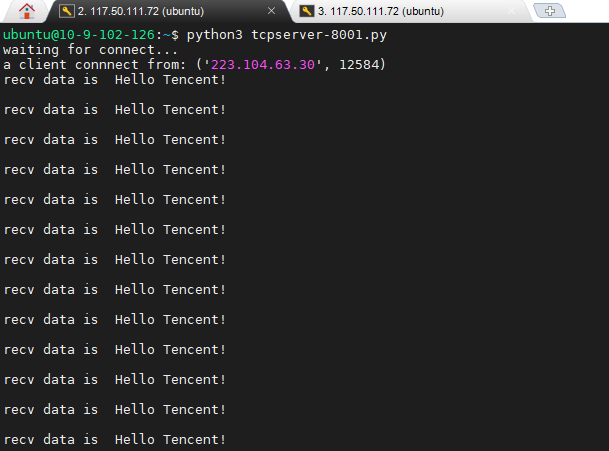

至此，测试完成。

# 5. 如何适配一个新的通信模组驱动

基于模组的AT指令集，使用 TencentOS-tiny AT 框架与模组交互，实现SAL框架所定义的函数，这个过程称为通信模组适配。

本文中我以移远通信的4G通信模组 EC20 作为示例，讲述一个全新的通信模组适配流程。

## Step1. 使用串口助手调试，熟悉该模组的AT指令集


适配SAL层需要熟悉模组的三类AT指令：

- 基本查询配置指令
- TCP/IP网络协议栈AT指令
- TCP/IP网络协议栈数据接收机制

比如EC20相关的AT指令如下：

### ① 基本查询配置指令

- 测试AT指令是否正常？

```
AT

OK
```

- 查询SIM卡是否正常？

```c
AT+CPIN?

+CPIN: READY

OK
```

- 查询模组的信号强度

```c
AT+CSQ

+CSQ: 17,0

OK
```

- 查询模组是否注册到GSM网络

```
AT+CREG?

+CREG: 0,1

OK
```

- 查询模组是否注册上GPRS网络

```
AT+CGREG?

+CGREG: 0,1

OK
```

- 设置GPRS的APN

```
AT+QICSGP=1,1,"CMNET"

OK
```

- 激活移动场景

```
AT+QIACT=1

OK
```

### ② TCP/IP网络协议栈AT指令

TCP/IP网络协议栈至少需要TCP/UDP socket的通信AT指令，其它上层协议的AT指令暂时不用。

- 建立Socket
```
AT+QIOPEN=1,0,"TCP","117.50.111.72",8902,0,0

OK

+QIOPEN: 0,0
```

>在建立socket的时候需要注意，有的通信模组需要提前使用AT指令配置单链路模式还是多链路模式（eg. ESP8266）,而有的通信模组默认直接支持多链路模式，无需配置。

- 发送数据

```c
AT+QISEND=0

> hello<0x1a>

SEND OK
```

>发送数据的时候需要注意，有的通信模组发送数据使用ASCII字符(eg. ESP8266、EC20等)，而有的通信模组发送数据使用十六进制（eg. NB-IoT类模组）

- 接收数据

接下来的一节重点讲述。

- 关闭Socket

```
AT+QICLOSE=0

OK
```

### ③ TCP/IP网络协议栈数据接收机制

通信模组在接收到服务器发来的数据时，会有两种方式上报给MCU：

- 使用固定的IP头上报socket id和数据长度，需要再次去读取数据(缓冲模式接收)

```c
//模组上报
+QIURC: "recv",0

//MCU发出AT指令去读取数据
AT+QIRD=0,1500

+QIRD: 14
Hello, client!

OK
```

- 使用固定的IP头上报socket id和数据长度，同时一起上报数据(直接模式接收)
```c
+QIURC: "recv",0,14
Hello, client!
```

有的模组只支持某一种模式，有的模组两种模式都支持，可以自己配置，对于TencentOS-tiny的AT框架来说，第二种直接上报模式解析起来会更加方便。

## Step2. 三类AT指令，三种实现方式

上面讲述了适配SAL层需要熟悉模组的三类AT指令：基本查询配置指令、TCP/IP网络协议栈AT指令、TCP/IP网络协议栈数据接收机制，这节讲述如何使用AT框架实现这三类AT指令。

① 只需要判断是否返回OK的AT指令

这一类AT指令的实现函数除了指令内容不同，别的都相同，比如关闭回显的AT指令：

```
ATE0

OK
```

对应的实现方法如下：
```c
static int ec20_echo_close(void)
{
    at_echo_t echo;

    /* 创建一个echo 对象，缓冲区为NULL，期望字符串为NULL */
    tos_at_echo_create(&echo, NULL, 0, NULL);

    /* 执行AT命令，超时时长1000ms */
    tos_at_cmd_exec(&echo, 1000, "ATE0\r\n");

    /* 判断执行结果是否为OK */
    if (echo.status == AT_ECHO_STATUS_OK)
    {
        return 0;
    }
    return -1;
}
```

② 需要判断是否OK，也需要解析执行结果的AT指令

这一类AT指令的实现函数中，不同点在于，创建echo对象的时候需要传入一个buffer来存放指令执行的结果，比如查询信号强度的AT指令：

```
AT+CSQ

+CSQ: 17,0

OK
```

对应的实现方法如下：
```c
static int ec20_signal_quality_check(void)
{
    int rssi, ber;
    at_echo_t echo;
    char echo_buffer[32], *str;
	int try = 0;
	
    /* 创建echo对象，传入一个缓冲区存放AT命令执行结果 */
	tos_at_echo_create(&echo, echo_buffer, sizeof(echo_buffer), NULL);

    /* 尝试检测10次，一旦有一次正常，返回 */
    while (try++ < 10) 
    {
        /* 执行AT命令，超时时长1000ms */
        tos_at_cmd_exec(&echo, 1000, "AT+CSQ\r\n");

        /* 判断执行结果是否返回了OK */
        if (echo.status != AT_ECHO_STATUS_OK)
        {
            return -1;
        }

        /* 从AT指令的执行结果中解析提取CSQ值进行判断 */
        str = strstr(echo.buffer, "+CSQ:");
        sscanf(str, "+CSQ:%d,%d", &rssi, &ber);
        if (rssi != 99) {
            return 0;
        }
    }

    return -1;
}
```

③ 模组主动上报的数据处理

这一类AT指令对应TCP/IP协议栈接收数据的上报机制，使用AT框架的事件机制进行处理。

首先将固定的ip头和事件处理回调函数注册：
```c
at_event_t ec20_at_event[] = {
	{ "+QIURC: \"recv\",",   ec20_incoming_data_process},   //处理远程服务器发来的数据
    { "+QIURC: \"dnsgip\",", ec20_domain_data_process},     //处理域名解析结果，暂时不管
};
```

事件处理回调函数自己编写，主要作用是提取模组上报的scoketid、数据长度、数据内容，然后将数据内容写入到对应socket id 的channel中。

>需要注意，AT框架一旦读取解析到固定的IP头，则停止解析，拉起对应的回调函数，所以在回调函数中可以继续从缓冲区中一边读取一边解析。

解析示例如下：

```c
__STATIC__ void ec20_incoming_data_process(void)
{
    uint8_t data;
    int channel_id = 0, data_len = 0, read_len;
    uint8_t buffer[128];

    /*
        模组上报的数据格式：
		+QIURC: "recv",<sockid>,<datalen>
		<data content>
    */

    /* 注册的ip头是：[+QIURC: "recv",]回调函数被拉起执行后，接着处理后边的数据即可 */
	
    /* 读取解析socket id */
    while (1)
    {
        if (tos_at_uart_read(&data, 1) != 1)
        {
            return;
        }

        if (data == ',')
        {
            break;
        }
        channel_id = channel_id * 10 + (data - '0');
    }

    /* 读取解析数据长度 */
	while (1)
    {
        if (tos_at_uart_read(&data, 1) != 1)
        {
            return;
        }

        if (data == '\r')
        {
            break;
        }
        data_len = data_len * 10 + (data - '0');
    }

    /* 读取'\r'之后的'\n'，不作任何处理 */
    if (tos_at_uart_read(&data, 1) != 1)
    {
        return;
    }

    /* 根据解析出的数据长度和缓冲区的长度，循环读取数据内容，写入到对应 socket id 的channel中 */
    do {
#define MIN(a, b)   ((a) < (b) ? (a) : (b))
        read_len = MIN(data_len, sizeof(buffer));

        /* 读取数据 */
        if (tos_at_uart_read(buffer, read_len) != read_len) {
            return;
        }

        /* 写入到对应的channel中 */
        if (tos_at_channel_write(channel_id, buffer, read_len) <= 0) {
            return;
        }

        data_len -= read_len;
    } while (data_len > 0);

	return;
}
```

## Step3. 整体适配流程

前两步都是细节性的处理，这一步从整体的角度讲述适配流程。

① 模组初始化

```c
static int ec20_init(void)
{
    printf("Init ec20 ...\n" );

    /* 关闭回显 */

    if (ec20_echo_close() != 0)
    {
        printf("echo close failed,please check your module\n");
        return -1;
    }

    /* 检测SIM卡是否正常 */
    if(ec20_sim_card_check() != 0)
    {
        printf("sim card check failed,please insert your card\n");
        return -1;
    }

    /* 检测信号强度是否正常 */
    if (ec20_signal_quality_check() != 0)
    {
        printf("signal quality check status failed\n");
        return -1;
    }

    /* 检测是否注册到GSM网络 */
    if(ec20_gsm_network_check() != 0)
    {
        printf("GSM network register status check fail\n");
        return -1;
    }
    
    /* 检测是否注册到GPRS网络 */
    if(ec20_gprs_network_check() != 0)
    {
        printf("GPRS network register status check fail\n");
        return -1;
    }
    
    /* 关闭APN */
    if(ec20_close_apn() != 0)
    {
        printf("close apn failed\n");
        return -1;
    }
		
    /* 设置APN，激活移动场景 */
    if (ec20_set_apn() != 0) {
        printf("apn set FAILED\n");
        return -1;
    }

    printf("Init ec20 ok\n" );
    return 0;
}
```

② 将实现的函数映射到SAL框架上：

```c
sal_module_t sal_module_ec20 = {
    .init             = ec20_init,
    .connect          = ec20_connect,
    .send             = ec20_send,
    .recv_timeout     = ec20_recv_timeout,
    .recv             = ec20_recv,
    .sendto           = ec20_sendto,
	.recvfrom         = ec20_recvfrom,
	.recvfrom_timeout = ec20_recvfrom_timeout,
    .close            = ec20_close,
    .parse_domain     = ec20_parse_domain,
};
```

③ 再次封装，留出一个外部调用接口，供上层应用程序调用：

```c
int ec20_sal_init(hal_uart_port_t uart_port)
{
    /* 初始化AT框架及其串口 */
    if (tos_at_init(uart_port, ec20_at_event,
                        sizeof(ec20_at_event) / sizeof(ec20_at_event[0])) != 0) {
        return -1;
    }

    /* 将第②步中映射的函数关系，注册到SAL框架 */
    if (tos_sal_module_register(&sal_module_ec20) != 0) {
        return -1;
    }

    /* 调用SAL初始化函数，因为接口和映射的存在，最终调用到ec20_init */
    if (tos_sal_module_init() != 0) {
        return -1;
    }
		
    return 0;
}
```


