# 1 操作场景

使用BLE蓝牙模拟一款智能灯，配合“腾讯连连”小程序实现设备接入，物联网开发平台可以远程控制灯的亮度、颜色、开关，并实时获取智能灯上报到开发平台的数据。

本文档主要指导您如何使用NRF52832模组在物联网开发平台创建智能灯产品并通过手机接入。

# 2 前提条件

为了通过下面的步骤快速理解该业务流程，需要做好以下准备工作：
- 申请物联网开发平台服务。
- 准备一块NRF52832开发板。
- 下载最新版本代码。
- 安装python、JLink驱动程序。

# 3 操作步骤

## 3.1 控制台操作

### 3.1.1 新建项目
1. 登录 [物联网开发平台控制台](https://console.cloud.tencent.com/iotexplorer)，选择【新建项目】。
2. 在新建项目页面，填写项目基本信息，完成后点击保存。
   - 项目名称：输入“智能灯演示”或其他名称。
   - 项目描述：按照实际需求填写项目描述。  
   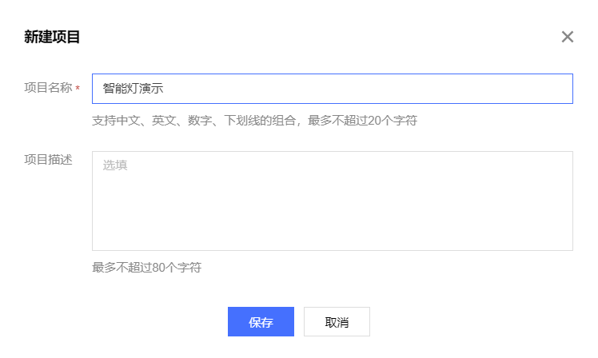

### 3.1.2 新建产品
1. 进入该项目的产品列表页面，单击【新建产品】。
2. 在新建产品页面，填写产品基本信息，完成后点击保存。
  - 产品名称：输入“蓝牙智能灯”或其他产品名称。
  - 产品类型：选择“智慧生活—电工照明—灯”。 
  - 设备类型：选择“设备”。
  - 认证方式：选择“密钥认证”。
  - 通信方式：选择“BLE”。
  - 其他选项保持默认。  
  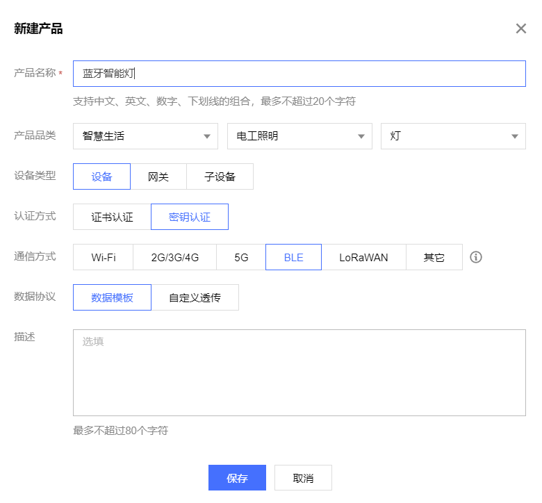

### 3.1.3 创建数据模板
1. 打开刚刚创建的【蓝牙智能灯】产品。  
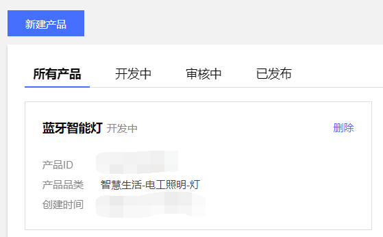

2. 选择【数据模板】，点击【导入JSON】。  
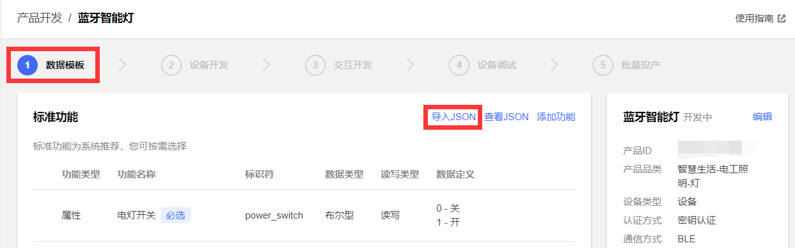

1. 打开代码中的`examples\nimble_llsync\date_templatenrf52832.json`，如果出现乱码请将您的编辑器修改为utf8编码，将文件中的代码粘贴进来，点击【导入】。  
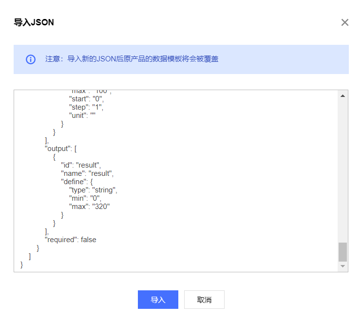

### 3.1.4 交互开发配置
配置产品在小程序端的控制面板、配网引导、快捷入口，若不配置则使用系统默认配置。  
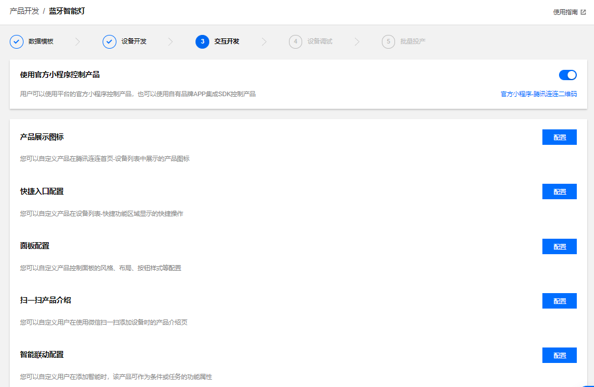

### 3.1.5 新建设备
在设备调试页面中，单击【新建设备】，输入设备名“ble_device_01”或其他设备名称，点击【保存】。  
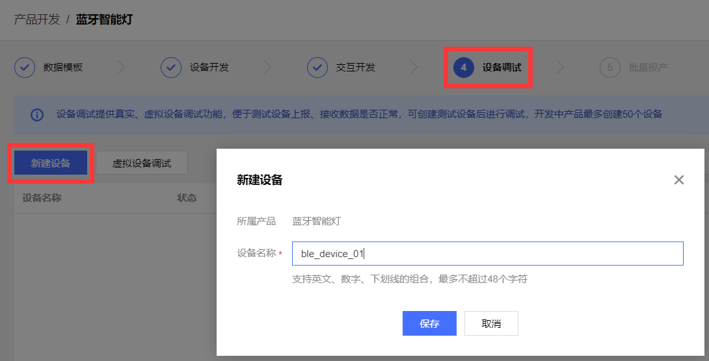

## 3.2 设备端操作

### 3.2.1 硬件简介与连接
开发板实物如下：  
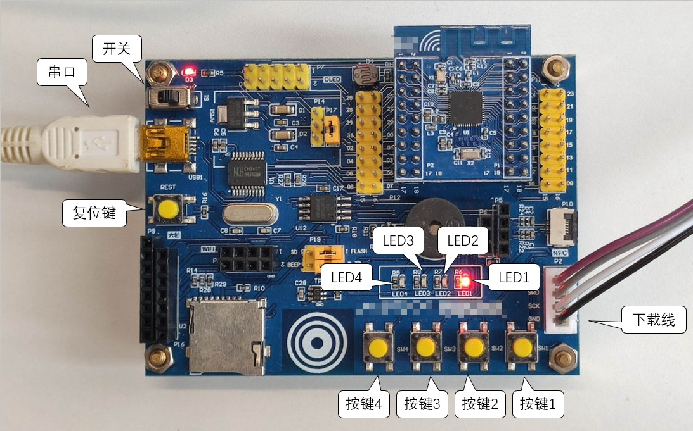

指示灯作用如下
- LED1: 开关
- LED2: action
- LED3: replay
- LED4: 未使用

1. 使用USB线连接开发板左上角串口。
2. 使用JLink连接开发板右下角下载线接口。
3. 打开左上角电源开关。
4. 打开设备管理器，确保串口和JLink能够正常识别，若不能识别请重新安装驱动。  
   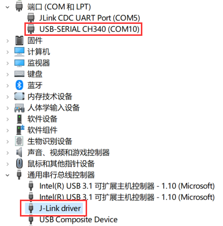

### 3.2.2 准备软件环境
1. 新买到的nrf52832开发板可能已经烧写了 NORDIC 官方蓝牙协议栈，需要进行擦除，否则会导致下载失败、程序异常或其他问题
2. 启动 JFlash.exe，选择 File -> New project  
   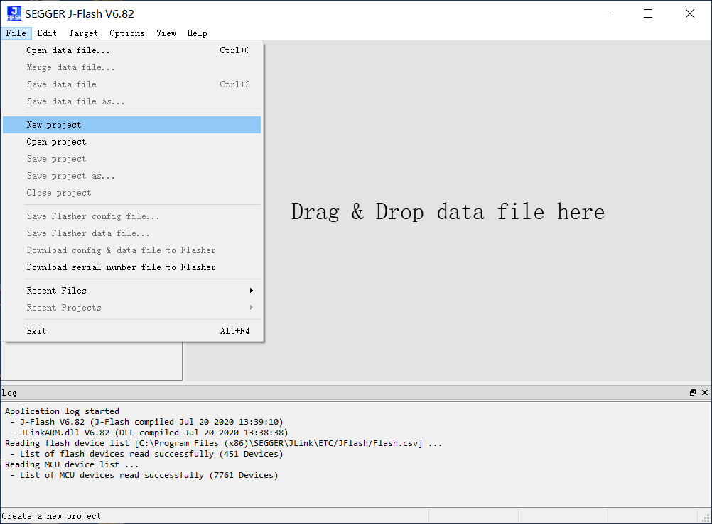
3. 点击省略号添加设备  
   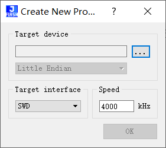
4. 在“Device”中输入nrf52832，选择具体芯片型号，例程中使用的为nRF52832_xxAA  
   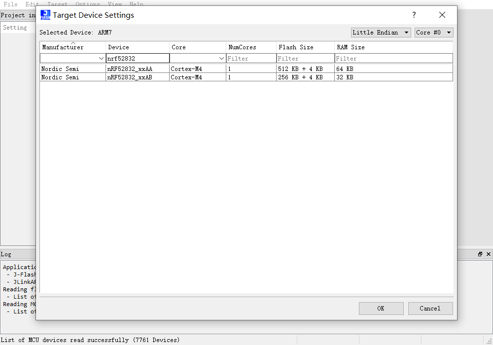
5. 选择 Target -> Manual Programming -> Erase Chip 擦除芯片  
   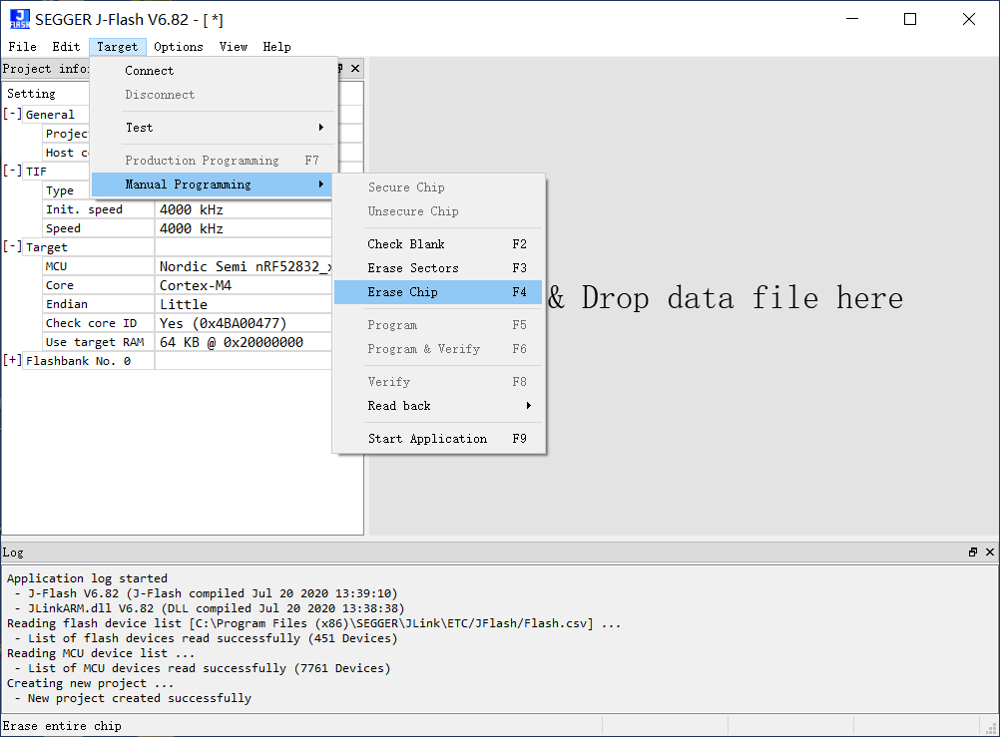
6. 擦除完成后即可继续进行之后的开发

### 3.2.3 代码修改与烧录
1. 打开工程`board\Nordic_NRF52832\KEIL\llsync\TencentOS_tiny.uvprojx`。
2. 打开文件`ble_qiot_import.c`，找到以下三个宏并修改为你自己的设备信息。  
   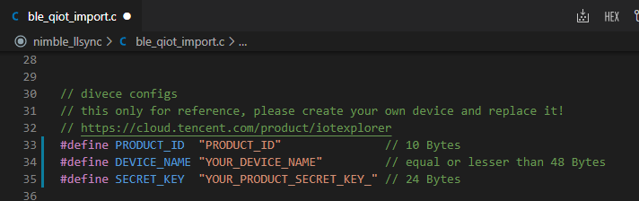
3. 在【设备调试】页面中选择【设备信息】子页面，将【设备名称】、【设备密钥】、【产品ID】分别填入`DEVICE_NAME`,`SECRET_KEY`,`PRODUCT_ID`。  
   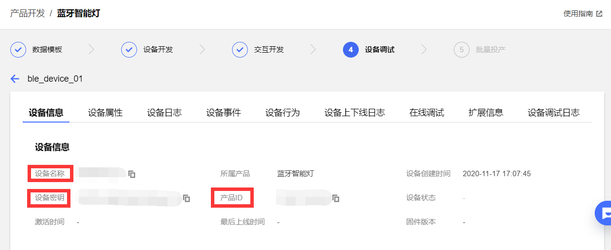
4. 在`ble_qiot_ret_status_t ble_qiot_explorer_init(void)`中或其他合适的地方修改日志等级`ble_qiot_set_log_level(BLE_QIOT_LOG_LEVEL_DEBUG);`，以便开发调试。
5. 编译下载并运行。

## 3.3 腾讯连连小程序调试
1. 微信主页面下拉并搜索【腾讯连连】小程序。  
   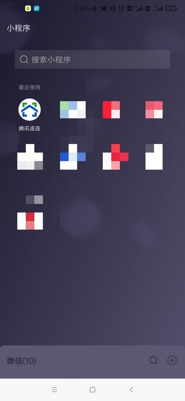
2. 点击下方的【加号】添加设备。  
   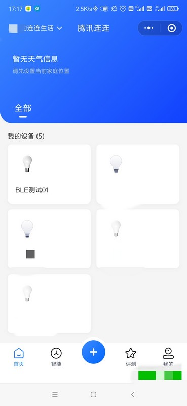
   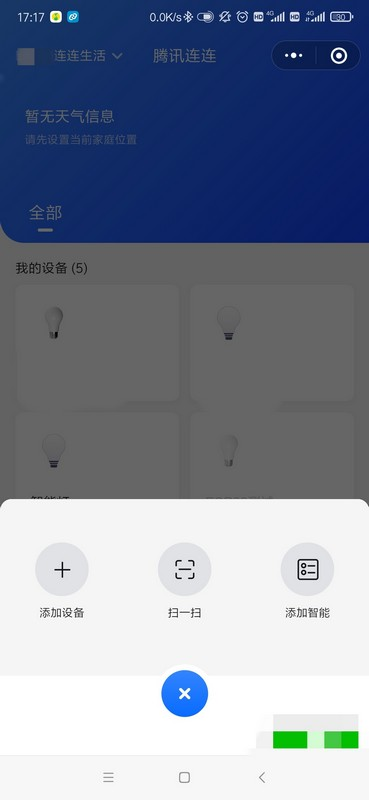
3. 待扫描到蓝牙设备后点击右侧的【连接】。  
   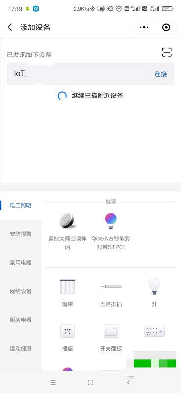
4. 在【我的设备】中打开刚刚添加的蓝牙设备。  
   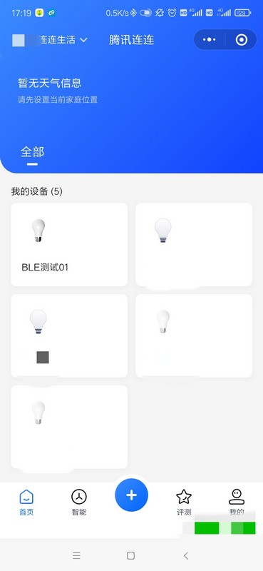
5. 点击右侧的【立即连接】连接设备，如连接失败。  
   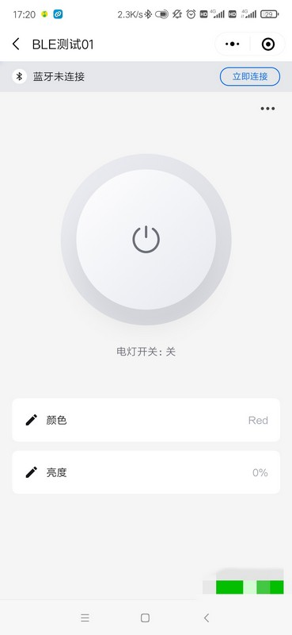
6. 连接成功后点击【电灯开关】，可以看到开发版上【LED1】随之变化。  
   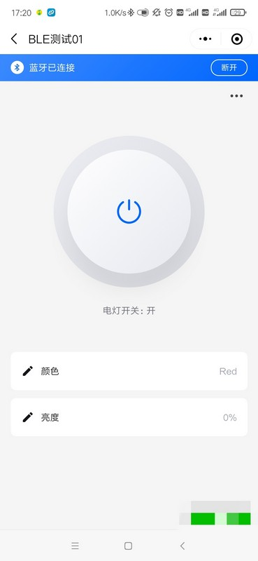
7. 点击【亮度】或【颜色】按钮进行设置  
8. 查看串口打印，可以看到亮度、颜色设置成功  
   

# 4 Q&A
Q: 实际产品中如何处理设备信息？  
A: 例程中 `DEVICE_NAME`, `SECRET_KEY`, `PRODUCT_ID` 直接写在代码中，产品中应保存在Flash中，同时修改`ble_qiot_import.c`中`ble_get_product_id()`,`ble_get_device_name()`,`ble_get_psk()`三个函数。  

Q: LLSync SDK 需要多大的 Flash 来保存配置信息？  
A: 目前只需要不到32字节。  

Q: 如果开发其他 BLE 芯片，有什么注意事项？  
A: `components\connectivity\qcloud_iot_explorer_ble\inc\ble_qiot_import.h` 为用户需要移植适配的接口，与蓝牙协议栈相关的接口在`ble_qiot_import.c`中已经完成了适配，用户仅需根据实际产品要开发`ble_write_flash()`,`ble_read_flash()`等接口。  

# 5 参考资料
[LLSync SDK](https://github.com/tencentyun/qcloud-iot-explorer-BLE-sdk-embedded) 内相关文档  
[LLSync SDK 接入指引](https://cloud.tencent.com/document/product/1081/48398)  
[LLSync SDK 使用参考](https://cloud.tencent.com/document/product/1081/48399)  
