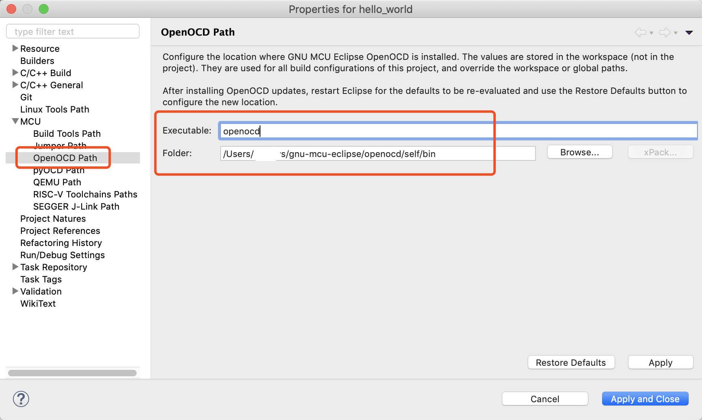
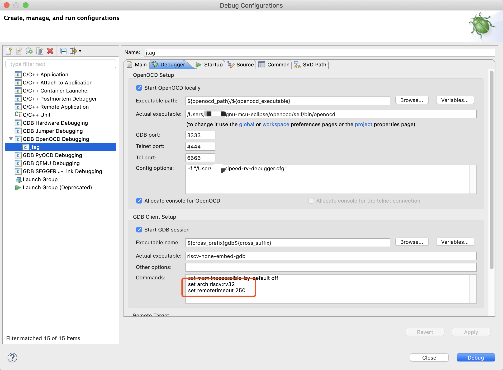

#RISC-V eclipse 开发环境搭建

## 软件列表

* eclipse
* riscv toolchain
* riscv openocd


## eclipse

下载安装过程略

## riscv toolchain

在下载页`https://github.com/gnu-mcu-eclipse/riscv-none-gcc/releases`选择相应平台下载。并解压，放到合适的目录。

## riscv openocd

签出代码```git clone https://github.com/riscv-mcu/riscv-openocd```

编译
```
./configure --enable-cmsis-dap --enable-ftdi --prefix=安装目录路径

make

make install
```


## 配置eclipse


配置toolchain路径


配置openocd路径




##调试设置

添加如下两行

```
set arch riscv:rv32
set remotetimeout 250
```




## 如果用gd-link调试

配置文件

```
adapter_khz     1000
reset_config srst_only
adapter_nsrst_assert_width 100


interface cmsis-dap

transport select jtag

#autoexit true

set _CHIPNAME riscv
jtag newtap $_CHIPNAME cpu -irlen 5 -expected-id 0x1000563d

set _TARGETNAME $_CHIPNAME.cpu
target create $_TARGETNAME riscv -chain-position $_TARGETNAME
$_TARGETNAME configure -work-area-phys 0x20000000 -work-area-size 20480 -work-area-backup 0


# Work-area is a space in RAM used for flash programming
if { [info exists WORKAREASIZE] } {
   set _WORKAREASIZE $WORKAREASIZE
} else {
   set _WORKAREASIZE 0x5000
}

# Allow overriding the Flash bank size
if { [info exists FLASH_SIZE] } {
    set _FLASH_SIZE $FLASH_SIZE
} else {
    # autodetect size
    set _FLASH_SIZE 0
}

# flash size will be probed
set _FLASHNAME $_CHIPNAME.flash

flash bank $_FLASHNAME gd32vf103 0x08000000 0 0 0 $_TARGETNAME
riscv set_reset_timeout_sec 1
init

halt
```

## 如果用sipeed riscv debugger调试

配置文件

```
adapter_khz     1000

interface ftdi
ftdi_device_desc "Dual RS232"
ftdi_vid_pid 0x0403 0x6010

transport select jtag
ftdi_layout_init 0x0008 0x001b
ftdi_layout_signal nSRST -oe 0x0020 -data 0x0020

set _CHIPNAME riscv
jtag newtap $_CHIPNAME cpu -irlen 5 -expected-id 0x1e200a6d

set _TARGETNAME $_CHIPNAME.cpu
target create $_TARGETNAME riscv -chain-position $_TARGETNAME
$_TARGETNAME configure -work-area-phys 0x20000000 -work-area-size 10000 -work-area-backup 1

set _FLASHNAME $_CHIPNAME.flash
flash bank $_FLASHNAME gd32vf103 0x08000000 0 0 0 $_TARGETNAME

riscv expose_csrs 3040-3071

init

halt
# We must turn on this because otherwise the IDE version debug cannot download the program into flash
#flash protect 0 0 last off
```