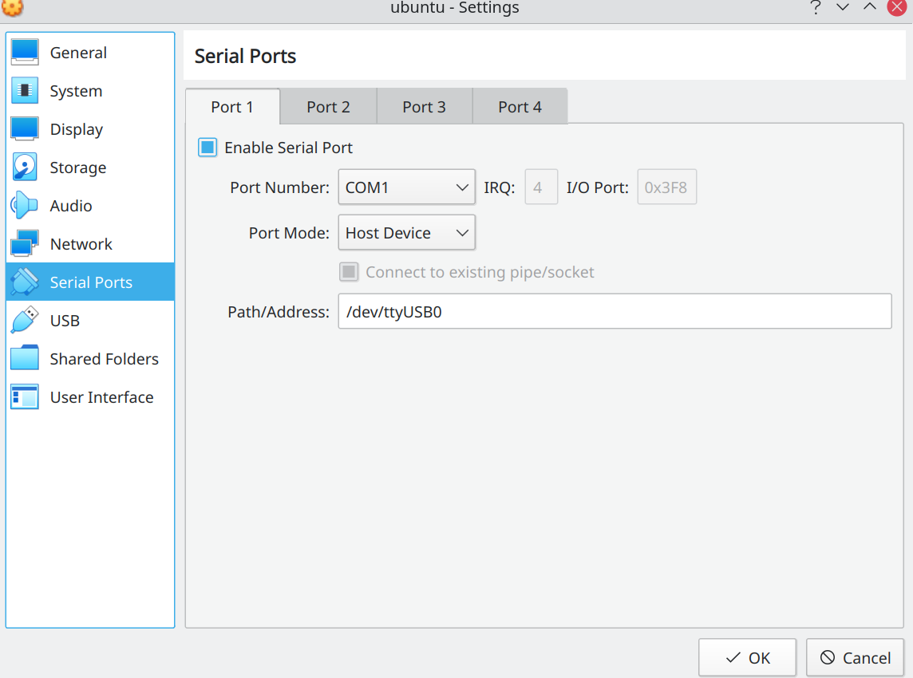

#  CH34x 串口驱动

- 基本原理

    在板子上有一个写有 CH340C 的电子元件, 这个就是电子元件的作用就是将 USB 协议转换为串口协议,
    要让这个这个电子元件正常工作, 需要安装 CH340 驱动.

    在 USB 接口里有 4 根线, 外侧的两根长金手指负责供电, 即电源线, 内侧的两根金手指比较短,
    用于数据传输, 即数据线.

    当我们在电脑上通过串口向板子传输数据时, 电脑端采用 USB 数据传输协议通过数据线传到板子上,
    然后 CH340 驱动解析 USB 数据将其转换为串口数据传输给板子上的其他元器件.

    串口除了传输数据的功能之外, 还有调试功能, 板子上程序的输出一般都是被重定向到串口中,
    然后打印出数据供调试用.

- 驱动安装

    - 使用默认系统驱动

        默认情况下, linux 内核已经带了 ch34x 的驱动, 可以使用如下命令搜索

            ls -R /lib/modules/$(uname -r) | grep ch34

        输出类似如下

            ch341.h
            ch341.ko.xz

        然后挂载 ch341 模块

            sudo modprobe ch341

        查看是否挂载成功

            lsmod | grep ch34

    - 手动编译驱动

        下载地址位于[这里](http://www.wch.cn/downloads/CH341SER_LINUX_ZIP.html), 下载之后解压, 其内容如下所示

            CH341SER_LINUX/
            +-- ch34x.c
            +-- Makefile
            +-- readme.txt

        我们需要将 ch34x.c 替换为内核中对应的代码, 可以使用 uname -r 查看内核, 假设内核版本为 5.11,
        则下载地址如下

            curl -LO https://raw.githubusercontent.com/torvalds/linux/v5.11/drivers/usb/serial/ch341.c
            mv ch341.c ch34x.c

        然后编译该模块

            make clean
            make
            sudo make load
            sudo rmmod ch341

- 使用方法

    当驱动 ch34x 加载之后, 使用如下命令监听外设连接情况

        sudo dmesg -w

    然后将串口插到电脑上, 其输出如下所示

        [ 3897.948205] usb 3-1: new full-speed USB device number 5 using xhci_hcd
        [ 3898.101841] usb 3-1: New USB device found, idVendor=1a86, idProduct=7523, bcdDevice= 2.64
        [ 3898.101846] usb 3-1: New USB device strings: Mfr=0, Product=2, SerialNumber=0
        [ 3898.101848] usb 3-1: Product: USB Serial
        [ 3898.108866] ch341 3-1:1.0: ch341-uart converter detected
        [ 3898.122905] usb 3-1: ch341-uart converter now attached to ttyUSB0

    可以看到串口已经被绑定到 /dev/ttyUSB0 上了.

- 虚拟机映射

    查看 ttyUSB0 所属组

        ls -l /dev/ttyUSB0
        crw-rw---- 1 root uucp 188, 0 Mar 28 17:49 /dev/ttyUSB0

    将其添加到该组

        sudo usermod -a -G uucp $USER

    添加完毕后, 务必重启电脑.

    然后打开 virtualbox, 关闭 ubuntu, 打开其设置, 定位到 serial port 项, 选择 Port 1,
    Port Number 为 COM1, Port Mode 为 Host Device, Path/Address 为 /dev/ttyUSB0,
    如下所示:

    

    启动 ubuntu 虚拟机, ubuntu 虚拟机中的 /dev/ttyS0 就对应于 COM1, 也就是主机的 /dev/ttyUSB0.

# 参考

- https://jjmilburn.github.io/2016/04/04/ttyUSB-to-vagrant-virtualbox/
