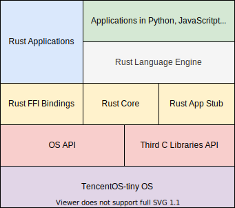

# Rust 集成

目前十分粗糙的设计架构如下所示

即 TencentOS 对硬件层进行抽象, 对上层提供系统 API 以及可能的第三方 C 库 API,
然后 Rust 对这些 API 通过胶水文件 (Wrapper) 进行封装, 提供给 Rust 应用程序使用.

这里的一个关键问题是如何将 Rust 应用程序编译后和系统源码链接起来生成一个固件.

其基本的解决思想是首先获取 Rust 应用程序编译后的对象文件(.obj), 其次获取系统源码编译后的对象文件,
最后将所有的对象文件链接起来生成系统固件.

具体实践过程中遇到的细节, 会在下面提到.

- 设置 Rust 插桩文件

    在 `目录介绍` 中的 libs 目录中的文件即为插桩文件, 其结构如下

        +-- libs/
            +-- rustapp/
                +-- stub.c
            +-- rustcore/
                +-- stub.c

    stub.c 中的内容并不重要, 插桩的意思就是占个坑, 它们的真实意图是用来生成两个库文件
    librustcore.a 和 librustapp.a 文件, 因此需要在 CMakeLists.txt 中添加如下两行

        add_library(rustcore STATIC ${ROOTDIR}/libs/rustcore/stub.c)
        add_library(rustapp STATIC ${ROOTDIR}/libs/rustapp/stub.c)

    librustapp.a 将会被真实的 rust 应用程序所替代, 那 librustcore.a 是干什么的?
    所有的 rust 程序都依赖于 Rust 的核心库即 rust core, 因此这个是必须提供,
    Rust Core 的介绍参见 [The Rust Core Library](https://doc.rust-lang.org/core/).

    rust core 库和 rust 应用程序库的生成将会在接下来节介绍.

- rust core 库的生成

    当添加完 rust 编译嵌入式的工具链时, rust core 库会自动被放到系统中固定的目录下,
    其路径的获取方式如下

        RUST_THUMBV6M_SYSROOT=$(rustc --print sysroot --target thumbv6m-none-eabi)
        RUST_LIBCORE_SRC=$(ls -1 $RUST_THUMBV6M_SYSROOT/lib/rustlib/thumbv6m-none-eabi/lib/libcore-*.rlib)

    rlib 文件实际上就是静态库文件, 可以用如下命令查看 rlib 内容

        arm-none-eabi-ar t $RUST_LIBCORE_SRC

            core-1ba29f225cca71e5.core.1ml6ett9-cgu.0.rcgu.o
            lib.rmeta

    因此我们直接将该文件复制为 librustcore.a 即可.

- rust app 库的生成

    新建的 rust 应用程序目录为 app, Rust 提供了 cargo 工具, 可以快速创建项目,
    进入项目根目录执行如下命令即可生成 app 目录(也可以使用 --lib 直接生成库文件目录结构)

        cargo new app

    - 进入 app/src 目录, 删除 main.rs, 然后新建 lib.rs
    - 配置 app/Cargo.toml

        配置其内容如下所示

            [package]
            name = "app"
            version = "0.1.0"
            authors = ["ikey4u <pwnkeeper@gmail.com>"]
            edition = "2018"
            
            # See more keys and their definitions at https://doc.rust-lang.org/cargo/reference/manifest.html
            
            [dependencies]
            cty = "0.2.0"        # String utilities from cty library: https://crates.io/crates/cty
            cstr_core = "0.1.2"  # String utilities from cstr_core library: https://crates.io/crates/cstr_core
            cortex-m = "0.5.8"   # Arm Cortex-M utilities: https://crates.io/crates/cortex-m
            
            [lib]
            name = "tosrs"
            test = false
            bench = false
            
            # Options for `cargo build`
            [profile.dev]
            panic = "abort"     # Disable stack unwinding on panic
            
            # Options for `cargo build --release`
            [profile.release]
            panic = "abort"     # Disable stack unwinding on panic
            codegen-units = 1   # Better optimizations
            debug = true        # Symbols are nice and they don't increase the size on Flash lto = true          # Better optimizations

    - 配置 app/.cargo/config 文件

        配置其内容如下所示

            [target.thumbv6m-none-eabi]
            
            [target.'cfg(all(target_arch = "arm", target_os = "none"))']
            
            rustflags = [
              # LLD (shipped with the Rust toolchain) is used as the default linker
              "-C", "link-arg=-Tlink.x",
            ]
            
            [build]
            target = "thumbv6m-none-eabi"

        注意 tos_evb_g0 对应的 target 是 thumbv6m-none-eabi.

    项目中最终的目录如下所示

        +-- app/
            +-- src/
                + bridge.rs
                + lib.rs
            +-- Cargo.toml
            +-- .cargo/
                +-- config
    
    配置完成后, 便可在 app 目录执行如下命令编译

        cargo build

    编译的中间产物位于 `app/target/thumbv6m-none-eabi/debug/deps` 中,
    这里面是一系列的 .rlib 文件(静态库文件), 这些库文件包含了应用程序代码及其依赖的库代码.

    我们将这些库包含的所有对象文件提取出来重新打包成一个新的库文件, 即为 librustapp.a 文件.

    其中 `bridge.rs` 声明了胶水文件中的 API 接口, 比如

        use cty::*;

        /// These glue functions are from tosglue.c
        extern {
            pub fn rust_print(msg: *const u8);
        }

    `lib.rs` 则是应用程序代码, 示例如下

        #![no_std]

        extern crate cortex_m;

        mod bridge;

        use crate::bridge::*;
        use cty::*;

        #[no_mangle]
        pub extern "C" fn application_entry_rust() -> c_void {
            unsafe {
                rust_mqtt_daemon();
            }

            loop {
                unsafe {
                    rust_print(b"[+] Welcome to the RUST-WORLD in TencentOS :)".as_ptr());
                }
            }
        }

- 胶水文件

    Rust 调用系统 API 或者第三方 C 库的 API 通过胶水文件 tosglue.c 实现,
    这里的做法是将 tosglue.c 编译为一个库文件, 但是不参与链接, 而是提取其对象文件,
    合并到 librustapp.a 中, 在 CMakeLists.txt 中添加如下行

        add_library(tosglue STATIC ${ROOTDIR}/tosglue.c)

    tosglue.c 中的一个 API 示例如下

        void rust_print(const char *msg) {
            printf("%s\r\n", msg);
        }

- 一键编译生成固件

    在编译之前还需要注意修改 CMakeLists.txt, 保证固件链接了 librustcore.a 和 librustapp.a

        target_link_libraries(${PROJECT_NAME} ${LIBS} c nosys rustcore rustapp)

    这样设置之后, 我们再替换完 librustcore.a 和 librustapp.a 之后,
    就可以强制重新生成新的固件.

    最终的编译脚本参见 [build.sh](../build.sh)

# 参考

- [Hosting Embedded Rust apps on Apache Mynewt with STM32 Blue Pill](https://medium.com/@ly.lee/hosting-embedded-rust-apps-on-apache-mynewt-with-stm32-blue-pill-c86b119fe5f)
- [STM32L0 Rust Part 1 - Getting Started](https://craigjb.com/2019/12/31/stm32l0-rust/)
- [FreeRTOS meets Rust](http://www.hashmismatch.net/freertos-meets-rust/)
