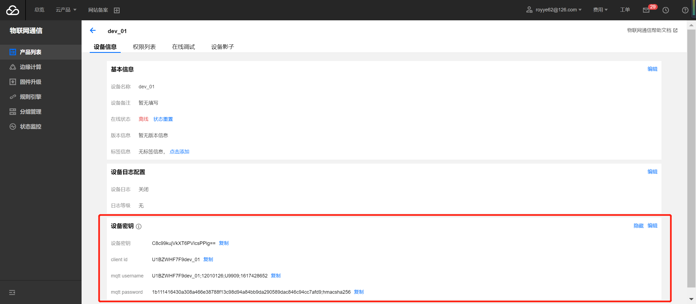

### 小程序云开发DEMO-智慧农业

本示例小程序配合 TencentOS_tiny开发板 + 智慧农业传感器扩展板(E53-IA1) 使用

+ 设备端
  + 示例代码路径
  TencentOS-tiny/examples/sensor_e53_ia1_e2e_demo

  + 配置信息 e53_ia1_e2e_demo_config.h
```c
#define MQTT_PRODUCT_ID         "U1BZWHF7F9"
#define MQTT_DEV_NAME           "dev_01"
#define MQTT_CLIENT_ID          "U1BZWHF7F9dev_01"
#define MQTT_USR_NAME           "U1BZWHF7F9dev_01;12010126;O3I57;1611533066"
#define MQTT_PASSWORD           "6ebcf20c9f7f725b5bcf18a85cc7a49479f489eea65946f92ba18a51a135c89e;hmacsha256"
#define MQTT_SUBSCRIBE_TOPIC    "U1BZWHF7F9/dev_01/data"
#define MQTT_PUBLISH_TOPIC      "$shadow/operation/U1BZWHF7F9/dev_01" // $shadow/operation/{MQTT_PRODUCT_ID}/{MQTT_DEV_NAME}
```
  在 腾讯云控制台-物联网通信-产品-设备-设备信息-设备密钥中 获取

  

+ 云开发
  + 云函数说明
    + iothub-shadow-query 调用接口：物联网通信-设备影子相关接口-获取设备影子
    + iothub-publish 调用接口：物联网通信-消息相关接口-发布消息
  + 云函数开发指引参考：
    + [doc/17.Mini_Program_Quick_Start.md](https://github.com/Tencent/TencentOS-tiny/blob/master/doc/17.Mini_Program_Quick_Start.md) - 云开发方式（云函数） 