# 基于STM32Cube MX开发的TencentOS-Tiny软件包

TencentOS-Tiny software package based on STM32Cube MX

2021/11/10

东南大学

导师：汪礼超

学员：崔林威

Email：1797878653@qq.com

<https://github.com/OpenAtomFoundation/TencentOS-tiny>

# 摘要

腾讯物联网操作系统（TencentOS
tiny）是腾讯面向物联网领域开发的实时操作系统，具有低功耗，低资源占用，模块化，可裁剪等特性。TencentOS
tiny提供了最精简的 RTOS 内核，内核组件可裁剪可配置，可灵活移植到多种终端
MCU上；基于RTOS内核提供了COAP/MQTT/TLS/DTLS等常用物联网协议栈及组件，方便用户快速接入腾讯云物联网通信IoT
Hub；同时，为物联网终端厂家提供一站式软件解决方案，方便各种物联网设备快速接入腾讯云，可支撑智慧城市、智能穿戴、车联网等多种行业应用。

为了减少开发人员移植TencentOS
tiny到STM32系列单片机上的开发时间，研究了**STM32Cube MX软件包的制作**，基于STM32
PackCreator完成了TencentOS Tiny软件包的封装，并在STM32Cube IDE和MDK-ARM
v5上完成了软件包的**移植测试**，从而用户在安装本软件包后，能够使用pack**在STM32Cube
MX上直**接生成适合不同MCU的TencentOS Tiny工程。

目录

[1、STM32 Cube MX软件包介绍](#1stm32-cube-mx软件包介绍)

[1.1 软件包简介](#11-软件包简介)

[1.2 软件包制作](#12-软件包开发)

[1.2.1 软件包开发过程](#121-软件包开发过程)

[1.2.2 PDSC文件的编写](#122-利用stm32packcreator制作软件包)

[1.2.3 生成软件包](#_Toc82013881)

[2、TencentOS-tiny软件包](#2tencentos-tiny软件包)

[2.1 软件包内容](#21-软件包内容)

[2.2 软件包安装](#22-软件包安装)

[3、软件包测试](#3软件包测试)

[3.1 ARM内核移植TencentOS
tiny软件包](#31-stm32-mcu移植测试生成stm32-cubeide工程)

[3.2 STM32不依赖裸机工程移植](#32-stm32-board移植测试生成mdk-arm-v5工程)

[3.3 单片机裸机工程移植](#33-单片机测试)

[4、总结](#_Toc82013889)

[5、开发参考](#4开发参考)

[6、附录-移植配置参考](#_Toc82013891)

[6.1 MDK5.14版本移植到ARM内核](#_Toc82013892)

[6.1.1 Cortex-M0内核移植](#_Toc82013893)

[6.1.2 Cortex-M0+内核移植](#_Toc82013894)

[6.1.3 Cortex-M3内核移植](#_Toc82013895)

[6.1.4 Cortex-M4内核移植](#_Toc82013896)

[6.1.5 Cortex-M7内核移植](#_Toc82013897)

[6.2 MDK5.14版本移植到基于ARM内核的芯片](#_Toc82013898)

[6.2.1 移植到stm32f103c8芯片](#_Toc82013899)

[6.2.2 移植到stm32f767igt芯片](#_Toc82013900)

[6.3
MDK5.30和MDK5.35版本移植（Cortex-M0+、0、3、4、7内核和芯片）](#_Toc82013901)

[6.4 MDK5.30和MDK5.35版本移植（Cortex-M23、33）](#_Toc82013902)

[6.4.1 Cortex-M23内核移植](#_Toc82013903)

[6.4.2 Cortex-M33内核移植](#_Toc82013904)

# 1、STM32 Cube MX软件包介绍

## 1.1 软件包简介

在进行嵌入式软件开发时，ARM为我们提供了软件包功能，能够将软件算法等模块进行集成封装，从而方便第三方用户使用。ARM软件包能够为微控制器设备和开发板提供支持，包含软件组件（Software
Component）如驱动程序和中间件，还可以包含示例项目和代码模板等，主要有以下类型的软件包：

(1) 器件系列包（Device Family
Pack）：由硅供应商或工具供应商生成，为特定的目标微控制器创建软件应用提供支持；

(2) 板级支持包（Board Support
Pack）：由电路板供应商发布，为安装在电路板上的外围硬件提供软件支持。

(3) CMSIS软件包：由ARM提供，包括对CMSIS核心、DSP和RTOS的支持；

(4) 中间件包（Middleware
Pack）：由芯片供应商、工具供应商或第三方创建；通过提供对常用软件组件（如软件堆栈、特殊硬件库等）的软件集成，从而减少开发时间；

(5) 内部组件（In-house components）：由工具用户开发，用于内部或外部分发。

软件组件包括以下几部分：

(1) 源代码、库、头文件/配置文件和文档；

(2) 完整的示例项目，展示了软件组件的使用，可以下载并在评估硬件上执行；

(3) 代码模板，方便使用软件组件。

一个完整的软件包是一个ZIP文件，包含所有需要的软件库和文件，以及一个包含软件包所有信息的包描述文件（PDSC文件），ARM软件包的结构是在CMSIS中定义的(<http://www.keil.com/CMSIS/Pack>)。

STM32
CubeMX是ST公司推出了专门用于生成STM32的HAL代码的代码生成软件，可以通过可视化界面完成工程的配置，同时生成能够在STM32
CubeMX、Keil等软件中运行的工程。STM32 Cube
MX软件包是在ARM软件包的基础上，结合ST公司提供的软件包生成工具STM32
PackCreator制作的，利用这个软件我们可以很方便地以图形化界面的方式进行软件包的制作。

如下图所示，使用STM32PackCreator需要我们的操作系统安装Java™ Runtime Environment
(JRE)和JavaFX™，目前STM32CubeMX已经更新到了6.3版本，但这个版本并没有集成JavaFX，最为方便的方式是安装STM32
CubeMX 6.2版本，省去了JavaFX的配置问题。

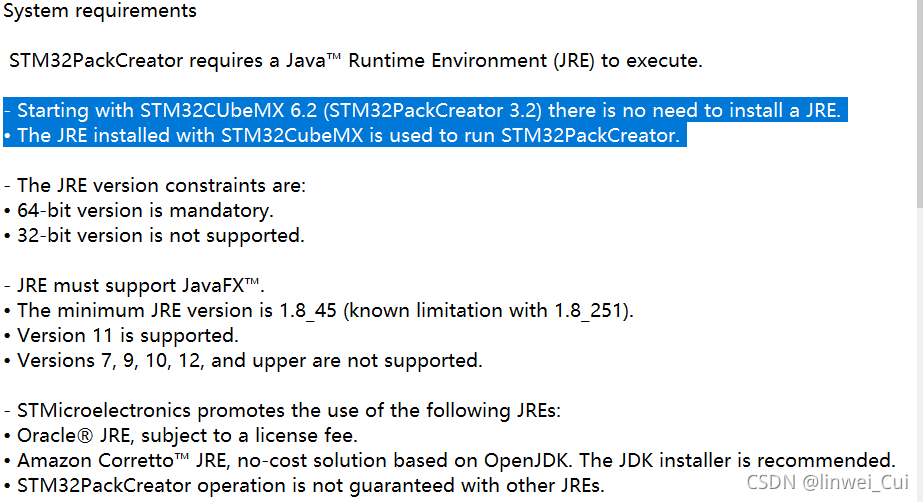

图1.1 STM32PackCreator使用要求

具体步骤如下：

（1）安装STM32CubeMX6.2.0：[STM32CubeMX - STM32Cube初始化代码生成器 -
STMicroelectronics](https://www.st.com/zh/development-tools/stm32cubemx.html#get-software)；

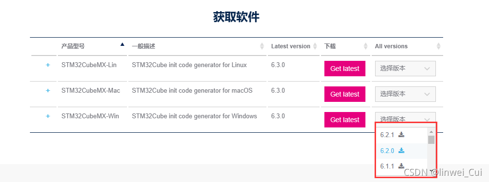

图1.2 下载STM32CubeMX6.2.0

（2）双击安装目录下的STM32PackCreator，此时会提示需要安装JRE，点击确定，跳转到[https://java.com/zh-CN/download/](https://aijishu.com/link?target=https%3A%2F%2Fjava.com%2Fzh-CN%2Fdownload%2F)，然后下载安装。

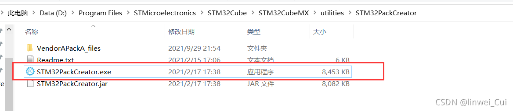

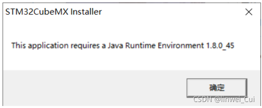

图1.3 STM32PackCreator使用前的配置

（3）然后再次双击打开STM32PackCreator.exe，STM32 PackCreator的界面如下图所示。

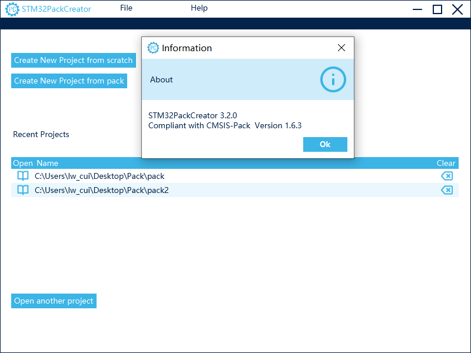

图1.4 STM32 PackCreator界面

## 1.2 软件包开发

### 1.2.1 软件包开发过程

软件包的开发过程相当于完成了一项产品的制作，因此引入产品生命周期管理（PLM）的概念，PLM包括以下四个阶段：（1）概念的产生，基于软件包需求进行产品定义，并创建第一个功能原型；（2）设计，根据技术特征和要求，进行原型测试和产品的实施，通过广泛的测试验证产品的功能与规格；（3）发布，产品被制造出来并推向市场；（4）服务，对产品的维护，包括对客户的支持，最后不断优化，结束产品的周期。

在制作软件包时，主要面临以下几个过程：

图1.5 软件包开发流程

首先，根据特定组件生成软件包即根据需求将相应的头文件、库文件等软件组件利用PDSC文件进行组织，在组织完成后即可利用软件包生成工具生成对应版本的软件包，然后对新生成的软件包进行测试，给出示例测试程序，再将其包含如PDSC文件中，最后经测试完成后生成最终的软件包。

### 1.2.2 利用STM32PackCreator制作软件包

STM32PackCreator能够通过图形化界面设计软件包，省去了我们手动编写PDSC文件和软件包生成脚本文件的步骤，使用起来非常方便快捷，以下是使用STM32PackCreator制作软件包的步骤。

（1）打开STM32 PackCreator后，点击File-new project from scratch。

图1.6 生成新软件包

（2）进行软件包的配置，包括软件包生成的文件夹、软件包的vendor、name和description属性。

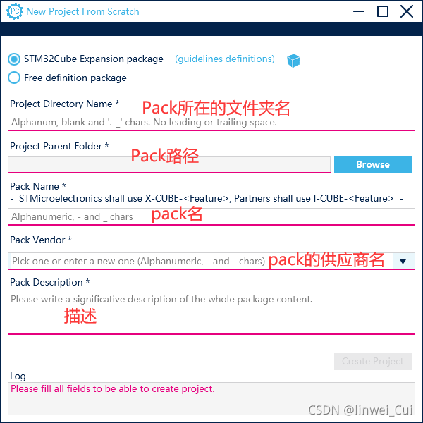

图1.7 软件包初始配置

（3）配置完成后，可以看到有四个属性栏，他们分别代表软件包的基本配置、版本控制、组件内容和附加文件，如图1.7所示：

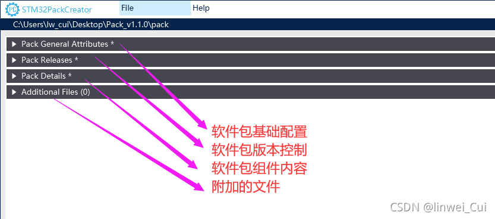

图1.8 软件包属性栏

（4）如下为制作Tencent OS-tiny软件包时的配置：

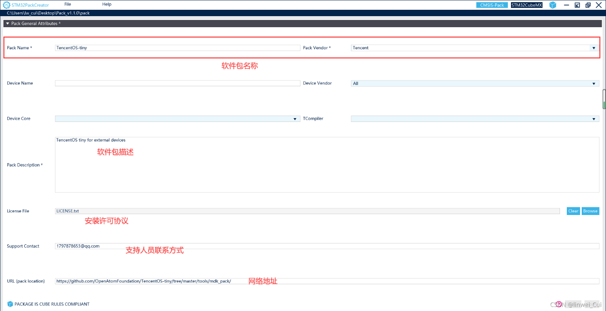

（a）基础配置

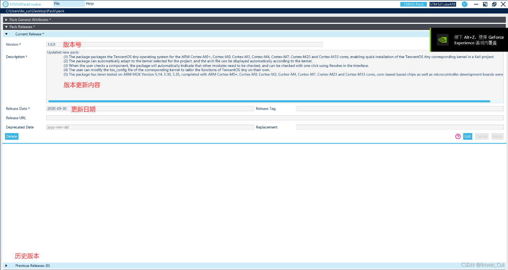

（b）软件包版本控制

图1.9 软件包配置

（5）制作软件包的关键在于Pack
Details的配置，这里实际上就是手工编写PDSC文件的图形化界面显示，我们按照ARM
PDSC文件的编写规范设计condition、设计组件结构、添加组件即可。

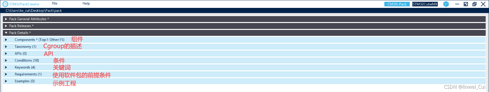

图1.10 软件包组件配置

（6）添加附件，在Additional
Files中，我们需要添加上软件包的说明文件（README.md）、利用软件包生成的示例工程（Projects）和STM32CubeMX文件夹，此时我们点击File-Save
and Generate
Pack，可以在之前设定的路径下看到软件包。然后我们再次将这个软件包也加入到Additional
Files中，如图1.11所示，我们再次点击File-Save and Generate
Pack，就可以生成一个完整的STM32CubeMX软件包了。

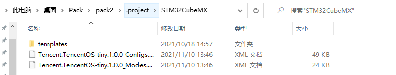

图1.11 STM32CubeMX文件夹

图1.12 Additional Files界面

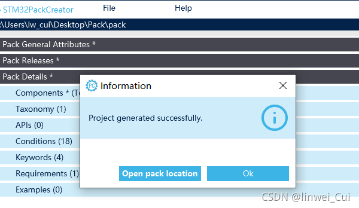

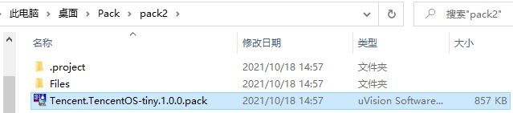

图1.13 生成软件包

（7）另外，STM32PackCreator提供了参数预先配置的功能，使得我们在STM32 Cube
MX生成工程时，可以对软件包的参数进行提前配置。首先在图1.13(a)中添加我们需要用户提前配置的一系列参数，然后在图1.13(b)中制作一个模板文件，此处我设置为头文件的形式，然后将之前设置的一系列参数添加过来并保存，这样用户在使用软件包生成工程的时候就可以预先配置参数，并在生成工程时自动生成名为tos_config的文件。

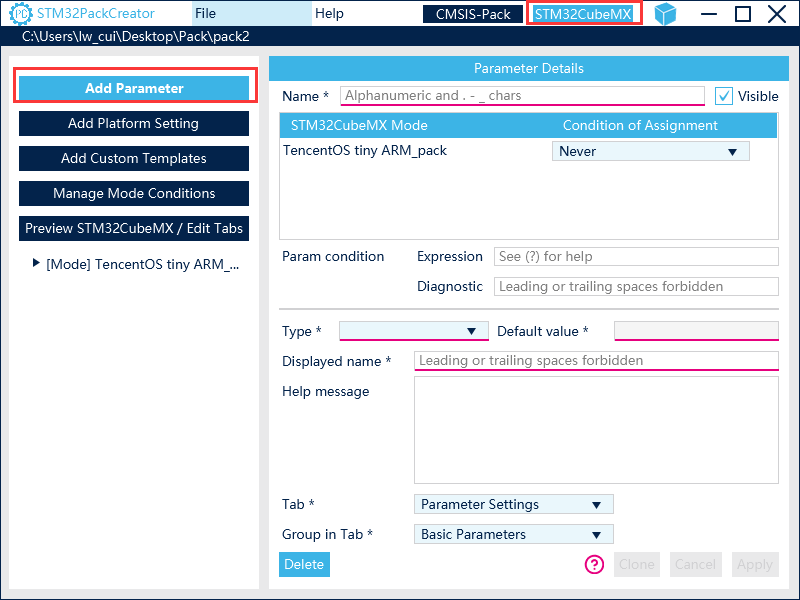
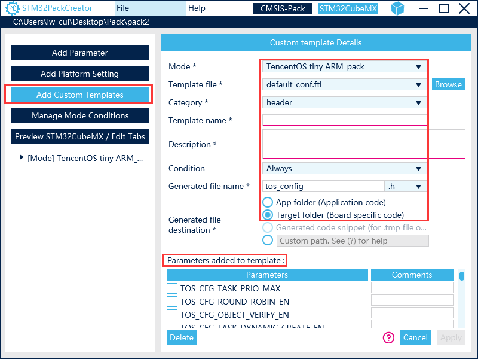

（a） （b）

图1.14 软件包参数配置

# 2、TencentOS-tiny软件包

## 2.1 软件包内容

结合TencentOS tiny的算法架构，本文设计的软件包包括如表2-1所示的内容：

表2-1 软件包内容

| 内容     | 功能                                                                                                                          |                                              |
|----------|-------------------------------------------------------------------------------------------------------------------------------|----------------------------------------------|
| arch     | 包括TencentOS-tiny\\arch\\arm下内核为Cortex-M0+、Cortex-M0、Cortex-M3、Cortex-M4、Cortex-M7、Cortex-M23、Cortex-M33的arch文件 |                                              |
| kernel   | 包括TencentOS-tiny\\kernel下的core、hal路径中的文件、tos_config文件                                                           |                                              |
| cmsis_os | 对应TencentOS-tiny\\osal\\cmsis_os的文件                                                                                      |                                              |
| example  | helloworld_main                                                                                                               | 用于测试软件包的main文件                     |
|          | mcu_it.c                                                                                                                      | 移植软件包时需要按照该文件对中断函数进行修改 |
|          | mcu_platform.h                                                                                                                | 用户可在此文件在添加对应单片机的头文件       |

软件包具有以下功能：

（1）软件包针对ARMCortex-M0+、Cortex-M0、Cortex-M3、Cortex-M4、Cortex-M7、Cortex-M23和Cortex-M33内核进行了TencentOS
tiny软件的封装，用户在安装软件包后能够快速将TencentOS tiny相应内核的Keil工程中；

（2）软件包能够自动适应用户所选的内核，arch文件能够根据内核自动显示，从而方便用户使用；

（3）用户在勾选一个组件时，软件包会自动提示还需要勾选其他模块，并可利用界面中的Resolve一键勾选，防止遗漏；

（4）用户可在STM32CubeMX上修改tos_config文件中的参数，对TencentOS
tiny的功能进行裁剪。

## 2.2 软件包安装

接下来介绍Tencent.TencentOS-tiny软件包的安装，首先打开STM32 Cube
MX软件，如图2.1(a)所示，点击INSTALL/REMOVE，然后将软件包拖进来，点击I agree to
all the terms of the preceding License
Agreement，再点击next进行安装，安装完成界面如图2.1(b)所示。

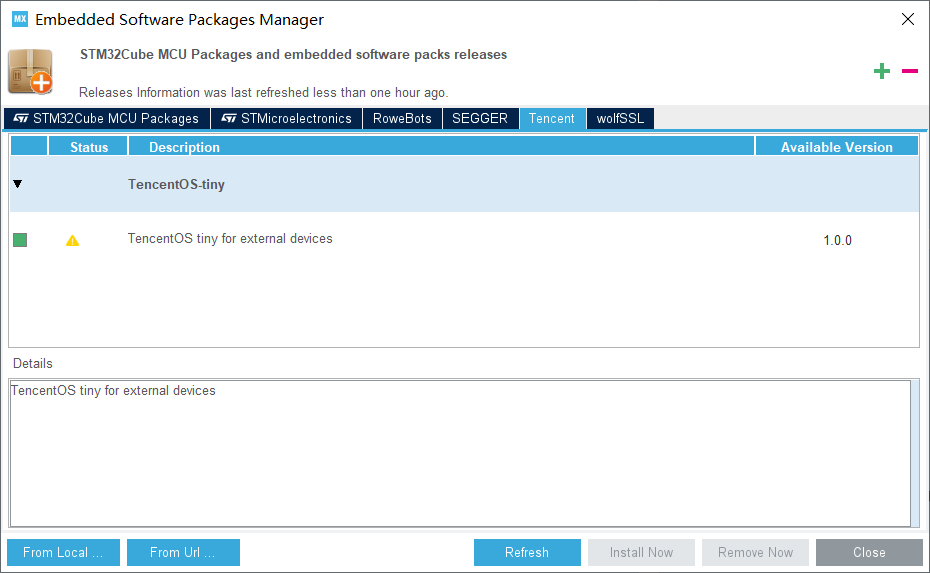

（a） （b）

图2.1 软件包安装

安装好的软件包可以在安装路径中查看内容，路径在Help-Updater Settings中查看。

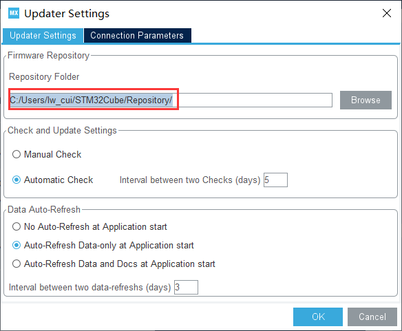

(a)安装路径

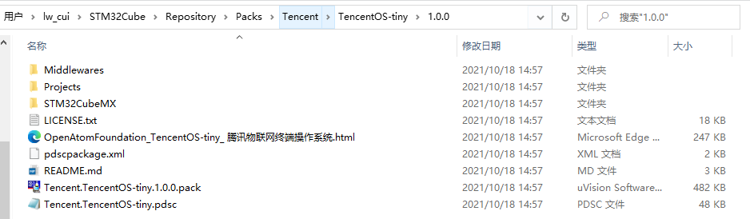

(b) 软件包安装查看

图2.2 软件包安装

# 3、软件包测试

## 3.1 STM32 MCU移植测试（生成STM32 CubeIDE工程）

移植步骤如下：

（1）点击ACCESS TO MCU SELECTOR：

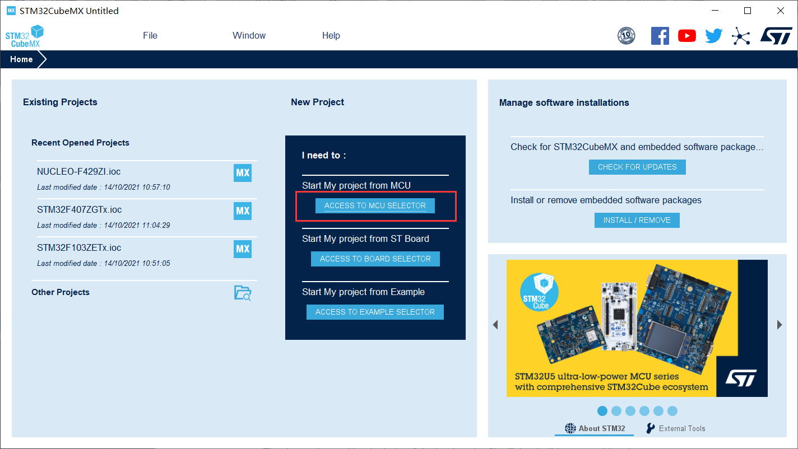

图3.1 打开MCU选择的界面

（2）选择STM32F407ZGTx，点击Start Project：

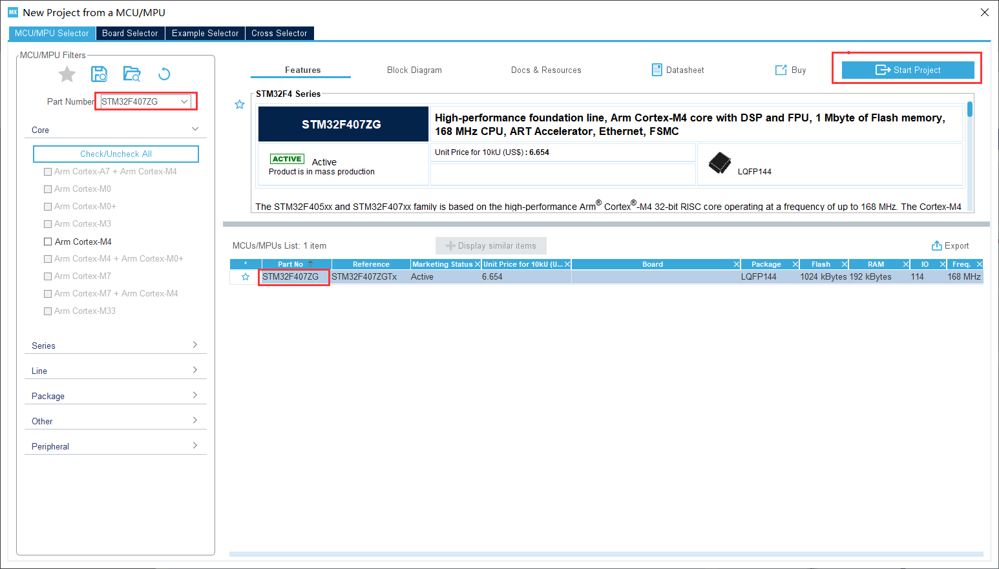

图3.2 选择MCU

（3）点击红框中选项

图3.3 选择软件包

（4）此时生成使用STM32
CubeIDE编译的工程，首先选择gcc版本的arch（如果是MDK-ARM版本的话就点击armcc版本的arch），然后点击黄色感叹号，再点击Resolve。之后手动添加helloworld_main和cmsis_os，并选择对应MCU版本的mcu_platform。最后点击ok完成配置。

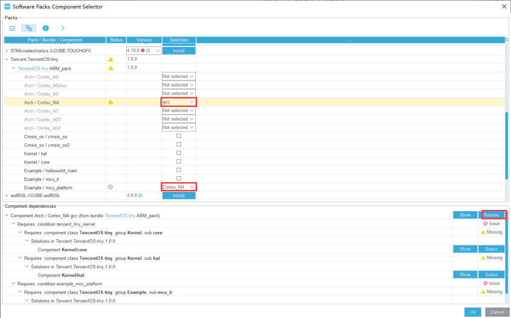

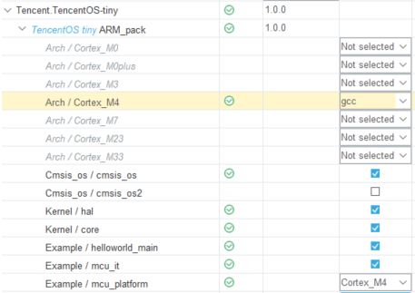

图3.4 软件包配置

（5）点击Software Packs，打勾，并在下方进行软件包的参数配置。

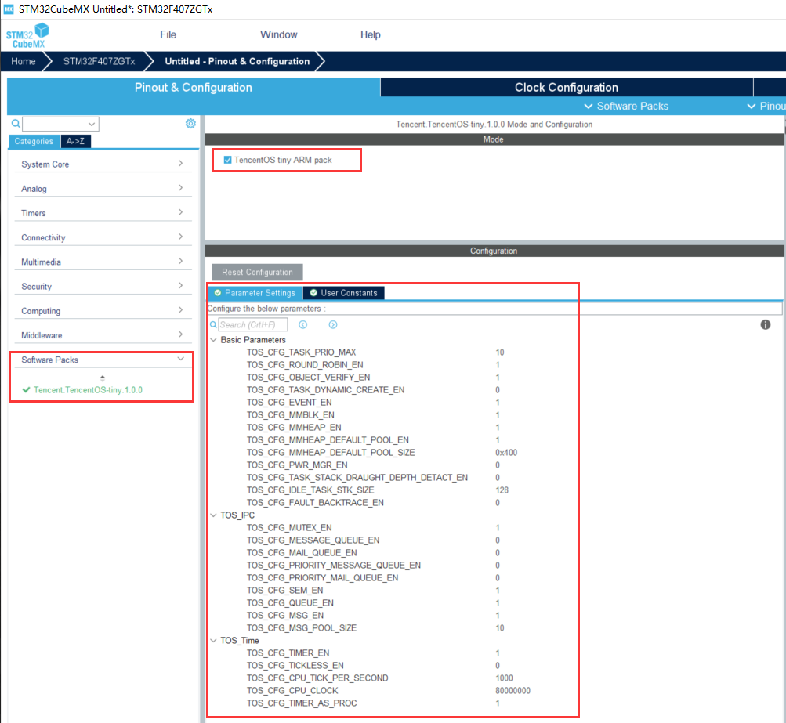

图3.5 软件包参数配置

（6）注释掉中断函数PendSV()、void
SysTick_Handler(void)等，这些在软件包中都进行了配置。

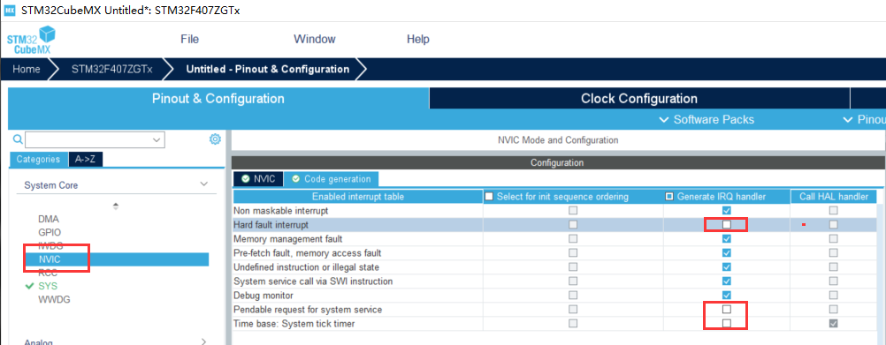

图3.6 中断函数处理

（7）进行生成工程配置，按如下界面进行配置，最后点击GENERATE CODE，并点击Open
Project。

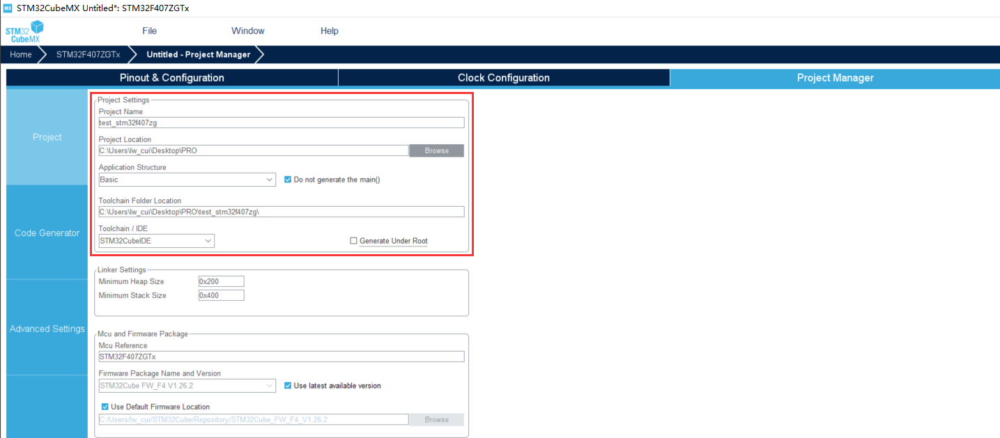

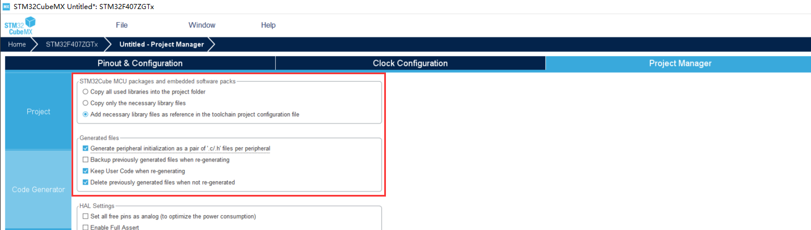

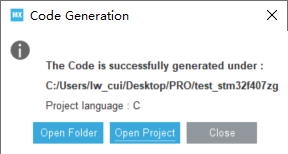

图3.7 工程生成配置

（8）在tos_config头文件中加入头文件：**\#include**
"mcu_platform_M4.h"，点击Build All，如下界面所示，编译通过，完成软件包的移植。

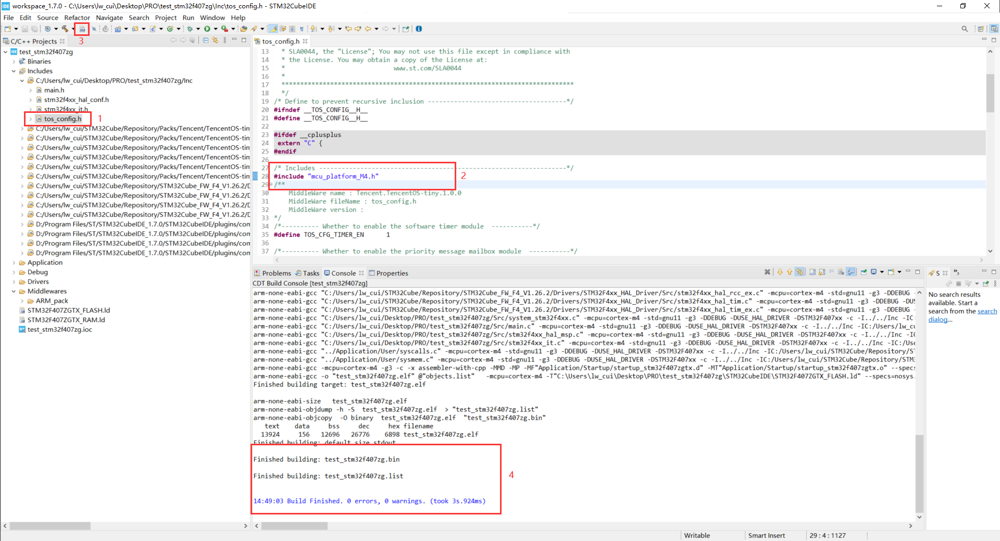

图3.8 工程配置与编译

## 3.2 STM32 Board移植测试（生成MDK-ARM v5工程）

（1）点击ACCESS TO BOARD SELECTOR，选择Board为NUCLEO-F401RE，点击Start Project：

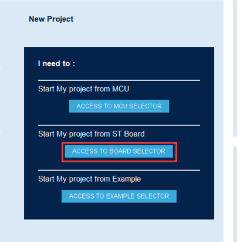

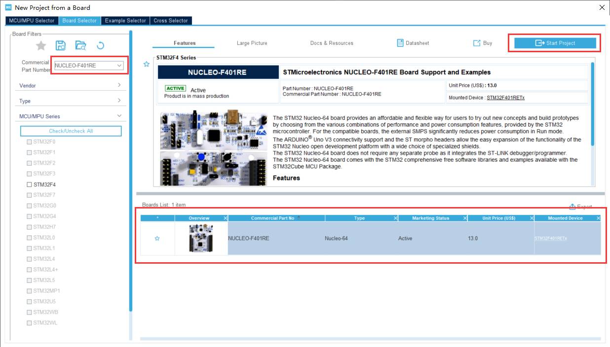

图3.9 Board选择

（2）点击红框中选项

图3.10 选择软件包

（3）此时生成使用MDK-ARM编译的工程，首先选择armcc版本的arch（如果是STM32
CubeIDE版本的话就点击gcc版本的arch），然后点击黄色感叹号，再点击Resolve。之后手动添加helloworld_main和cmsis_os，并选择对应MCU版本的mcu_platform。最后点击ok完成配置。

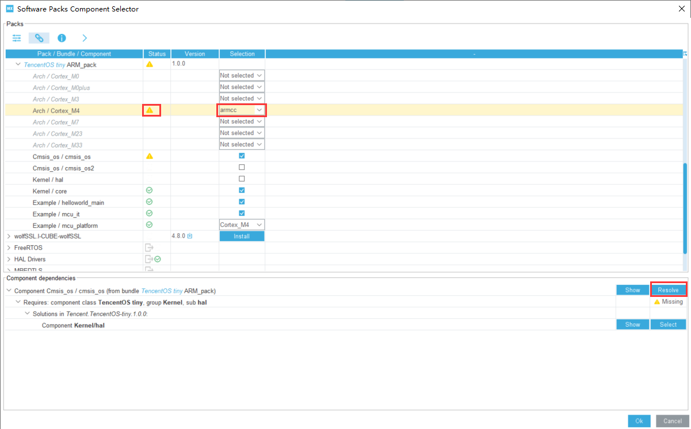

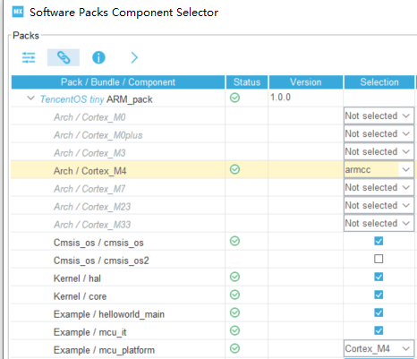

图3.11 软件包配置

（4）点击Software Packs，打勾，并在下方进行软件包的参数配置。

图3.12 软件包参数配置

（5）注释掉中断函数PendSV()、void
SysTick_Handler(void)等，这些在软件包中都进行了配置。

图3.13 中断函数处理

（6）进行生成工程配置，按如下界面进行配置，最后点击GENERATE CODE，并点击Open
Project。

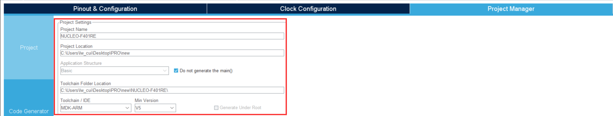

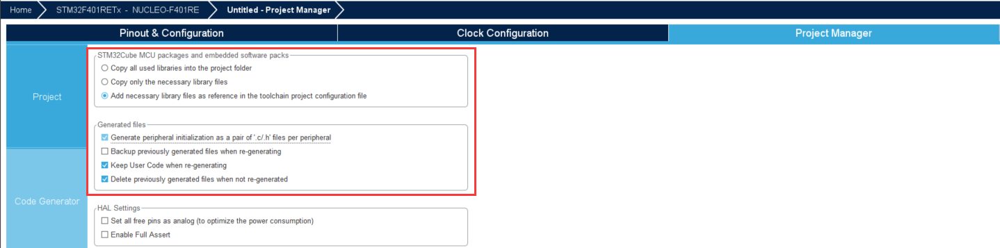

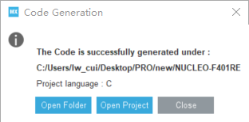

图3.14 工程生成配置

（8）打开main_example.c，跳转到tos_config头文件，在其中加入头文件：**\#include**
"mcu_platform_M4.h"，点击Build All，如下界面所示，编译通过，完成软件包的移植。

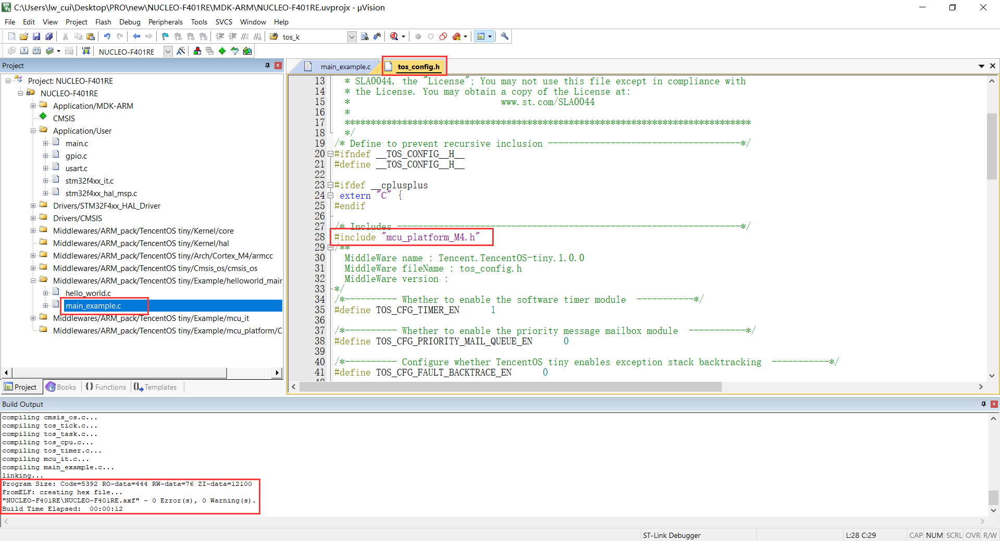

图3.15 移植编译

## 3.3 单片机测试

对单片机开发板进行测试，以正点原子探索者STM32F407ZGT6为例介绍TencentOS-tiny软件包的移植。

（1）点击ACCESS TO MCU SELECTOR：

图3.16 打开MCU选择的界面

（2）选择STM32F407ZGTx，点击Start Project：

图3.17 选择MCU

（3）点击红框中选项

图3.18 选择软件包

（4）此时生成使用MDK-ARM编译的工程，首先选择armcc版本的arch（如果是STM32
CubeIDE版本的话就点击gcc版本的arch），然后点击黄色感叹号，再点击Resolve。之后手动添加cmsis_os，并选择对应MCU版本的mcu_platform。最后点击ok完成配置。

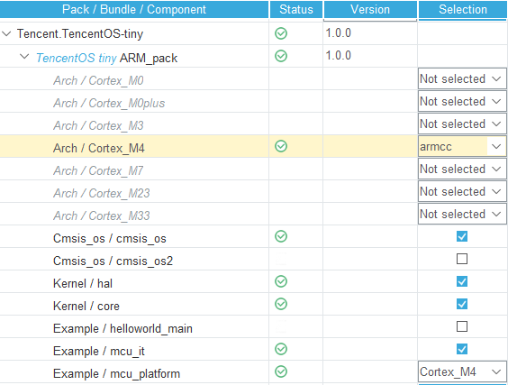

图3.19 软件包配置

（5）点击Software Packs，打勾，并在下方进行软件包的参数配置。

图3.20 软件包参数配置

（6）注释掉中断函数PendSV()、void
SysTick_Handler(void)等，这些在软件包中都进行了配置，然后我们还需要对串口、下载等模块进行修改，如下：

（a）中断函数处理

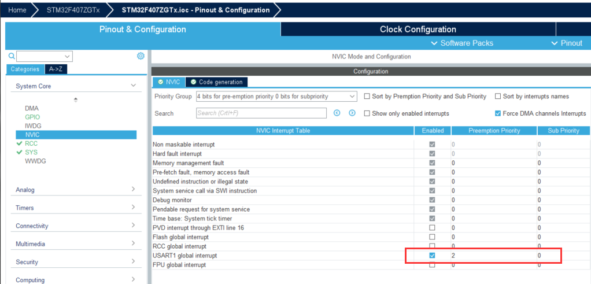

（b）中断优先级配置

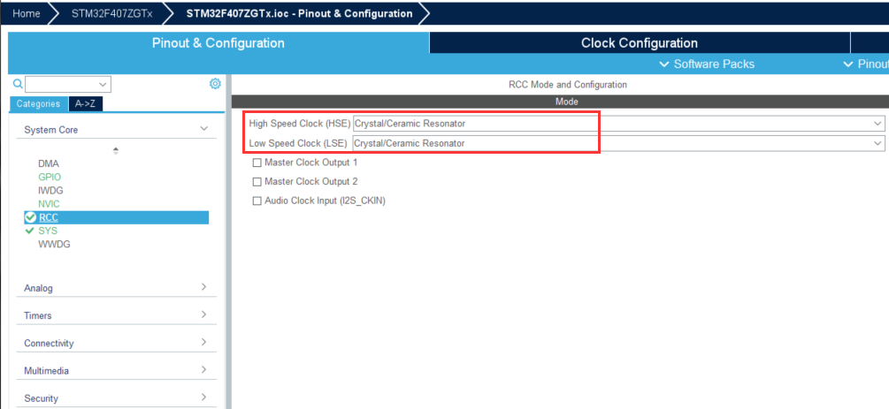

（c）RCC配置

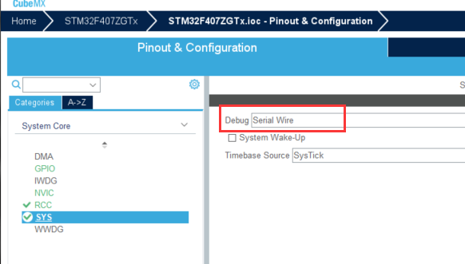

（d）SYS配置

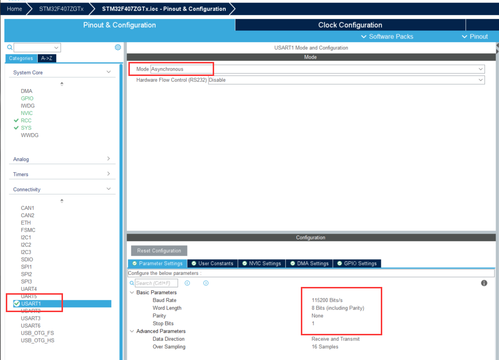

（e）串口1配置

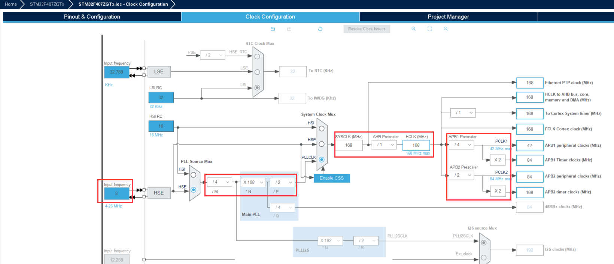

（f）时钟树配置

图3.21 模块配置

（7）进行生成工程配置，按如下界面进行配置，最后点击右上角GENERATE
CODE，生成工程后点击Open Project。

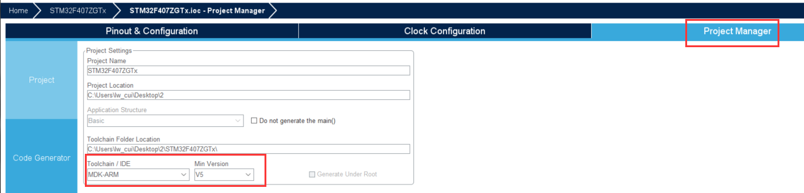

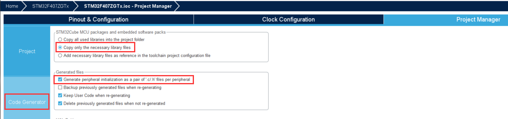

图3.22 工程配置

（8）打开tos_config头文件，在其中加入头文件：**\#include**
"mcu_platform_M4.h"，然后使用如下的main文件：

/\* USER CODE BEGIN Includes \*/

\#include "cmsis_os.h"

/\* USER CODE END Includes \*/

/\* USER CODE BEGIN 0 \*/

//task1

\#define TASK1_STK_SIZE 512

void task1(void \*pdata);

osThreadDef(task1, osPriorityNormal, 1, TASK1_STK_SIZE);

//task2

\#define TASK2_STK_SIZE 512

void task2(void \*pdata);

osThreadDef(task2, osPriorityNormal, 1, TASK2_STK_SIZE);

void task1(void \*pdata)

{

int count = 1;

char buffer[64] = {0};

while(1) {

snprintf(buffer, sizeof(buffer), "task 1 %04d\\r\\n", count++);

HAL_UART_Transmit(&huart1, (uint8_t\*)buffer, strlen(buffer), 0xFFFF);

osDelay(2000);

}

}

void task2(void \*pdata)

{

int count = 1;

char buffer[64] = {0};

while(1) {

snprintf(buffer, sizeof(buffer), "task 2 %04d\\r\\n", count++);

HAL_UART_Transmit(&huart1, (uint8_t\*)buffer, strlen(buffer), 0xFFFF);

osDelay(1000);

}

}

/\* USER CODE END 0 \*/

int main(void)

{

/\* USER CODE BEGIN 1 \*/

/\* USER CODE END 1 \*/

/\* MCU Configuration--------------------------------------------------------\*/

/\* Reset of all peripherals, Initializes the Flash interface and the Systick.
\*/

HAL_Init();

/\* USER CODE BEGIN Init \*/

/\* USER CODE END Init \*/

/\* Configure the system clock \*/

SystemClock_Config();

/\* USER CODE BEGIN SysInit \*/

/\* USER CODE END SysInit \*/

/\* Initialize all configured peripherals \*/

MX_GPIO_Init();

MX_USART1_UART_Init();

/\* USER CODE BEGIN 2 \*/

osKernelInitialize(); //TOS Tiny kernel initialize

osThreadCreate(osThread(task1), NULL);// Create task1

osThreadCreate(osThread(task2), NULL);// Create task2

osKernelStart(); //Start TOS Tiny

/\* USER CODE END 2 \*/

/\* Infinite loop \*/

/\* USER CODE BEGIN WHILE \*/

while (1)

{

/\* USER CODE END WHILE \*/

/\* USER CODE BEGIN 3 \*/

}

/\* USER CODE END 3 \*/

}

（9）编译，然后使用ST-LINK下载到正点原子探索者单片机中

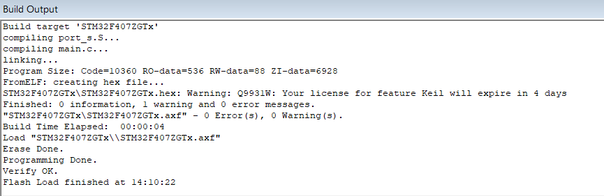

图3.23 编译、下载程序

（10）使用串口助手查看，两个任务的延时设置不一样，运行效果也不一样：

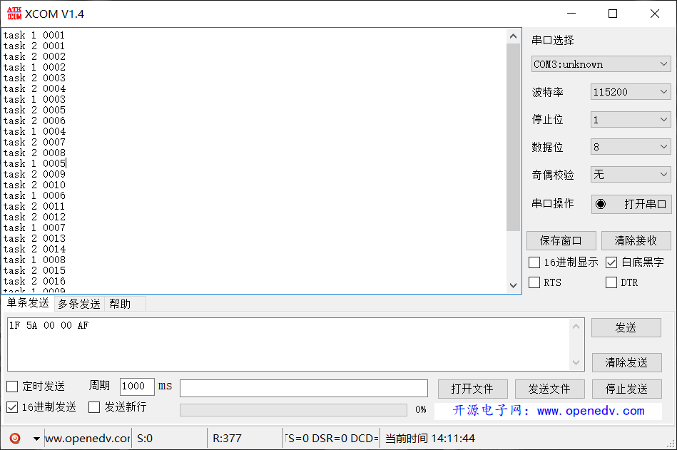

图3.24 串口查看界面

# 4、开发参考

1、腾讯物联网操作系统网址<https://github.com/OpenAtomFoundation/TencentOS-tiny>

2、ST官方教程[How to develop a STM32Cube Expansion Package - stm32mcu
(stmicroelectronics.cn)](https://wiki.stmicroelectronics.cn/stm32mcu/wiki/How_to_develop_a_STM32Cube_Expansion_Package)

3、[制作STM32Cube软件包-STM32 PackCreator的使用及软件包的制作 - 极术社区 -
连接开发者与智能计算生态 (aijishu.com)](https://aijishu.com/a/1060000000243533)

4、[（1）STM32
CubeMX软件包的制作---STM32PackCreator的使用_linwei_Cui的博客-CSDN博客](https://blog.csdn.net/qq_40259429/article/details/120557456?spm=1001.2014.3001.5501)

5、[（2）STM32
CubeMX软件包的制作---简易软件包的制作_linwei_Cui的博客-CSDN博客](https://blog.csdn.net/qq_40259429/article/details/120583659?spm=1001.2014.3001.5501)
