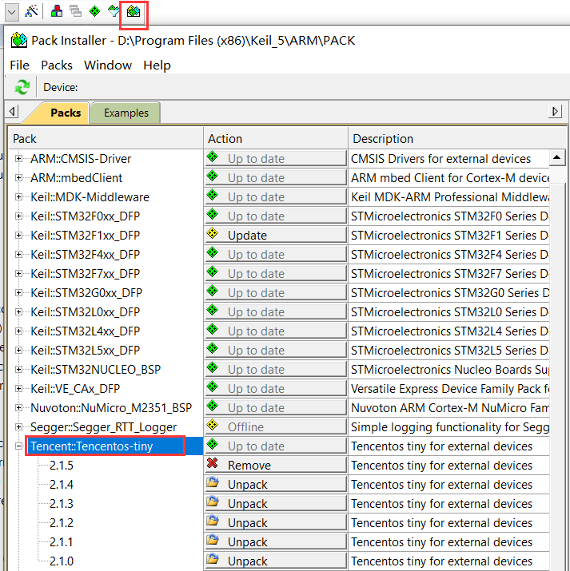
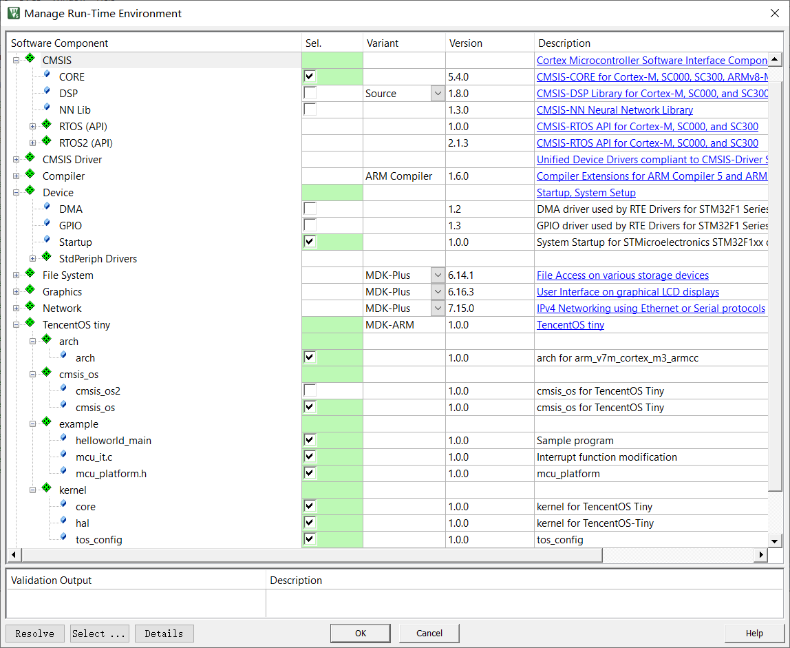
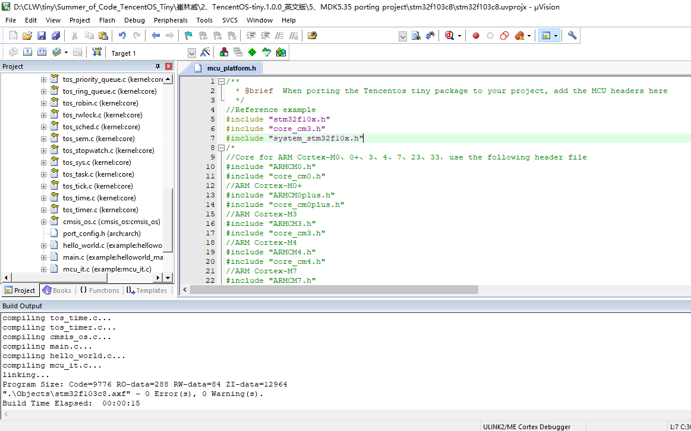
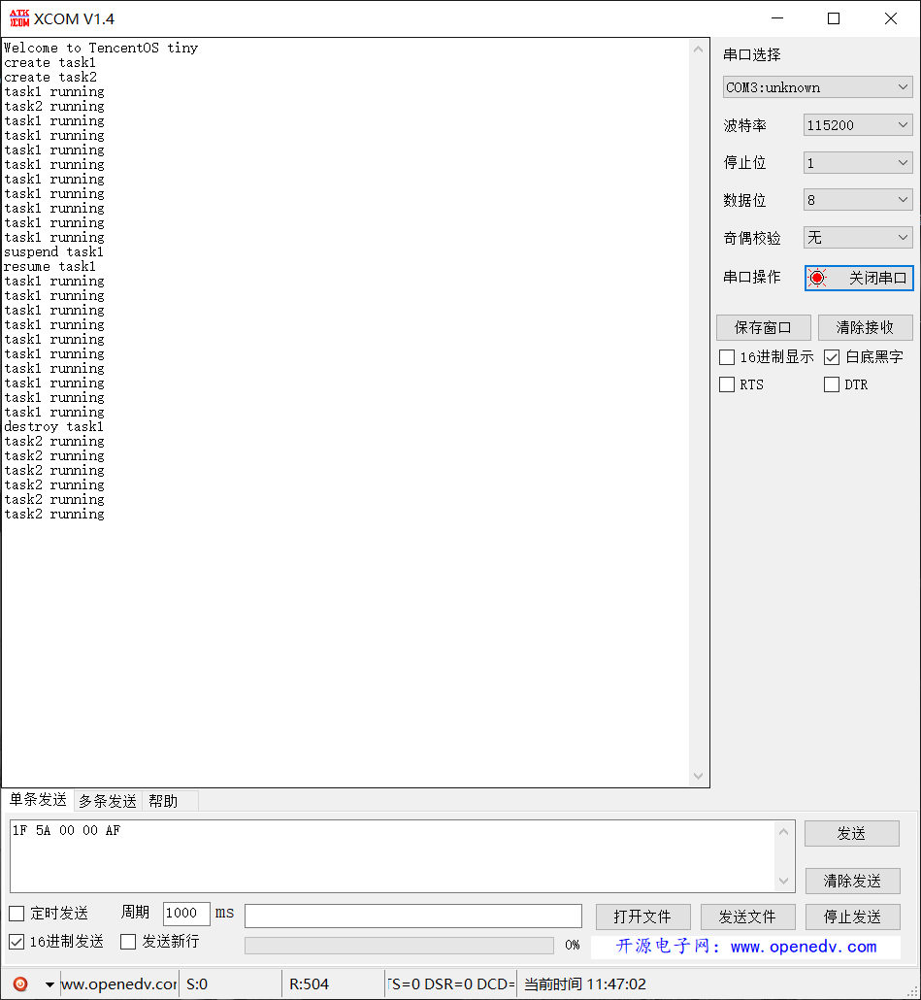
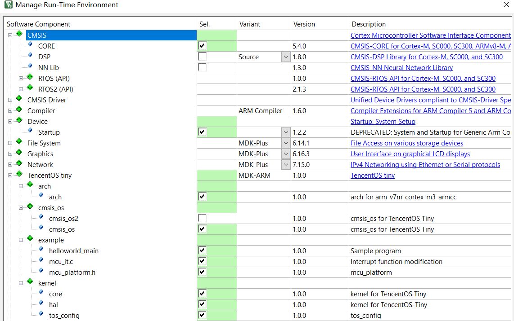
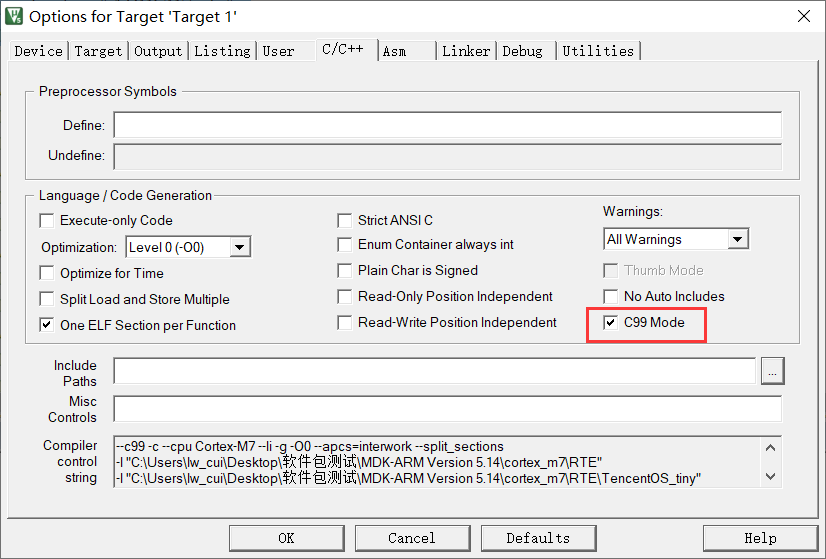
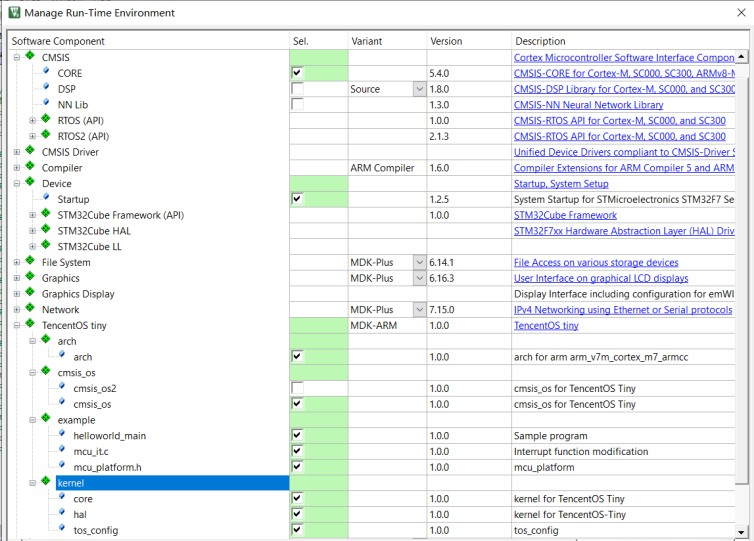
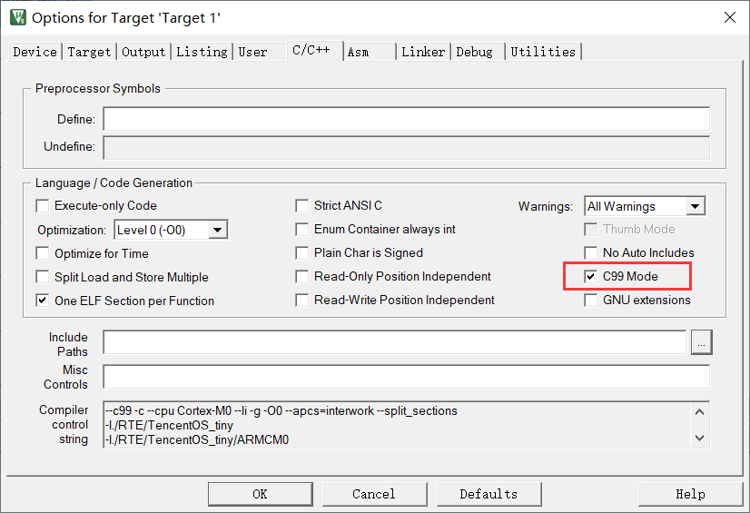
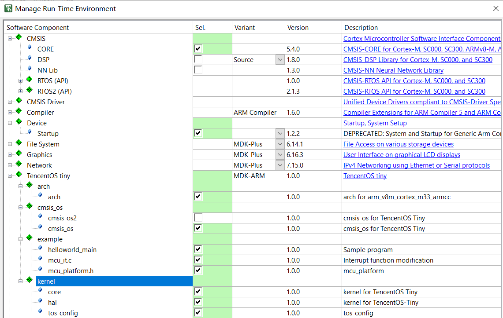

TencentOS-Tiny software package based on MDK development

2021/9/19

Southeast University

Tutor: WANG Lichao

Developer: CUI Linwei

Email: [1797878653@qq.com](mailto:1797878653@qq.com)

<https://github.com/OpenAtomFoundation/TencentOS-tiny>

Catalog

[1、Introduction to ARM packs](#_Toc82966100)

[1.1 Introduction to the software pack](#_Toc82966101)

[1.2 Software pack development](#_Toc82966102)

[1.2.1 The software pack development process](#_Toc82966103)

[1.2.2 Preparation of PDSC documents](#_Toc82966104)

[1.2.3 Generating packs](#_Toc82966105)

[2、TencentOS-tiny pack](#2tencentos-tiny-pack)

[2.1 Software pack contents](#_Toc82966107)

[2.2 Software pack installation](#_Toc82966108)

[3、Pack testing](#3pack-testing)

[3.1 ARM kernel porting of the TencentOS tiny pack](#_Toc82966110)

[3.2 STM32-independent bare-metal engineering port](#_Toc82966111)

[3.3 Microcontroller bare-metal engineering port](#_Toc82966112)

[4、Summary](#_Toc82966113)

[5、Development reference](#5development-reference)

[6、Appendix - Migration Configuration Reference](#_Toc82966115)

[6.1 MDK version 5.14 ported to ARM core](#_Toc82966116)

[6.1.1 Cortex-M0 core porting](#_Toc82966117)

[6.1.2 Cortex-M0+ core porting](#_Toc82966118)

[6.1.3 Cortex-M3 core porting](#_Toc82966119)

[6.1.4 Cortex-M4 core porting](#_Toc82966120)

[6.1.5 Cortex-M7 core porting](#_Toc82966121)

[6.2 MDK version 5.14 ported to ARM core-based chips](#_Toc82966122)

[6.2.1 Porting to the STM32F103C8 chip](#_Toc82966123)

[6.2.2 Porting to the STM32F767IGTx chip](#_Toc82966124)

[6.3 MDK5.30 and MDK5.35 porting (Cortex-M0+, 0, 3, 4, 7 cores and
chips)](#_Toc82966125)

[6.4 MDK5.30 and MDK5.35 porting (Cortex-M23, 33)](#_Toc82966126)

[6.4.1 Cortex-M23 core porting](#_Toc82966127)

[6.4.2 Cortex-M33 core port](#_Toc82966128)

# 1、Introduction to ARM packs

## 1.1 Introduction to the software pack

ARM packs provide support for microcontroller devices and development boards,
including Software Components such as drivers and middleware, and can include
example projects and code templates. The following types of packs are available.

(1) Device Family Pack (DFP): generated by a silicon supplier or tool vendor to
provide support for creating software applications for a specific target
microcontroller.

(2) Board Support Pack: Published by the board supplier to provide software
support for the peripheral hardware installed on the board.

(3) CMSIS software pack: provided by ARM, including support for the CMSIS core,
DSP and RTOS.

(4) Middleware Pack: created by chip suppliers, tool suppliers or third parties;
reduces development time by providing software integration of common software
components (e.g. software stacks, special hardware libraries, etc.).

(5) In-house components: developed by the tool user for internal or external
distribution. The software components include the following.

(1) Source code, libraries, headers/configuration files and documentation.

(2) Complete example project demonstrating the use of software components that
can be downloaded and implemented on the evaluation hardware.

(3) Code templates to facilitate the use of software components.

A complete pack is a ZIP file containing all the required software libraries and
files, as well as a pack description file (PDSC file) containing all the
information about the pack, the structure of which is defined in CMSIS
[(](http://www.keil.com/CMSIS/Pack) <http://www.keil.com/CMSIS/Pack>
[).](http://www.keil.com/CMSIS/Pack)

## 1.2 Software pack development

### 1.2.1 The software pack development process

The process of developing a software pack is equivalent to the completion of a
product, hence the introduction of the concept of Product Lifecycle Management
(PLM), which consists of the following four phases: (1) concept generation,
where the product is defined based on the pack requirements and the first
functional prototype is created; (2) design, where the prototype is tested and
the product is implemented according to the technical features and requirements,
and the product is verified through extensive testing of functionality and
specifications; (3) release, where the product is manufactured and brought to
market; and (4) service, where the product is maintained, including support for
customers, and finally continuous optimisation to end the product cycle.

The following are the main processes faced when creating a software pack.

Figure 1.1 Software pack development process

First, the pack is generated according to the specific components, i.e. the
software components such as header files and library files are organised
according to the requirements using PDSC files, after which the corresponding
version of the pack can be generated using the pack generation tool. The final
pack will be generated after testing.

### 1.2.2 Preparation of PDSC documents

PDSC files are based on Extensible Markup Language (XML), which allows the
modules contained in a pack to be organised in a specific format, and are
described in detail according to the structure of a PDSC file.

The first two sentences are declared in XML format, which is defined in the
PACK.xsd file in the MDK, so there is no need to modify it; the \<name\> and
\<vendor\> tags define the basic contents of the pack and are also used for the
file name of the PACK file, so this PDSC file should be named Tencent.
TencentOS-tiny.pdsc; the \< description \> tag describes the pack information
that will be displayed in the pack installer; the \< url\> tag can contain a URL
with a link to download the pack for the user's convenience; the \< license \>
tag contains the protocol that the user needs to follow to use the pack; the \<
support \> tag contains a description of the pack. Figure 1.2 shows the pack
interface for the following code.

\<? xml version="1.0" encoding="utf-8"? \>

\<pack schemaVersion="1.0"
xmlns:[xs=http://www.w3.org/2001/XMLSchema-instance](http://www.w3.org/2001/XMLSchema-instance)
xs:noNamespaceSchemaLocation="PACK.xsd"\>

\<name\> Tencent\</name\>

\< description \> Description of your pack\</description

\<vendor\> TencentOS-tiny\</vendor\>

\< url\>
[https://github.com/OpenAtomFoundation/TencentOS-tiny\</url](https://github.com/OpenAtomFoundation/TencentOS-tiny%3c/url)

\<license\>LICENSE.txt\</license\>

\< supportContact\> ...\</supportContact\>

Figure 1.2 Pack corresponding to the program

Next are the modules of the PDSC file. The \< releases\> tag defines the version
of the pack, where the developer can mark when the version is updated, so that
when the pack is generated, the system will automatically generate the latest
version of the pack.

\<releases\>

\<release version=**"1.0.1**"\> Sep/3/2021, version name

\</release\>

\<release version=**"1.0.0**"\> Sep/1/2021, version name

\</release\>

\</releases\>

The \< taxonomy\> tag is used to define the description for each component, as
shown in Figure 1.3, by identifying where the description is located with the
following code for Cclass, Cgroup and Csub, doc is used to specify the
description file (which may or may not be added) and then adding the name of the
description.

\<taxonomy\>

\<description Cclass="TencentOS tiny" Cgroup="xx" Csub="xx" doc =
"examples/index.html"\> TencentOS tiny\</description\>

\</taxonomy\>

Figure 1.3 \< taxonomy\> tag

The \< keywords \> tag defines the keywords for the pack, which can be used to
search for the pack you need when downloading packs from the ARM website.

\<keywords \>

\<keyword\>Tencent\</keyword\>

\</keywords \>

The \< requirements \> tag defines the associated installation requirements for
the pack, i.e. when installing this pack, other packs need to be installed
online (URL: [MDK5 Software](https://www.keil.com/dd2/pack/#!%23eula-container)
[Packs (keil.com)](https://www.keil.com/dd2/pack/#!%23eula-container)), for
example the following definition requires us to install the CMSIS 5.7.0 pack for
ARM.

\<requirements\>

\<packs\>

\<pack vendor="ARM" name="CMSIS" version="5.7.0"/\>

\</packs\>

\</requirements

Next is the \< conditions\> tag, which is used when designing \< components\> to
indicate the dependencies of each component in the pack, i.e. the use of this
component also requires the selection of other components. Under this tag
multiple conditions can be defined, each of which can have multiple conditions
defined, where \< conditions id\> is the condition name, \< description\> is the
condition information, and then the defined condition, where \< accept\> means
that the condition is optional. When multiple \< accept\>s exist, the user must
satisfy at least one of them to use the condition; \< require\> means that the
condition is mandatory, otherwise the component cannot be used. Within the
conditions, there is some specific indicative syntax. If a condition named
Cortex_M0 is selected by the developer when designing the \< component\>, then
the user will need to comply with the condition when using the \< component\>:
where \<accept Dvendor="ARM:82" Dname="ARMCM0"/\> means that the user needs to
select the ARM-Cortex M0 core, \<require condition="condition id"/\> is a nested
condition, which means that the user also needs to meet the requirements
corresponding to that condition, \<require Cclass=" TencentOS tiny"
Cgroup="kernel" Csub="core"/\> indicates that the user also needs to select the
core component.

\<conditions\>

\<condition id="Cortex_M0"\>

\<description\> Cortex-M0\</description\>

\<accept Dvendor="ARM:82" Dname="ARMCM0"/\>

\<require condition="condition id"/\>

\< require Tcompiler="ARMCC"/\>

\<require Cclass="TencentOS tiny" Cgroup="kernel" Csub="core"/\>

\</condition\>

\</conditions\>

Then there is the \< components\> tag, which describes all the files contained
in the pack. When writing programs under this tag, the files need to be divided
according to file categories. In the following code, a \<component\> of Keil::
TencentOS tiny:: arch::arch is defined and \< description\> is the information
about the component, as shown in Figure 1.4.

Figure 1.4 \<component\> definition screen

\<components\>

\<component Cvendor="Keil" Cclass="TencentOS tiny" Cgroup="arch" Csub="arch"
Cversion="1.0.1" condition=" condition id"\>

\<description\> description \</description\>

\<files\>

\<file category="doc" name="Documentation/General/html/driver_I2C.html"/\> --\>

\<file category="include" name="arch/arm/arm-v7m/common/include/"/\>

\<file category="header" name="arch/arm/arm-v7m/cortex-m0+/armcc/port.h"/\>

\<file category="header" name="arch/arm/arm-v7m/cortex-m0+/armcc/port_config.h"
attr="config" version="1.1.0"/\>

\<file category="source" name="arch/arm/arm-v7m/common/tos_cpu.c"/\>

\</files\>

\</components\>

condition=" condition id" is the \<condition\> tag introduced above, so that the
user also needs to satisfy the dependencies required by the condition when using
the component. In addition, when defining a \<component\>, files need to be
added according to the \<files\> ...\</files\> syntax of the above procedure,
where the file category is defined as shown in Table 1-1, where the path to the
file and the specific In the pack, the files we add are not editable by default.
To make it easier for the user to configure the files, we need to add the
attribute attr="config" and update the different versions of the files by
version.

Table 1-1 File category definitions

| category | Meaning                                             |
|----------|-----------------------------------------------------|
| doc      | Documents, which can be web pages or other links    |
| include  | Contains all the headers under a certain path       |
| header   | Contains specific header files under a certain path |
| source   | .c source file                                      |

In order to adapt the pack we design to different cores, i.e. none of the files
that do not match the user's ARM core when using the pack, we can add \<files\>
as follows: (1) in the condition condition, add a program like \< require
Dvendor="ARM:82" Dname=" ARMCM0"/\>, which indicates that the user is required
to select the ARM Cortex-M0 core; (2) when adding the \<files\>, we can keep the
same name for the Cgroup and Csub of the same type of file for different cores,
and add the condition defined in (1), so that when the user selects the for
different kernels, only the files consistent with that kernel will appear.

Also, if multiple packs need to be defined in a PDSC file, the following code
structure can be used, where each \< bundle\> tag defines a pack.

\<components\>

\<bundle Cbundle="MDK-ARM" Cclass="TencentOS tiny" Cversion="1.0.0"\>

\<description\> TencentOS tiny\</description\>

\<doc\>examples/index.html\</doc\>

\< component

\<! -- Component content --\>

\</component

\</bundle\>

\<bundle Cbundle="MDK-ARM" Cclass="TencentOS tiny" Cversion="1.0.0"\>

\<description\> TencentOS tiny\</description\>

\<doc\>examples/index.html\</doc\>

\< component

\<! -- Component content --\>

\</component

\</bundle\>

\</components\>

In addition, PDSC files can also contain \<devices\>, \<apis\>, \<boards\> and
\<examples\>, which are provided by ARM or other device or board manufacturers,
for the device, api library files, board level and corresponding example files,
as described in ARM CMSIS packs.

Finally, the PDSC file needs to be completed by adding \</pack\> at the end to
indicate the end of the file.

### 1.2.3 Generating packs

After the PDSC file has been written, in order to generate the final pack, three
more files need to be prepared as shown in Figure 1.5. PackChk.exe is used to
verify that all the files included in the pack exist, i.e. are complete;
gen_pack.bat is a Windows batch file that requires us to make changes to the
path in the file and is used to generate the pack PACK. xsd is the schema, which
is used to develop the XML specification to validate the PDSC files we have
written. In addition, the 7-Zip File Manager software is needed to compress the
files and create the integrated packs.

Figure 1.5 Software configuration required to generate the pack

First open gen_pack.bat using Notepad or Notepad++ and make the following
changes to the following areas, as shown in Table 1-2.

SET ZIPPATH=C:\\Program Files\\7-Zip

SET RELEASE_PATH=..\\Local_Release

SET PACK_VENDOR=Tencent

SET PACK_NAME=TencentOS-tiny

SET PACK_FOLDER_LIST=arch osal kernel examples

SET PACK_FILE_LIST=%PACK_VENDOR%.%PACK_NAME%.pdsc README.md LICENSE.txt

Table 1-2 gen_pack.bat modifications

| Code                 | Meaning                                            |
|----------------------|----------------------------------------------------|
| SET ZIPPATH          | Installation path for 7-Zip File Manager software  |
| SET RELEASE_PATH     | The path to the generated pack, as a relative path |
| SET PACK_VENDOR      | The \<vendor\> tag in the PDSC file                |
| SET PACK_NAME        | The \<name\> tag in the PDSC file                  |
| SET PACK_FOLDER_LIST | Path to where the pack contains the files          |
| SET PACK_FILE_LIST   | Path to README.md LICENSE.txt                      |

Once you have modified gen_pack.bat, you can create the pack by first using cmd
to open the command line interface of your computer, executing the cd command to
go to the path where gen_pack.bat is located, then typing gen_pack.bat and
clicking enter, as shown in Figure 1.6. gen_pack.bat will compress the files in
order, then read the The PDSC file will then be read, checked for data integrity
and file dependencies, and the pack will be generated.

Figure 1.6 Pack generation interface

At this point the generated packs can be seen under the Local_Release path.

Figure 1.7 Software pack

# 2、TencentOS-tiny pack

Tencent IoT operating system (TencentOS tiny) is a real-time operating system
developed by Tencent for the IoT field, featuring low power consumption, low
resource consumption, modularity and scalability. tiny provides the most
streamlined RTOS kernel, which is scalable and configurable, and can be flexibly
ported to a variety of terminal MCUs. At the same time, TencentOS tiny provides
one-stop software solutions for IoT terminal manufacturers to facilitate the
rapid access of various IoT devices to Tencent Cloud. It can support a variety
of industry applications such as smart city, smart water meter, smart home,
smart wear, and connected car.

Therefore, in order to effectively reduce developers' development time in
porting TencentOS tiny to ARM kernel microcontrollers, this paper completes the
packaging of third-party TencentOS Tiny pack and packs based on MDK, enabling
the use of MDK pack to directly generate TencentOS Tiny projects for different
MCUs.

## 2.1 Software pack contents

In conjunction with the algorithmic architecture of TencentOS tiny, the pack
designed in this paper includes the elements shown in Table 2-1.

Table 2-1 Software pack contents

| Contents   | Function                                                                                                                                     |                                                                                          |
|------------|----------------------------------------------------------------------------------------------------------------------------------------------|------------------------------------------------------------------------------------------|
|  arch      | Includes arch files for cores Cortex-M0+, Cortex-M0, Cortex-M3, Cortex-M4, Cortex-M7, Cortex-M23, Cortex-M33 under TencentOS-tiny\\arch\\arm |                                                                                          |
| kernel     | Including the files in the core, hal path under TencentOS-tiny\\kernel and tos_config file                                                   |                                                                                          |
| cmsis_os   | Files corresponding to TencentOS-tiny\\osal\\cmsis_os                                                                                        |                                                                                          |
|    example | helloworld_main                                                                                                                              | The main file for testing the pack                                                       |
|            | mcu_it.c                                                                                                                                     | The interrupt functions need to be modified according to this file when porting the pack |
|            | mcu_platform.h                                                                                                                               | The user can add the header file of the corresponding microcontroller to this file       |

The software pack has the following features.

1.  The pack packs the TencentOS tiny software for the ARMCortex-M0+, Cortex-M0,
    Cortex-M3, Cortex-M4, Cortex-M7, Cortex-M23 and Cortex-M33 cores, allowing
    users to quickly integrate the TencentOS tiny corresponding kernel in a Keil
    project.

    1.  The pack can automatically adapt to the kernel selected by the user and
        the arch file can be displayed automatically according to the kernel,
        thus facilitating the user's use.

        1.  When the user checks a component, the pack will automatically prompt
            that other modules need to be checked and can be checked with one
            click using Resolve in the interface to prevent omissions.

        2.  Users can modify the tos_config file of the corresponding kernel on
            their own to tailor the functions of TencentOS tiny.

## 2.2 Software pack installation

The
next step is to introduce the installation of Tencent.TencentOS-tiny pack, first
double-click the pack in Figure 1.5, then enter the installation interface as
shown in Figure 2.1(a), click I agree to all the terms of the preceding License
Agreement, then click next to install. The installation completion screen is
shown in Figure 2.1(b).

(a) (b)

Figure 2.1 Installation screen

At this point the pack has been installed into Keil 5, open the Keil 5 software
and click on the Pack Installer icon to install and remove the different pack
versions.

Figure 2.2 Pack Installer interface

Next you can install the components in the Tencent. TencentOS-tiny pack. Click
on the Manage Run-Time Environment icon and tick the files that need to be
ported from the pack, as shown in Figure 2.3. If there are dependencies you can
click Resolve to install them with one click.

Figure 2.3 Manage Run-Time Environment interface

# 3、Pack testing

## 3.1 ARM kernel porting of the TencentOS tiny pack

First download and install the ARM CMSIS-5.7.0 pack from [MDK5 Software
Packs](https://www.keil.com/dd2/pack/#!%23eula-container) [(keil.com)
in](https://www.keil.com/dd2/pack/#!%23eula-container) order to test this pack
under different kernels.

Figure 3.1 ARM CMSIS-5.7.0 pack

After installing the pack, the pack was ported and compiled using the ARM
Cortex-M3 kernel as an example. Firstly, a new project was created using the
Keil5-5.30 software and ARMCM3 was selected as shown in Figure 3.2, then the
corresponding TencentOS-tiny components and Cortex-M3 kernel files were checked
according to Figure 3.3, and it can be seen that arch and tos_config have both
been automatically adapted according to the kernel.

Figure 3.2 Checking the kernel

Figure 3.3 Checking components

Next click on Options for target, check Use MicroLIB and the default compile
version 5, then select C99 mode.

Figure 3.4 Options for target

Then add the \#include "ARMCM3.h" and \#include "core_cm3.h" header files to
mcu_platform.h.

Figure 3.5 Adding the corresponding kernel header file

Finally click on the Build icon to test, as shown in Figure 3.6.

Figure 3.6 Compilation test

Similarly, to test this pack under the ARM Cortex-M4 core, simply modify the
header files in mcu_platform. h to \#include "ARMCM4.h" and \#include
"core_cm4.h" in the above steps, or modify the header files correspondingly for
other cores.

## 3.2 STM32-independent bare-metal engineering port

Next the specific microcontroller chip is selected and the pack is tested,
following the following steps.

Download the software support pack for the STM32F1 from the website [MDK5
Software](https://www.keil.com/dd2/pack/#!%23eula-container) [Packs
(keil.com),](https://www.keil.com/dd2/pack/#!%23eula-container) as shown in
Figure 3.7, and install it.

Figure 3.7 STM32 software support pack

Create a new project, select the chip as STM32F103C8 as shown in Figure 3.8,
then click ok and select the components of the TencentOS-tiny pack and the STM32
boot file as shown in Figure 3.9.

Figure 3.8 Selecting the STM32F103C8 chip

Figure 3.9 Selecting components

Then tick compile version 5 as shown in Figure 3.10(a), and select C99mode.

(a)

(b)

Figure 3.10 Software settings

Then add the following header file to mcu_platform. h, as shown in Figure 3.11.

\#include "stm32f10x.h"

\#include "core_cm3.h"

\#include "system_stm32f10x.h"

Figure 3.11 Modifying mcu_platform.h

Finally, click Build to compile and if no errors are reported, the port is
successful.

Figure 3.12 Compilation interface

## 3.3 Microcontroller bare-metal engineering port

Finally, the microcontroller development board is tested and the TencentOS-tiny
package is introduced using the Positive Point Atomic Explorer STM32F407ZGT6 as
an example.

(1) The following diagram shows the contents of the package ticker.

Figure 3.13 Pack components ticked

The interface after porting the pack in the Positive Point Atomic Explorer
STM32F407ZGT6 bare-metal project template is shown in Figure 3.14.

Figure 3.14 Migration interface

(2) Then follow mcu_it.c to modify the PendSV_Handler() function and
SysTick_Handler() function in stm32f4xx_it.c as shown below, comment out the
PendSV_Handler() function in stm32f4xx_it.c, and modify the SysTick\_ Handler()
function.

Figure 3.15 Function modification

(3) Modify mcu_platform.h by adding \#include "stm32f4xx.h"

Figure 3.16 Modifying mcu_platform.h

(4) Next, use the following main program.

\#include "stm32f4xx.h"

\#include "usart.h"

\#include "tos_k.h"

k_task_t task1;

k_task_t task2;

k_stack_t task_stack1[1024];

k_stack_t task_stack2[1024];

void test_task1(void \*Parameter)

{

while(1)

{

printf("task1 running\\r\\n");

tos_task_delay(200);

}

}

void test_task2(void \*Parameter)

{

k_err_t err;

printf("task2 running\\r\\n");

tos_task_delay(2000);

// suspend task1

printf("suspend task1\\r\\n");

err = tos_task_suspend(&task1);

if(err != K_ERR_NONE)

printf("suspend task1 fail! code : %d \\r\\n",err);

tos_task_delay(2000);

// resume task1

printf("resume task1\\r\\n");

err = tos_task_resume(&task1);

if(err != K_ERR_NONE)

printf("resume task1 fail! code : %d \\r\\n",err);

tos_task_delay(2000);

// destroy task1

printf("destroy task1\\r\\n");

err = tos_task_destroy(&task1);

if(err != K_ERR_NONE)

printf("destroy task1 fail! code : %d \\r\\n",err);

// task2 running

while(1)

{

printf("task2 running\\r\\n");

tos_task_delay(1000);

}

}

/\*\*

\* @brief main function

\* @param none

\* @retval none

\*/

int main(void)

{

k_err_t err;

/\* Initialize USART configuration mode to 115200 8-N-1, interrupt function
receive\*/

uart_init(115200);

printf("Welcome to TencentOS tiny\\r\\n");

tos_knl_init(); // TOS Tiny kernel initialize

tos_robin_default_timeslice_config((k_timeslice_t)500u);

printf("create task1\\r\\n");

err = tos_task_create(&task1, "task1", test_task1, NULL, 3, task_stack1, 1024,
20);

if(err != K_ERR_NONE)

printf("TencentOS Create task1 fail! code : %d \\r\\n",err);

printf("create task2\\r\\n");

err = tos_task_create(&task2, "task2", test_task2, NULL, 4, task_stack2, 1024,
20);

if(err != K_ERR_NONE)

printf("TencentOS Create task2 fail! code : %d \\r\\n",err);

tos_knl_start(); // Start TOS Tiny

}

(5) Then click compile and use ST LINK-V2 to download the program to the
microcontroller as shown in Figure 3.17. Then connect the serial port of the
microcontroller to the computer and use XCOM serial communication assistant to
view the result as shown in Figure 3.18.

Figure 3.17 Compilation interface

Figure 3.18 Test interface

In addition, if you encounter the error in Figure 3.19(a) during compilation,
you need to change \#define TOS_CFG_OBJECT_VERIFY_EN 1u to
TOS_CFG_OBJECT_VERIFY_EN 0u in Figure 3.19(b)

(a)

(b)

Figure 3.19 Error reporting modification

# 4、Summary

In this paper, we firstly studied the development process of completing
third-party pack packaging based on MDK and wrote the steps of pack creation,
and then combined with TencentOS Tiny IoT operating system to pack the files
under ARM kernel architecture in it, so as to design the pack based on TencentOS
Tiny.

This pack enables developers to quickly port the TencentOS Tiny operating system
to the user's ARM kernel microcontroller, greatly saving development porting
time, while the pack features automatic kernel adaptation and dependency hints
to improve porting efficiency.

# 5、Development reference

1\. Tencent IoT OS website <https://github.com/OpenAtomFoundation/TencentOS-tiny>

2\. MDK[5 Software Packs MDK5 Software Packs
(keil.com)](https://www.keil.com/dd2/pack/#!%23eula-container)

1.  Production of software pack training videos
    <https://www.bilibili.com/video/BV1AK411p7d9>

2.  Production pack blog
    <https://blog.csdn.net/qq_40259429/article/details/119320319>

3.  Make a simple pack <https://www.cnblogs.com/libra13179/p/6273415.html>

4.  CMSIS-Driver pack [ARM-software/CMSIS-Driver: Repository of microcontroller
    peripheral](https://github.com/ARM-software/CMSIS-Driver) [drivers
    implementing the CMSIS-Driver API specification (
    github.com)](https://github.com/ARM-software/CMSIS-Driver)

# 6、Appendix - Migration Configuration Reference

## 6.1 MDK version 5.14 ported to ARM core

### Cortex-M0 core porting

（1）Manage Run-Time Environment is ticked as follows.

（2）In mcu_platform.h, add：

\#include "ARMCM0.h"

\#include "core_cm0.h"

### 6.1.2 Cortex-M0+ core porting

（1）Manage Run-Time Environment is ticked as follows.

（2）In mcu_platform.h, add.

\#include "ARMCM0plus.h"

\#include "core_cm0plus.h"

### 6.1.3 Cortex-M3 core porting

（1）Manage Run-Time Environment is ticked as follows.

（2）In mcu_platform.h, add.

\#include "ARMCM3.h"

\#include "core_cm3.h"

### Cortex-M4 core porting

（1）Manage Run-Time Environment is ticked as follows.

（2）In mcu_platform.h, add.

\#include "ARMCM4.h"

\#include "core_cm4.h"

### 6.1.5 Cortex-M7 core porting

（1）Manage Run-Time Environment tick the following.

（2）Modified to C99 in MDK

（3）In mcu_platform.h, add.

\#include "ARMCM7.h"

\#include "core_cm7.h"

## 6.2 MDK version 5.14 ported to ARM core-based chips

### 6.2.1 Porting to the STM32F103C8 chip

（1）Manage Run-Time Environment tick the following.

（2）In mcu_platform.h, add.

\#include "stm32f10x.h"

\#include "core_cm3.h"

\#include "system_stm32f10x.h"

### Porting to the STM32F767IGTx chip

（1）Manage Run-Time Environment tick the following.

（2）Modified to C99 in MDK

（3）In mcu_platform.h, add.

\#include "stm32f7xx.h"

\#include "core_cm7.h"

\#include "system_stm32f7xx.h"

## 6.3 MDK5.30 and MDK5.35 porting (Cortex-M0+, 0, 3, 4, 7 cores and chips)

When porting TencentOS-tiny Pack to Keil in MDK5.30 and MDK5.35, for Cortex-M0+,
0, 3, 4 and 7 kernels and chips, the steps for ticking components and adding
header files are the same as before, but you need to modify the compiler version
as follows and then just execute the compilation.

## 6.4 MDK5.30 and MDK5.35 porting (Cortex-M23, 33)

### 6.4.1 Cortex-M23 core porting

（1）Manage Run-Time Environment is ticked as follows.

（2）In mcu_platform.h, add.

\#include "ARMCM23.h"

\#include "core_cm23.h"

（3）Amend to not view error reports.

### 6.4.2 Cortex-M33 core port

（1）Selecting a chip with FPU

（2）Manage Run-Time Environment is ticked as follows.

（3）In mcu_platform.h, add.

\#include "ARMCM33_DSP_FP.h"

\#include "core_cm33.h"

（4）Amend to not view error reports.

