# 基于MDK开发的TencentOS-Tiny Software Pack

TencentOS-Tiny software package based on MDK development

2021/9/3

东南大学

导师：汪礼超

学员：崔林威

Email：1797878653@qq.com

<https://github.com/OpenAtomFoundation/TencentOS-tiny>

目录

[1、ARM软件包介绍](#1arm软件包介绍)

[1.1 软件包简介](#11-软件包简介)

[1.2 软件包开发](#12-软件包开发)

[1.2.1 软件包开发过程](#121-软件包开发过程)

[1.2.2 PDSC文件的编写](#122-pdsc文件的编写)

[1.2.3 生成软件包](#123-生成软件包)

[2、TencentOS-tiny软件包](#2tencentos-tiny软件包)

[2.1 软件包内容](#21-软件包内容)

[2.2 软件包安装](#22-软件包安装)

[3、软件包测试](#3软件包测试)

[3.1 ARM内核移植TencentOS tiny软件包](#31-arm内核移植tencentos-tiny软件包)

[3.2 STM32不依赖裸机工程移植](#32-stm32不依赖裸机工程移植)

[3.3 单片机裸机工程移植](#33-单片机裸机工程移植)

[4、总结](#4总结)

[5、开发参考](#5开发参考)

[6、附录-移植配置参考](#6附录-移植配置参考)

[6.1 MDK5.14版本移植到ARM内核](#61-mdk514版本移植到arm内核)

[6.1.1 Cortex-M0内核移植](#611-cortex-m0内核移植)

[6.1.2 Cortex-M0+内核移植](#612-cortex-m0内核移植)

[6.1.3 Cortex-M3内核移植](#613-cortex-m3内核移植)

[6.1.4 Cortex-M4内核移植](#614-cortex-m4内核移植)

[6.1.5 Cortex-M7内核移植](#615-cortex-m7内核移植)

[6.2 MDK5.14版本移植到基于ARM内核的芯片](#62-mdk514版本移植到基于arm内核的芯片)

[6.2.1 移植到stm32f103c8芯片](#621-移植到stm32f103c8芯片)

[6.2.2 移植到stm32f767igt芯片](#622-移植到stm32f767igt芯片)

[6.3
MDK5.30和MDK5.35版本移植（Cortex-M0+、0、3、4、7内核和芯片）](#63-mdk530和mdk535版本移植cortex-m00347内核和芯片)

[6.4
MDK5.30和MDK5.35版本移植（Cortex-M23、33）](#64-mdk530和mdk535版本移植cortex-m2333)

[6.4.1 Cortex-M23内核移植](#641-cortex-m23内核移植)

[6.4.2 Cortex-M33内核移植](#642-cortex-m33内核移植)

# 1、ARM软件包介绍

## 1.1 软件包简介

在进行嵌入式软件开发时，ARM为我们提供了软件包功能，能够将软件算法等模块进行集成封装，从而方便第三方用户使用。ARM软件包能够为微控制器设备和开发板提供支持，包含软件组件（Software
Component）如驱动程序和中间件，还可以包含示例项目和代码模板等，主要有以下类型的软件包：

(1) 器件系列包（Device Family
Pack）：由硅供应商或工具供应商生成，为特定的目标微控制器创建软件应用提供支持；

(2) 板级支持包（Board Support
Pack）：由电路板供应商发布，为安装在电路板上的外围硬件提供软件支持。

(3) CMSIS软件包：由ARM提供，包括对CMSIS核心、DSP和RTOS的支持；

(4) 中间件包（Middleware
Pack）：由芯片供应商、工具供应商或第三方创建；通过提供对常用软件组件（如软件堆栈、特殊硬件库等）的软件集成，从而减少开发时间；

(5) 内部组件（In-house components）：由工具用户开发，用于内部或外部分发。

软件组件包括以下几部分：

(1) 源代码、库、头文件/配置文件和文档；

(2) 完整的示例项目，展示了软件组件的使用，可以下载并在评估硬件上执行；

(3) 代码模板，方便使用软件组件。

一个完整的软件包是一个ZIP文件，包含所有需要的软件库和文件，以及一个包含软件包所有信息的包描述文件（PDSC文件），软件包的结构是在CMSIS中定义的(<http://www.keil.com/CMSIS/Pack>)。

## 1.2 软件包开发

### 1.2.1 软件包开发过程

软件包的开发过程相当于完成了一项产品的制作，因此引入产品生命周期管理（PLM）的概念，PLM包括以下四个阶段：（1）概念的产生，基于软件包需求进行产品定义，并创建第一个功能原型；（2）设计，根据技术特征和要求，进行原型测试和产品的实施，通过广泛的测试验证产品的功能与规格；（3）发布，产品被制造出来并推向市场；（4）服务，对产品的维护，包括对客户的支持，最后不断优化，结束产品的周期。

在制作软件包时，主要面临以下几个过程：

图1.1 软件包开发流程

首先，根据特定组件生成软件包即根据需求将相应的头文件、库文件等软件组件利用PDSC文件进行组织，在组织完成后即可利用软件包生成工具生成对应版本的软件包，然后对新生成的软件包进行测试，给出示例测试程序，再将其包含如PDSC文件中，最后经测试完成后生成最终的软件包。

### 1.2.2 PDSC文件的编写

PDSC文件时基于可扩展标记语言（XML）进行编写的，能够将软件包包含的各个模块按照特定的格式组织起来，接下来按照PDSC文件的结构对文件的编写进行详细介绍：

首先是PDSC文件的开头，前两句是声明为XML格式，它是在MDK中的PACK.xsd文件定义的，所以不用修改；\<name\>和\<vendor\>标签定义了软件包的基本内容，也用于PACK文件的文件名，故该PDSC文件应命名为Tencent.TencentOS-tiny.pdsc；\<
description
\>标签描述了软件包的信息，它将显示在包安装程序中；\<url\>标签可以包含一个带有软件包下载链接的网址，方便用户下载；\<
license \>标签包含了用户使用该软件包时需要遵守的协议，\< supportContact
\>标签表示软件包的支持人员联系方式，可以提供一个电子邮件地址或网页URL。如图1.2为下列代码对应的软件包界面。

\<?xml version="1.0" encoding="utf-8"?\>

\<package schemaVersion="1.0"
xmlns:xs=<http://www.w3.org/2001/XMLSchema-instance>
xs:noNamespaceSchemaLocation="PACK.xsd"\>

\<name\>Tencent\</name\>

\<description\>Description of your pack\</description\>

\<vendor\>TencentOS-tiny\</vendor\>

\<url\>[https://github.com/OpenAtomFoundation/TencentOS-tiny\</url](https://github.com/OpenAtomFoundation/TencentOS-tiny%3c/url)\>

\<license\>LICENSE.txt\</license\>

\<supportContact\>…\</supportContact\>

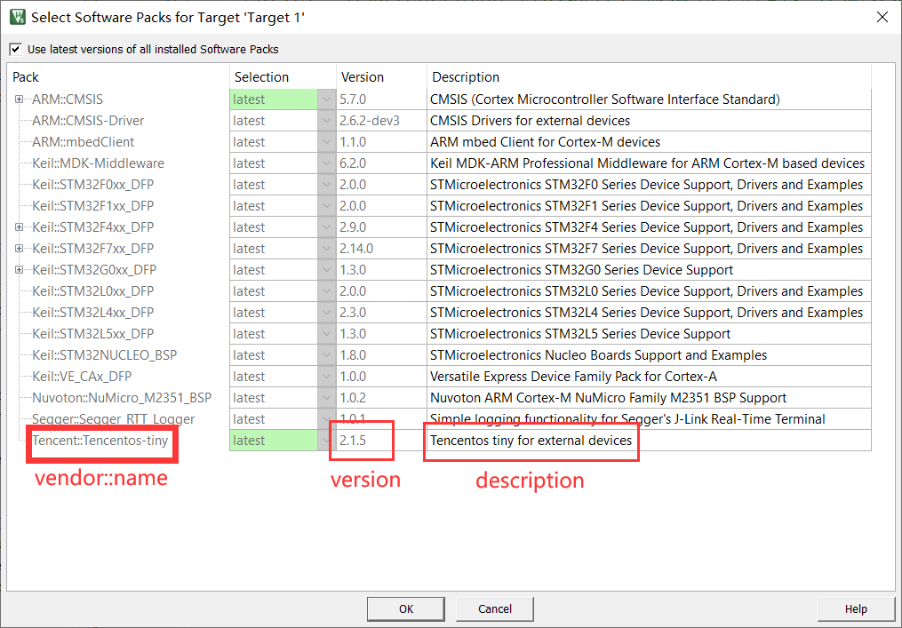

图1.2 程序对应的软件包

接下来是PDSC文件的各个模块，\<releases\>标签定义了软件包的版本，开发者可以在版本更新时在此进行标注，从而在生成软件包时，系统会自动生成最新版本的软件包；

\<releases\>

\<release version=**"1.0.1"**\>

Sep/3/2021, version name

\</release\>

\<release version=**"1.0.0"**\>

Sep/1/2021, version name

\</release\>

\</releases\>

\<taxonomy\>标签用于定义每个组件的description，如图1.3所示，通过下列代码中的Cclass、Cgroup和Csub来确定description所在的位置，doc用于指定description文件（也可以不加），然后添加description的名字。

\<taxonomy\>

\<description Cclass="TencentOS tiny" Cgroup="xx" Csub="xx"
doc="examples/index.html"\>TencentOS tiny\</description\> \<!—添加网页功能 --\>

\</taxonomy\>

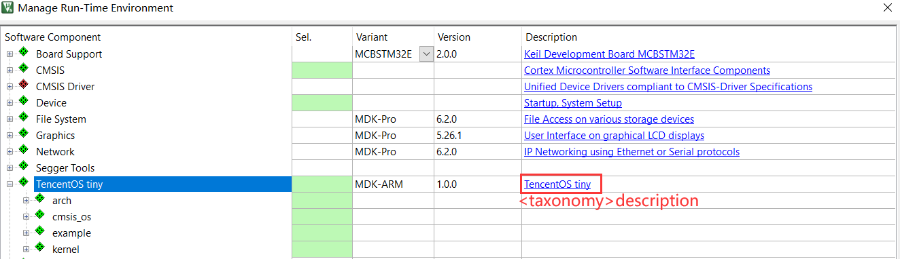

图1.3 \<taxonomy\>标签

\< keywords
\>标签定义了软件包的关键词，在ARM官网下载软件包时可利用关键词搜索到需要的软件包。

\<keywords \>

\<keyword\>Tencent\</keyword\>

\</keywords \>

\< requirements
\>标签定义了软件包的关联安装需求，即在安装本软件包时，还需要在网上安装其他包（网址：MDK5
Software Packs (keil.com)），例如下面的定义则需要我们安装ARM的CMSIS5.7.0软件包。

\<requirements\>

\<packages\>

\<package vendor="ARM" name="CMSIS" version="5.7.0"/\>

\</packages\>

\</requirements\>

接下来是\<conditions\>标签，该标签在设计\<components\>时使用，用以说明软件包中各个组件的依赖关系，即使用本组件还需要选择其他组件。在该标签下可以定义多个condition，每个condition可以定义多个条件。其中\<conditions
id\>表示条件名，\<description\>为条件信息，然后便是定义的条件，其中\<accept\>表示该条件时可选的，当同时存在多个\<accept\>时，用户需要至少满足其中一个条件才可以使用；\<require\>表示该条件是必选的，否则便无法使用相应的组件。在条件内部，包含一些特定的指示性语法，如果在设计\<component\>的时候开发者选择了名为Cortex_M0的条件，那么用户在使用该\<component\>时，则需要遵守条件要求：其中\<accept
Dvendor="ARM:82" Dname="ARMCM0"/\>表示用户选择ARM-Cortex
M0内核时才会触发该条件，\<require condition="condition id
"/\>为条件嵌套，表示用户还需要满足嵌套条件对应的要求，\<require
Cclass="TencentOS tiny" Cgroup="kernel"
Csub="core"/\>表示用户还需要选择core组件。

\<conditions\>

\<condition id="Cortex_M0"\>

\<description\> Cortex-M0\</description\>

\<accept Dvendor="ARM:82" Dname="ARMCM0"/\>

\<require condition="condition id "/\>

\< require Tcompiler="ARMCC"/\>

\<require Cclass="TencentOS tiny" Cgroup="kernel" Csub="core"/\>

\</condition\>

\<condition id=" condition_2 "\>

\<description\>\</description\>

\<!-- 第二个condition的内容 --\>

\</condition\>

\</conditions\>

然后是\<components\>标签，该标签描述了软件包包含的所有文件，在编写该标签下的程序时，需要按照文件类别将文件进行划分，在下列代码中，定义了一个Keil::
TencentOS tiny::
arch::arch的\<component\>，\<description\>为该组件的信息，具体如图1.4所示。

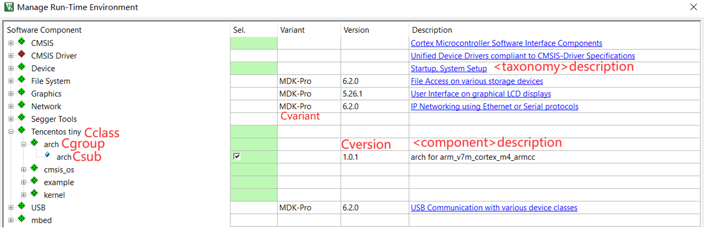

图1.4 \<component\>定义界面

\<components\>

\<component Cvendor="Keil" Cclass="TencentOS tiny" Cgroup="arch" Csub="arch"
Cversion="1.0.1" condition=" condition id"\>

\<description\> description \</description\>

\<files\>

\<file category="doc" name="Documentation/General/html/driver_I2C.html"/\>--\>

\<file category="include" name="arch/arm/arm-v7m/common/include/"/\>

\<file category="header" name="arch/arm/arm-v7m/cortex-m0+/armcc/port.h"/\>

\<file category="header" name="arch/arm/arm-v7m/cortex-m0+/armcc/port_config.h"
attr="config"

version="1.1.0"/\>

\<file category="source" name="arch/arm/arm-v7m/common/tos_cpu.c"/\>

\</files\>

\</component\>

\</components\>

condition=" condition
id"即为上述介绍的\<condition\>标签，从而用户在使用该组件时，还需要满足condition所要求的依赖组件。另外，在定义某一个\<component\>时，需要按照上面程序的\<files\>…\</files\>语法进行文件添加，其中file
category的定义如表1-1所示，在name中可以添加文件路径和具体的某个文件，在软件包中，我们添加的文件默认是不可编辑的，为了方便用户对文件进行进行配置，我们需要添加attr="config"属性，并可通过version更新不同版本的文件。

表1-1 file category定义

| category | 含义                         |
|----------|------------------------------|
| doc      | 文件，可以是网页或者其他链接 |
| include  | 包含某一个路径下的所有头文件 |
| header   | 包含某路径下的具体头文件     |
| source   | .c源文件                     |

为了使我们设计的软件包能够适配不同的内核，即在使用软件包时与用户ARM核不一致的文件都不出现，可以按如下步骤进行\<files\>的添加：（1）在condition条件中，加入\<require
Dvendor="ARM:82" Dname="ARMCM0"/\>这样的程序，该程序表示需要用户选择ARM
Cortex-M0内核才会触发该条件；（2）在添加\<files\>时，我们可以将针对不同内核，同一类型文件的Cgroup和Csub保持同样的名字，并添加上（1）中定义的condition，这样用户选择不同内核时，将只会出现与用户内核一致的文件。

同时，如果需要在PDSC文件中定义多个软件包，可以采用下列代码结构，其中每一个\<bundle\>标签定义了一个软件包。

\<components\>

\<bundle Cbundle="MDK-ARM" Cclass="TencentOS tiny" Cversion="1.0.0"\>

\<description\>TencentOS tiny\</description\>

\<doc\>examples/index.html\</doc\> \<!—添加网页功能 --\>

\<component

\<!-- 组件内容 --\>

\</component\>

\</bundle\>

\<bundle Cbundle="MDK-ARM" Cclass="TencentOS tiny" Cversion="1.0.0"\>

\<description\>TencentOS tiny\</description\>

\<doc\>examples/index.html\</doc\>

\<component

\<!-- 组件内容 --\>

\</component\>

\</bundle\>

\</components\>

另外，PDSC文件还可以包含\<devices\>、\<apis\>、\<boards\>和\<examples\>，这些为ARM公司或者其他器件、开发板厂商提供，为针对器件、api库文件、板级和相应的示例文件，具体可以参阅ARM
CMSIS的软件包。

最后，PDSC文件后还需要在最后加上\</package\>，表示该文件的结束，从而完成PDSC文件的编写。

### 1.2.3 生成软件包

在完成PDSC文件的编写后，为了生成最终的软件包，还需要准备如图1.5所示的3个文件，其中PackChk.exe用于验证软件包包含的文件是否都存在，即是否完整；gen_pack.bat为Windows批处理文件，需要我们对文件中的路径进行修改，并用于生成软件包；PACK.xsd是schema，主要用来制定XML规范，用以验证我们编写的PDSC文件。另外，还需要准备7-Zip
File Manager软件，用于对文件进行压缩，制作集成的软件包。

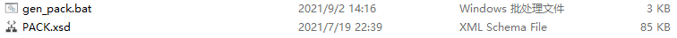

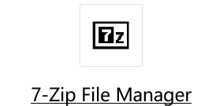

图1.5 生成软件包所需的软件配置

首先利用记事本或Notepad++打开gen_pack.bat，对以下几个地方需要修改，如表1-2所示：

SET ZIPPATH=C:\\Program Files\\7-Zip

SET RELEASE_PATH=..\\Local_Release

SET PACK_VENDOR=Tencent

SET PACK_NAME=TencentOS-tiny

SET PACK_FOLDER_LIST=arch osal kernel examples

SET PACK_FILE_LIST=%PACK_VENDOR%.%PACK_NAME%.pdsc README.md LICENSE.txt

表1-2 gen_pack.bat修改内容

| 代码                 | 含义                             |
|----------------------|----------------------------------|
| SET ZIPPATH          | 7-Zip File Manager软件的安装路径 |
| SET RELEASE_PATH     | 生成的软件包路径，为相对路径     |
| SET PACK_VENDOR      | PDSC文件中的\<vendor\>标签       |
| SET PACK_NAME        | PDSC文件中的\<name\>标签         |
| SET PACK_FOLDER_LIST | 软件包包含文件所在路径           |
| SET PACK_FILE_LIST   | README.md LICENSE.txt所在路径    |

修改完毕gen_pack.bat后，便可以制作软件包了，首先利用cmd打开电脑的命令行界面，执行cd命令转到gen_pack.bat所在的路径，然后输入gen_pack.bat点击enter，如图1.6所示，gen_pack.bat会按照顺序压缩文件，然后读取PDSC文件，检查数据完整性和文件依赖是否完整，然后生成软件包，当提示gen_pack.bat
completed sucessfully后就完成了软件报的创建。

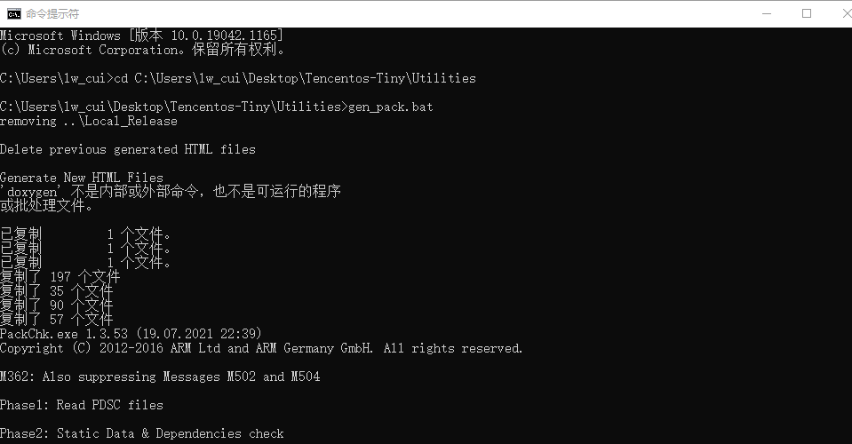

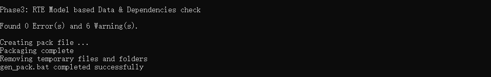

图1.6 软件包生成界面

此时在Local_Release路径下，可以看到生成的软件包。

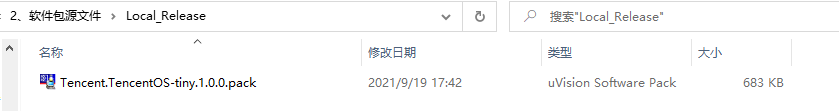

图1.7 软件包

# 2、TencentOS-tiny软件包

腾讯物联网操作系统（TencentOS
tiny）是腾讯面向物联网领域开发的实时操作系统，具有低功耗，低资源占用，模块化，可裁剪等特性。TencentOS
tiny提供了最精简的 RTOS 内核，内核组件可裁剪可配置，可灵活移植到多种终端 MCU
上。而且，基于RTOS内核，提供了 COAP/MQTT/TLS/DTLS
等常用物联网协议栈及组件，方便用户快速接入腾讯云物联网通信 IoT
Hub。同时，TencentOS tiny
为物联网终端厂家提供一站式软件解决方案，方便各种物联网设备快速接入腾讯云，可支撑智慧城市、智能水表、智能家居、智能穿戴、车联网等多种行业应用。

因此，为了有效减少开发人员在移植TencentOS
tiny到ARM内核单片机上的开发时间，本文基于MDK完成了第三方TencentOS Tiny
pack和软件包的封装，能够使用MDK pack直接生成适合不同MCU的TencentOS Tiny工程。

## 2.1 软件包内容

结合TencentOS tiny的算法架构，本文设计的软件包包括如表2-1所示的内容：

表2-1 软件包内容

| 内容     | 功能                                                                                                                          |                                              |
|----------|-------------------------------------------------------------------------------------------------------------------------------|----------------------------------------------|
| arch     | 包括TencentOS-tiny\\arch\\arm下内核为Cortex-M0+、Cortex-M0、Cortex-M3、Cortex-M4、Cortex-M7、Cortex-M23、Cortex-M33的arch文件 |                                              |
| kernel   | 包括TencentOS-tiny\\kernel下的core、hal路径中的文件、tos_config文件                                                           |                                              |
| cmsis_os | 对应TencentOS-tiny\\osal\\cmsis_os的文件                                                                                      |                                              |
| example  | helloworld_main                                                                                                               | 用于测试软件包的main文件                     |
|          | mcu_it.c                                                                                                                      | 移植软件包时需要按照该文件对中断函数进行修改 |
|          | mcu_platform.h                                                                                                                | 用户可在此文件在添加对应单片机的头文件       |

软件包具有以下功能：

（1）软件包针对ARMCortex-M0+、Cortex-M0、Cortex-M3、Cortex-M4、Cortex-M7、Cortex-M23和Cortex-M33内核进行了TencentOS
tiny软件的封装，用户在安装软件包后能够快速将TencentOS tiny相应内核的Keil工程中；

（2）软件包能够自动适应用户所选的内核，arch文件能够根据内核自动显示，从而方便用户使用；

（3）用户在勾选一个组件时，软件包会自动提示还需要勾选其他模块，并可利用界面中的Resolve一键勾选，防止遗漏；

（4）用户可自主修改对应内核的tos_config文件，对TencentOS tiny的功能进行裁剪。

## 2.2 软件包安装

接下来介绍Tencent.TencentOS-tiny软件包的安装，首先双击图1.5中的软件包，然后进入安装界面，如图2.1(a)，点击I
agree to all the terms of the preceding License
Agreement，再点击next进行安装，安装完成界面如图2.1(b)所示；

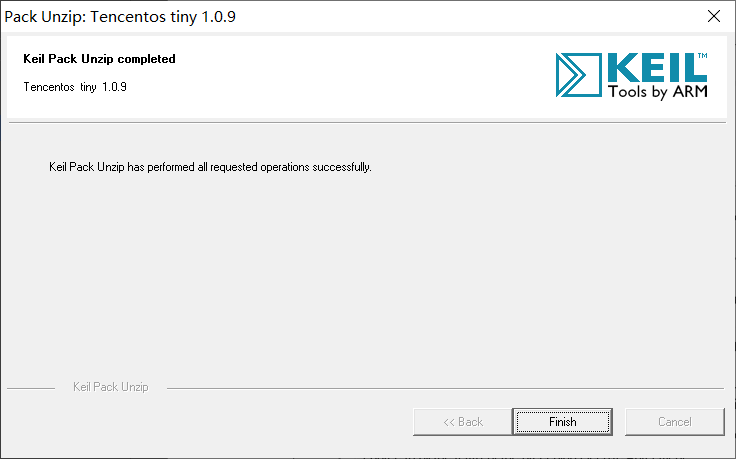

(a) (b)

图2.1 安装界面

此时软件包已经安装到Keil 5之中，打开Keil 5软件，并点击Pack
Installer图标，可以进行不同软件包版本的安装与移除：

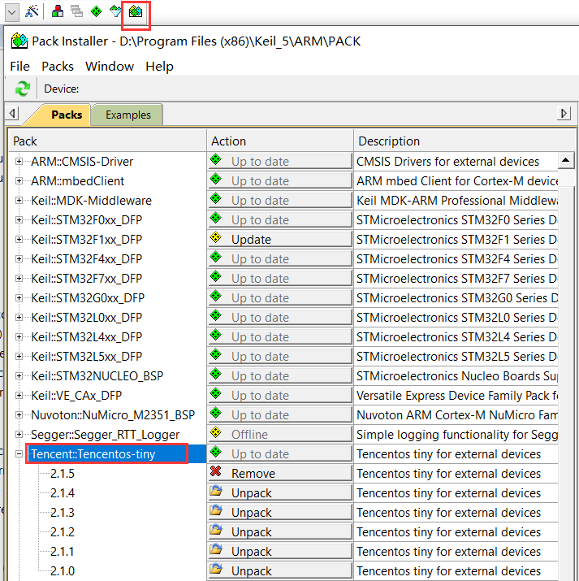

图2.2 Pack Installer界面

接下来就可以安装Tencent.TencentOS-tiny软件包中的组件，点击Manage Run-Time
Environment图标，对需要从软件包中移植的文件进行勾选，如图2.3所示，如果有依赖可以点击Resolve进行一键安装。

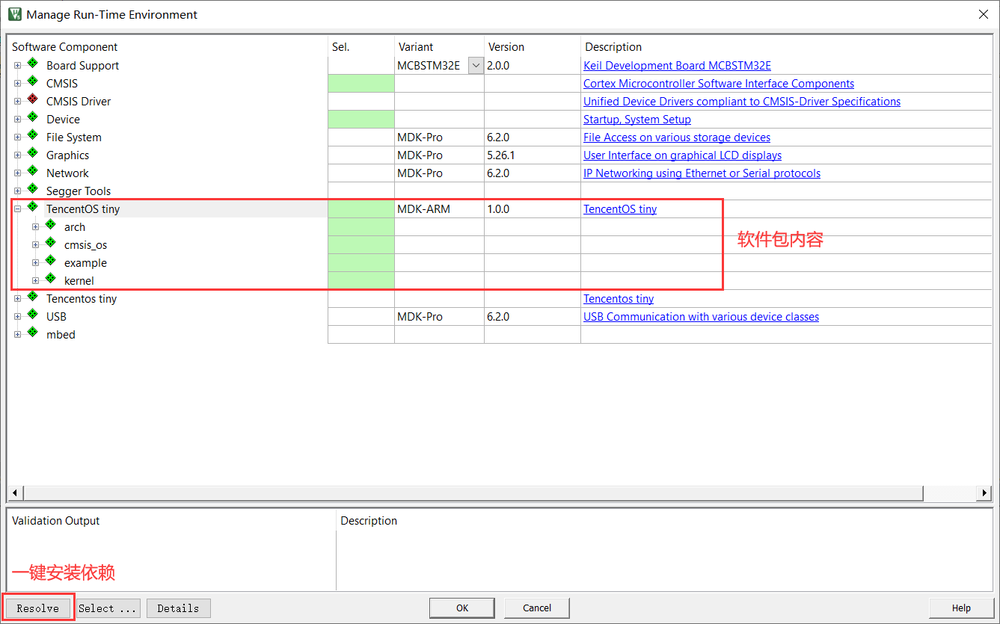

图2.3 Manage Run-Time Environment界面

# 3、软件包测试

## 3.1 ARM内核移植TencentOS tiny软件包

首先在[MDK5 Software Packs
(keil.com)](https://www.keil.com/dd2/pack/#!#eula-container)下载安装ARM
CMSIS-5.7.0软件包，以便在不同内核下测试本软件包。

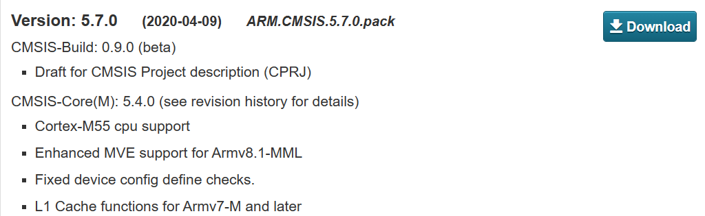

图3.1 ARM CMSIS-5.7.0软件包

在安装完软件包后，以ARM
Cortex-M3内核为例对软件包进行移植，并进行编译，首先利用Keil5-5.30版本软件新建工程，并选择ARMCM3，如图3.2所示，然后按照图3.3勾选相应的TencentOS-tiny组件和Cortex-M3内核文件，可以看到arch和tos_config都已经根据内核进行了自动适配。

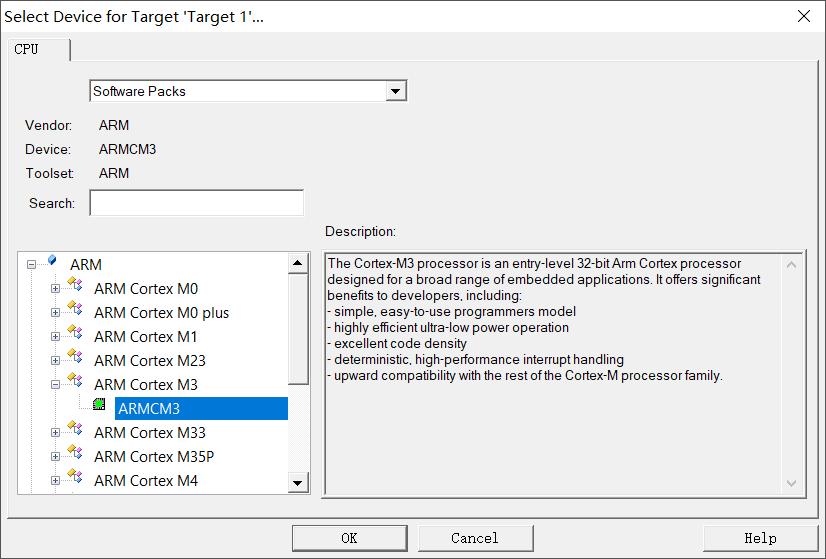

图3.2勾选内核

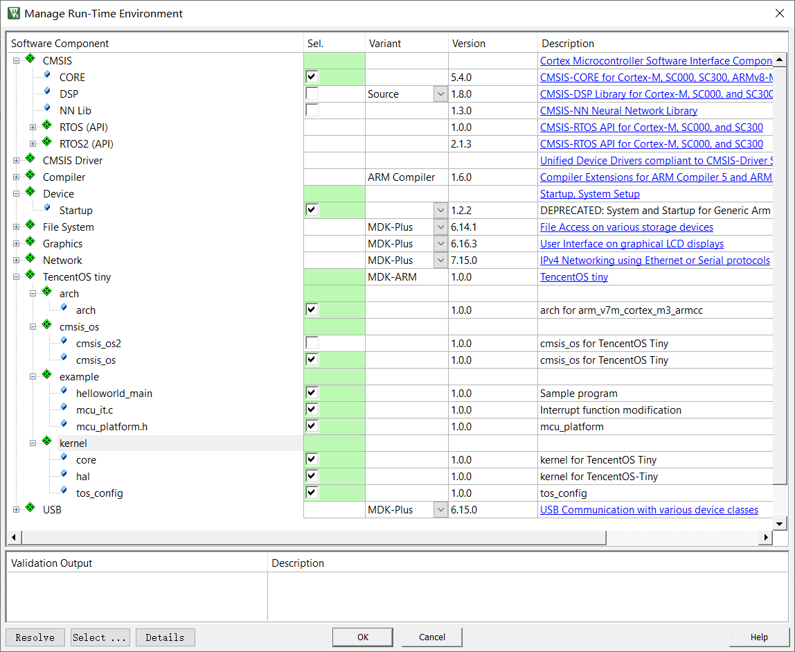

图3.3勾选组件

接下来点击Options for target，选中默认编译版本5，然后选择C99 mode。

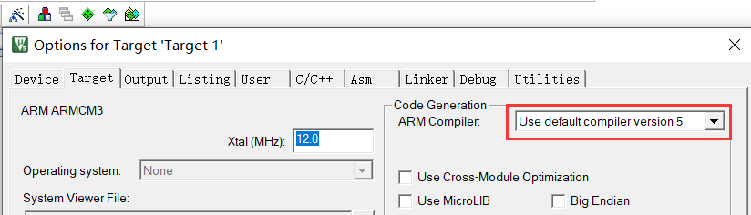

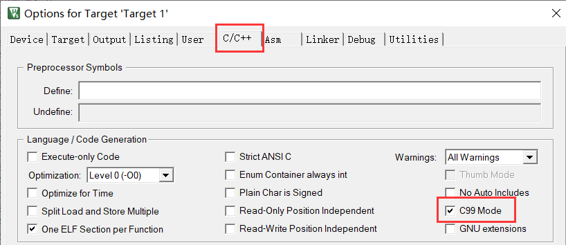

图3.4 Options for target

然后在mcu_platform.h中添加\#include "ARMCM3.h"和\#include "core_cm3.h"头文件。

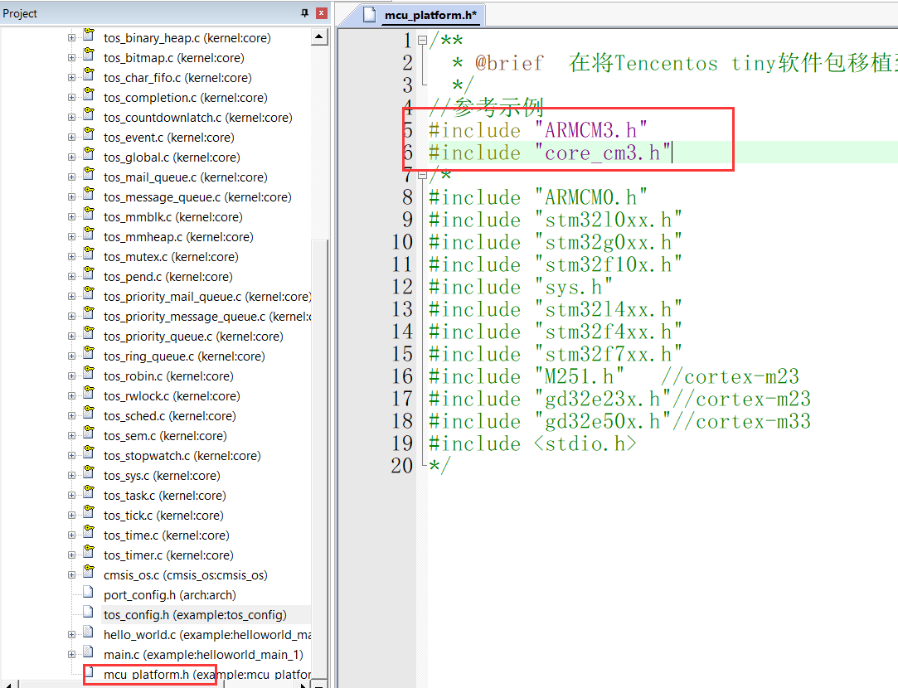

图3.5 添加对应内核的头文件

最后点击Build图标进行测试，如图3.6所示：

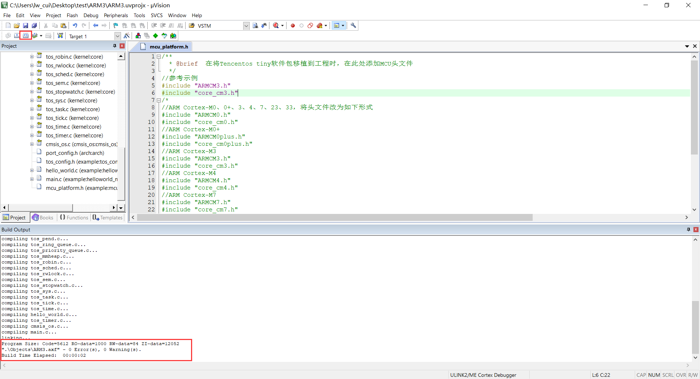

图3.6 编译测试

与之类似，如果要在ARM
Cortex-M4内核下对本软件包进行测试，只需要在上述步骤修改mcu_platform.h中的头文件为\#include
"ARMCM4.h"和\#include "core_cm4.h"即可，如果是其他内核则对应修改头文件。

## 3.2 STM32不依赖裸机工程移植

接下来选取具体单片机芯片，进行软件包的测试，按照以下步骤：

在网站MDK5 Software Packs
(keil.com)上下载STM32F1的软件支持包，如图3.7所示，并进行安装。

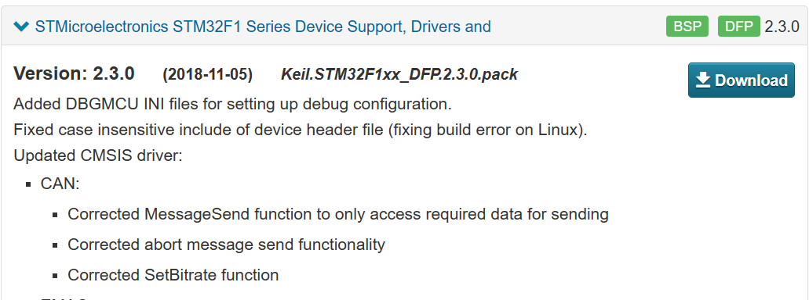

图3.7 STM32软件支持包

新建工程，选择芯片为STM32F103C8，如图3.8所示，然后点击ok，按照图3.9所示，选择TencentOS-tiny软件包的组件和STM32的启动文件。

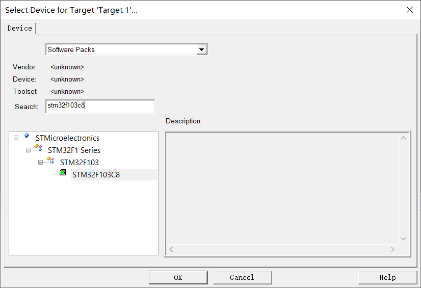

图3.8 选择STM32F103C8芯片

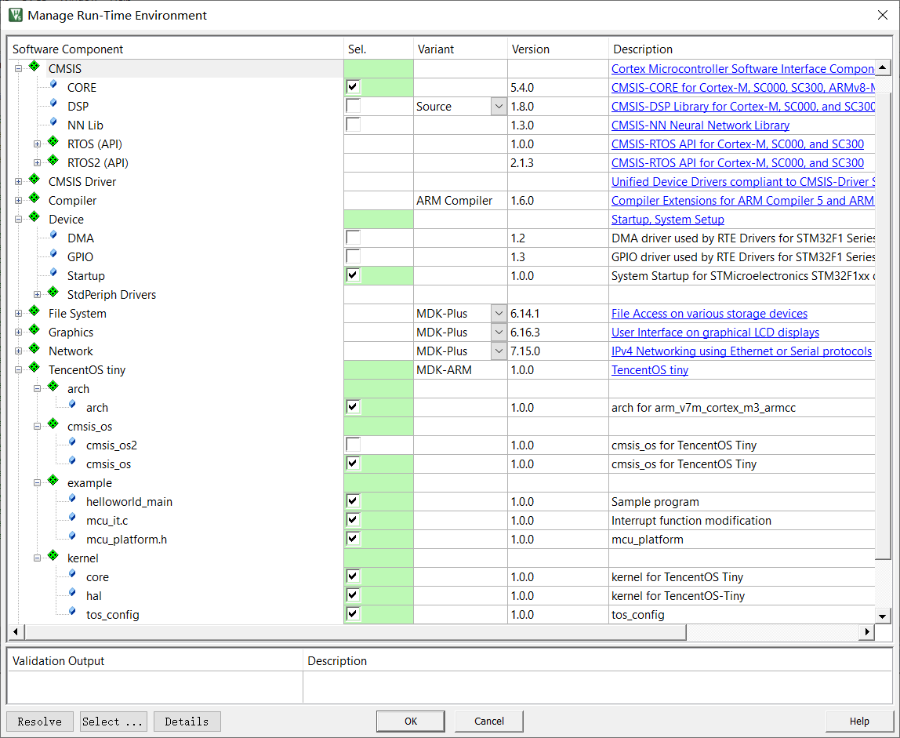

图3.9 选择组件

然后按照图3.10(a)所示勾选编译版本5，并选择C99mode。

(a)

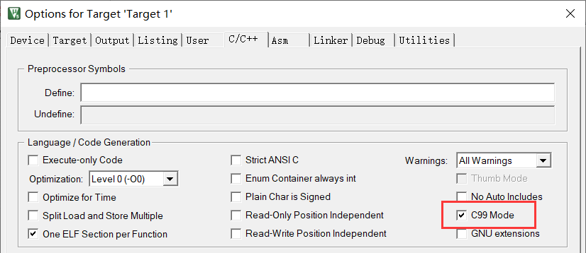

(b)

图3.10 软件设置

然后按照图3.11，在mcu_platform.h中添加以下头文件：

\#include "stm32f10x.h"

\#include "core_cm3.h"

\#include "system_stm32f10x.h"

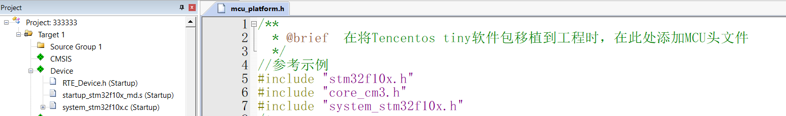

图3.11 修改mcu_platform.h

最后点击Build编译，没有报错则移植成功。

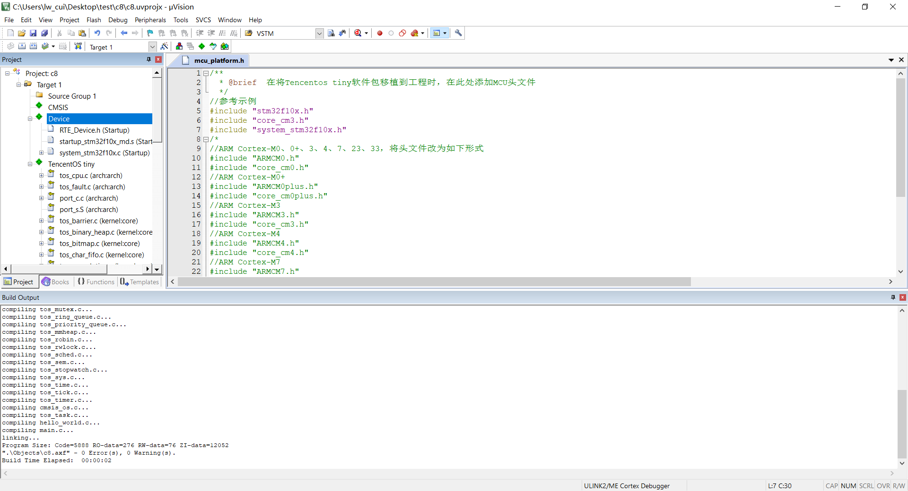

图3.12 编译界面

## 3.3 单片机裸机工程移植

最后对单片机开发板进行测试，以正点原子探索者STM32F407ZGT6为例介绍TencentOS-tiny软件包的移植。

（1）如下图为软件包勾选的内容：

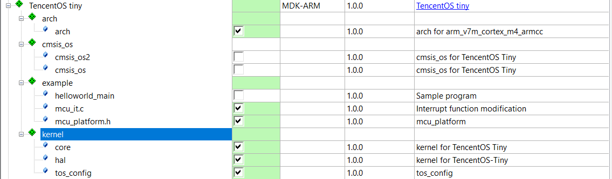

图3.13 软件包组件勾选

在正点原子探索者STM32F407ZGT6裸机工程模板中移植软件包后的界面如图3.14所示：

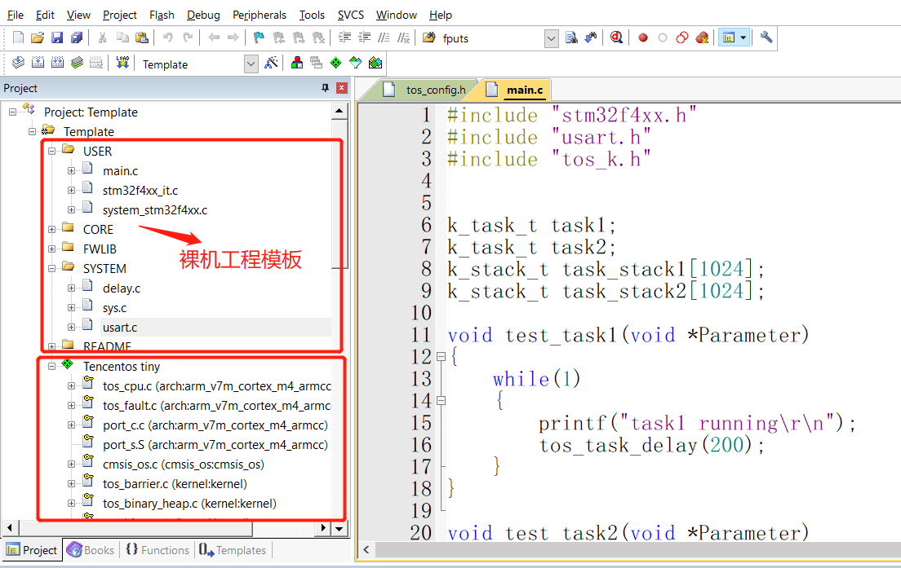

图3.14 移植界面

（2）然后按照mcu_it.c对stm32f4xx_it.c中的PendSV_Handler()函数和SysTick_Handler()函数进行修改，如下图所示，注释stm32f4xx_it.c中的PendSV_Handler()函数，并修改SysTick_Handler()函数。

图3.15 函数修改

（3）对mcu_platform.h进行修改，添加\#include "stm32f4xx.h"

图3.16 修改mcu_platform.h

（4）接下来，使用如下main程序：

\#include "stm32f4xx.h"

\#include "usart.h"

\#include "tos_k.h"

k_task_t task1;

k_task_t task2;

k_stack_t task_stack1[1024];

k_stack_t task_stack2[1024];

void test_task1(void \*Parameter)

{

while(1)

{

printf("task1 running\\r\\n");

tos_task_delay(200);

}

}

void test_task2(void \*Parameter)

{

k_err_t err;

printf("task2 running\\r\\n");

tos_task_delay(2000);

// suspend task1暂停

printf("suspend task1\\r\\n");

err = tos_task_suspend(&task1);

if(err != K_ERR_NONE)

printf("suspend task1 fail! code : %d \\r\\n",err);

tos_task_delay(2000);

// resume task1恢复

printf("resume task1\\r\\n");

err = tos_task_resume(&task1);

if(err != K_ERR_NONE)

printf("resume task1 fail! code : %d \\r\\n",err);

tos_task_delay(2000);

// destroy task1销毁

printf("destroy task1\\r\\n");

err = tos_task_destroy(&task1);

if(err != K_ERR_NONE)

printf("destroy task1 fail! code : %d \\r\\n",err);

// task2 running

while(1)

{

printf("task2 running\\r\\n");

tos_task_delay(1000);

}

}

int main(void)

{

k_err_t err;

/\*初始化USART 配置模式为 115200 8-N-1，中断接收\*/

uart_init(115200);

printf("Welcome to TencentOS tiny\\r\\n");

tos_knl_init(); // TOS Tiny kernel initialize

tos_robin_default_timeslice_config((k_timeslice_t)500u);

printf("create task1\\r\\n");

err = tos_task_create(&task1, "task1", test_task1, NULL, 3, task_stack1, 1024,
20);

if(err != K_ERR_NONE)

printf("TencentOS Create task1 fail! code : %d \\r\\n",err);

printf("create task2\\r\\n");

err = tos_task_create(&task2, "task2", test_task2, NULL, 4, task_stack2, 1024,
20);

if(err != K_ERR_NONE)

printf("TencentOS Create task2 fail! code : %d \\r\\n",err);

tos_knl_start(); // Start TOS Tiny

}

（5）点击编译，并利用ST
LINK-V2将程序下载到单片机上，如图3.17，然后将单片机的串口与电脑连接起来，利用XCOM串口通讯助手进行查看，结果如图3.18所示。

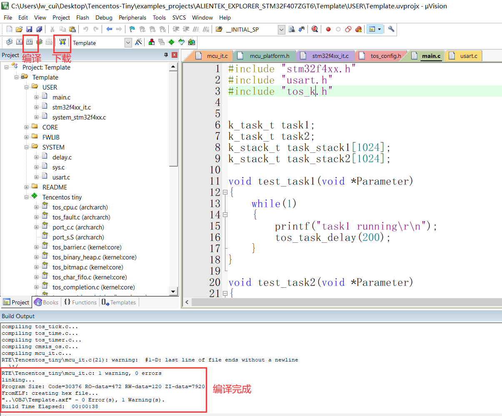

图3.17 编译界面

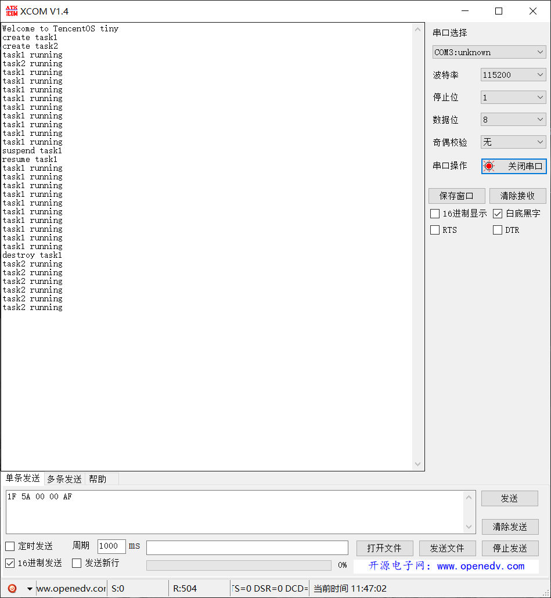

图3.18 测试界面

另外，在编译过程中如果遇到图3.19(a)的报错，需要将图3.19(b)中的\#define
TOS_CFG_OBJECT_VERIFY_EN 1u修改为TOS_CFG_OBJECT_VERIFY_EN 0u

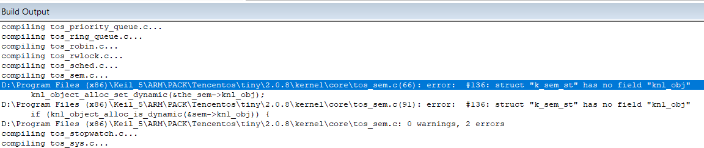

(a)

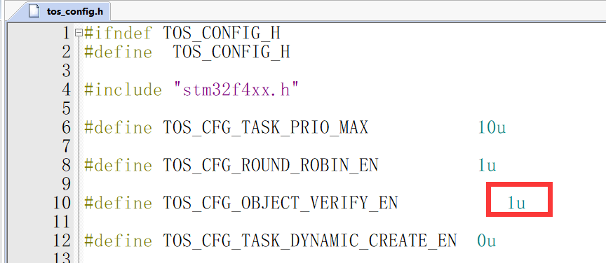

(b)

图3.19 报错修改

# 4、总结

本文首先研究了基于MDK完成第三方软件包封装的开发过程，并编写了软件包制作的步骤，然后结合TencentOS
Tiny物联网操作系统，对其中的ARM内核架构下的文件进行了封装，从而设计了基于TencentOS
Tiny的软件包。

本软件包能够方便开发者快速地将TencentOS
Tiny操作系统移植到用户的ARM内核单片机上，大大节省了开发移植的时间，同时软件包具有自动适配内核和依赖提示的功能，能够提高移植的效率。

# 5、开发参考

1、腾讯物联网操作系统网址<https://github.com/OpenAtomFoundation/TencentOS-tiny>

2、MDK5软件包MDK5 Software Packs (keil.com)

3、制作软件包培训视频https://www.bilibili.com/video/BV1AK411p7d9

4、制作软件包博客https://blog.csdn.net/qq_40259429/article/details/119320319

5、制作简易软件包https://www.cnblogs.com/libra13179/p/6273415.html

6、CMSIS-Driver软件包ARM-software/CMSIS-Driver: Repository of microcontroller
peripheral driver implementing the CMSIS-Driver API specification (github.com)

# 6、附录-移植配置参考

## 6.1 MDK5.14版本移植到ARM内核

### 6.1.1 Cortex-M0内核移植

（1）Manage Run-Time Environment勾选如下：

（2）在mcu_platform.h中添加：

\#include "ARMCM0.h"

\#include "core_cm0.h"

### 6.1.2 Cortex-M0+内核移植

（1）Manage Run-Time Environment勾选如下：

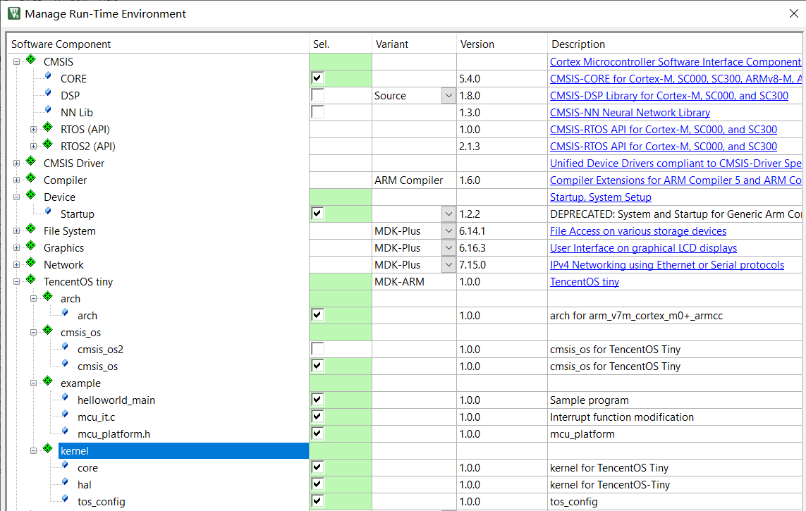

（2）在mcu_platform.h中添加：

\#include "ARMCM0plus.h"

\#include "core_cm0plus.h"

### 6.1.3 Cortex-M3内核移植

（1）Manage Run-Time Environment勾选如下：

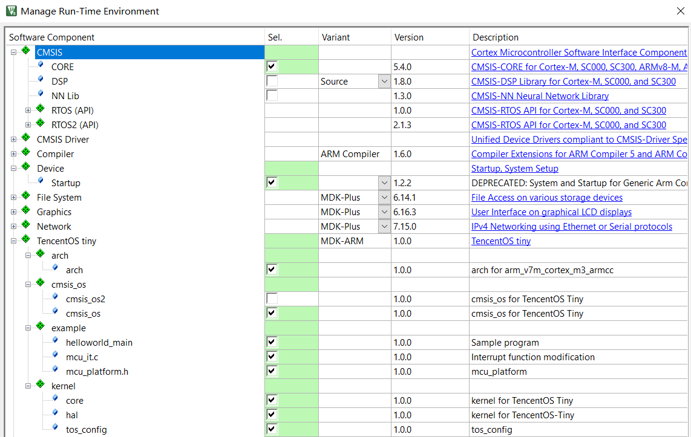

（2）在mcu_platform.h中添加：

\#include "ARMCM3.h"

\#include "core_cm3.h"

### 6.1.4 Cortex-M4内核移植

（1）Manage Run-Time Environment勾选如下：

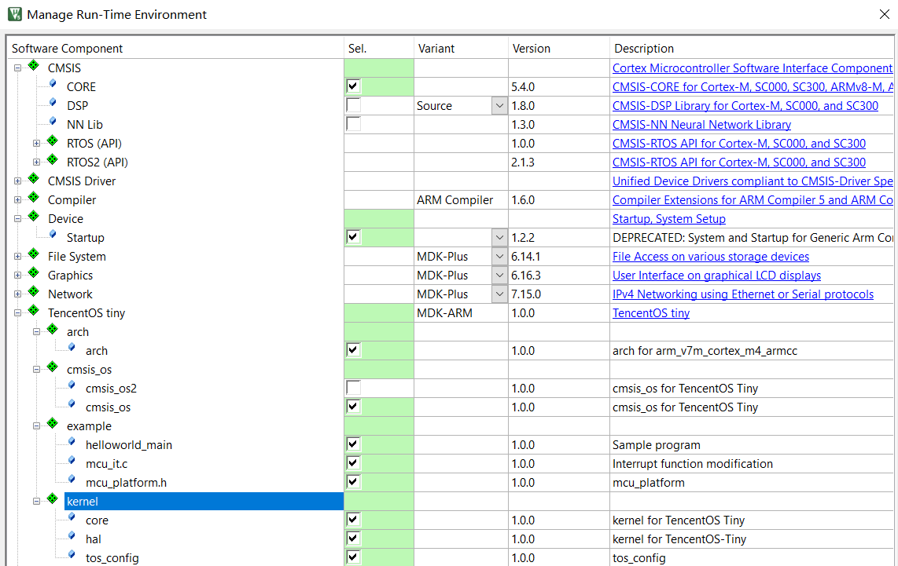

（2）在mcu_platform.h中添加：

\#include "ARMCM4.h"

\#include "core_cm4.h"

### 6.1.5 Cortex-M7内核移植

1、Manage Run-Time Environment勾选如下：

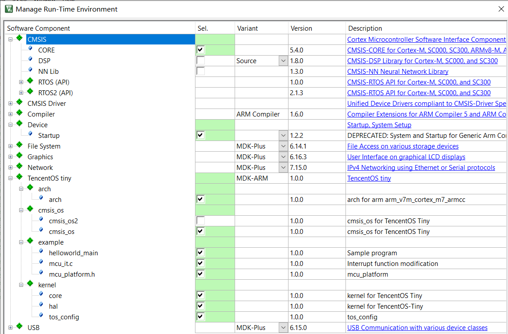

2、在MDK中修改为C99

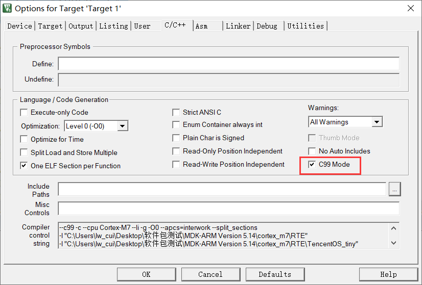

3、在mcu_platform.h中添加：

\#include "ARMCM7.h"

\#include "core_cm7.h"

## 6.2 MDK5.14版本移植到基于ARM内核的芯片

### 6.2.1 移植到stm32f103c8芯片

1、Manage Run-Time Environment勾选如下：

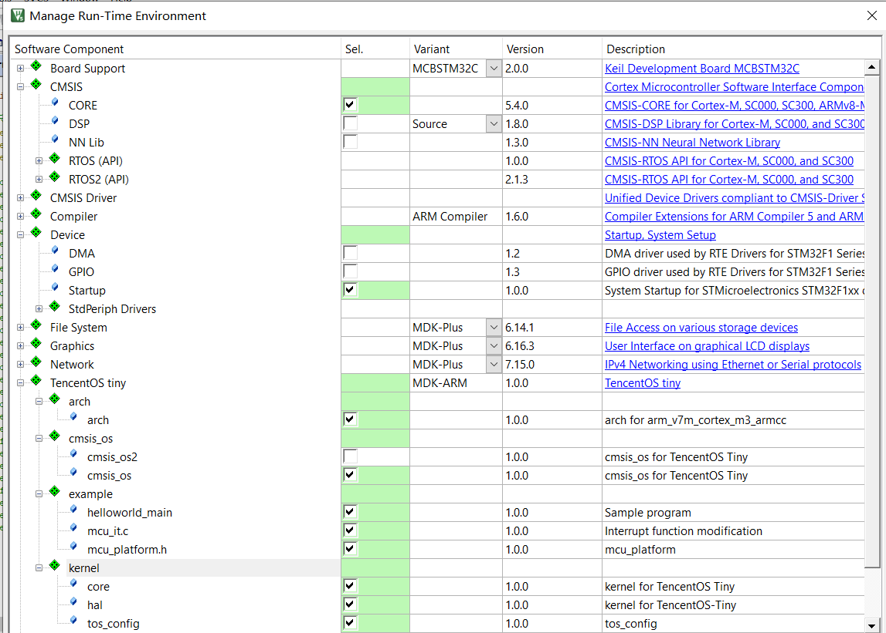

2、在mcu_platform.h中添加：

\#include "stm32f10x.h"

\#include "core_cm3.h"

\#include "system_stm32f10x.h"

### 6.2.2 移植到stm32f767igt芯片

1、Manage Run-Time Environment勾选如下：

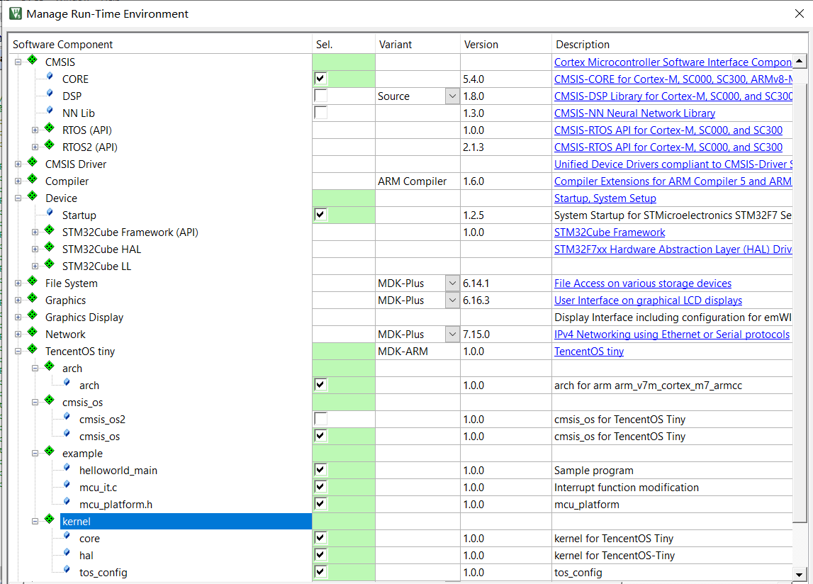

2、在MDK中修改为C99

3、在mcu_platform.h中添加：

\#include "stm32f7xx.h"

\#include "core_cm7.h"

\#include "system_stm32f7xx.h"

## 6.3 MDK5.30和MDK5.35版本移植（Cortex-M0+、0、3、4、7内核和芯片）

在MDK5.30和MDK5.35版本的Keil移植TencentOS-tiny
Pack时，对于Cortex-M0+、0、3、4、7的内核和芯片，勾选组件和添加头文件的步骤之前一致，但是需要修改编译器的版本，具体修改如下，然后执行编译即可。

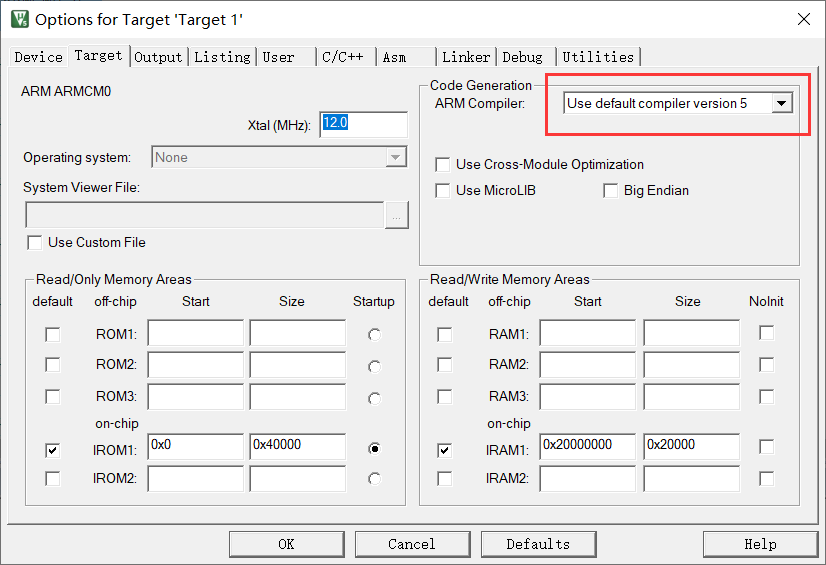

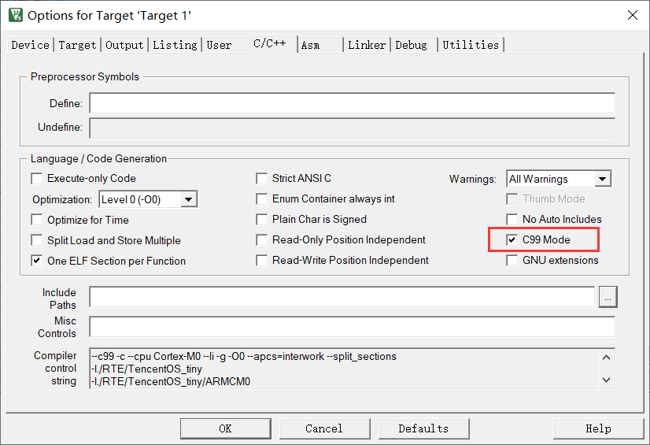

## 6.4 MDK5.30和MDK5.35版本移植（Cortex-M23、33）

### 6.4.1 Cortex-M23内核移植

（1）Manage Run-Time Environment勾选如下：

（2）在mcu_platform.h中添加：

\#include "ARMCM23.h"

\#include "core_cm23.h"

（3）修改为不查看报错：

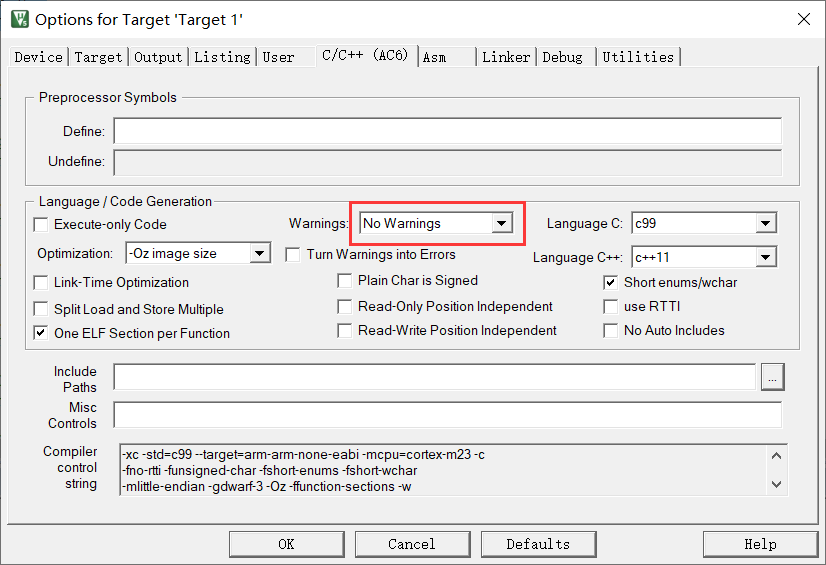

### 6.4.2 Cortex-M33内核移植

（1）选择带FPU的芯片

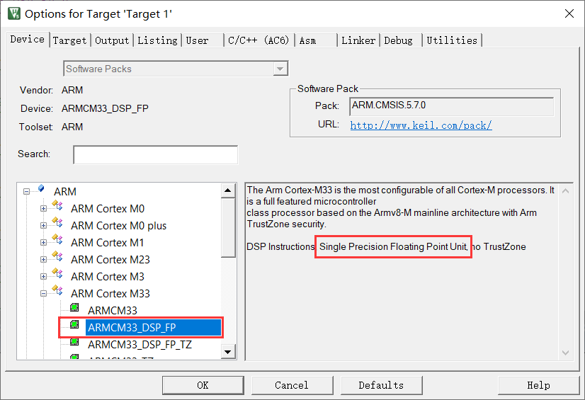

（2）Manage Run-Time Environment勾选如下：

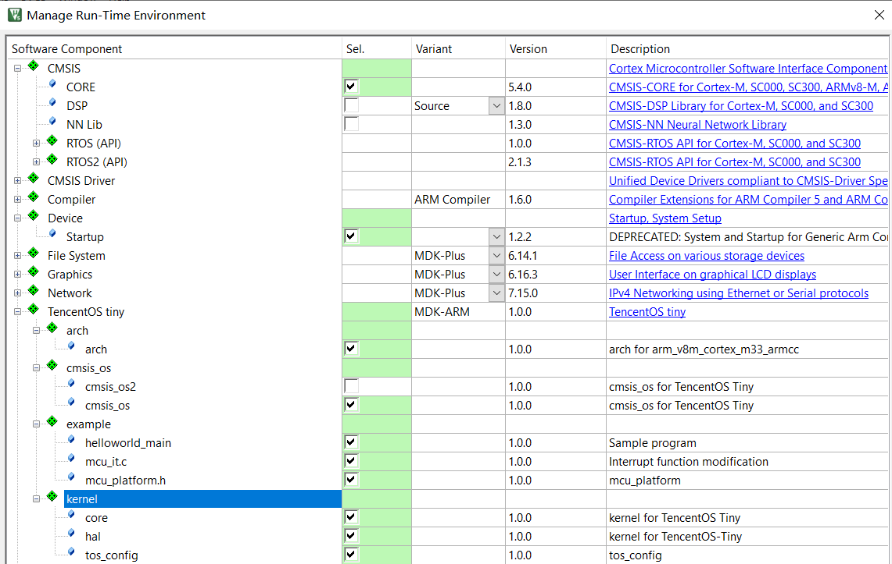

（3）在mcu_platform.h中添加：

\#include "ARMCM33_DSP_FP.h"

\#include "core_cm33.h"

（4）修改为不查看报错：

